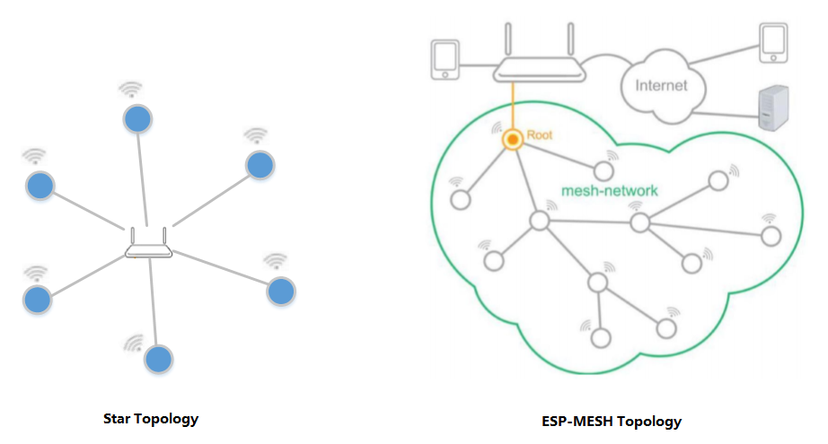
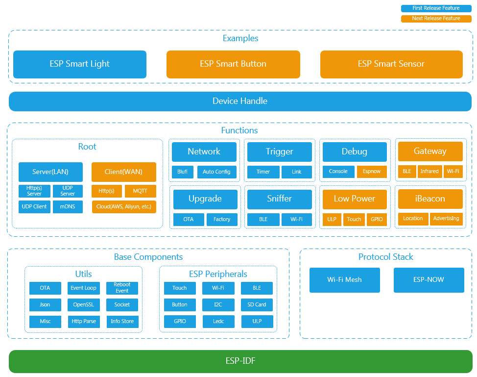
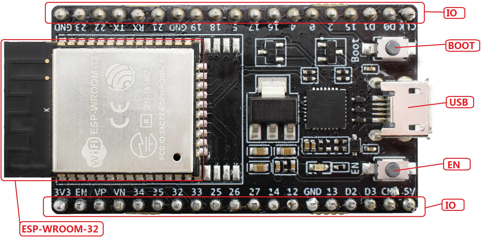

# Espressif Mesh Development Framework

Espressif Systems Mesh Development Framework (ESP-MDF) is the official mesh development framework for the [ESP32](https://espressif.com/en/products/hardware/esp32/overview) chip.

## ESP-MESH Overview

With the development of the Internet of Things, the scale of networked devices is rapidly expanding. However, the traditional senario of wireless networking implements a point-to-point or point-to-multipoint star topology. All terminal nodes must be connected to the hub (router). This will lead to the following two issues:

* Limited network capacity: the hub (router) can be directly connected to 10 devices at most.
* Limited network coverage: all terminal nodes must be located within the Wi-Fi coverage of the central node, making the networking senario inappropriate for large venues or places with multiple layers.

In order to meet the growing needs for wireless networking for the Internet of Things, Espressif launched the [ESP-MESH](https://espressif-docs.readthedocs-hosted.com/projects/esp-idf/en/latest/api-guides/mesh.html) wireless networking technology. Different from traditional wireless networking, ESP-MESH nodes can dynamically talk to each other, and self-organize into a tree network. Any node can transmit data with another node and forward packets.

The decentralized ESP-MESH network topology features:

* High reliability: the structure is robust, because even when some nodes fail in the network, other nodes can still self-organize dynamically to form a network.
* Extensive coverage: any two mesh nodes can communicate with each other, which is suitanle for the networking demands in large venues and places with multiple layers.
* Great network capacity: over 10,000 devices can be connected into the wireless entwork.

## Introduction of ESP-MDF

ESP-MDF supports development of mesh applications for the Espressif Systems [ESP32](https://espressif.com/en/products/hardware/esp32/overview) chip in the most comprehensive way. For details of communication protocol for ESP-MESH nodes please refer to [ESP-MESH](https://espressif-docs.readthedocs-hosted.com/projects/esp-idf/en/latest/api-guides/mesh.html), based on which users can develop their own mesh applications.

Below are the main features of ESP-MDF:

* Fast networking: combining Blufi networking and ESP-NOW chain networking
* Various control methods: app control, sensor control, coordinated control, and remote control
* Fast and stable upgrade: continuous transmission of breakpoints is adopted to improve the success rate of equipment upgrades in complex network environments
* Low-power solutions: reduced system power consumption through a variety of low-power solutions
* Bluetooth application: Bluetooth gateway and iBeacon function
* Sniffer: applicable for pedestrian flow monitoring, tracking of personal belongings, indoor positioning, etc.
* Factory mode: when a ESP-MDF device is in abnormal condition, it will enter the factory mode to upgrade the firmware
* Debug mechanism: terminal instruction configuration, wireless transmission of device log, device log analysis, etc.

The ESP-MESH festures can be illustrated by the following figure:

## Developing with the ESP-MDF

### Hardware
---

#### ESP32-DevKitC V4

At least two [ESP32-DevKitC V4](https://esp-idf.readthedocs.io/en/latest/hw-reference/modules-and-boards.html#esp32-devkitc-v4) are needed for development with ESP-MDF.

Introduction to ESP32-DevKitC V4:

| Interface / Module | Description|
| --------     | :-----  |
| ESP-WROOM-32 | [ESP-WROOM-32 module](http://esp-idf.readthedocs.io/en/latest/hw-reference/modules-and-boards.html#esp-modules-and-boards-esp-wroom-32) |
| EN           | reset button; pressing this button will reset the system|
| Boot         | download button; press this button and then the EN button, the system will enter download mode, and program the flash via the serial port |
| USB          | USB interface that provides power supply for the board and acts as the interface for connecting the PC and the ESP-WROOM-32|
| IO           | lead out most of the pins of ESP-WROOM-32 |

 ESP32-DevKitC V4 

#### ESP SMART LIGHT

ESP SMART LIGHT are smart lights based on ESP-MDF which to get developers familiar with the features of ESP-MDF. Secondary development can be done to the program of ESP SMART LIGHT.

> This ESP SMART LIGHT will soon be released.

 ESP SMART LIGHT 

#### Router

ESP-MDF is an upper-layer development framework developed based on the ESP-MESH communication protocol. Therefore, data transmission through routers is required in specific application.

* Make sure that a 2.4G Wi-Fi network is used (ESP32 does not support 5G Wi-Fi).
* To enable the functions of user login, remote control and firmware upgrade, please make sure that the router is connected to external network.

#### Phone & Pad

Please download [Mesh APP](https://github.com/EspressifApp/Esp32MeshForAndroid/raw/master/release/mesh.apk) before specific use. Currently, only andoird version of app for phones and pads are provided.

> NOTES: currently only Android version app for phones and pads is supported, and the pad should have GPS functionality.

* Turn on the Wi-Fi, Bluetooth and GPS.
* Make sure that the phone/pad and the ESP-MDF devices are connected to the same router.

### ESP-IDF

ESP-MDF is based on the application layer of [ESP-IDF](https://github.com/espressif/esp-idf) (Espressif IoT Development Framework). So you need to first install the ESP-IDF and then use the ESP-MDF. Please take a look at [ESP-MDF Get Started](docs/get-started.md).

### Examples

Check folder [examples](https://github.com/espressif/esp-mdf/blob/master/examples) to get start and understand the API features of the ESP-MDF.

# Resources

* Documents are stored in [docs](docs) directory.

* [ESP-IDF Programming Guide](https://esp-idf.readthedocs.io/en/latest/) is the documentation for Espressif IoT Development Framework.

* [ESP-MESH](https://esp-idf.readthedocs.io/en/latest/api-guides/mesh.html) is the fundamental wireless communucation protocol of ESP-MDF.

* Check the [Issues](https://github.com/espressif/esp-mdf/issues) section on github if you find a bug or have a feature request. Please check existing Issues before opening a new one.

* The [esp32.com forum](https://esp32.com/) is a place to ask questions and find community resources.

* If you're interested in contributing to ESP-MDF, please check the [Contributions Guide](https://esp-idf.readthedocs.io/en/latest/contribute/index.html).
