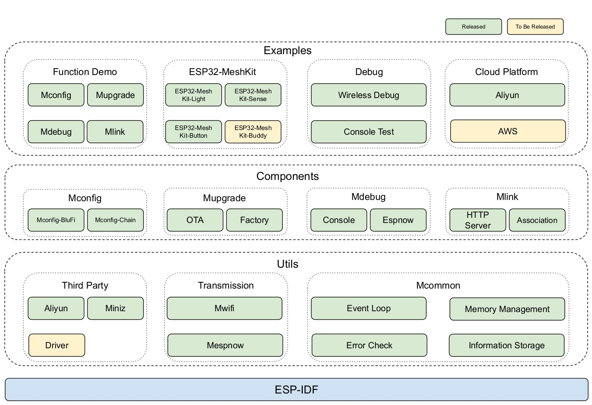
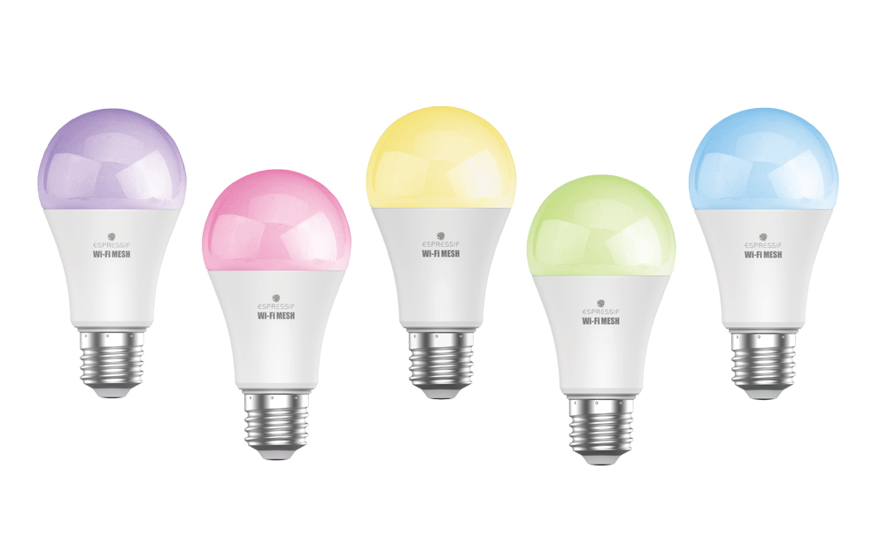
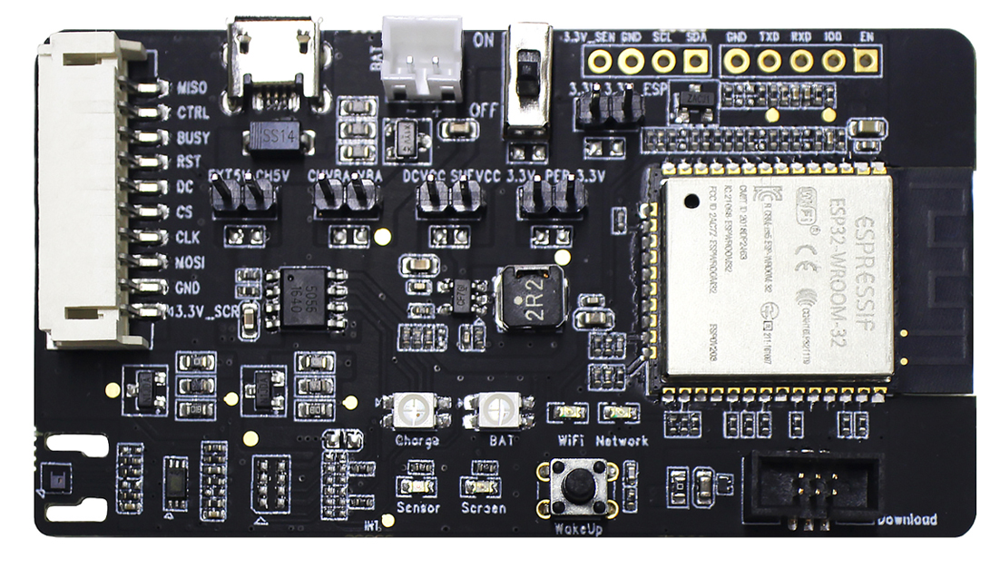

# ESP-WIFI-MESH 开发框架 [[English]](./README.md)

[](https://docs.espressif.com/projects/esp-mdf/zh_CN/latest/?badge=latest)

ESP-MDF (Espressif Mesh Development Framework) 是基于 [ESP32](https://www.espressif.com/zh-hans/products/hardware/esp32/overview) 芯片的 [ESP-WIFI-MESH](https://docs.espressif.com/projects/esp-idf/en/stable/api-guides/mesh.html) 开发框架。ESP-WIFI-MESH 是一种基于 Wi-Fi 构建的 MESH 网络通信协议。

## 概述

ESP-MDF 在 [ESP-WIFI-MESH](https://docs.espressif.com/projects/esp-idf/en/stable/api-guides/mesh.html) 协议栈的基础上增加了配网、升级、调试机制及应用示例。使用 ESP-MDF 您可以快速上手 ESP-WIFI-MESH 开发。其主要特点如下：

* **快速配网**：在 app 配网的基础上增加了设备间链式配网，以实现大范围快速配网；
* **稳定升级**：通过断点续传、数据压缩、版本回退和固件检查等机制达到高效升级；
* **高效调试**：支持指令终端、通过无线进行日志传输和调试等多种调试方式；
* **局域网控制**：支持 app 控制、传感器控制等；
* **丰富的示例**：提供了基于 ESP-WIFI-MESH 的照明等综合解决方案。

## 框架

ESP-MDF 共分为 Utils、Components 和 Examples 三个部分（如下图所示），他们之间的关系：Utils 是 ESP-IDF APIs 的抽象封装以及第三方库，Components 是基于 Utils APIs 组成的 ESP-MDF 功能模块，Examples 是基于 Components 完成的 ESP-WIFI-MESH 解决方案。



- **Utils**：
    - Third Party：第三方的组件
        - [Driver](https://docs.espressif.com/projects/esp-mdf/zh_CN/latest/api-reference/third_party/index.html)：常用的按键、LED 等驱动
        - [Miniz](https://docs.espressif.com/projects/esp-mdf/zh_CN/latest/api-reference/third_party/index.html)：无损高性能数据压缩库
        - [Aliyun](https://github.com/espressif/esp-aliyun)：阿里云物联网套件

    - Transmission：设备间数据通信方式
        - [Mwifi](https://docs.espressif.com/projects/esp-mdf/zh_CN/latest/api-reference/mwifi/index.html)：对 ESP-WIFI-MESH 的封装，在其基础上增加了重包过滤、数据压缩、分包传输和 P2P 组播
        - [Mespnow](https://docs.espressif.com/projects/esp-mdf/zh_CN/latest/api-reference/mespnow/index.html)：对 ESP-NOW 的封装，在其基础上增加了重包过滤、CRC 校验、数据分包

    - Mcommon：ESP-MDF 各组件之间的共用模块
        - Event loop：ESP-MDF 的事件处理
        - Error Check：ESP-MDF 的错误码管理
        - Memory Management：ESP-MDF 的内存管理
        - Information Storage：将配置信息存储到 flash 中

- **Components**：
    - [Mconfig](https://docs.espressif.com/projects/esp-mdf/zh_CN/latest/api-guides/mconfig.html)：配网模块
    - [Mupgrade](https://docs.espressif.com/projects/esp-mdf/zh_CN/latest/api-guides/mupgrade.html)：升级模块
    - Mdebug：调试模块
    - [Mlink](https://docs.espressif.com/projects/esp-mdf/zh_CN/latest/api-guides/mlink.html)：局域网控制模块

- **Examples**：
    - [Function demo](examples/function_demo/)：各个功能模块的使用示例
        - [Mwifi](examples/function_demo/mwifi)：常见组网方式的示例：无路由器、有路由器。先基于此示例进行开发,而后在其基础上添加配网、升级、无线测试等功能
        - [Mupgrade](examples/function_demo/mupgrade)：设备的升级示例
        - [Mconfig](examples/function_demo/mconfig)：设备的配网示例
        - [Mcommon](examples/function_demo/mcommon)：通用模块示例,事件处理 内存管理 信息存储的使用示例

    - Debug：性能测试和调试工具
        - [Console Test](examples/function_demo/mwifi/console_test)：通过串口输入命令的方式，测试 ESP-WIFI-MESH 吞吐量、网络配置、发包时延。
        - [Wireless Debug](examples/wireless_debug/)：通过无线的方式进行 ESP-MDF 调试

    - [Development Kit](examples/development_kit/)：ESP32-MeshKit 使用示例, 用于调研和了解 ESP-WIFI-MESH
        - [ESP32-MeshKit-Light](examples/development_kit/light/)：板载 ESP32 芯片的智能灯，用于 ESP-WIFI-MESH 作为主干网络进行长供电的场景。支持 BLE + ESP-WIFI-MESH, 可实现BLE网关, iBeacon 和 BLE 扫描
        - [ESP32-MeshKit-Sense](examples/development_kit/sense/)：ESP-WIFI-MESH 在 Deep-sleep + Light-sleep 模式下的低功耗方案，可用于：监测 MeshKit 外设功耗和根据传感器数据控制 MeshKit 外设
        - [ESP32-MeshKit-Button](examples/development_kit/button/)：ESP-WIFI-MESH 在超低功耗的场景下使用，平常处于断电状态，仅在唤醒时工作，并通过 [ESP-NOW](https://docs.espressif.com/projects/esp-idf/zh_CN/stable/api-reference/network/esp_now.html) 给 ESP-WIFI-MESH 设备发包。

    - 云平台: ESP-MDF 对接云平台
        - [Aliyun Linkkit](examples/maliyun_linkkit/)：ESP-MDF 接入阿里飞燕平台示例
        - AWS：ESP-MDF 接入 AWS 平台示例

## 使用 ESP-MDF 进行开发

您首先需要详细阅读 [ESP-WIFI-MESH 通信协议](https://docs.espressif.com/projects/esp-idf/en/stable/api-guides/mesh.html)和[ESP-MDF 编程指南](https://docs.espressif.com/projects/esp-mdf/zh_CN/latest/index.html)，并通过 ESP32-MeshKit 开发套件调研和了解 ESP-WIFI-MESH。其次基于 [Function demo](examples/function_demo/)进行您的项目开发，当您可以在开发中遇到问题，首先可在[官方论坛](https://esp32.com/viewforum.php?f=21&sid=27bd50a0e45d47b228726ee55437f57e)和[官方 GitHub ](https://github.com/espressif/esp-mdf/issues)上寻找是否已存在类似问题，若不存在类似问题，您也可直接在网站中提问。

### 开发板指南

#### ESP32-MeshKit 开发套件

ESP32-MeshKit 包含一整套完整的 [ESP-WIFI-MESH 的照明解决方案](https://www.espressif.com/zh-hans/products/software/esp-mesh/overview)（如下图所示），可配套 ESP-Mesh App（[iOS 版](https://itunes.apple.com/cn/app/esp-mesh/id1420425921?mt=8)和[安卓版](https://github.com/EspressifApp/Esp32MeshForAndroid/raw/master/release/mesh.apk)）使用，既可以调研和了解 ESP-WIFI-MESH，也可以进行二次开发。

<table>
    <tr>
        <td ><p align=center>ESP32-MeshKit Light</p></td>
        <td ><p align=center>ESP32-MeshKit Sense</p></td>
    </tr>
</table>

* 产品：
    * [ESP32-MeshKit-Light](https://www.espressif.com/sites/default/files/documentation/esp32-meshkit-light_user_guide_cn.pdf)：RGBCW 智能灯，直观反应控制结果，可用于测试组网时间、响应速度、距离测试、稳定性测试等。
    * [ESP32-MeshKit-Sense](https://github.com/espressif/esp-iot-solution/blob/master/documents/evaluation_boards/ESP32-MeshKit-Sense_guide_cn.md)：带有光强传感器和温湿度传感器，可用于功耗测量和低功耗应用的开发，可配套使用 ESP-Prog 进行固件烧录和 Debug。
    * [ESP32-MeshKit-Button](docs/ESP32-MeshKit-Button_Schematic.pdf)：作为开关控制，用于低功耗应用的开发，可配套使用 ESP-Prog 进行固件烧录和调试。

#### ESP32-Buddy 开发板

ESP32-Buddy 是专为 ESP-WIFI-MESH 开发测试而设计的开发板。体积小，采用 USB 供电，方便做大数量设备的测试及距离测试。

* 功能：
    * 16 MB 的 flash：存储运行日志
    * OLED 屏：显示当前设备所在的层级、连接状态等信息
    * LED：运行状态指示
    * 温湿度传感器：数据采集

### 快速开始(Make)

通过如下的步骤，可以快速开始开发 ESP-MDF 应用程序，如果需要了解详细的过程，参见 [ESP-IDF 入门指南](https://docs.espressif.com/projects/esp-idf/zh_CN/stable/get-started/index.html)，我们使用 ``~/esp`` 目录来安装编译工具链、ESP-MDF 和示例程序。您也可以使用其它目录，但是需要注意调整相应的指令。

1. [**设置工具链**](https://docs.espressif.com/projects/esp-idf/zh_CN/stable/get-started/index.html#get-started-setup-toolchain)：根据您的电脑操作系统（[Windows](https://docs.espressif.com/projects/esp-idf/zh_CN/stable/get-started/windows-setup.html)，[Linux](https://docs.espressif.com/projects/esp-idf/zh_CN/stable/get-started/linux-setup.html) 或 [Mac OS](https://docs.espressif.com/projects/esp-idf/zh_CN/stable/get-started/macos-setup.html)）进行配置。

2. **获取 ESP-MDF**：
    ```shell
    git clone --recursive https://github.com/espressif/esp-mdf.git
    ```
    > 如果您在没有 `--recursive` 标记的情况下克隆项目，转到 esp-mdf 目录并运行命令 `git submodule update --init --recursive`

3. **设置 ESP-MDF 路径**：工具链程序使用环境变量 ``MDF_PATH`` 来访问 ESP-MDF，设置它的过程类似于设置 ``IDF_PATH`` 变量，请参阅[`添加 IDF_PATH 到用户配置文件`](https://docs.espressif.com/projects/esp-idf/zh_CN/stable/get-started/add-idf_path-to-profile.html)。
    ```shell
    export MDF_PATH=~/esp/esp-mdf
    ```

4. **创建一个工程**：此工程为 ESP-WIFI-MESH 两个设备之间通信的示例
    ```shell
    cp -r $MDF_PATH/examples/get-started/ .
    cd get-started/
    ```

5. **编译和烧写**：除串口号需要修改外，其余使用默认配置即可
    ```shell
    make menuconfig
    make erase_flash flash
    ```

6. [**监视/调试**](https://docs.espressif.com/projects/esp-idf/zh_CN/stable/get-started/idf-monitor.html)：要退出监视器，请使用快捷键 ``Ctrl+]``
    ```shell
    make monitor
    ```

7. **更新 ESP-MDF**：
    ```shell
    cd ~/esp/esp-mdf
    git pull
    git submodule update --init --recursive
    ```

### 快速开始(CMake)

通过如下的步骤，可以快速开始开发 ESP-MDF 应用程序，如果需要了解详细的过程，参见 [ESP-IDF 入门指南(CMake)](https://docs.espressif.com/projects/esp-idf/en/stable/get-started-cmake/index.html#)，我们使用 ``~/esp`` 目录来安装编译工具链、ESP-MDF 和示例程序。您也可以使用其它目录，但是需要注意调整相应的指令。

1. [**设置工具链**](https://docs.espressif.com/projects/esp-idf/en/stable/get-started-cmake/index.html#step-1-set-up-the-toolchain)：根据您的电脑操作系统（[Windows](https://docs.espressif.com/projects/esp-idf/zh_CN/stable/get-started-cmake/windows-setup.html)，[Linux](https://docs.espressif.com/projects/esp-idf/zh_CN/stable/get-started-cmake/linux-setup.html) 或 [Mac OS](https://docs.espressif.com/projects/esp-idf/zh_CN/stable/get-started-cmake/macos-setup.html)）进行配置。

2. **获取 ESP-MDF**：
    ```shell
    git clone --recursive https://github.com/espressif/esp-mdf.git
    ```
    > 如果您在没有 `--recursive` 标记的情况下克隆项目，转到 esp-mdf 目录并运行命令 `git submodule update --init`

3. **设置 ESP-MDF 路径**：工具链程序使用环境变量 ``MDF_PATH`` 来访问 ESP-MDF，设置它的过程类似于设置 ``IDF_PATH`` 变量，请参阅[`添加 IDF_PATH & idf.py 到用户配置文件`](https://docs.espressif.com/projects/esp-idf/en/stable/get-started-cmake/add-idf_path-to-profile.html)。
    ```shell
    export MDF_PATH=~/esp/esp-mdf
    export PATH="$MDF_PATH/esp-idf/tools:$PATH"
    ```

4. **创建一个工程**：此工程为 ESP-WIFI-MESH 两个设备之间通信的示例
    ```shell
    cp -r $MDF_PATH/examples/get-started/ .
    cd get-started/
    ```

5. **编译和烧写**：除串口号需要修改外，其余使用默认配置即可
    ```shell
    idf.py menuconfig
    idf.py erase_flash flash
    ```

6. [**监视/调试**](https://docs.espressif.com/projects/esp-idf/zh_CN/stable/get-started/idf-monitor.html)：要退出监视器，请使用快捷键 ``Ctrl+]``
    ```shell
    idf.py monitor
    ```

7. **更新 ESP-MDF**：
    ```shell
    cd ~/esp/esp-mdf
    git pull
    git submodule update --init --recursive
    ```

## ESP-WIFI-MESH 的优势

* **布置方便**：采用 Wi-Fi 组网，无需布线安装等复杂工作，支持自组网、自修复和自管理，用户只需配置路由器的密码即可；

* **无需网关**：ESP-WIFI-MESH 采用去中心化的结构，其无需网关避免了单点故障造成整个网络瘫痪，仅一个 ESP-WIFI-MESH 设备也能正常工作；
* **传输更安全**：数据链路层和应用层均可实施加密；
* **传输更可靠**：两个设备之间的是可靠传输和流控，支持单播、组播和广播；
* **网络容量大**：ESP-WIFI-MESH 采用树状结构，单个设备最多直接连接 10 个设备，单个网络可容纳 1000 个节点；
* **传输范围广**：两个设备之间的传输距离隔墙 30 m，空旷环境 200 m（测试基于 ESP32-DevKitC）；
    * **智能家居**：即使仅有三五个设备且隔墙也能够组成网络，可以满足家庭环境中，设备数量少无法相互通信的问题；
    * **路灯方案**：可能满足路灯场景中两个相距较远的设备之间的通信。
* **传输速率高**：基于 Wi-Fi 传输，高达 10 Mbps 的传输率；
    * **环境控制系统**：可以直接传输传感器采集到的原始数据，对大量数据的分析来校准算法提高传感器准确性；
    * **背景音乐系统**：可以进行音视频传输。
* **能同时运行 BLE 协议栈**：ESP32 芯片可以同时运行 Wi-Fi 和 BLE 协议栈，利用 ESP-WIFI-MESH 做为主干网络进行数据的传输，通过 BLE 接收探针、发送广播和连接设备；
    * **物品跟踪**：通过多个采集点监控同一设备发出的 BLE 或 Wi-Fi 数据包；
    * **人流量检测**：统计 Wi-Fi 设备发出的 Probe Request （探测请求）帧；
    * **室内定位**：每个设备相当于 Beacon 基站不断向四周发送蓝牙信号，手机通过分析与设备之间的信号强度，计算出当前的位置；
    * **产品推广**：通过 iBeacon 实时推送产品信息和优惠活动；
    * **蓝牙网关**：每个设备可以相当于一个蓝牙网关，使传统的蓝牙设备也能连接 ESP-WIFI-MESH 网络。

## 相关资源

* [ESP-MDF 编程指南](https://docs.espressif.com/projects/esp-mdf/zh_CN/latest/index.html) 是 ESP-MDF 开发框架的说明文档。
* [ESP-IDF 编程指南](https://docs.espressif.com/projects/esp-idf/zh_CN/stable/index.html) 是乐鑫物联网开发框架的说明文档。
* [ESP-WIFI-MESH](https://docs.espressif.com/projects/esp-idf/en/stable/api-guides/mesh.html) 是 ESP-MDF 的无线通信协议基础。
* 如您发现 bug 或有功能请求，可在 GitHub 上的 [Issues](https://github.com/espressif/esp-mdf/issues) 提交。请在提交问题之前查看已有的 Issues 中是否已经有您的问题。
* 如果您想在 ESP-MDF 上贡献代码，请点击[贡献代码指南](docs/zh_CN/contribute/index.rst)。
* 访问 ESP32 官方论坛请点击 [ESP32 BBS](https://esp32.com/) 。
* 关于 ESP32-MeshKit 硬件文档，请至[乐鑫官网](https://www.espressif.com/zh-hans/support/download/documents?keys=&field_technology_tid%5B%5D=18)查看。
* ESP32-MeshKit-Light 购买链接：[淘宝](https://item.taobao.com/item.htm?spm=a230r.1.14.1.55a83647K8jlrh&id=573310711489&ns=1&abbucket=3#detail)。
* ESP32-Buddy 购买链接：即将上架。
