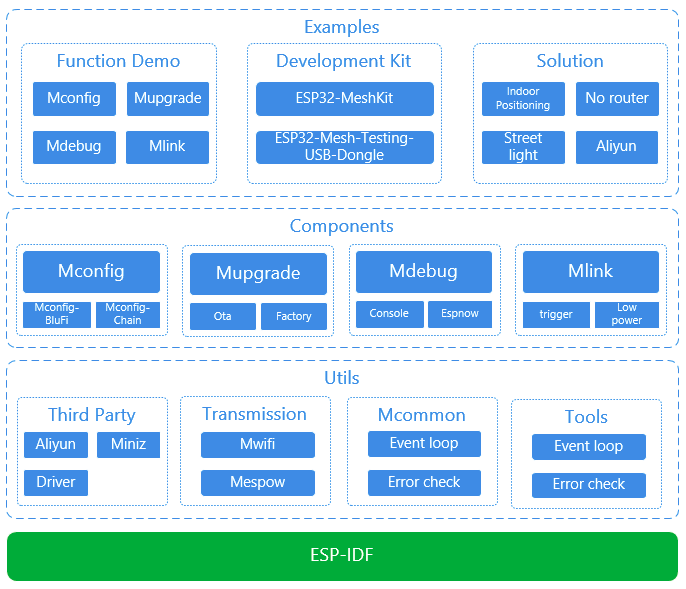

About
=====

This is documentation of `ESP-MDF <https://github.com/espressif/esp-mdf>`_, the framework to develop mesh applications for `ESP32 <https://espressif.com/en/products/hardware/esp32/overview>`_ chip by `Espressif <https://espressif.com>`_.

The **ESP32** is 2.4 GHz Wi-Fi and Bluetooth combo, 32 bit dual core chip running up to 240 MHz, designed for mobile, wearable electronics, and Internet-of-Things (IoT) applications. It has several peripherals on board including I2S interfaces to easy integrate with dedicated mesh chips. These hardware features together with the ESP-MDF software provide a powerful platform to implement mesh applications including native wireless networking and powerful user interface.

The **ESP-MDF** provides a range of API components including **Mesh Streams**, **Codecs** and **Services** organized in **Mesh Pipeline**, all integrated with mesh hardware through **Media HAL** and with **Peripherals** onboard of **ESP32**.

    Espressif Mesh Development Framework

The ESP-MDF also provides integration with **Aliyun** cloud services.

The **ESP-MDF** builds on well established, FreeRTOS based, Espressif IOT Development Framework `ESP-IDF <https://github.com/espressif/esp-idf>`_.
