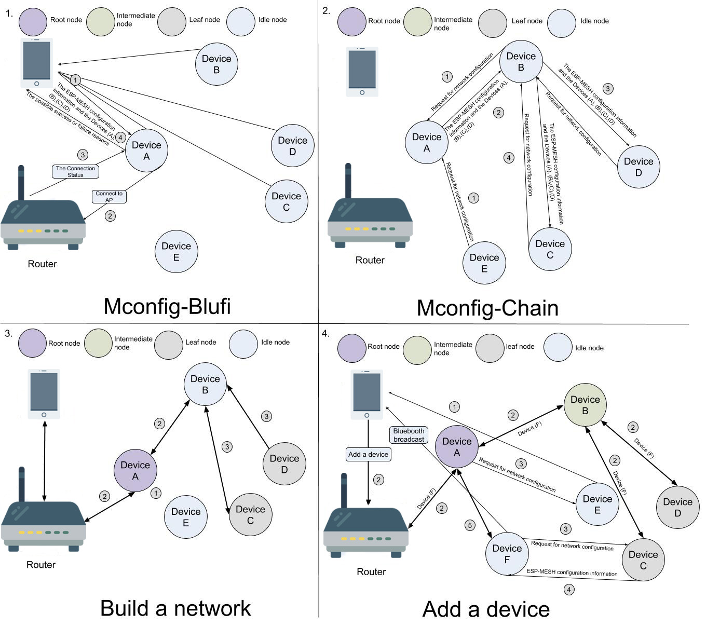
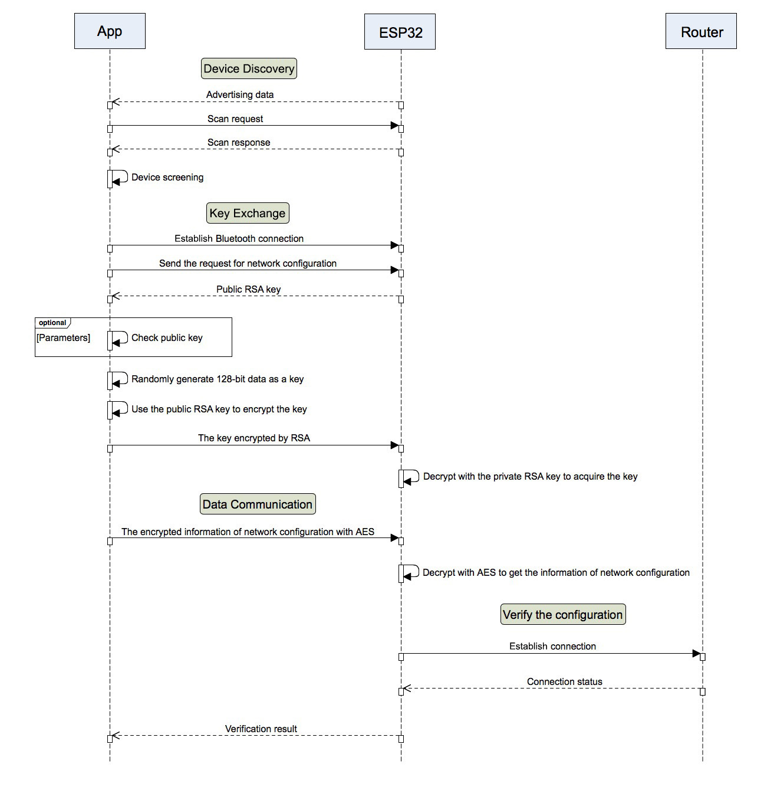
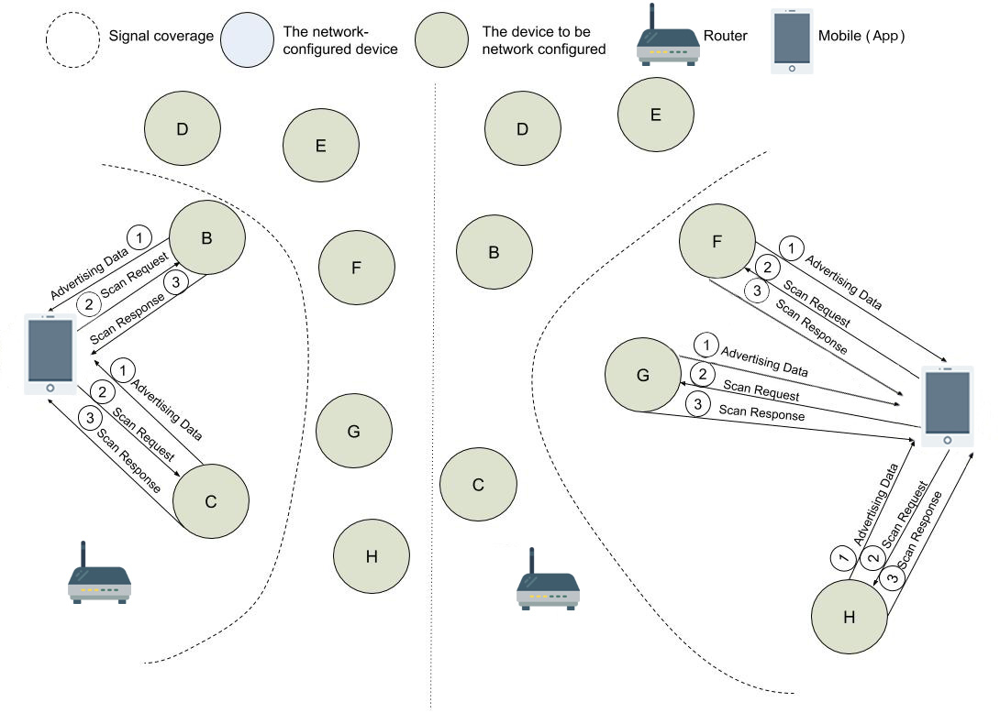
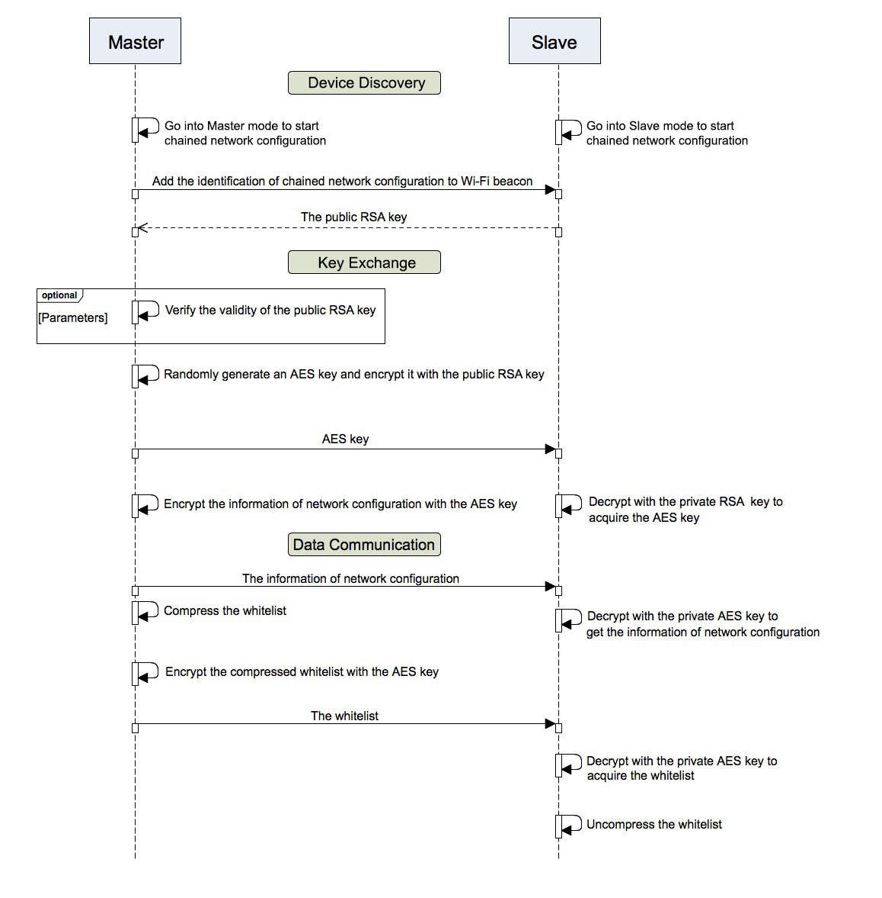

Mconfig
=========
:link_to_translation:`zh_CN:[中文]`

Mconfig (Mesh Network Configuration) is a network configuration solution for ESP-MESH, which sends network configuration information to ESP-MESH devices in a convenient and efficient manner.

Mconfig uses `ESP-Mesh App <https://github.com/EspressifApp/Esp32MeshForAndroid/raw/master/release/mesh.apk>`_ for network configuration. The App employs RSA algorithms for key exchange, 128-AES for data encryption, and CRC for verification and monitoring of transmission errors.

Terminology
-----------

========================= ==========================================================
Terminology               Description
========================= ==========================================================
Device                    Any device that is either connected, or can be connected to an ESP-MESH network.
Whitelist                 List of devices approved for verifying newly-added devices during the chained way of network configuration. A whitelist can be formed by scanning devices’ QR codes as well as by approving devices found via Bluetooth scanning. A whitelist includes each device’s MAC address and an MD5 (Message-Digest Algorithm 5) hash of its public key.
Configuration Information The configuration information related to Router and ESP-MESH.
AES                       Advanced Encryption Standard, also known as Rijndael in the field of cryptography, is a block encryption standard adopted by the U.S. government and is now used worldwide.
RSA                       An asymmetric encryption algorithm that is widely used in the areas of public-key encryption and e-commerce.
CRC                       Cyclic Redundancy Check is a hash function that generates a short verification code of fixed length for any network data packet or a file. It is mainly used for detection of any possible errors during data transmission or after data has been saved.
========================= ==========================================================

Process
-------

The detailed description of the process given in the figure can be found below.

1. :ref:`Mconfig-BluFi`: App implements network configuration for a single device through Bluetooth.
    a. App scans the Bluetooth packet of each device and generates a whitelist, which, for example, includes Devices *A*, *B*, *C*, and *D*. Since the signal of Device *A* is the strongest, App establishes connection and sends to this device the configuration information as well as the whitelist.
    b. Device *A* uses the configuration information to connect to the access point (AP), Router in this case.
    c. Device *A* checks if the configuration information is correct, according to the status returned by AP.
    d. Device *A* returns the network configuration status to App and does the following:
        - In case the configuration information is correct: Device *A* prompts other devices to request the network configuration information through a Wi-Fi beacon frame.
        - In case the configuration information is not correct: Device *A* returns possible failure reasons to App and goes back to its status at Step *a*.

2. :ref:`Mconfig-Chain`: The master, a single configured device, transfers the network configuration information to its slaves through Wi-Fi. The whitelisted slaves become secondary masters and find new devices to turn into their own slaves. The process propagates in waves until all the available devices have been covered.
    a. Device *A*, as the master, sends notifications to its slaves - Devices *B* and *E*. After receiving the notifications, both devices return requests for network configuration information.
    b. Device *A* checks the requesting devices against the whitelist:
        - If Device *B* is on the list, it will receive the network configuration information from Device *A*.
        - If Device *E* is not whitelisted, its request will be ignored.
    c. As soon as Device *B* obtains the network configuration information, it becomes a master for Devices *C* and *D* and starts the same process.

3. `Building a network <https://docs.espressif.com/projects/esp-idf/zh_CN/latest/api-guides/mesh.html#building-a-network>`_
    a. Root node selection: Devices *A*, *B*, *C* and *D* elect Device *A* as a root node, because of its optimal relay position for passing signal between each node and Router.
    b. Second layer formation: Once the elected root node is connected to Router, the idle node, Device *B*, within the coverage of the root node connects to Device *A*, thereby forming the second layer of the network;
    c. Formation of remaining layers: Devices *C* and *D* connect to Device *B*, forming the third layer, and so on. In this case Device *B* functions as an intermediate parent node for its leaf nodes - Devices *C* and *D*.

4. Add a new device
    a. App listens for incoming Bluetooth advertising packets from added devices. At some point a prompt pops up, asking the user whether Devices *E* and *F* should be added. If Device *F* is chosen to be added, App sends the command to the root node to add Device *F*.
    b. Device *A*, the root node, receives the command and forwards it to other devices in the ESP-MESH network. When Devices *B*, *C*, and *D* receive this command to add Device *F*, Mconfig-Chain gets activated.
    c. Device *F* sends a request for network configuration to Device *C*, the one with the strongest signal.
    d. Device *C* sends the network configuration information to Device *F* through Wi-Fi.
    e. Device *F* connects to the ESP-MESH network as soon as it receives the network configuration information.

Security
---------

- Data security
    - **RSA**: Generation of random public keys.
    - **AES**: Encryption of network configuration information to ensure the security of data transmission.

- Device security
    - **Mconfig-BluFi**: Screening devices via App, based on their signal intensity. It helps avoid potential attacks from malicious devices that use weak signal to disguise themselves.
    - **Mconfig-Chain**: To avoid potential attacks from disguised devices, this solution sets a time window for network configuration, during which only network configuration requests are accepted.

- ID security (optional)
    - Downloads to each device a public/private RSA key pair that is randomly generated by a downloading tool, then uploads the public key to a cloud for future verification.
    - Encrypts the flash partition that stores the public/private RSA key pair.

Notice
------

If you want to customize network configuration, please be sure to:

- **Verify password**: The nodes in ESP-MESH, except for the root node, do not check the router information. They only check if the configuration within their ESP-MESH network is correct. For this reason, if you accidentally provide a wrong router password to a non-root node, it will not be able to connect to the router after becoming a root node, even if their configuration within the network is correct. To avoid this potential problem, please verify the router password for non-root nodes.

.. ---------------------- Mconfig-BluFi --------------------------

.. _Mconfig-BluFi:

Mconfig-BluFi
--------------

Mconfig-BluFi is a network configuration protocol, that expands the features of BluFi - a Bluetooth network configuration protocol defined by Espressif. The additional features include advertizing packet definitions, RSA encryption, and ID authentication.

Mconfig-BluFi is generally used by hardware, such as mobile phones, other devices supporting Bluetooth connection, and routers.

The network configuration process consists of four phases:

- Device discovery
- Key exchange
- Data communication
- Verification of network configuration

.. note::

    Prior to using Mconfig-BluFi, the Bluetooth protocol stack must be enabled. Mconfig-BluFi also demands more resources, so please consider the following:

    1. **Firmware size increase**: As the firmware size will increase about 500 KB, it is recommended to modify the flash partition table and ensure that the size of the partition for firmware exceeds 1 MB.
    2. **Memory usage increase**: Extra 30 KB of the memory will be used. If you need to free this memory, please be aware that Bluetooth will only function as usual after reboot.

Device discovery
^^^^^^^^^^^^^^^^

Devices periodically send Bluetooth advertising packets through BLE, while App listens for the packets and screens the devices according to their signal strength. Then App generates a whitelist to avoid adding wrong devices to its network later. The process is shown below.

There are two types of Bluetooth advertising packets:

- Advertising Data: Storing the customized data of a specific product
    - Maximum length is 31 bytes.
    - The data format must meet the requirements of `Bluetooth Specification <https://www.libelium.com/forum/libelium_files/bt4_core_spec_adv_data_reference.pdf>`_.
- Scan Response: Storing the information of network configuration
    - Device name uses 10 bytes.
    - Manufacturer information uses 14 bytes. See the details in the table below.

========== ======== ====================
Field      Length   Description
========== ======== ====================
company id 2 bytes  The only ID assigned to `SIG member companies <https://www.bluetooth.com/specifications/assigned-numbers/company-identifiers>`_ by Bluetooth SIG
OUI        2 bytes  The Mconfig Blufi ID that is used to filter broadcast packets. It takes the form of 0x4d, 0x44, 0x46, i.e. "MDF"
version    2 bits   The current version
whitelist  1 bit    Flag to enable whitelist filter
security   1 bit    Flag to verify the validity of whitelisted deviced
reserved   4 bits   Reserved for future extension
sta mac    6 bytes  MAC address of the device (station)
tid        2 bytes  Device type
========== ======== ====================

Key Exchange
^^^^^^^^^^^^

1. App connects and sends the request for network configuration through BLE to Device *A*, which exhibits the strongest signal.
2. Device *A* receives the request and returns its public RSA key to App.
3. App verifies the validity of the public RSA key.
4. App randomly generates a 128-bit key and encrypts it with the public RSA key. Later this encrypted key is sent to Device *A*.
5. Device *A* decrypts the received data with its private RSA key to obtain the 128-bit key, which is then encrypted with AES to secure data transmission between App and Device *A*.

Data Communication
^^^^^^^^^^^^^^^^^^

App places the network configuration information and the whitelist into a data packet, and then transfers it as BluFi custom data.

The data packet is encoded in a TLV (Type-length-value or Tag-length-value) format, which is detailed below.

+--------------+----------------------------------------+---------------+------------------------------------------------------------------------------------------+
| Type         | Definition                             | Length, bytes | Description                                                                              |
+==============+========================================+===============+==========================================================================================+
|                                                                  Router Configuration                                                                            |
+--------------+----------------------------------------+---------------+------------------------------------------------------------------------------------------+
| 1            | BLUFI_DATA_ROUTER_SSID                 | 32            | SSID of the router                                                                       |
+--------------+----------------------------------------+---------------+------------------------------------------------------------------------------------------+
| 2            | BLUFI_DATA_ROUTER_PASSWORD             | 64            | Router password                                                                          |
+--------------+----------------------------------------+---------------+------------------------------------------------------------------------------------------+
| 3            | BLUFI_DATA_ROUTER_BSSID                | 6             | BSSID is equal to the router's MAC address. This field must be configured if more than   |
|              |                                        |               | one router shares the same SSID. You can avoid using BSSIDs by setting up a unique SSID  |
|              |                                        |               | for each router. This field must also be configured if the router is hidden              |
+--------------+----------------------------------------+---------------+------------------------------------------------------------------------------------------+
| 4            | BLUFI_DATA_MESH_ID                     | 6             | Mesh network ID. Nodes sharing the same MESH ID can communicate with one another         |
+--------------+----------------------------------------+---------------+------------------------------------------------------------------------------------------+
| 5            | BLUFI_DATA_MESH_PASSWORD               | 64            | Password for secure communication between devices in a MESH network                      |
+--------------+----------------------------------------+---------------+------------------------------------------------------------------------------------------+
| 6            | BLUFI_DATA_MESH_TYPE                   | 1             | Only MESH_IDLE, MESH_ROOT, and MESH_NODE device types are supported.                     |
|              |                                        |               | MESH_ROOT and MESH_NODE are only used for routerless solutions                           |
+--------------+----------------------------------------+---------------+------------------------------------------------------------------------------------------+
|                                                                   Mesh Network Configuration                                                                     |
+--------------+----------------------------------------+---------------+------------------------------------------------------------------------------------------+
| 16           | BLUFI_DATA_VOTE_PERCENTAGE             | 1             | Vote percentage threshold above which the node becoms a root                             |
+--------------+----------------------------------------+---------------+------------------------------------------------------------------------------------------+
| 17           | BLUFI_DATA_VOTE_MAX_COUNT              | 1             | Max multiple voting each device can have for the self-healing of a MESH network          |
+--------------+----------------------------------------+---------------+------------------------------------------------------------------------------------------+
| 18           | BLUFI_DATA_BACKOFF_RSSI                | 1             | RSSI threshold below which connections to the root node are not allowed                  |
+--------------+----------------------------------------+---------------+------------------------------------------------------------------------------------------+
| 19           | BLUFI_DATA_SCAN_MIN_COUNT              | 1             | The minimum number of times a device should scan the beacon frames from other devices    |
|              |                                        |               | before it becomes a root node                                                            |
+--------------+----------------------------------------+---------------+------------------------------------------------------------------------------------------+
| 20           | BLUFI_DATA_SCAN_FAIL_COUNT             | 1             | Max fails (60 by default) for a parent node to restore connection to the MESH network    |
|              |                                        |               | before it breaks the connection with its leaf nodes                                      |
+--------------+----------------------------------------+---------------+------------------------------------------------------------------------------------------+
| 21           | BLUFI_DATA_MONITOR_IE_COUNT            | 1             | Allowed number of changes a parent node can introduce into its information element (IE), |
|              |                                        |               | before the leaf nodes must update their own IEs accordingly                              |
+--------------+----------------------------------------+---------------+------------------------------------------------------------------------------------------+
| 22           | BLUFI_DATA_ROOT_HEALING_MS             | 2             | Time lag between the moment a root node is disconnected from the network and the moment  |
|              |                                        |               | the devices start electing another root node                                             |
+--------------+----------------------------------------+---------------+------------------------------------------------------------------------------------------+
| 23           | BLUFI_DATA_ROOT_CONFLICTS_ENABLE       | 1             | Allow more than one root in one network                                                  |
+--------------+----------------------------------------+---------------+------------------------------------------------------------------------------------------+
| 24           | BLUFI_DATA_FIX_ROOT_ENABLE             | 1             | Enable a device to be set as a fixed and irreplaceable root node                         |
+--------------+----------------------------------------+---------------+------------------------------------------------------------------------------------------+
| 25           | BLUFI_DATA_CAPACITY_NUM                | 2             | Network capacity, defining max number of devices allowed in the MESH network             |
+--------------+----------------------------------------+---------------+------------------------------------------------------------------------------------------+
| 26           | BLUFI_DATA_MAX_LAYER                   | 1             | Max number of allowed layers                                                             |
+--------------+----------------------------------------+---------------+------------------------------------------------------------------------------------------+
| 27           | BLUFI_DATA_MAX_CONNECTION              | 1             | Max number of MESH softAP connections                                                    |
+--------------+----------------------------------------+---------------+------------------------------------------------------------------------------------------+
| 28           | BLUFI_DATA_ASSOC_EXPIRE_MS             | 2             | Period of time after which a MESH softAP breaks its association with inactive leaf nodes |
+--------------+----------------------------------------+---------------+------------------------------------------------------------------------------------------+
| 29           | BLUFI_DATA_BEACON_INTERVAL_MS          | 2             | Mesh softAP beacon interval                                                              |
+--------------+----------------------------------------+---------------+------------------------------------------------------------------------------------------+
| 30           | BLUFI_DATA_PASSIVE_SCAN_MS             | 2             | Mesh station passive scan duration                                                       |
+--------------+----------------------------------------+---------------+------------------------------------------------------------------------------------------+
| 31           | BLUFI_DATA_MONITOR_DURATION_MS         | 2             | Period (ms) for monitoring the parent's RSSI. If the signal stays weak throughout the    |
|              |                                        |               | period, the node will find another parent offering more stable connection                |
+--------------+----------------------------------------+---------------+------------------------------------------------------------------------------------------+
| 32           | BLUFI_DATA_CNX_RSSI                    | 1             | RSSI threshold above which the connection with a parent is considered strong             |
+--------------+----------------------------------------+---------------+------------------------------------------------------------------------------------------+
| 33           | BLUFI_DATA_SELECT_RSSI                 | 1             | RSSI threshold for parent selection. Its value should be greater than SWITCH_RSSI        |
+--------------+----------------------------------------+---------------+------------------------------------------------------------------------------------------+
| 34           | BLUFI_DATA_SWITCH_RSSI                 | 1             | RSSI threshold below which a node selects a parent with better RSSI                      |
+--------------+----------------------------------------+---------------+------------------------------------------------------------------------------------------+
| 35           | BLUFI_DATA_XON_QSIZE                   | 1             | Number of MESH buffer queues                                                             |
+--------------+----------------------------------------+---------------+------------------------------------------------------------------------------------------+
| 36           | BLUFI_DATA_RETRANSMIT_ENABL            | 1             | Enable a source node to retransmit data to the node from which it failed to receive ACK  |
+--------------+----------------------------------------+---------------+------------------------------------------------------------------------------------------+
| 37           | BLUFI_DATA_DROP_ENABLE                 | 1             | If a root is changed, enable the new root to drop the previous packet                    |
+--------------+----------------------------------------+---------------+------------------------------------------------------------------------------------------+
|                                                                    Whitelist Configuration                                                                       |
+--------------+----------------------------------------+---------------+------------------------------------------------------------------------------------------+
| 64           | BLUFI_DATA_WHITELIST                   | 6 * N         | Device address                                                                           |
+              +                                        +---------------+------------------------------------------------------------------------------------------+
|              |                                        | 32 * N        | Verify the validity of the public key to avoid attacks from disguised devices            |
+--------------+----------------------------------------+---------------+------------------------------------------------------------------------------------------+

Verification of Network Configuration
^^^^^^^^^^^^^^^^^^^^^^^^^^^^^^^^^^^^^

When a device receives the network configuration information from AP, it connects to AP to verify if the information is correct. Then a device returns the connection status as well as the verification result to App, in the following format:

====== ============================ ====================
Type   Definition                   Description
====== ============================ ====================
0      ESP_BLUFI_STA_CONN_SUCCESS   Connecting to router successful
1      ESP_BLUFI_STA_CONN_FAIL      Connecting to router failed
16     BLUFI_STA_PASSWORD_ERR       Password configuration error
17     BLUFI_STA_AP_FOUND_ERR       Router is not found
18     BLUFI_STA_TOOMANY_ERR        Router reached max number of connections
19     BLUFI_STA_CONFIG_ERR         Parameter configuration error
====== ============================ ====================

.. ---------------------- Mconfig-Chain --------------------------

.. _Mconfig-Chain:

Mconfig-Chain
--------------

Mconfig-Chain is a network configuration protocol for devices based on `ESP-NOW <https://docs.espressif.com/projects/esp-idf/zh_CN/latest/api-reference/wifi/esp_now.html?highlight=espnow>`_, a connectionless Wi-Fi communication protocol defined by Espressif.

Currently, there are three methods to configure a Wi-Fi network: BLE, sniffer, and softAP, all of which are designed for network configuration of a single device. For this reason, these methods are not applicable for an ESP-MESH network, which usually involves network configuration of multiple devices.

Mconfig-Chain is specifically designed for ESP-MESH network configuration. It features a chained, transferable configuration process, which means that each device connected to the network can implement network configuration for other devices. Mconfig-Chain turns configuratoin process of a wide-range network into a simple and efficient process.

Mconfig-Chain splits devices into two types:

- **Master**: a device that initiates a connection
- **Slave**: a device that accepts a connection request

The network configuration process consists of three phases: Device Discovery, Key Exchange, and Data Communication.

Device Discovery
^^^^^^^^^^^^^^^^

1. A master adds an identification of chained network configuration to Vendor IE of Wi-Fi beacon frames and awaits the request from a slave for network configuration.
    - An examples of Vendor IE identification is shown below:

=========== ================
Type        Data
=========== ================
Element ID  0xDD
Length      0X04
OUI         0X18, 0XFE, 0X34
Type        0X0F
=========== ================

   - A master sets a window period, during which only the request from a slave can be accepted.
   - The identification of chained network configuration is sent through Wi-Fi beacon frames. So if a device has STA mode only, then it cannot become a master.

2. A slave enables a Wi-Fi sniffer in order to find the identification of chained network configuration. A sniffer keeps switching channels, sniffing Wi-Fi advertising packets. As soon as the sniffer finds masters, it stops switching channels and sends the request for network configuration to the master with the strongest signal.
    - Slaves need to switch channels when they sniffer Wi-Fi adverting packets, but the ESP-MESH function of network self-forming does not allow channel switching. Whenever a slave switches to another channel, the function automatically switches back to its original channel. Therefore, before using slave sniffer, the function of network self-forming in ESP-MESH should be disabled.

Key Exchange
^^^^^^^^^^^^

1. A master receives the request for network configuration from a slave and checks if a slave is in the whitelist. In order to verify the device’s ID, the ID authentication needs to be enabled. It requires implementing MD5 algorithms for the received public RSA key, and checking its validity against the whitelist.
2. A master removes Vendor IE identification of chained network configuration from the Wi-Fi beacon frame.
3. A master randomly generates 128-bit data as the key to communicate with a slave, encrypts it with the received public RSA key, and then sends the encrypted key to the slave through ESP-NOW.
4. The slave receives the encrypted key from the master and decrypts it using the private RSA key to acquire the communication key with the master.

Data Communication
^^^^^^^^^^^^^^^^^^

1. The master encrypts the network configuration information as well as the whitelist using the AES key and sends it to the slave through ESP-NOW.
2. The slave uses its AES key to decrypt the received data and completes network configuration. Then it stop functioning as a slave and becomes a master.

.. Note::

     As ESP-NOW implements data encryption on the data link layer. For this, the communicating devices must use an identical key, which should be written in flash or directly downloaded into firmware.
