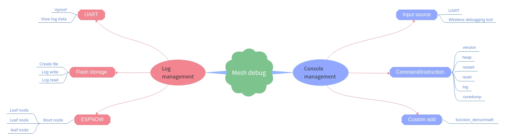
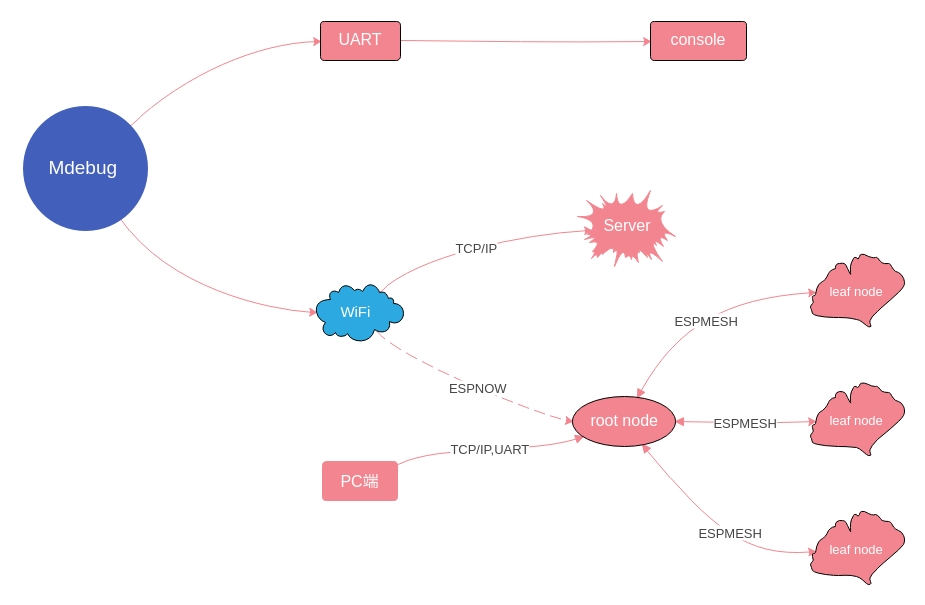

Mdebug
=========

:link_to_translation:`zh_CN:[中文]`

Mdebug (Mesh Network debug) is an important debugging solution used in ESP-MDF. It is designed to efficiently obtain ESP-MDF device logs through wireless espnow protocol, TCP protocol, serial port, etc., so that it can be read more conveniently and quickly. 
Then the device log information can be analyzed according to the extracted logs.

The Mdebug guide is divided into the following forms:

1. :ref:`Introduction`

2. :ref:`Functions`

3. :ref:`Debug-method`

4. :ref:`Console-management`

5. :ref:`Log-management`

.. ----------------------------- Introduction -----------------------------------

.. _Introduction:

Introduction
----------------

The traditional debugging method is to read all the log information by connecting the serial port. Some of the log information is unnecessary information, which wastes a lot of filtering time of the user, and needs to be connected online through the PC and the device to collect log information, resulting in the log information. A waste of time and resources.

The difference between the Mdebug debugging method and the traditional debugging method is that, while not affecting the operation of the normal device, the Mdebug debugging can filter the log through wireless debugging, log storage, and control commands, thereby improving the efficiency and convenience of the log. Save time and resources for devices to find problems and read the information they need.

Mdebug is mainly divided into command management and log management
    1. Command management can be roughly divided into `input source`, `command/instruction`, `user-defined add`;
    2. Log management can be roughly divided into `UART`, `Flash storage`, `ESPNOW`.

.. ----------------------------- Functions --------------------------------------

.. _Functions:

Functions
-----------

- ``Mdebug espnow``: Transfer log data from the device to other devices or servers via ``ESPNOW`` wireless WiFi form, thus improving the speed and convenience of debugging.
- ``Mdebug flash``: The log data in the device is directly written into the flash memory. The memory space has been created in the flash memory. Power loss protection log information, and the log information can be read at any time, thereby improving the availability of data and the convenience of the customer.
- ``Mdebug log``: The log data in the device is read out through the serial port monitor, and the log information such as `MDF_LOGI, MDF_LOGD, MDF_LOGW, MDF_LOGE` in `ESP_MDF` is read out.
- ``Mdebug console``: The log data in the device is read through the input command line in the terminal, which improves the operability and practicability of the user.

.. ----------------------------- Debug-method ---------------------------------

.. _Debug-method:

Debug Method
---------------

The debugging method can be summarized as two methods.One is UART serial port debugging, and the other is wireless WiFi debugging.

1. Serial port debugging uses the serial port debugging tool on the PC port (use minicom under linux), directly obtains the output log information, and can output the required log information by controlling the command line debugging method.
2. The wireless WiFi debugging has two communication modes: TCP/IP protocol and ESPNOW protocol. One is that the log information is transmitted to the Sever end through the TCP/IP protocol, and the other is that the log information from the child node is transmitted to the root through the ESPNOW protocol. The node then extracts log information from the serial port of the root node or TCP/IP.

.. ----------------------------- Console management ---------------------------------

.. _Console-management:

Command Management
--------------------

1. Input source
^^^^^^^^^^^^^^^^^

 - serial
    PC monitor

 - ESPNOW
    Wireless debugging tool (ESP-WROVER-KIT-V2）

2. Command and operation
^^^^^^^^^^^^^^^^^^^^^^^^^^^

 **2.1 General instruction**

    - help
        Print registered commands and their descriptions
    - version
        Get the chip and SDK version
    - heap
        Get the current available heap memory size
    - restart
        Soft restart chip
    - reset
        Clear all configuration information of the device

 **2.2 Log command**

  +-------------------+------------------------------------------------+----------------------------------+
  |Command definition | log -or [<tag>] [<level>]                      |                                  |
  |                   | [-s <addr(xx:xx:xx:xx:xx:xx)>] [-e <enable_type|                                  |
  |                   | ('uart'or'flash'or'espnow')>]                  |                                  |
  |                   | [-d <disable_type('uart'or'flash'or'espnow')>] |                                  |
  +-------------------+------------------------------------------------+----------------------------------+
  | Instruction       | log -o                                         |Get the log enable status         |
  +-------------------+------------------------------------------------+----------------------------------+
  |                   | log -r                                         |Read the log information          |
  +-------------------+------------------------------------------------+----------------------------------+
  |                   | log -s                                         |Send logs to the specified device |
  +-------------------+------------------------------------------------+----------------------------------+
  | Parameter         | tag                                            |Use tag to filter logs            |
  +-------------------+------------------------------------------------+----------------------------------+
  |                   | level                                          |Use level to filter logs          |
  +-------------------+------------------------------------------------+----------------------------------+
  |                   | addr                                           |Monitoring device MAC address     |
  +-------------------+------------------------------------------------+----------------------------------+
  |                   | e 'uart' or 'flash' or 'espnow'                |Enable serial port, flash, espnow |
  +-------------------+------------------------------------------------+----------------------------------+
  |                   | d 'uart' or 'flash' or 'espnow'                |Disable serial port, flash, espnow|
  +-------------------+------------------------------------------------+----------------------------------+
  | Examples          | log  mdebug_cmd INFO                           |Set the log output level of TAG   |
  |                   |                                                |to mwifi to INFO                  |
  +-------------------+------------------------------------------------+----------------------------------+
  |                   | log * NONE                                     |Set all logs to not output        |
  +-------------------+------------------------------------------------+----------------------------------+

 **2.3 Coredump command**

  +--------------------+----------------------------------------+----------------------------------------------------+
  | Command definition | coredump [-loe] [-q ] [-s <addr        |                                                    |
  |                    | (xx:xx:xx:xx:xx:xx)>]                  |                                                    |
  +--------------------+----------------------------------------+----------------------------------------------------+
  | Instruction        | coredump -l                            |Get the length of the coredump data on the device   |
  +--------------------+----------------------------------------+----------------------------------------------------+
  |                    | coredump -o                            |Read the coredump data on the device and print it to|
  |                    |                                        |the console                                         |
  +--------------------+----------------------------------------+----------------------------------------------------+
  |                    | coredump -e                            |Erase the coredump data on the device               |
  +--------------------+----------------------------------------+----------------------------------------------------+
  |                    | coredump -s                            |Send coredump data from the device to the specified |
  |                    |                                        |device                                              |
  +--------------------+----------------------------------------+----------------------------------------------------+
  | Parameter          | addr                                   |Monitoring device MAC address                       |
  +--------------------+----------------------------------------+----------------------------------------------------+
  |                    | sequence                               |The serial number of the coredump data              |
  +--------------------+----------------------------------------+----------------------------------------------------+
  | Examples           | coredump -s 30:ae:a4:00:4b:90          |Send coredump data to 30:ae:a4:00:4b:90 device      |
  +--------------------+----------------------------------------+----------------------------------------------------+
  |                    | coredump -q 110 -s 30:ae:a4:00:4b:90   |Send the coredump data starting with sequence number|
  |                    |                                        |110 to the 30:ae:a4:80:16:3c device                 |
  +--------------------+----------------------------------------+----------------------------------------------------+

3. Custom add
^^^^^^^^^^^^^^^^

Users can see how to customize the addition according to example:`function_demo/mwifi/console_test` in ESP-MDF. Add the features you want to suit your needs.

.. ----------------------------- Log management ---------------------------------

.. _Log-management:

Log Management
-----------------

Mdebug can be roughly divided into two forms according to the way the log is written:

1. The log information of the device is printed directly from the serial port by printing or the log information is stored, and then the read is called. The storage of the log information first writes the device log to the flash memory (here, a partition is allocated as `storage` in the flash memory, in order to store the device log, but the allocated memory here is limited, according to the file size set by the user. The decision) will be temporarily stored in the form of a file, and then the data will be sent to the PC or the server in the form of a packet through a serial port or wirelessly;
2. The device will send log information in the form of espnow. The child node log information is sent to the root node through the ESP-MESH network, and the log information is read from the device of the root node.

According to the log reading mode, there are three enabled states in the log, namely ``uart``, ``flash``, and ``espnow``.

.. -------------------------------------------------------- UART ENABLE ------------------------------------------------------------

1. UART enable
^^^^^^^^^^^^^^^^^^^^^

The serial port is enabled and the log information will be printed out via ``vprintf``.

    1. The I/O port for reading the log is UART0. The pin of the serial port is TXD0, which is GPIO1, RXD0 is GPIO3, and it is also the download serial port.
        =====  =====
            UART0   
        ------------
        TXDO   RXD0
        =====  =====
        GPIO1  GPIO3
        =====  =====

    2. Read the log information, diagnose the problem and find the problem. If the device is running normally, you can disable the serial port. If you do not close the serial port, it will occupy the memory. At the same time, the serial port prints too much information and activates. The watchdog makes the normal device run the program ``Backtrace``.

    3. The default state of the serial port is enabled. You can turn it off according to your needs.

.. -------------------------------------------------------- Flash ENABLE -----------------------------------------------------------

2. Flash enable
^^^^^^^^^^^^^^^^^^^^^^

Write flash enable to store log information in flash.

    2.1 Save the log to the flash

    The certain memory space selected in the partition table is ``storage``, and the memory allocated here provides memory space for writing the log to the flash. The file name is ``spiffs``,

    `spiffs` partition::

        # Name,   Type, SubType,  Offset,   Size,  Flags
        nvs,      data, nvs,      0x9000,   16k
        otadata,  data, ota,      0xd000,   8k
        phy_init, data, phy,      0xf000,   4k
        ota_0,    app,  ota_0,    0x10000,  1920k
        ota_1,    app,  ota_1,    ,         1920k
        coredump, data, coredump, ,         64K
        storage,  data, spiffs,   ,         64K
        reserved, data, 0xfe,     ,         64K

    .. Note::

        1. Before updating the partition table, you need to erase the entire flash at first;
        2. The partition table cannot be modified by OTA;
        3. The size of the file space can be allocated according to the user's reasonable choice.

    2.2 Log information access

        .. figure:: ../../_static/Mdebug/Mdebug_access.jpg
                :align: center
                :alt: Mdebug_access.jpg
                :figclass: align-center

        1. Log initialization, create two text flash memory space, and get the state of the text ``stat``, determine whether to write or read, use the main function is ``esp_vfs_spiffs_register``, ``esp_spiffs_info``, ``Sprintf``, ``fopen``;

        2. Add a mutex to the access. When the log information is read, the write function will be disabled. The main functions used are ``xSemaphoreTake``, ``xSemaphoreGive``;

        3. Write to flash, first write the timestamp, and write down the address pointer `g_log_info[g_log_index]` of the text array. The main functions used are ``time``, ``localtime_r``, ``strftime``;

        4. Write the log data, and write down the address pointer ``g_log_index`` of the array of text 1 to write the address for the next log write flash. The main functions are ``fseek``, ``fwrite``;

        5. Judge, if the address pointer of the text 1 array is full, clear the address pointer of text 1, the address is offset to the address pointer of text 2, and start writing log data; if it is not full, it will continue to write in text 1. Log data

        6. Similarly, when the address pointer of the text 2 array is full, the address pointer of the text 2 is cleared, the address is offset to the address pointer of the text 1, and the log data is started to be written; if it is not full, it will continue in the text 2 Write log data;

        7. Obtain the read text address pointer `log_info` according to the write address pointer `g_log_info`, then read the log data in the text, and also write down the address offset pointer `offset` of the read text data, for the next time from flash Read the log for address addressing, using the main functions as ``fseek``, ``fread``;

        8. Judge that if the text is not read, the text log data will continue to be read; if the text is read, the read task will end.

    .. Note::

        1. The header of the log data is added with a timestamp. It is only used as an experiment, and there is no real-time calibration. The user can modify it according to his own needs.

        2. The file size of the log storage is CONFIG_MDEBUG_FLASH_FILE_MAX_SIZE = 16384. You can modify the storage space of the log file according to your needs.

        3. ``Log Redirection`` The log storage information output is re-defined. This is to debug the log write flash. When the log output information has a problem, the log output information can be better debugged. The debugging function is ``MDEBUG_PRINTF(fmt, ...)``;

        4. Added data erasure. When the data is full, the data pointer will be cleared, and the main function ``rewind`` used will be restarted from the file header pointer address.

    2.3 Log data format

    The log data will come from `MDF_LOGI, MDF_LOGD, MDF_LOGW, MDF_LOGE`, etc. in `ESP_MDF`. This is because the IDF's log library will use the function of class vprintf to output the formatted string to the dedicated UART by default. The extracted data is shown below:

        .. figure:: ../../_static/Mdebug/Mdebug_log_data.jpg
                :align: center
                :alt: Mdebug_log_data.jpg
                :figclass: align-center

    Since the log information in the MDF has unnecessary data at the beginning and the end, it is necessary to extract and select valid string data information, so it needs to be removed and filtered, and then the log data is extracted. ``Front data`` contains the added information such as the font color, so the header part data needs to be removed, and ``Tail data`` contains the data such as line breaks, which also needs to be removed.
    There is no such useless data for `MDF_LOGD`, so no processing is required.

.. -------------------------------------------------------- ESPNOW ENABLE -----------------------------------------------------------

3. ESPNOW enable
^^^^^^^^^^^^^^^^^^^^^

    3.1 ESP-NOW Features

    * Both sender and receiver must be on the same channel
    * The receiving end may not add the MAC address of the sender in the case of non-encrypted communication (addition required for encrypted communication), but the sender must add the MAC address of the receiver.
    * ESP-NOW can add up to 20 paired devices and support up to 6 devices for communication encryption
    * Receive packets by registering a callback function, and check the delivery (success or failure)
    * Secure data with CTR and CBC-MAC protocol (CCMP)

    3.2 ESP-NOW enable process

    .. figure:: ../../_static/Mdebug/Mdebug_espnow.jpg
            :align: center
            :alt: Mdebug_espnow.jpg
            :figclass: align-center

    By enabling `espnow`, the log data of the child node can be sent to the root node through espnow, so that the log information of the child node is read from the root node, and then the log information is read through the serial port.
    For more on `espnow` see example:`wireless_debug`.

    .. code:: c

        MDF_ERROR_ASSERT(mdebug_console_init());
        MDF_ERROR_ASSERT(mdebug_espnow_init());
        mdebug_cmd_register_common();

For more `espnow` see example:`wireless_debug` and the official documentation ``espnow``.

.. Note:: 

    Because ESP-NOW is the same as ESP-MESH, it sends and receives data packets through the Wi-Fi interface. Therefore, when the ESP-MESH device has a large amount of data transmission, it will generate some delay for its control command reception or data transmission.
    After actual testing, the ESP-MESH device delay caused by the following configuration parameters is a negligible threshold when the network environment is good:

    * 50 ESP-MESH devices (the more the number of devices, the worse the network environment)
    * Add 10 ESP-MESH devices to the ESP-NOW receiving end (the more the receiving end is added, the worse the network environment)
    * The transfer log level is info (the lower the log level, the worse the network environment)

