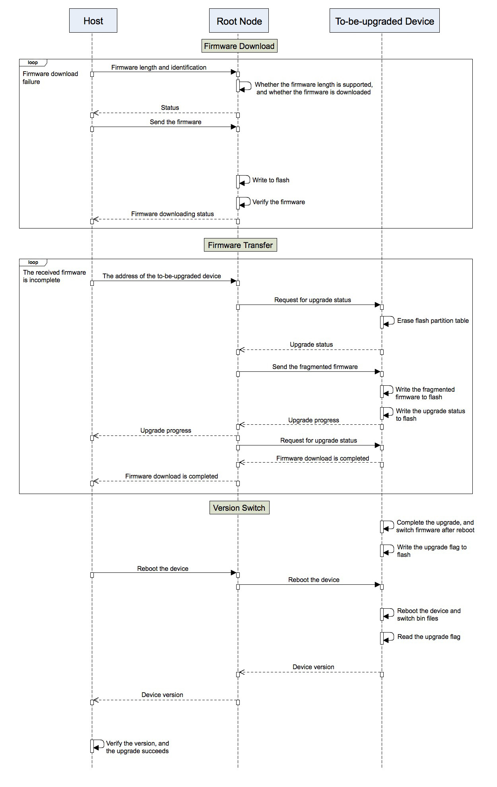

Mupgrade
=========

:link_to_translation:`zh_CN:[中文]`

Mupgrade, or MESH Upgrade, is a solution for simultaneous over-the-air (OTA) upgrading of multiple ESP-MESH devices on the same wireless network by efficient routing of data flows.

Mupgrade downloads a firmware upgrade to a root node, which splits it into fragments and flashes multiple devices with these fragments. When each device receives all the fragments, the mass upgrade is completed.

.. figure:: ../../_static/Mupgrade/image.jpeg
    :align: center
    :alt: image
    :figclass: align-center

Functions
---------

- **Automatic retransmission of failed fragments**: The root node splits the firmware into fragments of a certain size and transmits them to the devices that need to be upgraded. The devices write the downloaded firmware fragments to flash and keep log of the process. If the upgrade is interrupted, the device only needs to request the remaining fragments.
- **Data compression**: Miniz is used to compress firmware fragments to reduce their size and, as a result, decrease transmission time.
- **Multicast send**: To prevent redundancy in data transmission during simultaneous upgrade of multiple devices, each device creates a copy of a received firmware fragment and sends it to the next node.
- **Firmware check**: Each firmware fragment contains Mupgrade identification and Cyclic Redundancy Check (CRC) code to avoid such issues as upgrading to wrong firmware versions, transmission errors, and incomplete firmware downloads.
- **Revert to an earlier version**: The device can be reverted to a previous version using specific approaches, such as triggering GPIO, or cutting the power supply and rebooting for multiple times.

Process
-------

1. **Download Firmware**
^^^^^^^^^^^^^^^^^^^^^^^^

a. HOST communicates with the root node through UART or Wi-Fi.
b. HOST transfers the information about firmware, such as length and identification, to the root node.
c. The root node checks if the upgrade of this firmware is supported according to the received firmware information, then erases flash partition and returns the status to HOST.
d. HOST receives the returned status and acts accordingly:
    - Downloaded: skips Step e and directly goes to Step f.
    - Length error: checks if there is a firmware sending error, or if the firmware size exceeds the partition limit.
    - Error solved: continues to the next Step.
e. HOST sends the firmware to the root node that writes it directly to flash. When the root node confirms that the received firmware length matches the declared length, it will automatically check the firmware and return its downloading details to HOST.
f. HOST sends to the root node a list of the devices to be upgraded.

.. note::

    - The partition tables of all the devices to be upgraded must contain: ota_data, ota_0, ota_1. For more information on these partitions, please refer to `Over The Air Updates (OTA) <https://docs.espressif.com/projects/esp-idf/en/latest/api-reference/system/ota.html>`_.
    - The firmware size must not exceed the size of its destination partition (ota_0 or ota_1).
    - The root node writes the received fragment into flash. At this point, if sending of another packet to the root node as well as all other tasks are not suspended, it may cause data packet loss. So, if UART is used to send the firmware, please enable flow control, or send a firmware fragment and wait for the ACK signal from the root node before sending the next fragment.

2. Transfer Firmware
^^^^^^^^^^^^^^^^^^^^

a. The root node receives the device list and verifies it.
b. Then the root node sends the request for upgrade status to the devices on the list.
c. The devices receive the request for upgrade status and check their flash for missing or partially downloaded fragments, erasing such fragments in the process. Then the devices return their reports to the root node.
d. The root node transmits the failed firmware fragments to target devices in accordance with their reports.
e. The target devices verify the IDs of the received firmware fragments and write these fragments into flash accordingly, reporting the upgrade status each time the progress increases by 10%.
f. The root node goes back to Step b either until all the devices on the list complete downloading firmware or until the number of cycles reach a user-defined limit.

3. Switch Versions
^^^^^^^^^^^^^^^^^^

a. As the devices to be upgraded receive the last firmware fragment, they mark the partition in the ota_data of flash to be run after reboot.
b. When the root node receives the information that all the target devices are ready for upgrade, it sends a reboot command.
c. The devices receive the reboot command and report their current version when the reboot is completed.
d. HOST verifies the versions and completes the upgrade.

Partition Table
---------------

A partition table defines the flash layout. A single ESP32’s flash can contain multiple apps, as well as many different kinds of data. To find more information, please see `Partition Tables <https://docs.espressif.com/projects/esp-idf/en/latest/api-guides/partition-tables.html>`_.

The default partition table in ESP-IDF provides a partition of only 1 MB for apps, which is quite a limited size for ESP-MESH application development.

In order to help you configure the partition table, please find two types of partitions below for your reference.

1. Without `factory` partition::

    # Name,   Type, SubType,  Offset,   Size,  Flags
    nvs,      data, nvs,      0x9000,   16k
    otadata,  data, ota,      0xd000,   8k
    phy_init, data, phy,      0xf000,   4k
    ota_0,    app,  ota_0,    0x10000,  1920k
    ota_1,    app,  ota_1,    ,         1920k
    coredump, data, coredump, ,         64K
    reserved, data, 0xfe,     ,         128K

2. With `factory` partition::

    # Name,   Type, SubType,  Offset,   Size,  Flags
    nvs,      data, nvs,      0x9000,   16k
    otadata,  data, ota,      0xd000,   8k
    phy_init, data, phy,      0xf000,   4k
    factory,  app,  factory,  0x10000,  1280k
    ota_0,    app,  ota_0,    ,         1280k
    ota_1,    app,  ota_1,    ,         1280k
    coredump, data, coredump, ,         64K
    reserved, data, 0xfe,     ,         128K

.. Note::

    1. Before updating the partition table, please erase the entire flash.
    2. App partitions (factory, ota_0, ota_1) have to be at offsets aligned to 0x10000 (64K).
    3. The partition table cannot be modified wirelessly.
    4. The root node uses ota_0 or ota_1 to cache the firmware. The factory partition is used to store backup firmware, without which recovering a device after a fatal error can be much harder.

Notice
------

If you want to customize the upgrade approach, please keep in mind the following:

- **Do not upgrade from device to device**: It may lead to incompatibility between different versions of devices, which will destroy the original network, create standalone nodes, and increase upgrade difficulties.
- **Do not transmit an entire firmware file**: ESP-MESH is a multi-hop network, which means it can only guarantee a reliable transmission from node to node, and NOT end to end. If an entire firmware is attempted to be transmitted in one go, devices located a few nodes away from the root node are very likely to experience data loss, which will immediately cause upgrade failure.