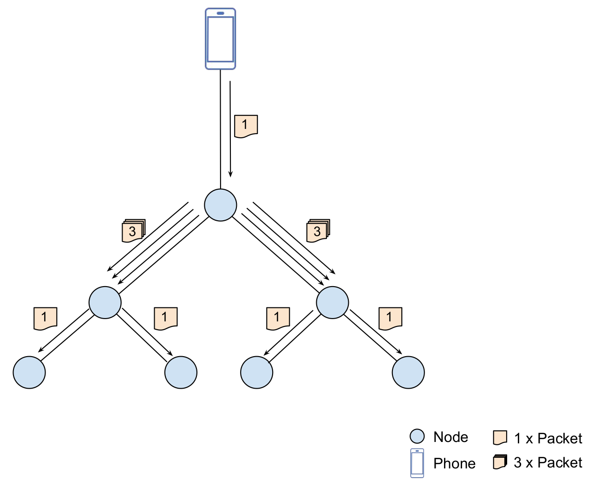
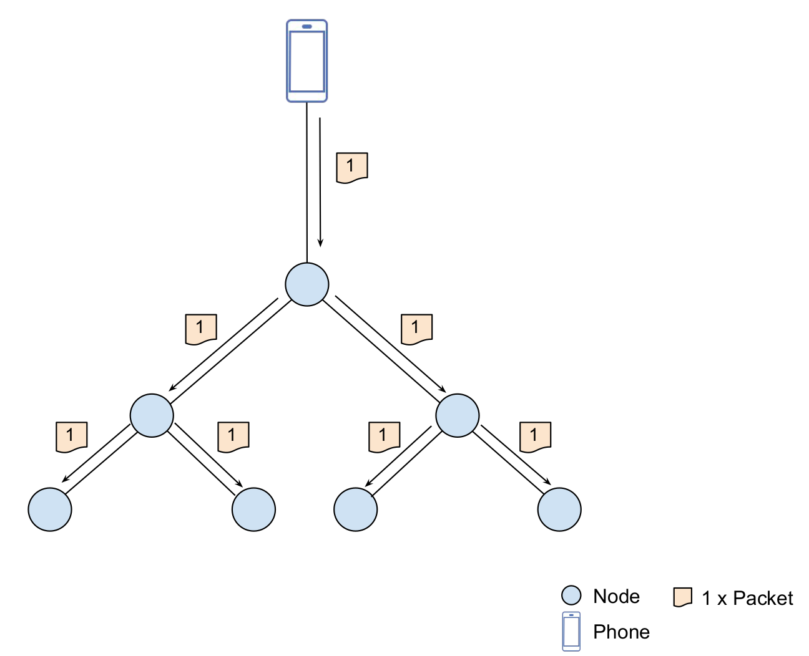
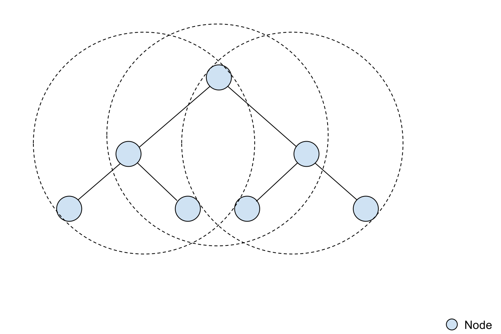
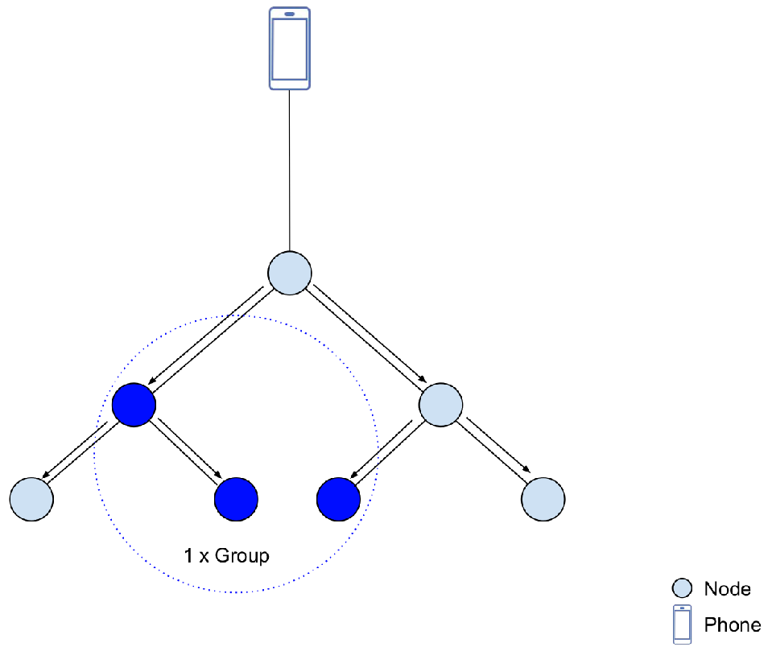

Mwifi
=========

:link_to_translation:`zh_CN:[中文]`

Mwifi (MESH Wi-Fi) is the most important component for ESP-MDF, for it allows the ESP-WIFI-MESH network to form and to communicate.  To further enhance ESP-WIFI-MESH, we have encapsulated native APIs for Mwifi.

Function
--------

- **Network configuration**: We provide a simple-to-use API to configure the root node parameters, network capacity, ESP-WIFI-MESH network stability, data transmission, routing information, and ESP-WIFI-MESH connection parameters;
- **Data transmission by segments**: Data fragmentation is implemented for application layer data, thus allowing the underlying data packet of  ESP-WIFI-MESH to be sent by segments;
- **Data compression**: `miniz` is used to compress each data packet, thus reducing the size of the data packet (and speeding up the transmission);
- **Unicast transmission**: After receiving a data packet, the device will send each destination address this data packet, which will then gets to the destination address through multi-hop transmission in the ESP-WIFI-MESH network;
- **Multicast transmission**: After receiving a data packet, the device will send this packet to all the nodes of the next layer, thus reducing data transmission times, in a manner similar to IP multicast;
- **Broadcast transmission**: After receiving a data packet, the device will broadcast this packet to all the neighboring nodes, which will then continue to broadcast this packet to their neighboring nodes;
- **Device grouping**: You can specify a bunch of nodes (of the same type, or those you want to control in one go) in one group, and control all these nodes by using the only unique identifier for the group, which is the group address;
- **Duplicate packet filtering**: When receiving data packets using the API provided by Mwifi, duplicated packets will be filtered out;
- **Secured thread**: A mutex is required before sending any data packets and will be released after the sending, meaning FreeRTOS operating system is supported in this case.

Network configuration
^^^^^^^^^^^^^^^^^^^^^

Mwifi provides an API to configure the ESP-WIFI-MESH network for parameters including router SSID and password, MESH ID and password, node type, and MESH channel, etc.

1. Network without a router

For an ESP-WIFI-MESH network without a router, you can only appoint a node to be the root node. For details, please go to :`example/function_demo/mwifi/no_router`.

2. Network with a router

For an ESP-WIFI-MESH network with a router, you can appoint a node to be the root node, or enable automatic root node election. For details, please go to :`example/function_demo/mwifi/router`.

Data transmission by segments
^^^^^^^^^^^^^^^^^^^^^^^^^^^^^

In some user cases,  the data in the application layer may exceed the maximum length of each packet, which calls for data transmission by segments. The maximum length of a data packet in the ESP-MDF application layer is 8095 bytes, while that of a data packet in the ESP-WIFI-MESH underlying protocol stack is 1472 bytes.

.. figure:: ../../_static/Mwifi/fragmenting.png
    :align: center
    :alt: fragmenting_packets
    :figclass: align-center

Data compression
^^^^^^^^^^^^^^^^

Considering the amount of data will be relatively large in the application layer, application layer data is compressed before transmission, and decompressed upon receiving. This is possible because of the `miniz` data compression library.

- Time: 2 ~ 4 ms for compression, 1 ~ 2 ms for decompression
- Memory requirement: The task stack should be not less than 8 KB; The dynamic memory should be larger than 7 KB for compression and 2 KB for decompression.
- Compression ratio: The compression ratio varies dramatically with the data content. The compression ratio increases when there are more repetitive content. This is applicable to some plain text formats, such as json.

Unicast transmission
^^^^^^^^^^^^^^^^^^^^

As shown, in the unicast transmission mode, the data sent by the device will traverse to the destination address, through multi-hop transmission, in the MEHS network. In one-to-more communication，

.. note::

    Flow control is added for up-stream transmission (from a child node to a root node). Therefore, the transmission can be blocked and you need to wait for the completion of the sending or the returning of an error.

Multicast transmission
^^^^^^^^^^^^^^^^^^^^^^

In actual user cases, some applications require "one- to more-nodes" data transmission, which means a source node needs to send a packet to more than one destination nodes. These users cases can be, for example, turning off all the lightings in one house. Multicast transmission can significantly reduce the consumption of various resources in the network, compared with unicast mode.

As can be seen from the figure, in the unicast mode,  the source node needs to transmit the data packet to all the destination nodes, which requires n unicasts (meaning sending n copies of the same packet). 
However, in the multicast mode, the source node simply needs to transmit the data packet once to the root node. Then, the root node will relay this packet upon receipt to all nodes in the next layer, which will then repeat the same behavior (relaying the packet to nodes of the next layer). Eventually, all the nodes in the ESP-WIFI-MESH network are able to receive the packets from the source node. 

Broadcast transmission
^^^^^^^^^^^^^^^^^^^^^^

As introduced in the above section, in user cases that require one- to more-nodes communication, multicast transmission is preferred because it can significantly reduce the consumption of various resources in the network. However, broadcast transmission can be a good choice for cases that have a lower tolerance for time delay, a higher requirement for transmission speed, but can tolerate higher packet loss, such as audio streaming.

When using the broadcast transmission, device A will broadcast data packets to all its neighboring nodes, which will then broadcast the data packets as well, upon receipt, to their neighboring nodes. Note that, device A, which is the original source node, also receives the same broadcast data packet from device B. However, device A then finds out the received packet is the same with what it sent out earlier, thus it will not broadcast this packet.

Device grouping
^^^^^^^^^^^^^^^

In typical user cases of ESP-WIFI-MESH, there usually exist plenty of devices with similar functionality in the same ESP-WIFI-MESH network. Therefore, users may consider grouping these devices, thus controlling these devices by groups. 

The root node sends data packets to all its child nodes, but only the nodes in the destination group can parse the packets.

