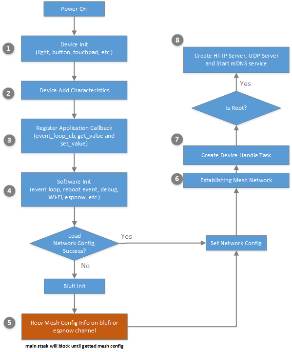

[[中文]](../../zh_CN/application-notes/add_new_device_cn.md)

# User Guide to Adding a New ESP-MDF Device

This document is intended to adding a new type of device into the mesh network based on ESP-MDF.

## 1. ESP-MDF Device Workflow

Below is an introduction to the workflow of ESP-MDF devices:

<div align=center>

<p> ESP-MDF Device Workflow </p>
</div>

### 1.1. Device Initialization

Hardware initialization of ESP-MDF devices includes the initialization of the pins connected to a temperature sensor, the initialization of the pin corresponding to the PWM module, etc. Different types of devices need different drivers. Here's an example of the `light_bulb` driver:

```c
// init GPIO of light_bulb
ESP_ERROR_CHECK(light_init(GPIO_NUM_4, GPIO_NUM_16, GPIO_NUM_5, GPIO_NUM_19, GPIO_NUM_23));
```

### 1.2. Adding Characteristics to a Device

Different types of devices are assigned different Type IDs (TID) and Characteristic IDs (CID). For example, lights and buttons are different types of devices which have different characteristics. The lights have the characteristics of color, shade, and power status, while the buttons have power status only.

The app or the server needs to acquire the device TID and CID to configure the mesh device status. Take the `light_bulb` as an example, the device characterstics are added with the function `mdf_device_add_characteristics(...)`.

```c
ESP_ERROR_CHECK(mdf_device_add_characteristics(STATUS_CID, "on", PERMS_READ_WRITE_TRIGGER, 0, 1, 1));
ESP_ERROR_CHECK(mdf_device_add_characteristics(HUE_CID, "hue", PERMS_READ_WRITE_TRIGGER, 0, 360, 1));
ESP_ERROR_CHECK(mdf_device_add_characteristics(SATURATION_CID, "saturation", PERMS_READ_WRITE_TRIGGER, 0, 100, 1));
ESP_ERROR_CHECK(mdf_device_add_characteristics(VALUE_CID, "value", PERMS_READ_WRITE_TRIGGER, 0, 100, 1));
ESP_ERROR_CHECK(mdf_device_add_characteristics(COLOR_TEMPERATURE_CID, "color_temperature", PERMS_READ_WRITE_TRIGGER, 0, 100, 1));
ESP_ERROR_CHECK(mdf_device_add_characteristics(BRIGHTNESS_CID, "brightness", PERMS_READ_WRITE_TRIGGER, 0, 100, 1));
```

### 1.3. Registering Status Update Interfaces

The app or server configures the CID value with the API (`*_get_value, *_set_value`) provided by the device. The two APIs need to be user-defined, created and added to the device's `mdf_device_request_task` through registration. Take the `light_bulb` as an example:

```c
ESP_ERROR_CHECK(mdf_device_init_handle(light_bulb_event_loop_cb, light_bulb_get_value, light_bulb_set_value));
```

### 1.4. Software Initialization

This step prepares the device for starting networking or initiating the ESP-MESH communication, and it is also key to the synchronization of components when the device is running.

* `mdf_event_loop_init(event_cb);` initialization of application-layer event notification function
* `mdf_reboot_event_init();` device reboot event handling
* `mdf_wifi_init();` Wi-Fi initialization
* `mdf_espnow_init();` ESP-NOW initialization
* `mdf_console_init();` Console Debug Init
* `mdf_espnow_debug_init();` ESP-NOW Debug Init

### 1.5. Network Configuration

After the hardware initialization and software initialization of the device are completed, the system reads the networking configuration information from the NVS. If the read is successful (namely the device has already been configured with network), this step will be skipped.

The device networking is completed through Blufi networking and ESP-NOW chain networking, which is fast and convenient. The first device to be networked communicates with the app via Bluetooth, and the other devices are networked via ESP-NOW chain networking. The relevant code is located at `$MDF_PATH/components/mdf_network_config`.

```c
for (;;) {
    /**< receive network info from blufi */
    if (xQueueReceive(g_network_config_queue, network_config, 0)) {
        MDF_LOGD("blufi network configured success");
        ret = MDF_OK;
        break;
    }

    ......

    /**< receive network info from espnow channel */
    if (mdf_ap_info_get(&request_data->rssi, dest_addr) != MDF_OK) {
        MDF_LOGV("did not find the network equipment has been configured network");
        continue;
    }

    ......

    break;
}
```

### 1.6. Establishing Mesh Network

The ESP-Mesh implements manual networking and self-organized networking. Users can specify the root node, leaf nodes, and parent node. Other unspecified nodes are connected in a self-organized way. For more information on the ESP-Mesh networking process, please refer to [Mesh Networking](https://espressif-docs.readthedocs-hosted.com/projects/esp-idf/en/latest/api-guides/mesh.html#mesh-networking).

### 1.7. Creating Device Handle Task

The device receives the data from the app, then parses the data to acquire instruction, inquires about the instruction list and executes the instruction, and replies as needed. Below is the process of handling a data packet:

* The device receives data from the app:

```c
device_data.request_size = mdf_wifi_mesh_recv(&src_addr, &data_type, device_data.request, WIFI_MESH_PACKET_MAX_SIZE, portMAX_DELAY);
```

* The device parses the data to acquire instruction:

```c
mesh_json_parse(device_data.request, "request", func_name);
```

* The device inquires about the instruction list and executes certain instruction:

```c
/**< if we can find this HTTP PATH from our list, we will handle this request. */
for (int i = 0; g_device_handle_list[i].func; i++) {
    if (!strncmp(func_name, g_device_handle_list[i].func_name, strlen(g_device_handle_list[i].func_name))) {
        status_code = g_device_handle_list[i].func(&device_data);
        MDF_LOGV("status_code: %d, func: %s, type: %x", status_code, func_name, data_type.val);
        break;
    }
}
```

* The device replies the result of the command execution:

The device decides, whether or not, to reply its `command execution status` to the app according to `status_code`.

```c
mdf_wifi_mesh_send(&dest_addr, &data_type, device_data.response, device_data.response_size);
```

### 1.8. Creating HTTP Server, UDP Server and Starting mDNS Service

After the node becomes the root node, the tasks and the services that are created in company include:
* `HTTP Server Task`, used for communication between the root node and external devices, which includes: `mdf_http_request_task` and `mdf_http_response_task`;
* `UDP Server Task`, used for device discovery, receiving UDP broadcast and response;
* `UDP Client Task`, used to broadcast the device's status;
* `mDNS Device Discovery Service`, used for enabling the device to be searched by the app on LAN;

For detailed code, please refer to `$MDF_PASTH/functions/mdf_server/mdf_server.c`.

```c
/**< receive http request from app or remote server */
xTaskCreate(mdf_http_request_task, "mdf_http_server_request", 4096, NULL, 6, NULL);

/**< send http response to app or remote server */
xTaskCreate(mdf_http_response_task, "mdf_http_server_response", 4096, NULL, 6, &g_http_response_task_handle);

/**< send notice(change of device's status) to lacal area network */
xTaskCreate(mdf_notice_udp_client_task, "mdf_udp_client", 3072, NULL, MDF_TASK_DEFAULT_PRIOTY, NULL);

/**< receive UDP broadcast from app for device discovery */
xTaskCreate(mdf_notice_udp_server_task, "mdf_udp_server", 2048, NULL, MDF_TASK_DEFAULT_PRIOTY, NULL);

/**< start mDNS service for device discovery in local area net */
mdf_mdns_init(void);
```

## 2. Steps to Add a New Type of ESP-MDF Device

Two parts of ESP-MDF, `device driver` and `device status update interface` are relevant to the device type. Therefore, when adding a new type of device to the mesh network, users need to modify the code in both parts.

### 2.1. Setting up a Project

Clone an example of ESP-MDF into a new directory, or set up a project yourself. For details, please refer to [Get Started](../get-started/get_started_en.md).

### 2.2. Creating a Driver

Create device drivers and wrap them up into APIs. Taking the mesh light as an example, the APIs includes the serial port initialization interface, color setting/reading interface, switch setting/reading interface, and the interface for light flashing.

```c
mdf_err_t mdf_light_init(gpio_num_t red_gpio, gpio_num_t green_gpio, gpio_num_t blue_gpio,
                         gpio_num_t brightness_gpio, gpio_num_t color_temperature_gpio);
mdf_err_t mdf_light_deinit();

mdf_err_t mdf_light_set_rgb(uint8_t red, uint8_t green, uint8_t blue);
int mdf_light_get_value();

......

mdf_err_t mdf_light_set_switch(uint8_t status);
int mdf_light_get_switch();

mdf_err_t mdf_light_breath_set(int period_ms);
mdf_err_t mdf_light_blink_start(uint8_t red, uint8_t green, uint8_t blue, int freq);
mdf_err_t mdf_light_blink_stop();
mdf_err_t mdf_light_blink_set(uint8_t red, uint8_t green, uint8_t blue, int freq, int blink_ms);
```

### 2.3. Defining Device's TID/CID and Creating Corresponding APIs

The detailed description can be found in Chapter 1.2 `Adding Characteristics to Device` and Chapter 1.3 `Registration Status Update Interface`. Below is an example of defining the characteristics of the light:

```c
enum light_status_cid {
    STATUS_CID            = 0,
    HUE_CID               = 1,
    SATURATION_CID        = 2,
    VALUE_CID             = 3,
    COLOR_TEMPERATURE_CID = 4,
    BRIGHTNESS_CID        = 5,
};

static esp_err_t light_bulb_set_value(uint8_t cid, int value);

static esp_err_t light_bulb_get_value(uint8_t cid, int *value);
```

API `light_set_value` and `light_get_value` are used by the app or server to set or get the status of the device.

### 2.4. Organization of app_main

The `app_main` function includes device information configuration, device initialization, configuring ESP-MDF parameters, and registering callback functions. Take the `light_bulb` as an example, the operate is shown blow:

```c
void app_main()
{
    ESP_ERROR_CHECK(light_init(GPIO_NUM_4, GPIO_NUM_16, GPIO_NUM_5, GPIO_NUM_19, GPIO_NUM_23));

    ESP_ERROR_CHECK(mdf_device_init_config(1, "light", "0.0.1"));

    ESP_ERROR_CHECK(mdf_device_add_characteristics(STATUS_CID, "on", PERMS_READ_WRITE_TRIGGER, 0, 1, 1));
    ESP_ERROR_CHECK(mdf_device_add_characteristics(HUE_CID, "hue", PERMS_READ_WRITE_TRIGGER, 0, 360, 1));
    ESP_ERROR_CHECK(mdf_device_add_characteristics(SATURATION_CID, "saturation", PERMS_READ_WRITE_TRIGGER, 0, 100, 1));
    ESP_ERROR_CHECK(mdf_device_add_characteristics(VALUE_CID, "value", PERMS_READ_WRITE_TRIGGER, 0, 100, 1));
    ESP_ERROR_CHECK(mdf_device_add_characteristics(COLOR_TEMPERATURE_CID, "color_temperature", PERMS_READ_WRITE_TRIGGER, 0, 100, 1));
    ESP_ERROR_CHECK(mdf_device_add_characteristics(BRIGHTNESS_CID, "brightness", PERMS_READ_WRITE_TRIGGER, 0, 100, 1));

    ESP_ERROR_CHECK(mdf_device_init_handle(light_bulb_event_loop_cb, light_bulb_get_value, light_bulb_set_value));
    ESP_ERROR_CHECK(mdf_trigger_init());
}
```

## 3. Communication Between Root Node and App

Root node is the only interface for the external communication of the mesh network. After becoming a root node, the node will first establish an HTTP server for external connection and data communication. The communication process is divided into the following three steps:

1. The app acquires the root node's IP and port
2. The app inquires the root node for network device list
3. The app communicates with the mesh devices

<div align=center>

<p> ESP-MDF Communication Protocol </p>
</div>

## 4. Customization of Components

ESP-IDF and ESP-MDF are composed by [components](https://esp-idf.readthedocs.io/en/latest/api-guides/build-system.html#component-makefiles), which can be used by different projects and examples. Meanwhile, users can customize the device function by modifying different components in the project (under directory `$IDF_PATH/components`, `$MDF_PATH/components`). To do so, the users need to set up a directory for the customized components and clone certain components of ESP-IDF or ESP-MDF to the newly established directory. For details, please refer to ESP-IDF [Build System](https://esp-idf.readthedocs.io/en/latest/api-guides/build-system.html#build-system).

## 5. Resources

* The [ESP32 BBS](https://esp32.com/) is a place to ask questions and find community resources.
* [ESP Mesh Development Framework](https://github.com/espressif/esp-mdf) is based on [ESP IoT Development Framework](https://github.com/espressif/esp-idf). For details, please refer to [ESP-IDF documentation](https://esp-idf.readthedocs.io).
