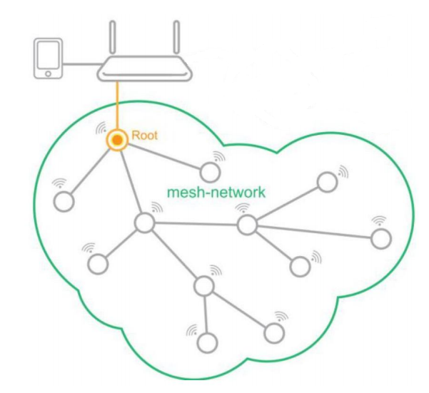

[[中文]](../../zh_CN/application-notes/mdf_lan_protocol_guide_cn.md)

#  Communication Protocol Between MDF Devices and the App

## 1. Preparation

The prerequisite for the ESP-Mesh app to communicate with the ESP-MDF devices is that the device has been successfully networked, and the mobile phone and mesh network are on the same LAN.

The ESP-MDF devices automatically enter the [networking stage](https://esp-idf.readthedocs.io/en/latest/api-guides/mesh.html#mesh-networking) once configured. If all the networked devices are shown in the ESP-Mesh app, it means that the networking is successful.

 ESP-Mesh Network Topology 

> The [ESP-Mesh app](https://www.espressif.com/zh-hans/support/download/apps?keys=&field_technology_tid%5B%5D=18) is hereafter referred to as "app" in this document.

## 2. Communication Process

The root node is the only interface of the mesh network that communicates with external network. To control the devices in the mesh network, the app needs to find the root node; then it obtains the MAC address of all devices in the mesh network from the root node; finally, the root node can communicate with any device on the mesh network.
The whole process is divided into three steps:

1. The app acquires the IP address, Port number and MAC address of the root node.
2. The app inquires a list of the network's devices from the mesh root node.
3. The app and the mesh devices communicate with each other.

 Communication Process Between App and Devices 

## 3. Communication Protocol

This chapter illustrates the communication protocols involved in the three steps mentioned above. The app gets the list of networked mesh devices, and communicates with devices in the mesh network using the standard HTTP or HTTPS communication protocol. In addition, the communication protocol also includes:

1. Device status notification: This is to allow the users to check the real-time status of the device through the app. That is, when the device status changes, the device will send UDP broadcast packets notifying the app of the changes, and then the app will inquire about the updated status of the device. For details, see section `3.5. Device Status Notification`.
2. Local connectivity control: connectivity control between devices on the LAN.
 * For detailed description, please refer to Section `3. ESP-MDF Device Connectivity Control` in the document [Readme_en.md](..／../Readme_en.md).
 * For protocol description, please refer to Section `3.6 Local Connectivity Control`.

### 3.1. App Gets the IP Address, Port Number and MAC Address of the Root Node

At this stage, the root node enables the mDNS service and UDP broadcasting function needed for device discovery. During device discovery, the app obtains the IP address, port number, and MAC address of the root node.

#### 3.1.1. mDNS Service for Device Discovery

    mDNS Service Info：
        hostname: "esp32_mesh"
        instance_name: "mesh"
        service_type: "_mesh-https"
        proto: "_tcp"
        port: 80
        txt:
            key: "mac"
            value: "112233445566"

The app will then acquire the root node's IP address through mDNS service, as well as the corresponding port number and MAC address from the `port` and `txt` fields of the service info.

#### 3.1.2. Receiving Broadcast UDP Packets

When scanning for devices, the app broadcasts UDP packets and obtains the information about the root node from its reply.

**Request:**

    "Are You Espressif IOT Smart Device?"

**Response:**

    "ESP32 Mesh 112233445566 http 80"

> * `112233445566` is the MAC address of the root node
> * `80` is the http service port
>
> In addition, the app obtains the IP address of the root node through the UDP packets replied by the root node.

### 3.2. App Acquires the Device List

**Request:**

    GET /mesh_info HTTP/1.1
    Host: 192.168.1.1:80

**Response:**

    HTTP/1.1 200 OK
    Content-Length: ??
    Mesh-Node-Mac: aabbccddeeff,112233445566,18fe34a1090c
    Host: 192.168.1.1:80

> * `/mesh_info` is the app command for abtaining the list of devices, which can be implemented via http URL field;
> * `Mesh-Node-Mac` is the list of the node' Station MAC addresses, separated by commas;
> * `Host` is a required field of the HTTP/1.1 protocol, indicating the console's IP address and port number.

### 3.3. App and ESP-MDF Device Communication Format 

#### 3.3.1. App Requests Format

**Request:**

    POST /device_request HTTP/1.1
    Content-Length: ??
    Content-Type: application/json
    Root-Response:??
    Mesh-Node-Mac: aabbccddeeff,112233445566
    Host: 192.168.1.1:80
    \r\n
    **content_json**

> * `/device_request` is the app command for controlling devices, which, apart from other things, can set and get the device status, via an http request through the URL field.
> * `Content-Length` is the length of the http message body.
> * `Content-Type` is the data type of the http message body, in the format of `application/json`.
> * `Root-Response` decides whether only replies from the root node are needed. If only the replies from the root node are required, the command will not be forwarded to the mesh devices. Value `1` means replies from the root node are required; `0` means no reply from the root node is required.

> * `Host` is a required field in the HTTP/1.1 protocol, indicating the app’s IP address and port number.
> * `**content_json**` is the http message body, corresponding to the `Request` in `3.4. App's Control of ESP-MDF Devices`.

#### 3.3.2. Device Replies

**Response:**

    HTTP/1.1 200 OK
    Content-Length: ??
    Content-Type: application/json
    Mesh-Node-Mac: 30aea4062ca0
    Mesh-Parent-Mac: aabbccddeeff
    Host: 192.168.1.1:80
    \r\n
    **content_json**

> * `Content-Length` is the length of the http message body.
> * `Content-Type` is the data type of the http message body, in the `application/json` format.
> * `Mesh-Node-Mac` is the MAC address of the device.
> * `Mesh-Parent-Mac` is the MAC address of the device’s parent node.
> * `Host` is a required field in the HTTP/1.1 protocol, indicating the app’s IP address and port.
> * `**content_json**` is the http message body that corresponding to the `Request` in `2.4. App's Control of ESP-MDF Devices`.

### 3.4. App's Control of ESP-MDF Devices

#### 3.4.1. Acquire device information: get_device_info

**Request:**

    {
        "request": "get_device_info"
    }

> * `"request"` is field defining the operation on the device, followed by specific commands of operation.

**Response:**

    {
        "tid": "1",
        "name": "light_064414",
        "version": "v0.8.5.1-Jan 17 2018",
        "characteristics": [
            {
                "cid": 0,
                "name": "on",
                "format": "int",
                "perms": 7,
                "value": 1,
                "min": 0,
                "max": 1,
                "step": 1
            },
            {
                "cid": 1,
                "name": "hue",
                "format": "int",
                "perms": 7,
                "value": 0,
                "min": 0,
                "max": 360,
                "step": 1
            },
            {
                "cid": 2,
                "name": "saturation",
                "format": "int",
                "perms": 7,
                "value": 0,
                "min": 0,
                "max": 100,
                "step": 1
            },
            {
                "cid": 3,
                "name": "value",
                "format": "int",
                "perms": 7,
                "value": 100,
                "min": 0,
                "max": 100,
                "step": 1
            },
            {
                "cid": 4,
                "name": "color_temperature",
                "format": "int",
                "perms": 7,
                "value": 0,
                "min": 0,
                "max": 100,
                "step": 1
            },
            {
                "cid": 5,
                "name": "brightness",
                "format": "int",
                "perms": 7,
                "value": 100,
                "min": 0,
                "max": 100,
                "step": 1
            }
        ],
        "status_code": 0
    }

> * `"tid"` is the type ID of the device, which is used to distinguish different types of devices from each other, such as lights, sockets, and air conditioners.
> * `"name"` is the device name.
> * `"version"` is the device firmware version.
> * `"characteristics"` is the device characteristics, in json format.
>   * `"cid"` is the characteristic ID of the device，indicating charactertistics such as brightness, hue, switches, etc.
>   * `"name"` is the name of the device characteristics.
>   * `"format"` is the data format. Four data types `"int"`, `"double"`, `"string"`, `"json"` are supported.
>   * `"value"` is the value of the device characteristics.
>   * `"min"` is the minimum value or the minimum length of the data string of `"charactertics"`
>   * `"max"` is the maximum value or the maximum length of the data string of `"charactertics"`
>   * `"step"` is the minimum variation of the characteristics value
> 		* When `"format"` is `"int"` or `"double"`, `"min"`,`"max"` and `"step"` represent the minimum value, maximum value, and the minimum variation of the charateristics.
> 		* When `"format"` is `"string"` or `"json"`, `"min"` and `"max"` indicate the minimum and maximum lengths of the string supported respectively, without the keyword `"step"`.
> * `perms` stands for permission, parsed in binary integers, with the first bit representing a read permission, the second bit representing a write permission, and the third bit representing a execution permission. Value 0 indicates that the permission is not granted, and value 1 the opposite.
> 	* If the parameter has no read permission, the corresponding value can not be accessed.
> 	* If the parameter has no write permission, the corresponding value can not be modified.
> 	* If the parameter has no execution permission, the corresponding value can not be set.
> * `status_code"` is the reply to the request commands; `0` indicates normal, and `-1` indicates error. 

#### 3.4.2. Acquire device status: get_status

**Request:**

    {
        "request": "get_status",
        "cids": [
            0,
            1,
            2
        ]
    }

> * `"cids"` is the field of device characteristics, followed by the CID list of the request.

**Response:**

    {
        "characteristics": [
            {
                "cid": 0,
                "value": 0
            },
            {
                "cid": 1,
                "value": 0
            },
            {
                "cid": 2,
                "value": 100
            }
        ],
        "status_code": 0
    }

> * `"status_code"` is the reply to the request command, `0` indicates normal, `-1` indicates that the request contains illegal parameters, such as lack of corresponding CID for a device or a value with no read permission in the `"cids"` list.

#### 3.4.3. Configure the device status: set_status

**Request:**

    {
        "request": "set_status",
        "characteristics": [
            {
                "cid": 0,
                "value": 0
            },
            {
                "cid": 1,
                "value": 0
            },
            {
                "cid": 2,
                "value": 100
            }
        ]
    }

**Response:**

    {
        "status_code": 0
    }

> * `"status_code"` is the reply value to the request command, `0` indicates normal, `-1` indicates that the request contains illegal parameters, such as lack of corresponding CID for a device or a value with no read permission in the `"cids"` list.

#### 3.4.4. Enters the networking mode: config_network

**Request:**

    {
        "request": "config_network"
    }

**Response:**

    {
        "status_code": 0
    }

> * `"status_code"` is the reply value to the request command, `0` indicates normal, `-1` indicates error.

#### 3.4.5. Reboots the device: reboot

**Request:**

    {
        "request": "reboot",
        "delay": 50
    }

>  `"delay"` is the delay for executing the command. This field is not required. The default delay is `2s`.

**Response:**

    {
        "status_code": 0
    }

> * `"status_code"` is the reply to the request command, `0` indicates normal, `-1` indicates error.

#### 3.4.6. Reset the device: reset

**Request:**

    {
        "request": "reset",
        "delay": 50
    }

> `"delay"` is the delay for executing the command. This field is not required. The default delay is `2s`.

**Response:**

    {
        "status_code": 0
    }

> * `"status_code"` is the reply value to the request command; `0` indicates normal, and `-1` indicates error.

### 3.5. Device Status Notification

When the status of the ESP-MDF device (on/off), network connection (connected or disconnected), and route table change, the root node will send broadcast UDP packets to notify the app to obtain the latest status of the device.

**UDP Broadcast:**

    mac=112233445566
    flag=1234
    type=***

> * "mac"` is the MAC address of the device whose status has changed;
> * `"flag"` is a random integer value used to distinguish among notifications at different times;
> * `"type"` is the type of change, including:
> * `"status"` indicates that the device status has changed;
> * `"https”` indicates that the information of the device connection in the network has changed, and the updated information is required through https communication protocol;
> * `"http"` indicates that the information of the device connection in the network has changed, and the updated information is required through http communication protocol;
> * ``sniffer"` indicates that a new networked device has been sniffered.

### 3.6 Device Connectivity Control on LAN

#### 3.6.1. Procedure of Connectivity Control

1. `Acquire device information`: acquire the device connectivity information

2. `Linked devices`: configure the association between devices (for example, setting a photosensor, which is the device that initiates the connectivity control in this case, to send a control command to turn on a light when the light brightness is below a certain threshold). Once configured, the app will convert the association information according to the protocol format into control commands and send it to the associated device.

3. `Trigger connectivity control`: When the associated device receives the command, it parses the command into `trigger condition` and `execution command`. After that, the device will periodically check its own status. When the status satisfies the `trigger condition`, the device will send an `execution command` to the target device.

#### 3.6.2. ESP-MDF Connectivity Control Protocol

#### 3.6.2.1. Acquire the info of existing connectivity events: get_event

**Request:**

    {
        "request": "get_event"
    }

> * `"get_event"` is the command to acquire device connectivity control data.

**Response:**

    {
        "events": {
            "name": "on",
            "trigger_content": {
                "request": "contorl"
            },
            "trigger_cid": 2,
            "trigger_compare": {
                ">": 1,
                "~": 10
            },
            "execute_mac": [
                "30aea4064060"
            ]
        },
        "status_code": 0
    }

> * `"events"` is the connectivity control event.
>   * `"name"` is the name and the unique identifier of the connectivity control event. 
>   * `"trigger_content"` is the contents of connectivity control event.
>       * `"request"` is the type of connectivity event.
>           * `"sync"` is the synchronization event to sync the state of the two associated devices.
>           * `"connectivity"` is the connectivity control; when the conditions for connectivity control are met, the connectivity event is triggered.
>           * `"delay"` is the period of delay (in unit of seconds) before a trigger command is sent when the trigger condition is met.
>   * `"trigger_cid"` is the associated device’s characteristics, which is the object of the connectivity control event.
>   * `"trigger_compare"` is the comparison of the actual value of the associated device with the threshold for the trigger event.
>      * `">"`: greater than
> 		* `"<"`: less than
> 		* `"=="`: equal 
> 		* `"!="`: not equal to
>		* `"~"`: variation in unit of time (seconds)
>		* `"/"`:  increases to a certain value in unit of seconds
> 		* `"\\"`: decreases to a certain value in unit of seconds 

> * `"execute_mac"` are the target mac address of the connectivity event and mac address of the device executing the instruction
> * `"status_code"` is the replied value to the request command. `0` indicates normal, and `-1` indicates error.

#### 3.6.2.2. Configure connectivity event：set_event

The communication protocol for connectivity control converts the trigger conditions into executable commands.

**Request:**

    {
        "request": "set_event",
        "events": {
            "name": "on",
            "trigger_cid": 0,
            "trigger_content": {
                "request": "connectivity"
            },
            "trigger_compare": {
                "==": 0,
                "~": 1
            },
            "execute_mac": [
                "30aea457e200",
                "30aea457dfe0"
            ],
            "execute_content": {
                "request": "set_status",
                "characteristics": [
                    {
                        "cid": 0,
                        "value": 1
                    }
                ]
            }
        }
    }

> Note: This event is added if there is no such event on the device's end. If the event exists, modify it.
>
> * `"set_event"` is the command to set device connectivity control data.
> * `"events"` is the connectivity control events.
> 	* `"name"` is the name of the connectivity event, which is the unique identifier of the event.
> 	* `"trigger_cid"` is the characteristics of the linked device, which is the object of the connectivity event.
> 	* `"trigger_content"` is the content of the connectivity event, the types of which include: `sync`, `connectivity`, and `delay`.
> 	* ``trigger_compare'` defines the conditions for the connectivity event by comparing the actual value of the associated device with the threshold; its value can be one of the following: `>`, `<`, `==`, `!=`, `~`,`/` and `\\`.
> 	* `"execute_mac"` is the target address of the connectivity event, namely the address of the device executing the command.
> 	* `"execute_content"` is the command to be executed. When the trigger condition is met, it is sent to `"execute_mac”`.

**Response:**

    {
        "status_code": 0
    }

#### 3.6.2.3. Remove the connectivity event: remove_event

**Request:**

    {
        "request": "remove_event",
        "events": [
            {
                "name": "on"
            },
            {
                "name": "off"
            }
        ]
    }

**Response:**

    {
        "status_code": 0
    }
