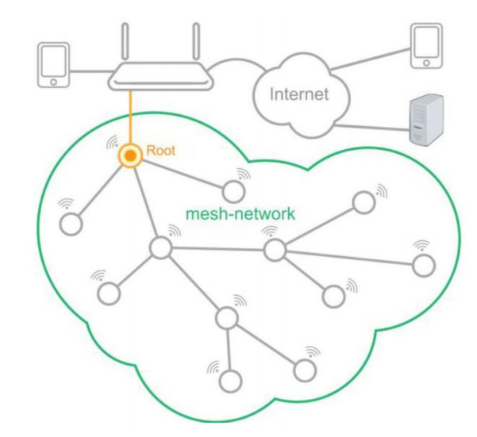

## 0. ESP-MDF 概述

ESP-MDF 是基于 [ESP-IDF](https://github.com/espressif/esp-idf)(Espressif IoT Development Framework) 应用层框架和 [ESP-MESH](https://esp-idf.readthedocs.io/en/latest/api-guides/mesh.html) 无线通信协议开发的一种物联网综合解决方案，包含设备配网，本地和远程控制，固件升级，设备间联动控制，低功耗方案等一套完整的功能。

更多关于 ESP-MDF 的介绍请参考项目 [README.md](../README.md) 文档。

## 1. ESP-MESH 优势说明

目前市面上的无线 Mesh 网络主要为以下三种：Zigbee，BLE Mesh 和 Wi-Fi Mesh。ESP-MESH 是 Espressif 开发的一种基于 Wi-Fi 传输协议的自组网，自修复的多跳（Multi-hop）网络传输协议，属于 Wi-Fi Mesh 协议的一种。关于 ESP-MESH 的原理介绍，请参考 [ESP-MESH](https://esp-idf.readthedocs.io/en/latest/api-guides/mesh.html) 官方手册。ESP-MESH 具有如下的优势：

1. 无需网关
    * ESP-MESH 网络中根节点通过普通路由器或手机热点直接与外部网络进行通信，不需要额外的网关设备。

2. 运行效率高
    * ESP-MESH 是基于 Wi-Fi MAC 层的 Mesh 组网方案，在 Mesh 网络内部，应用层的数据直接经过 MAC 层传输，没有冗长的 TCP 和 IP 包头数据，数据包的处理和传输效率更高。

3. 通信距离远
    * ESP-MESH 本质上是基于 Wi-Fi 通信协议开发的多跳网络协议，因此，也具备了 Wi-Fi 长距离（20 ~ 200 米）通信的优势。ESP-MESH 最大支持 11 层网络，以网络中两个设备之间的通信距离为 100 米为例，覆盖范围可达一平方公里。

三种无线 Mesh 网络(Wi-Fi Mesh 以 ESP-MESH 为例)的性能对比如下：

|   -    | Zigbee   | BLE Mesh | ESP-MESH |
| ------ | -------- | -------- | -------- |
| 速率   | 100 Kbps | 1 Mbps   | 20 Mbps  |
| 距离   | 50 米    | 100 米   | 150 米   |
| 功耗   | 低       | 低       | 高       |
| 网关   | 需要     | 需要     | 不需要   |
| 节点数 | 400      | 870      | 1000+    |

## 2. ESP-MDF 功能说明

ESP-MDF 工程包含的 [代码](https://github.com/espressif/esp-mdf) 已全部在 GitHub
上开源，您可以基于 ESP-MDF 系统框架开发多种类型的智能设备：智能灯，按键，插座，智能门锁，智能窗帘等。ESP-MDF 有如下一些功能：

1. 安全高效的配网方式
    * 速度快
        * 结合 [BluFi](https://esp-idf.readthedocs.io/en/latest/api-reference/bluetooth/esp_blufi.html) 与 [ESP-NOW](https://esp-idf.readthedocs.io/en/latest/api-reference/wifi/esp_now.html) 链式配网两种配网方式，只有第一个设备采用单连接的 BluFi 配网，之后的所有设备都采用 ESP-NOW 链式配网（已配网成功的设备在一定时间内将配网信息传递给周围未配网的设备）。经测试，对一百个设备进行配网，最快仅需 1 分钟。
    * 操作便捷
        * 配网信息存储于所有已配网的设备中，添加新设备时仅需要在 app 端一键 `添加设备` 即可完成对新设备的配网操作。
    * 完善的异常处理机制
        * 包括路由器密码配置变更、密码错误、路由器损坏等特殊情况的处理。
    * 安全
        * 非对称加密：对 BluFi 和 ESP-NOW 链式配网过程中的网络配置数据进行非对称加密；
        * 白名单机制：扫描设备的蓝牙信号或二维码信息生成待配网设备白名单，配网时仅对白名单上的设备进行配网；

2. 多种控制方式
    * 局域网控制
    * 语音控制：Alexa
    * 远程控制：Aliyun

    > 关于 ESP-MDF 的局域网控制协议说明，请参考相关协议说明文档: [mdf_lan_protocol_guide_cn.md](mdf_lan_protocol_guide_cn.md)。

2. 快速稳定的升级过程
    * 专用升级连接：50 个设备同时升级，最快仅需 3 分钟；
    * 支持断点续传：提高设备在复杂网络环境下的升级成功率；

4. 完善的调试工具
    * 指令终端: 通过命令行实现添加、修改、删除和控制 ESP-MDF 设备
    * 概要信息: 通过 mDNS 服务获取 Mesh 网络的 Root IP、MAC、Mesh-ID 等信息
    * 日志统计: 对接收的日志数据进行统计，包括：ERR 和 WARN 日志的数量，设备重启次数，Coredump 接收个数，系统运行时间等
    * 日志保存: 接收设备的日志与 coredump 信息并保存至 SD 卡中

    > 关于调试工具的使用，请参考项目示例 [mdf_debug](https://github.com/espressif/esp-mdf/tree/master/examples/mdf_debug) 的 README.md 说明文档。

5. 支持低功耗模式
    * 叶子结点可选择进入 Deep Sleep 运行模式，降低系统功耗，电流最低可至 5 微安。

6. 支持 iBeacon 功能
    * 可应用于室内定位（弥补 GPS 无法覆盖的室内定位场景）和产品推广（商家可以通过 iBeacon 实时推送产品信息和优惠活动）领域。

7. 支持 BLE & Wi-Fi 监听功能
    * 可应用于人流量统计（通过抓取空气中的无线数据包来统计手持联网设备的数量，进而统计人流量）和路径追踪（通过多个采集点对同一设备的无线数据包在时间上的统计，达到追踪某一联网设备的目的）领域。

8. 支持传感器设备网关
    * ESP32 芯片在运行 Wi-Fi 和 蓝牙协议栈的同时还可以接入多种传感器设备，能很方便的将各种传感器数据传给服务器，因此可以作为多种传感器设备的网关，包括蓝牙设备，红外传感器设备，温度传感器设备等。

9. 设备联动控制
    详细介绍请参考本文档章节 `3. ESP-MDF 设备联动控制详细说明`。

## 3. ESP-MDF 设备联动控制详细说明

### 3.1. 背景介绍

目前物联网设备的联动控制主要有以下两种方式：

1. 云端互联。通过云端服务器连接两个使用不同协议的产品，让它们互相触发，协同工作。这种方式解决了不同产品的兼容性问题，但也带来了诸多其他的问题：
    * 联动缓慢：控制命令的传递需要经过各自的网关，路由器和服务器，每个环节都会有数百毫秒的延迟，整个过程累计在一起，最终可能导致几秒甚至十几秒的控制延迟。
    * 网络依赖性高：设备之间的互联互通都需要经过外部网络，一旦某一环节出现故障（如路由器损坏），所有的互联互通都将无效。
    * 安全性低：为了实现设备的协同工作，用户必须将很多个人的在线账户资料交给云端服务器，一旦网络被攻破，那么用户隐私数据的安全性将无法保证。

2. 智能套件。通过定制化的智能设备套件，将设备互联的方式直接设定在智能套件设备中。这种方式虽避免了对外部网络和服务器的依靠，但其缺点也很明显：
    * 不灵活：设备之间的互联方式是事先定好的，无法满足用户各种定制化需求；
    * 成本高：需要成套的购买智能套件，增加了用户的使用成本，不利于产品的推广；

### 3.2. ESP-MDF 本地互联控制介绍

ESP-MDF 基于现有的局域网通信协议开发了一种 Mesh 网络内部的设备联动控制方案。用户通过移动端 app 页面设置联动控制方式（比如一打开房门就将客厅的灯全部点亮，离开厨房时关闭厨房的灯，同时打开客厅的灯等）；之后 app 会将用户配置好的条件转换成设备可执行的命令数据发送给设备；设备在运行过程中不断检测环境和自身状态，满足判断条件时，就直接向目标设备发送设定好的控制信息。

### 3.3. ESP-MDF 本地互联的优势

在 ESP-MDF 设备中，设备之间的联动信息是记录于设备内部的，不依赖外部网络或服务器，健壮性上比云端互联更高。并且每个联动信息都可以动态修改，比智能套件要更灵活。其优点如下：

* 速度快：设备之间的交互不通过云端，直接通过 Mesh 网络内部实现通信，控制速度更快；
* 更灵活：任意两个 ESP-MDF 设备均可以通过配置实现互联；
* 更健壮：设备联动控制数据在本地网络内传输，无需通过外部服务，降低了对网络的依赖；
* 低成本：联动的条件触发和控制由设备端自行处理完成，无需通过外部服务，减少了服务器开发和维护成本；
* 更安全：由于设备互联不通过云端，可以有效避免黑客通过云端服务对设备进行攻击的风险；

## 4. 相关链接

* [ESP-IDF 编程指南](https://esp-idf.readthedocs.io/en/latest/) 是乐鑫物联网开发框架的说明文档。
* [ESP-MESH](https://esp-idf.readthedocs.io/en/latest/api-guides/mesh.html) 是 ESP-MDF 的无线通信协议基础。
* [BluFi](https://esp-idf.readthedocs.io/en/latest/api-reference/bluetooth/esp_blufi.html) 是一种利用蓝牙配置 Wi-Fi 连接的方式。
* [ESP-NOW](https://esp-idf.readthedocs.io/en/latest/api-reference/wifi/esp_now.html) 是乐鑫开发的一种无连接的 Wi-Fi 通信协议。
* [ESP-MDF](https://github.com/espressif/esp-mdf) 工程包含的代码已开源到 github 平台。
* 项目示例 [mdf_debug](https://github.com/espressif/esp-mdf/tree/master/examples/mdf_debug) 即为 ESP-MDF 项目的调试工具代码。
