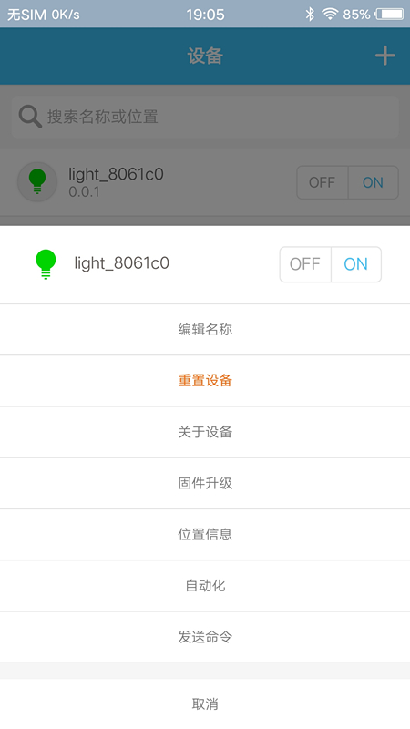
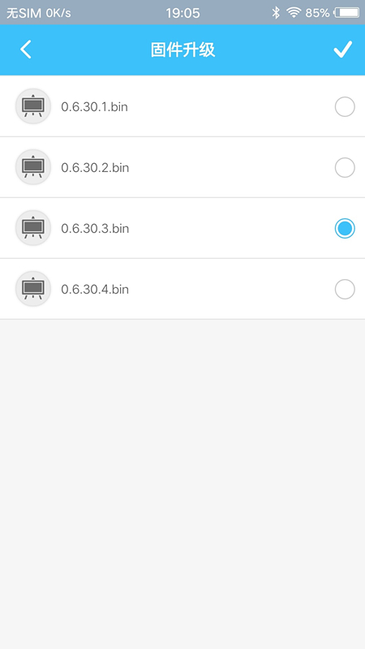

## 0. App 升级说明

`App 升级` 是指通过移动端 app 将固件文件发送给设备的一种升级方式。
在具体操作前，请确认手机端已安装 [开发版本的 Mesh app](https://github.com/EspressifApp/Esp32MeshForAndroid/raw/master/release/test.apk)，且在 Mesh app 中已完成 `配网` 和 `设备扫描` 操作。关于 ESP-MDF 设备的配网和设备扫描操作请参考开发版本 Mesh APP 的使用说明 [mdf_app_guide_dev_version_cn.md](mdf_app_guide_dev_version_cn.md)。

## 1. 详细操作流程

1. 连接手机至电脑，并允许电脑对手机进行 `数据访问`
2. 在电脑端 `文件浏览器` 左侧 `我的电脑` 下打开手机 `内部存储`，并在手机内部存储的根目录中找到 `Espressif` 目录
3. 在 `Espressif` 目录下建立 `Esp32` 目录，并在 Esp32 目录下建立 `upgrade` 目录
4. 拷贝固件文件至目录 `/Espressif/Esp32/upgrade` 下
5. 回到 app 界面，选择准备升级的设备，选择 `升级` 功能，此时可以看到刚刚放在目录 `/Espressif/Esp32/upgrade` 下固件文件列表
6. 选择固件文件对设备设备升级

<table><tr>
<td ></td>
<td ></td>
</tr>
<tr>
<td align="center"> Figure 1: 选择升级设备 </td>
<td align="center"> Figure 2: 选择固件文件 </td>
</tr>
</table>
