# 0. Preparation

* A router, powered on, and no need to connect to external networks
	* To enable the functions of user login, remote control and firmware upgrade, please make sure that the router is connected to external network.
* Android phone, install the APP
	* This version of the APP instructions is for APP v0.7.4
	* APK Resource is in the directory: `docs/_static/mesh-v0.7.4.apk`, and is `debug version` for second developmenters.
* A number of Mesh equipment
	* The lamp was selected as presentation device in this document

# 1. Power On the Mesh Devices

* If the device is power-on for the first time, the device will blink yellow, mean it is in config network mode
* If not for the first time, the status presented by the device is the status before the last power-off
	* Yellow light flashes, mean it is in config network mode
	* Stable color, the device has connected to Mesh network
		* If the router related information has not changed, skip to step 4
		* If changed, the device need to re-config network
			* Switch the equipment three times to bring it into config network mode

# 2. Login in APP

* Open the APP, if it is the first time, it will into Figure (1)
* Click `+` in the upper of Figure (1), into Figure (2)
	* If you have registered account, you can enter the relevant information to log in
	* If not, you can
		* Choose the `guest mode`
		* Choose to register. Click on the icon in the upper right corner of Figure (2), into Figure (3) to register

> When devices added in guest mode, the device information is publicly visible, can be scanned by other phones.
>
> The relevant registration information will be saved on the ESP company self-built server for device authentication. After registering to add a device, its device information can only be scanned by this account
>
> This document entered in guest mode.

<table><tr>
<td >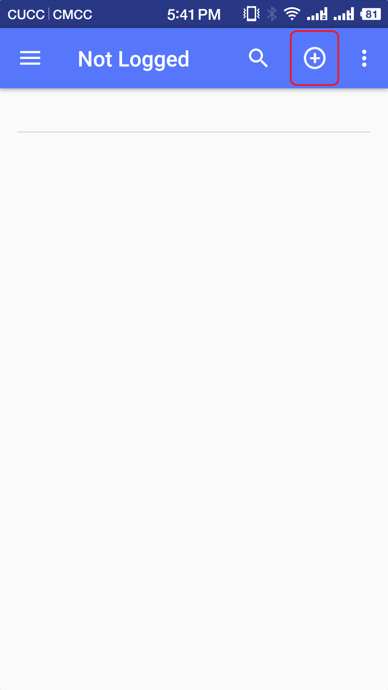</td>
<td >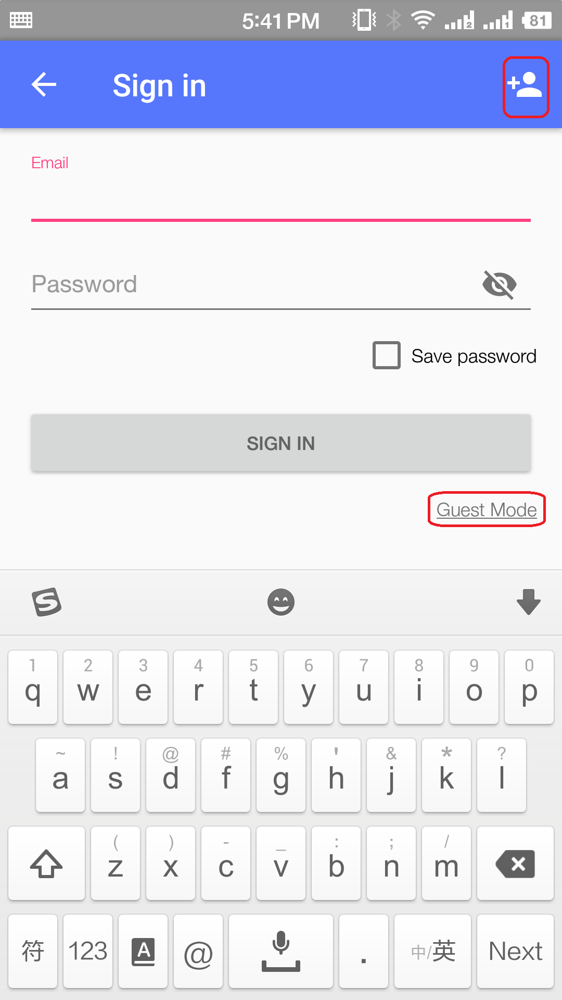</td>
<td >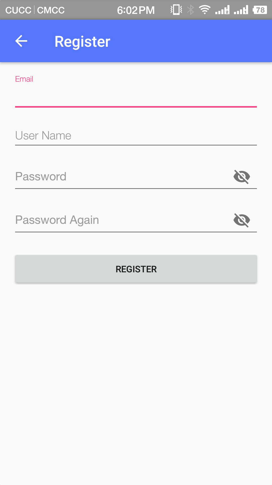</td>
</tr>
<tr>
<td align="center"> Figure 1: APP first page</td>
<td align="center"> Figure 2: Login page</td>
<td align="center"> Figure 3: Register page</td>
</tr>
</table>

# 3. Add Devices

* Click `+` in the upper of Figure (4), into Figure (5)
	- `MESH ID`: Can be automatically generated, different mesh id on behalf of different mesh network
	- `Wi-Fi SSID`: Router's SSID
	- `Wi-Fi PWD`: Router's password
* After enter the config information and click `OK`, it will automatically jump to the Ficture (6)
	- Figure (6) interface shows the routing information has been transmitted to one of the devices via Bluetooth. In this case, the device that has obtained the routing information performs the verification of the SSID and the PWD. After the verification is completed and the device has been connected to Router, the device delivers the information to other Mesh devices
	- The phenomenon of light in the process is:
		- `Calibration process`: light green flashing
		- `Completion of calibration`: light switch to stable white stable state
		- `Pass the message`: The remaining lights turn white one by one into a steady state
* Click on the upper left corner to return to the main interface, Figure (7), pull down to get a list of devices
	- If the device is a lamp, you can observe the color of the lamp to determine whether it has completed networking. Drop-down page for refresh after the completion
	- If the device is not lamp, or can not observe its color change, it is suggested to wait for about 15s to after the pull-down refresh

<table><tr>
<td >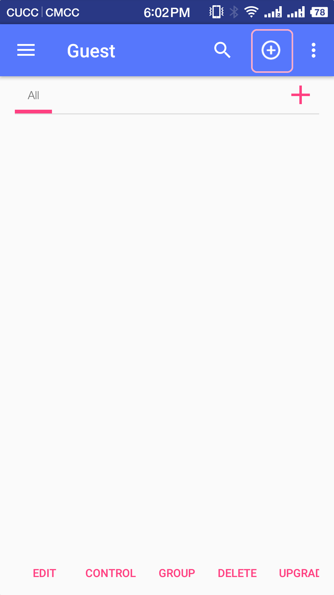</td>
<td >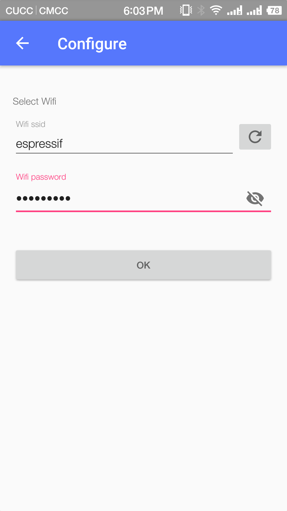</td>
<td >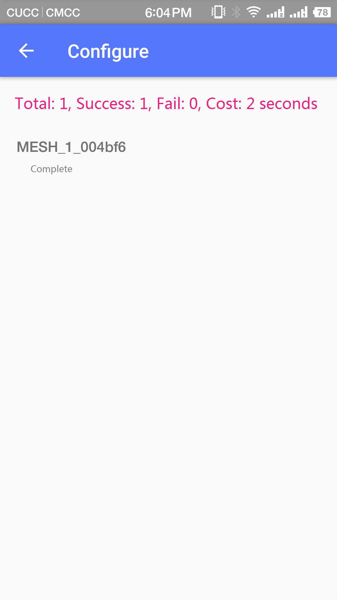</td>
<td >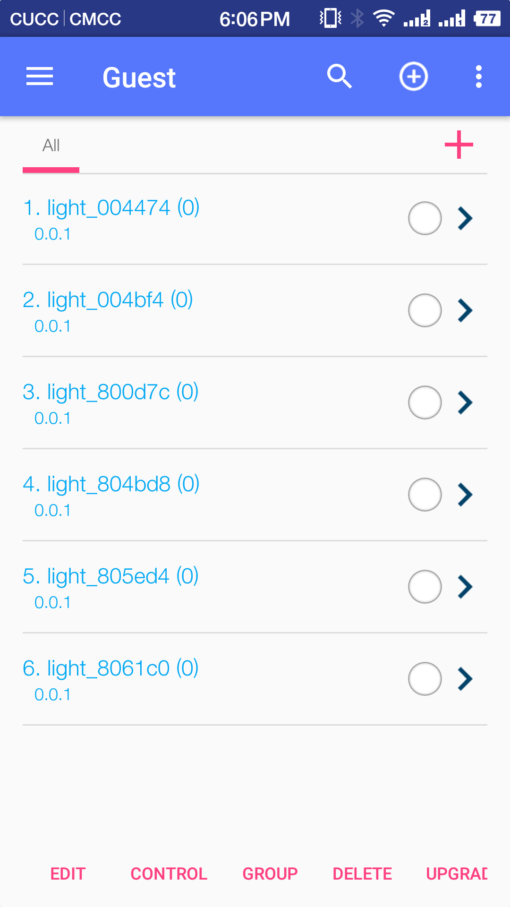</td>
</tr>
<tr>
<td align="center"> Figure 4: APP first page</td>
<td align="center"> Figure 5: Config Network</td>
<td align="center"> Figure 6: Config Network Successed</td>
<td align="center"> Figure 7: Devices List</td>
</tr>
</table>

# 4. Control Devices
* Can click on the device name light switch control straightly, as shown in Figure (8)
* Or click the box after the device name to select, check any number of devices, click on the bottom of the interface `control` option, out of the color control interface, the selected light switch, color, saturation control, Figure (10)

<table><tr>
<td >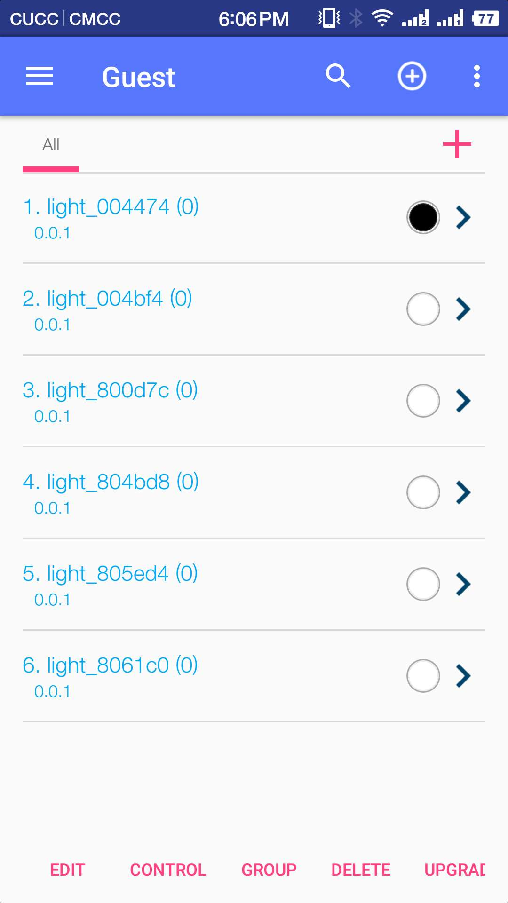</td>
<td >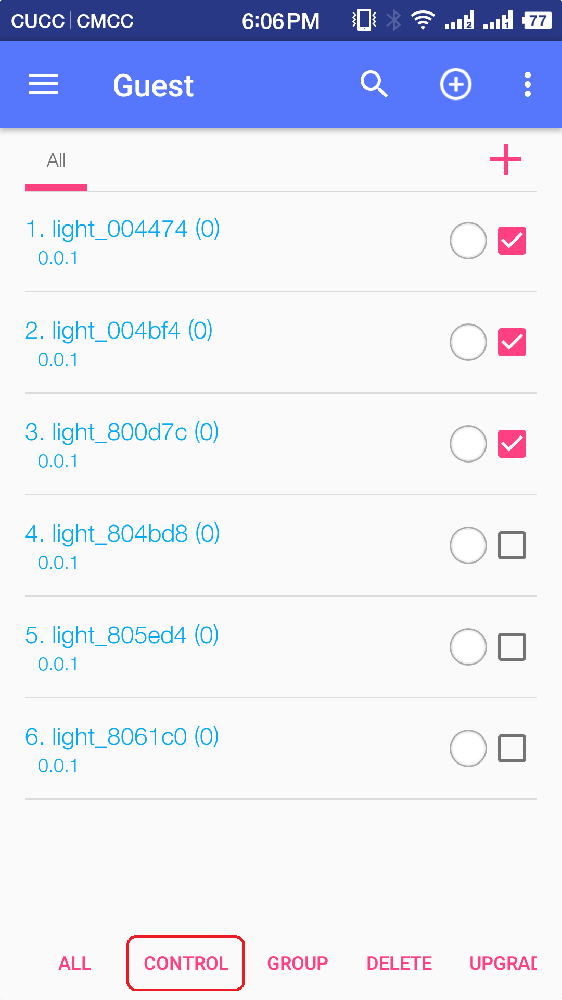</td>
<td >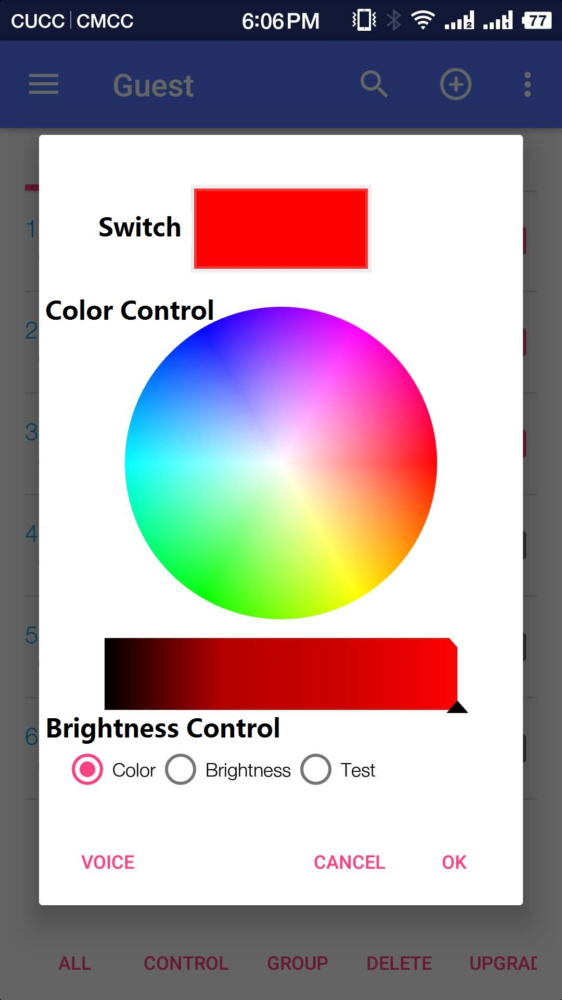</td>
</tr>
<tr>
<td align="center"> Figure 8: Switch Control</td>
<td align="center"> Figure 9: Multi Control</td>
<td align="center"> Figure 10: Control Interface</td>
</tr>
</table>

# 5. Group
* Click the red `+` to create new group, enter the group name according to the prompt, as shown in Figure (11)
* Click the device you want to form a group, click on the `Group` option below, select the option to `copy`, as shown in Figure (12)
* Click the new group, click the `group` option below, select the option to `paste`, as shown in Figure (13)
* At this point, in the group, select the `Select All` option below, after thar, you can control all devices in this group

<table><tr>
<td ></td>
<td >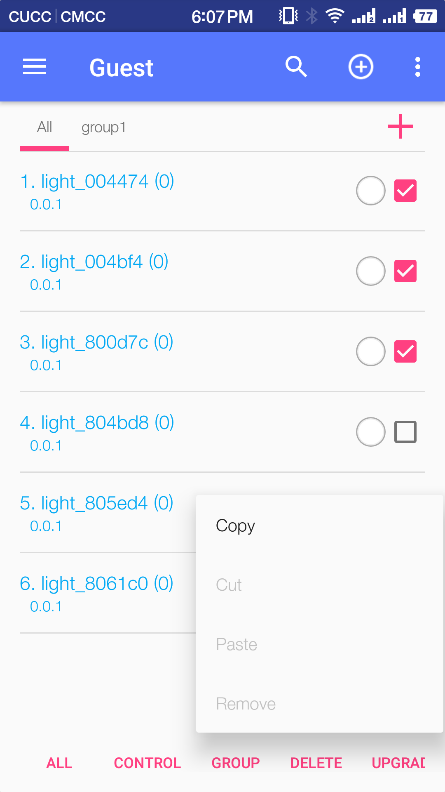</td>
<td >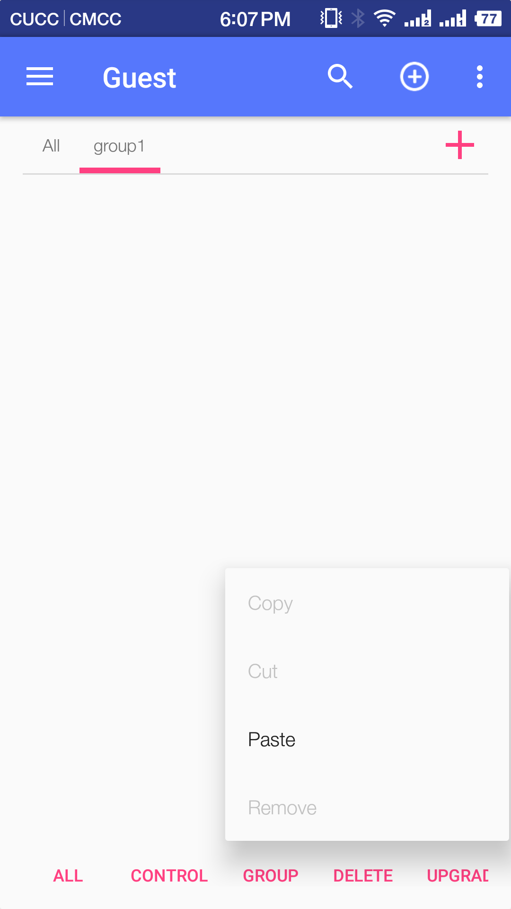</td>
</tr>
<tr>
<td align="center"> Figure 11: Add Group</td>
<td align="center"> Figure 12: Copy</td>
<td align="center"> Figure 13: Paste</td>
</tr>
</table>

# 6. Reset Devices
* Select devices that want to re-config network, click the `reset` option on the bottom, the device can be restored to config network mode

# 7. Main Page Functions
* The main page contains most of Mesh equipment operations, including config network, control, upgrade, reset and so on.

* `Edit`: Switch of device operations. Click it into `ALL` to select all devices or you can select one by one in the right side of devices name for control
* `Control`: Corresponding operations of the equipment with different properties, such as the light switch and color control
* `Group`: The equipment is divided into different groups to facilitate the control of different requirements
* `Delete`: Remove the device in the interface
* `Upgrade`: Upgrade the device
* `Reboot`: Reboot the device
* `Reset`: Clear all the device information, restore the factory settings
* `Config Mode`: Clear device's nerwork information, into the Config network mode
* `Sniffer`: Turn on the device sniffer switch to scan the surrounding Wi-Fi devices
