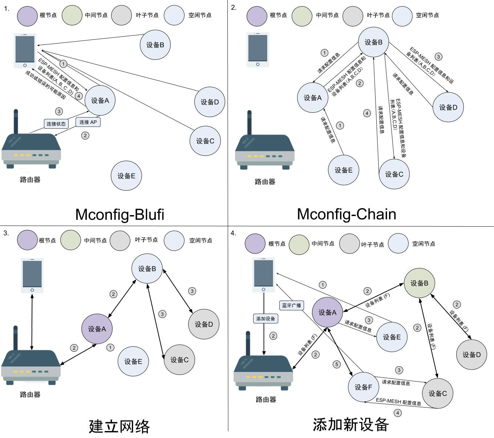
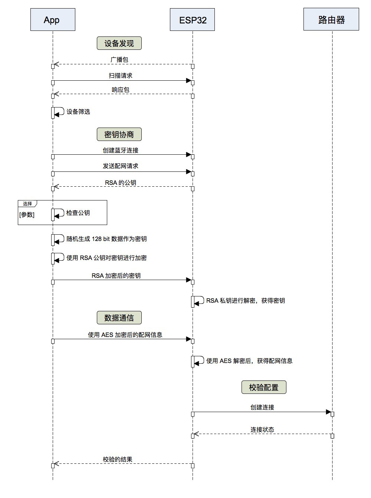
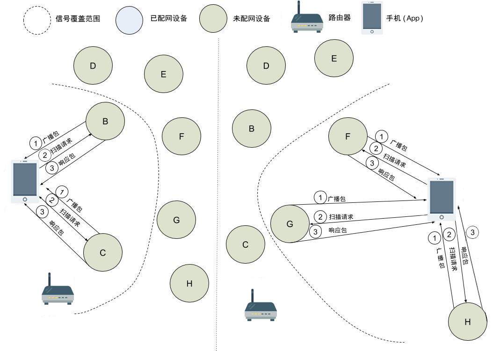
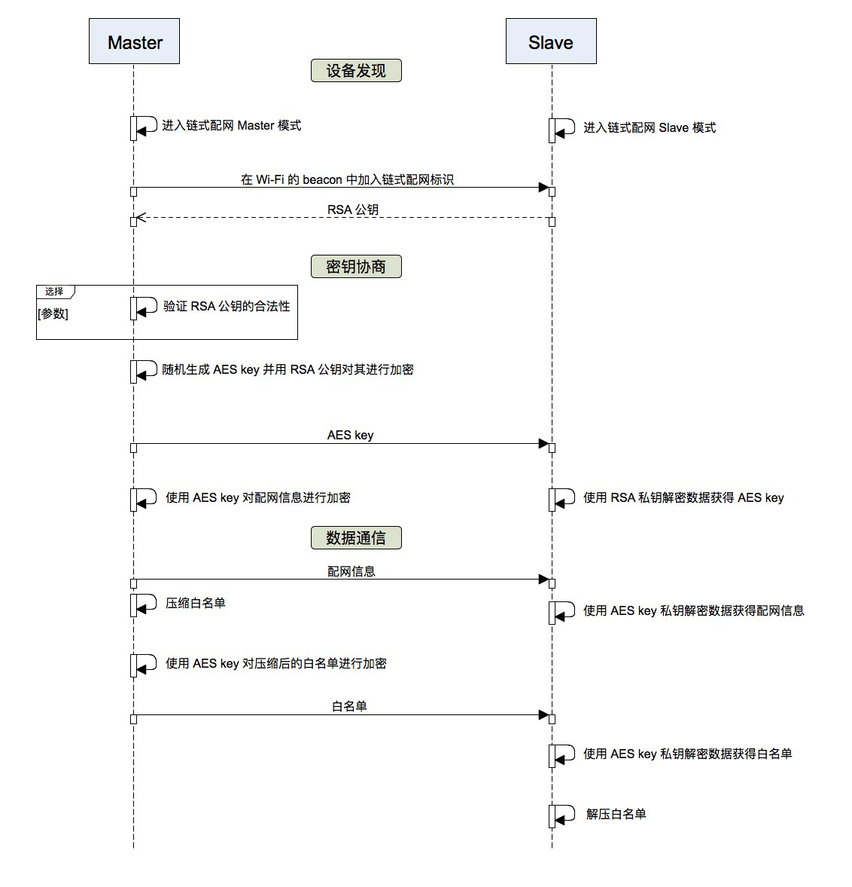

Mconfig
=========

:link_to_translation:`en:[English]`

Mconfig (Mesh Network Configuration) 是 ESP-MESH 配网的一种方案，目的是将配置信息便捷、高效地传递给 ESP-MESH 设备。

Mconfig 使用的 App 为 `ESP-Mesh App <https://github.com/EspressifApp/Esp32MeshForAndroid/raw/master/release/mesh.apk>`_，配网过程中使用 RSA 算法进行密钥协商，使用 128-AES 算法进行数据加密，使用 CRC 算法进行校验和验证。

概念
----

=========== =================================================================================================
术语         描述
=========== =================================================================================================
设备         任何属于或可以属于 ESP-MESH 网络的设备
白名单       包含设备的 MAC 地址列表和设备公钥的 MD5 值。可通过蓝牙扫描生成或扫描设备二维码导入，用于链式配网时设备校验
配置信息      路由器和 ESP-MESH 相关配置
AES         高级加密标准（英语：Advanced Encryption Standard，缩写：AES），在密码学中又称 Rijndael 加密法，是美国联邦政府采用的一种区块加密标准
RSA         RSA 加密算法是一种非对称加密算法。在公开密钥加密和电子商业中 RSA 被广泛使用
CRC         循环冗余校验 (Cyclic Redundancy Check, CRC) 是一种根据网络数据包或电脑文件等数据产生简短固定位数校验码的一种散列函数，主要用来检测或校验数据传输或者保存后可能出现的错误
=========== =================================================================================================

整体流程
---------

请见下方流程图详细说明。

1. :ref:`Mconfig-BluFi`：App 通过蓝牙给单个设备配网。
    1. App 扫描设备的蓝牙广播包，生成白名单，即设备列表（A、B、C、D），并连接信号最好的设备（A），将配置信息与设备列表传输给设备（A）；
    2. 设备（A）使用配置信息，尝试连接路由器；
    3. 设备（A）根据路由器返回的状态，校验配置信息是否正确：
    4. 设备（A）将配网状态返回给 App，同时：
        - 若信息正确：通过 Wi-Fi 的 beacon，通知其余设备来请求配网信息；
        - 若信息错误：将失败的可能原因返回给 App，并返回步骤 i 时的状态。

2. :ref:`Mconfig-Chain`: 已配网设备给未配网设备传递配网信息，通过 Wi-Fi 传输。
    1. 设备（B，E）收到设备（A）通知后，向设备（A）发送配网请求；
    2. 设备（A）对请求的设备进行校验：
        - 设备（E）不在设备列表中，因此忽略设备（E）的请求；
        - 设备（B）在设备列表中，设备（A）通过 Wi-Fi 将配置信息发送给设备（B）
    3. 设备（B）获取配置信息将重复步骤 i, 给设备（C，D）配网。

3. `建立网络 <https://docs.espressif.com/projects/esp-idf/zh_CN/latest/api-guides/mesh.html#building-a-network>`_
    1. 根节点选择：设备（A，B，C，D）根据其与路由器之间的信号强度动态选择，协商生成根节点设备（A）
    2. 第二层形成：一旦根节点连接到路由器，根节点范围内的空闲节点设备（B）将开始与设备 (A) 连接，从而形成网络的第二层
    3. 剩余层的形成：设备（C，D）与中间父节点设备（B）连接，形成网络的叶子节点

4. 添加新设备
    1. App 扫描设备的蓝牙广播包，并弹出是否添加设备（E，F）的提示框，当选择添加设备（F）时，App 会发送添加新设备（F）的指令；
    2. 根节点设备（A）收到指令后，转发给 Mesh 网络内的设备，设备（A， B，C，D）收到添加新设备（F）的指令将会开启 Mconfig-Chain；
    3. 设备（F）向与其信息最好的设备（C）发送配网请求;
    4. 设备（C）通过 Wi-Fi 将配置信息发送给设备（F）
    5. 设备（F）获取到配置信息后连入 MESH 网络

安全机制
---------

- 数据安全
    - 使用非对称加密算法 RSA 生成出一个共享随机密钥；
    - 使用密钥通对称加密算法 AES 对所有的配置信息进行加密，以保证数据传输过程的安全；

- 设备安全
    - Mconfig-BluFi：通过 App 端对设备的信号强度进行筛选，可以在一定程度上防止伪造设备攻击；
    - Mconfig-Chain：通过设置配网窗口期，仅在其窗口期内接收配网请求，来防止伪造设备攻击。

- 身份安全（即数字签名，可选）
    - 在为每一个设备烧录时由烧录工具为每一个设备随机提供一个单独的 RSA 公私钥对，并将公钥上传云端以备验证；
    - 对存储 RSA 公私钥对的 flash 分区进行加密。

注意事项
---------

若要自定义配网方式，请注意：

- 密码校验：ESP-MESH 非根节点不检查路由器的信息，只检查 ESP-MESH 网络内部的配置是否正确；如果 ESP-MESH 网络内部的配置正确，但是路由器密码错误，当非根节点成为根节点时就连不上路由器。因此，在对非根节点进行配网时需要校验路由器的密码；

.. ---------------------- Mconfig-BluFi --------------------------

.. _Mconfig-BluFi:

Mconfig-BluFi
--------------

Mconfig-BluFi 是基于 BluFi （一种由 Espressif 定义的蓝牙配网协议）的配网协议，并在 BluFi 的基础上增加了广播包的定义、RSA 加密和身份认证。配网中涉及的硬件有：手机、设备和路由器，分为设备发现、密钥协商、数据通信，校验配置四个过程。

.. note::

    使用 Mconfig-BluFi 必须使能蓝牙的协议栈，使能蓝牙的协议栈注意如下事项：

    1. 固件大小：固件的大小将增大 500 KB 左右，因此需调整 flash 分区表，保证存放固件的分区大于 1 MB；
    2. 内存使用：内存将多占用 30 KB，若释放此内存，需要重启才能再次使用蓝牙。

设备发现
^^^^^^^^^

设备通过 BLE 发送特定的蓝牙广播包，App 搜索到此特定的广播，根据信号强度进行筛选，生成白名单，避免将附近不属于自己的设备添加到自己的网络中。其过程如下图所示：

蓝牙广播包分为广播包（Advertising Data)和响应包（Scan Response）两种类型。广播包（Advertising Data）用于存放具体产品的自定义的数据，响应包（Scan Response）用于存放配网信息。

- 广播包（Advertising Data）
    1. 最大长度为 31 bytes；
    2. 数据格式必须满足 `蓝牙广播包的标准 <https://www.libelium.com/forum/libelium_files/bt4_core_spec_adv_data_reference.pdf>`_。

- 响应包（Scan Response）
    1. 设备名称占用 10 bytes，
    2. 厂家信息占用 14 bytes，具体内容如下：

=========== ========== =========
字段         长度        描述
=========== ========== =========
company id  2 bytes    Bluetooth SIG 分配给 SIG 成员 `公司的唯一标识符 <https://www.bluetooth.com/specifications/assigned-numbers/company-identifiers>`_
OUI         2 bytes    Mconfig Blufi 的标识码用于广播包过滤，数据为：0x4d, 0x44, 0x46，即："MDF"
version     2 bits     当前的版本号
whitelist   1 bit      是否使能白名单过滤
security    1 bit      是否验证白名单中设备的合法性
reserved    4 bits     保留以备后期扩展
sta mac     6 bytes    设备 sta 的 MAC 地址
tid         2 bytes    设备的类型
=========== ========== =========

密钥协商
^^^^^^^^^

1. App 通过 BLE 连接信号最好的设备（A），并向其发送配网请求；
2. 设备收到配网请求后，返回 RSA 的公钥给 App；
3. App 校验 RSA 的公钥的合法性；
4. App 随机生成一个 128 bit 的密钥，并用 RSA 的公钥对进行加密，发送给设备；
5. 设备使用 RSA 的私钥对接收到的数据进行解密，获取密钥，之后 App 与设备之间数据均以此密钥进行 AES 加密。

数据通信
^^^^^^^^^

App 将配置信息与设备列表合成一个数据包，并以 BluFi 的自定义字段进行传输，数据包采用 TLV 的格式，数据包中数据的类型及描述如下：

+--------------+----------------------------------------+---------------+------------------------------------------------------------------------------------------+
|类型          |含义                                    |长度 (bytes)   |解释                                                                                      |
+==============+========================================+===============+==========================================================================================+
|路由器配置                                                                                                                                                        |
+--------------+----------------------------------------+---------------+------------------------------------------------------------------------------------------+
| 1            | BLUFI_DATA_ROUTER_SSID                 | 32            | SSID of the router                                                                       |
+--------------+----------------------------------------+---------------+------------------------------------------------------------------------------------------+
| 2            | BLUFI_DATA_ROUTER_PASSWORD             | 64            | Router password                                                                          |
+--------------+----------------------------------------+---------------+------------------------------------------------------------------------------------------+
| 3            | BLUFI_DATA_ROUTER_BSSID                | 6             | BSSID is equal to the router's MAC address. This field must be configured if more than   |
|              |                                        |               | one router shares the same SSID. You can avoid using BSSIDs by setting up a unique SSID  |
|              |                                        |               | for each router. This field must also be configured if the router is hidden              |
+--------------+----------------------------------------+---------------+------------------------------------------------------------------------------------------+
| 4            | BLUFI_DATA_MESH_ID                     | 6             | Mesh network ID. Nodes sharing the same MESH ID can communicate with one another         |
+--------------+----------------------------------------+---------------+------------------------------------------------------------------------------------------+
| 5            | BLUFI_DATA_MESH_PASSWORD               | 64            | Password for secure communication between devices in a MESH network                      |
+--------------+----------------------------------------+---------------+------------------------------------------------------------------------------------------+
| 6            | BLUFI_DATA_MESH_TYPE                   | 1             | Only MESH_IDLE, MESH_ROOT, and MESH_NODE device types are supported.                     |
|              |                                        |               | MESH_ROOT and MESH_NODE are only used for routerless solutions                           |
+--------------+----------------------------------------+---------------+------------------------------------------------------------------------------------------+
|MESH 网络配置                                                                                                                                                     |
+--------------+----------------------------------------+---------------+------------------------------------------------------------------------------------------+
| 16           | BLUFI_DATA_VOTE_PERCENTAGE             | 1             | Vote percentage threshold above which the node becoms a root                             |
+--------------+----------------------------------------+---------------+------------------------------------------------------------------------------------------+
| 17           | BLUFI_DATA_VOTE_MAX_COUNT              | 1             | Max multiple voting each device can have for the self-healing of a MESH network          |
+--------------+----------------------------------------+---------------+------------------------------------------------------------------------------------------+
| 18           | BLUFI_DATA_BACKOFF_RSSI                | 1             | RSSI threshold below which connections to the root node are not allowed                  |
+--------------+----------------------------------------+---------------+------------------------------------------------------------------------------------------+
| 19           | BLUFI_DATA_SCAN_MIN_COUNT              | 1             | The minimum number of times a device should scan the beacon frames from other devices    |
|              |                                        |               | before it becomes a root node                                                            |
+--------------+----------------------------------------+---------------+------------------------------------------------------------------------------------------+
| 20           | BLUFI_DATA_SCAN_FAIL_COUNT             | 1             | Max fails (60 by default) for a parent node to restore connection to the MESH network    |
|              |                                        |               | before it breaks the connection with its leaf nodes                                      |
+--------------+----------------------------------------+---------------+------------------------------------------------------------------------------------------+
| 21           | BLUFI_DATA_MONITOR_IE_COUNT            | 1             | Allowed number of changes a parent node can introduce into its information element (IE), |
|              |                                        |               | before the leaf nodes must update their own IEs accordingly                              |
+--------------+----------------------------------------+---------------+------------------------------------------------------------------------------------------+
| 22           | BLUFI_DATA_ROOT_HEALING_MS             | 2             | Time lag between the moment a root node is disconnected from the network and the moment  |
|              |                                        |               | the devices start electing another root node                                             |
+--------------+----------------------------------------+---------------+------------------------------------------------------------------------------------------+
| 23           | BLUFI_DATA_ROOT_CONFLICTS_ENABLE       | 1             | Allow more than one root in one network                                                  |
+--------------+----------------------------------------+---------------+------------------------------------------------------------------------------------------+
| 24           | BLUFI_DATA_FIX_ROOT_ENABLE             | 1             | Enable a device to be set as a fixed and irreplaceable root node                         |
+--------------+----------------------------------------+---------------+------------------------------------------------------------------------------------------+
| 25           | BLUFI_DATA_CAPACITY_NUM                | 2             | Network capacity, defining max number of devices allowed in the MESH network             |
+--------------+----------------------------------------+---------------+------------------------------------------------------------------------------------------+
| 26           | BLUFI_DATA_MAX_LAYER                   | 1             | Max number of allowed layers                                                             |
+--------------+----------------------------------------+---------------+------------------------------------------------------------------------------------------+
| 27           | BLUFI_DATA_MAX_CONNECTION              | 1             | Max number of MESH softAP connections                                                    |
+--------------+----------------------------------------+---------------+------------------------------------------------------------------------------------------+
| 28           | BLUFI_DATA_ASSOC_EXPIRE_MS             | 2             | Period of time after which a MESH softAP breaks its association with inactive leaf nodes |
+--------------+----------------------------------------+---------------+------------------------------------------------------------------------------------------+
| 29           | BLUFI_DATA_BEACON_INTERVAL_MS          | 2             | Mesh softAP beacon interval                                                              |
+--------------+----------------------------------------+---------------+------------------------------------------------------------------------------------------+
| 30           | BLUFI_DATA_PASSIVE_SCAN_MS             | 2             | Mesh station passive scan duration                                                       |
+--------------+----------------------------------------+---------------+------------------------------------------------------------------------------------------+
| 31           | BLUFI_DATA_MONITOR_DURATION_MS         | 2             | Period (ms) for monitoring the parent's RSSI. If the signal stays weak throughout the    |
|              |                                        |               | period, the node will find another parent offering more stable connection                |
+--------------+----------------------------------------+---------------+------------------------------------------------------------------------------------------+
| 32           | BLUFI_DATA_CNX_RSSI                    | 1             | RSSI threshold above which the connection with a parent is considered strong             |
+--------------+----------------------------------------+---------------+------------------------------------------------------------------------------------------+
| 33           | BLUFI_DATA_SELECT_RSSI                 | 1             | RSSI threshold for parent selection. Its value should be greater than SWITCH_RSSI        |
+--------------+----------------------------------------+---------------+------------------------------------------------------------------------------------------+
| 34           | BLUFI_DATA_SWITCH_RSSI                 | 1             | RSSI threshold below which a node selects a parent with better RSSI                      |
+--------------+----------------------------------------+---------------+------------------------------------------------------------------------------------------+
| 35           | BLUFI_DATA_XON_QSIZE                   | 1             | Number of MESH buffer queues                                                             |
+--------------+----------------------------------------+---------------+------------------------------------------------------------------------------------------+
| 36           | BLUFI_DATA_RETRANSMIT_ENABL            | 1             | Enable a source node to retransmit data to the node from which it failed to receive ACK  |
+--------------+----------------------------------------+---------------+------------------------------------------------------------------------------------------+
| 37           | BLUFI_DATA_DROP_ENABLE                 | 1             | If a root is changed, enable the new root to drop the previous packet                    |
+--------------+----------------------------------------+---------------+------------------------------------------------------------------------------------------+
|白名单配置                                                                                                                                                        |
+--------------+----------------------------------------+---------------+------------------------------------------------------------------------------------------+
| 64           | BLUFI_DATA_WHITELIST                   | 6 * N         | Device address                                                                           |
+              +                                        +---------------+------------------------------------------------------------------------------------------+
|              |                                        | 32 * N        | Verify the validity of the public key to avoid attacks from disguised devices            |
+--------------+----------------------------------------+---------------+------------------------------------------------------------------------------------------+

校验配置
^^^^^^^^^

设备端获取到 AP 的信息后，尝试连接路由器，以校验配置信息是否正确，并将连接路由器的状态和校验的结果返回给 App，其校验结果如下：

====== ============================ ====================
类型    含义                          备注
====== ============================ ====================
0      ESP_BLUFI_STA_CONN_SUCCESS   连接路由器成功
1      ESP_BLUFI_STA_CONN_FAIL      连接路由器失败
16     BLUFI_STA_PASSWORD_ERR       密码配置错误
17     BLUFI_STA_AP_FOUND_ERR       路由器未找到
18     BLUFI_STA_TOOMANY_ERR        路由器已经达到最大的连接数
19     BLUFI_STA_CONFIG_ERR         参数配置错误
====== ============================ ====================

.. ---------------------- Mconfig-Chain --------------------------

.. _Mconfig-Chain:

Mconfig-Chain
--------------

Mconfig-Chain 是基于 `ESP-NOW <https://docs.espressif.com/projects/esp-idf/zh_CN/latest/api-reference/wifi/esp_now.html?highlight=espnow>`_ （一种由 Espressif 定义的无连接 Wi-Fi 通信协议）的设备间配网协议。

当前 Wi-Fi 网络配置主要有三种方式：BLE 配网、智能配网（sniffer）和 softAP 配网，均是为单个设备配网设计的，其并不适合 ESP-MESH 网络这种多设备同时配网的场景。Mconfig-Chain 是专为设计 ESP-MESH 网络的配网方式，其配网过程是链式的、可传递的，所有已配网的设备均可以为其他设备配网，实现大范围高效配网。

Mconfig-Chain 将设备分为 Master（已配网的设备）和 Slave （等待配网的设备）两种类型，配网过程分为设备发现、密钥协商和数据通信。

设备发现
^^^^^^^^

1. Master 在 Wi-Fi beacon 中的 Vendor IE 加入链式配网的标识，等待 Slave 的配网请求；
    - Vendor IE 标识的格式如下：

=========== ================
类型         数据
=========== ================
Element ID  0xDD
Length      0X04
OUI         0X18, 0XFE, 0X34
Type        0X0F
=========== ================

    - Master 需要配置窗口期，仅在其窗口期内接收 Slave 的请求；
    - 通过 Wi-Fi beacon 发送链式配网的标识，如果设备仅处于 STA 模式将无法启用 Master；

2. Slave 开启 Wi-Fi 的 sniffe 功能，不断切换信道监听 Wi-Fi 广播包，查找链式配网的标识，如若发现 Master 则停止信道切换, 选取信号强度最好的 Master 发送配网请求。
    - Slave 工作时会切换信道，在使用之前应停用 ESP-MESH 的自组网。

密钥协商
^^^^^^^^^

1. Master 收到 Slave 配网请求，校验 Slave 是否在配网白名单中，若使能设备身份认证，则需将设备收到的 RSA 公钥进行 MD5 运算与配网白名单比较校验其合法性；
2. Master 删除 Wi-Fi beacon 中的 Vendor IE 链式配网的标识；
3. Master 随机生成一个 128 bit 的数据，作为与 Slave 通信的密钥，并用接收到的 RSA 公钥对密钥进行加密，通过 ESP-NOW 发送给 Slave；
4. Slave 收到 Master 的 Response 后，使用 RSA 私钥对其进行解密获得通信的密钥。

数据通信
^^^^^^^^^

1. Master 使用密钥通过 AES 算法对配网信息和白名单进行加密，通过 ESP-NOW 发送给 Slave；
2. Slave 使用密钥通过 AES 算法对收到的数据进行解密，完成配网，并从 Slave 模式切换到 Master 模式。

.. Note::

     ESP-NOW 会在数据链路层对数据进行加密，相互配网设备加密的密钥必须相同，其密钥在产品生产时写入 flash 中或直接存储在固件中。