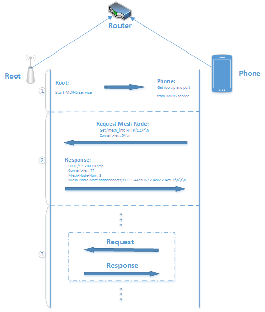

<<<<<<< Updated upstream
.. include:: ../../en/api-guides/mlink.rst
=======
Mupgrade
=========

:link_to_translation:`en:[English]`

1. 准备工作
---------------

ESP-Mesh app 与 ESP-MDF 设备之间进行局域网通信的前提是：设备已经组网成功，且手机和 Mesh 网络处于同一个局域网中。

ESP-MDF 设备在配网成功后会自动进入 `组网阶段 <https://esp-idf.readthedocs.io/en/latest/api-guides/mesh.html#mesh-networking>`_, 在 ESP-Mesh app 的设备页面中能够扫描到所以已配网的设备即可表示组网已经成功。

.. figure:: ../../_static/Mlink/mlink_discovery_protocol.png
    :align: center
    :alt: ESP-Mesh LAN Discovery Protocol
    :figclass: align-center

1. 通信流程
--------------------------

根节点是一个 Mesh 网络与外部通信的唯一出口，app 想要控制 Mesh 网络内设备，首先需要在该网络中找到根节点，之后通过根节点获取该 Mesh 网络内的设备列表，最后才能与该 Mesh 网络中任意设备进行通信。整个过程主要分为以下三步：

1. App 获取根节点的 IP 地址，局域网通信端口和 mac 地址
2. App 询问根节点获得 Mesh 网络设备列表
3. App 与 Mesh 网络中任意设备进行通信

3. 通信协议
--------------------------

本章节从通信流程角度，分别介绍这三个步骤中所涉及的通信协议格式。其中，app 获取 Mesh 网络设备列表，app 与 Mesh 网络中任意设备的通信采用标准的 HTTP 或 HTTPS 通信协议。此外，协议还包括以下两部分：

1. 设备状态通知：为了方便用户通过 app 查看设备的实时状态，在现有协议中增加了设备通知功能，即在设备状态发生变化时主动发 UDP 广播通知 app，之后由 app 来获取设备详细状态的过程。
2. 本地触发控制：实现局域网内设备间的触发控制

3.1. App 获取根节点的 IP 地址，局域网通信端口和 MAC 地址
^^^^^^^^^^^^^^^^^^^^^^^^^^^^^^^^^^^^^^^^^^^^^^^^^^^^^^^^^^^^^^^^^^^^^

现阶段，根节点会同时启动 mDNS 服务和接收 UDP 广播两种方式用于设备发现。设备发现表示 app 获取根节点的 IP 地址，通信端口和 MAC 地址的过程

1. mDNS 设备发现服务

当 app 查询到相关的 mDNS 服务时，便获取了根节点的 `IP`，再通过该服务中 `port` 和 `txt` 字段可知根节点的 `局域网通信端口` 和 `mac 地址`

    mDNS Service Info::

        hostname: "esp32_mesh"
        instance_name: "mesh"
        service_type: "_mesh-https"
        proto: "_tcp"
        port: 80
        txt:
            key: "mac"
            value: "112233445566"

2. 接收 UDP 广播

在设备发现阶段，app 会主动发送 UDP 广播包，并根据根节点的回复获取根节点的信息.

**Request:**

.. code-block:: none

    "Are You Espressif IOT Smart Device?"

**Response:**

.. code-block:: none

    "ESP32 Mesh 112233445566 http 80"

.. Note::

    * ``112233445566`` 为根节点的 MAC 地址
    * ``80`` 是 http 服务器端口
    * 此外，app 通过 UDP 回复包获取根节点的 IP 地址

3. 设备主动通知

当 ESP-MDF 设备状态（打开或关闭）、网络连接关系（连接或断开）、路由表（route table）信息等发生变化时，根节点会主动发送 UDP 广播，通知 app 来获取设备的最新状态

**UDP Broadcast:**

    mac=112233445566
    flag=1234
    type=***

* ``mac`` 状态发生变化的设备的 mac 地址
* ``flag`` 为一个随机整数值，用于区分不同时刻的通知
* ``type`` 状态变化的类型，包含以下几种：
* ``status`` 设备属性状态发生变化
* ``http`` 设备拓扑结构发生变化
* ``sniffer`` 设备使用监听模式监听到了设备

3.2. App 获取设备列表
^^^^^^^^^^^^^^^^^^^^^

**Request::**

.. code-block:: none

    GET /mesh_info HTTP/1.1
    Host: 192.168.1.1:80

**Response::**

.. code-block:: none

    HTTP/1.1 200 OK
    Content-Length: ??
    Mesh-Node-Mac: aabbccddeeff,112233445566
    Host: 192.168.1.1:80

.. Note::

    * ``/mesh_info`` app 获取设备列表的命令，通过 http 的 URL 字段实现
    * ``Mesh-Node-Mac`` 节点的 Station Mac 地址，以逗号分隔
    * ``Host`` HTTP/1.1 协议必须携带的字段，表示控制端 IP 地址和通信端口

3.3. App 与 ESP-MDF 设备通信格式说明
^^^^^^^^^^^^^^^^^^^^^^^^^^^^^^^^^^^^^^^^^^^^^^^^^^^^

1. App 请求格式

根节点只解析 http 头部信息, 将 http 的消息体通过 ESP-MESH 透传给目标设备

**Request::**

.. code-block:: none

    POST /device_request HTTP/1.1
    Content-Length: ??
    Content-Type: application/json
    Root-Response::??
    Mesh-Node-Mac: aabbccddeeff,112233445566
    Mesh-Node-Group: 01000000000,02000000000
    Host: 192.168.1.1:80

    **content_json**

1. ``/device_request`` app 对设备的控制操作，包括状态的设置和获取，通过 http 请求的 URL 字段实现
2. ``Content-Length`` http 请求的 body 数据长度
3. ``Content-Type`` http 请求的 body 数据类型，现阶段采用 ``application/json`` 格式
4. ``Root-Response`` 是否只需要根节点回复。如果只需要根节点回复, 则只由根节点回复命令是否收到. 通常用于控制设备时,去除上报的数据包, 以达到更好的控制效果.
5. ``Mesh-Node-Mac`` 命令转发的目标设备的 MAC 地址。 `ffffffffffff` 则表示控制所有设备
6. ``Mesh-Node-Group`` 命令转发的目标设备所在的组。
7. ``**content_json**`` http 请求的消息体，表示章节 ``3.4. 消息体的数据`` 中的 ``Response`` 部分

2. 设备回复的格式

根节点 ESP-MESH 收到设备回复信息后, 生成 http 的头部信息, 将回复信息放到 http 的消息体.转发给 app

**Response:**

.. code-block:: none

    HTTP/1.1 200 OK
    Content-Length: ??
    Content-Type: application/json
    Mesh-Node-Mac: 30aea4062ca0
    Host: 192.168.1.1:80
    \r\n
    **content_json**

1. ``Content-Length`` 消息体数据长度
2. ``Content-Type`` 消息体数据类型
3. ``Mesh-Node-Mac`` 设备自身的 mac 地址
4. ``**content_json**`` http 响应的消息体，表示章节 ``3.4. 消息体的数据`` 中的 ``Response`` 部分

3.4. 消息体的数据
^^^^^^^^^^^^^^^^^

1. Acquire device information: get_device_info

**Request:**

.. code-block:: none

    {
        "request": "get_device_info"
    }

* ``request`` is field defining the operation on the device, followed by specific commands of operation.

**Response:**

.. code-block:: none

    {
        "tid": "1",
        "name": "light_c800",
        "mesh_id": "94d9b3808c81",
        "version": "1.1.1",
        "idf_version": "v3.2.2-46-g878d70d9e",
        "mdf_version": "e0fb50c-dirty",
        "mlink_version": 2,
        "mlink_trigger": 0,
        "rssi": -28,
        "layer": 1,
        "group": ["010000000000"],
        "characteristics": [{
            "cid": 0,
            "name": "on",
            "format": "int",
            "perms": 7,
            "value": 1,
            "min": 0,
            "max": 3,
            "step": 1
        }, {
            "cid": 1,
            "name": "hue",
            "format": "int",
            "perms": 7,
            "value": 360,
            "min": 0,
            "max": 360,
            "step": 1
        }, {
            "cid": 2,
            "name": "saturation",
            "format": "int",
            "perms": 7,
            "value": 0,
            "min": 0,
            "max": 100,
            "step": 1
        }, {
            "cid": 3,
            "name": "value",
            "format": "int",
            "perms": 7,
            "value": 100,
            "min": 0,
            "max": 100,
            "step": 1
        }, {
            "cid": 4,
            "name": "color_temperature",
            "format": "int",
            "perms": 7,
            "value": 0,
            "min": 0,
            "max": 100,
            "step": 1
        }, {
            "cid": 5,
            "name": "brightness",
            "format": "int",
            "perms": 7,
            "value": 30,
            "min": 0,
            "max": 100,
            "step": 1
        }, {
            "cid": 6,
            "name": "mode",
            "format": "int",
            "perms": 3,
            "value": 2,
            "min": 1,
            "max": 3,
            "step": 1
        }],
        "status_msg": "MDF_OK",
        "status_code": 0
    }

* ``tid`` 设备的 type ID，用于区分灯，插座，空调等不同类型的 ESP-MDF 设备. 1~9: 灯, 10~19: 按键, 20~29: 传感器
* ``name`` 设备名称
* ``version`` 设备固件版本
* ``idf_version`` esp-idf 的版本
* ``mdf_version`` esp-mdf 的版本
* ``mlink_version`` mlink 通信协议的版本
* ``rssi`` 与父节点之间的信号强度
* ``layer`` 设备所属的层级
* ``group`` 设备所在的组
* ``characteristics`` 设备的属性信息
   * ``cid`` 设备属性身份（characteristic ID），用于区分亮度，明暗，开关等不同的的设备属性
   * ``name`` 属性名称
   * ``format`` 数据类型，支持 ``int``，``double``，``string``，``json`` 四种数据类型
   * ``value`` 属性值
   * ``min`` 属性值的最小值或支持的字符串的最小长度
   * ``max`` 属性值的最大值或支持的字符串的最大长度
   * ``step``  属性值的最小步长
        * 当 ``format`` 为 ``int`` 或 ``double`` 数据类型时，``min``，``max`` 和 ``step`` 分别表示属性值的最小值，最大值和最小变化值
        * 当 ``format`` 为 ``string`` 或 ``json`` 数据类型时，``min`` 和 ``max`` 分别表示支持的字符串的最小长度和最大长度，无关键字 ``step``
* ``perms``  属性的操作权限，以二进制整数解析，第一位表示 ``读权限``，第二位表示 ``写权限``，第三位表示 ``执行权限``，``0`` 表示禁止，``1`` 表示允许
   * 若参数没有读权限，则无法获得对应的值
   * 若参数没有写权限，则无法修改对应的
   * 若参数没有执行权限，则无法执行设置对应的触发事件
* ``status_code`` 请求命令的错误码， ``0`` 表示正常，``-1`` 表示错误
* ``status_msg`` 错误码对应的消息

2. 获取设备状态：get_status

**Request:**

.. code-block:: none

    {
        "request": "get_status",
        "cids": [
            0,
            1,
            2
        ]
    }

* ``cids`` 设备属性字段，后接请求的 CID 值列表

**Response:**

.. code-block:: none

    {
        "characteristics": [
            {
                "cid": 0,
                "value": 0
            },
            {
                "cid": 1,
                "value": 0
            },
            {
                "cid": 2,
                "value": 100
            }
        ],
        "status_code": 0
    }

3. 修改设备状态: set_status

**Request:**

.. code-block:: none

    {
        "request": "set_status",
        "characteristics": [
            {
                "cid": 0,
                "value": 0
            },
            {
                "cid": 1,
                "value": 0
            },
            {
                "cid": 2,
                "value": 100
            }
        ]
    }

**Response:**

.. code-block:: none

    {
        "status_msg": "MDF_OK",
        "status_code": 0
    }

4. 进入配网模式: config_network

**Request:**

.. code-block:: none

    {
        "request": "config_network"
    }

**Response:**

.. code-block:: none

    {
        "status_msg": "MDF_OK",
        "status_code": 0
    }

5. 重启设备: reboot

**Request:**

.. code-block:: none

    {
        "request": "reboot",
        "delay": 50
    }

  ``delay`` 命令延时执行时间，该字段非必需，若不设，使用设备端默认延时 ``3s``

**Response:**

.. code-block:: none

    {
        "status_msg": "MDF_OK",
        "status_code": 0
    }

6. 恢复出厂设置: reset

**Request:**

.. code-block:: none

    {
        "request": "reset",
        "delay": 50
    }

* ``delay`` 命令延时执行时间，该字段非必需，若不设，使用设备端默认延时 ``3s``。

**Response:**

.. code-block:: none

    {
        "status_msg": "MDF_OK",
        "status_code": 0
    }

7. 添加新设备: add_device

**Request:**

.. code-block:: none

    {
        "request": "add_device",
        "whitelist": ["aabbccddeeff", "112233445566"],
        "timeout": 30000,
        "rssi": -65
    }

* ``whitelist`` 新设备的 mac 地址列表
* ``timeout`` 允许设备添加的窗口时间
* ``rssi`` 允许设备添加的最小信号强度

**Response:**

.. code-block:: none

    {
        "status_msg": "MDF_OK",
        "status_code": 0
    }

8. 修改设备名称: rename_device

**Request:**

.. code-block:: none

    {
        "request": "rename_device",
        "name": "light_c800_11"
    }

* ``name`` 修改后的设备名称, 总长度必需小于 32 个字节

**Response:**

.. code-block:: none

    {
        "status_msg": "MDF_OK",
        "status_code": 0
    }

9. 修改设备地址: set_position

**Request:**

.. code-block:: none

    {
        "request": "set_position",
        "position": "1F-A-001"
    }

* ``position`` 修改后的设备地址, 总长度必需小于 32 个字节

**Response:**

.. code-block:: none

    {
        "status_msg": "MDF_OK",
        "status_code": 0
    }

10. 获取升级状态: get_ota_progress

**Request:**

.. code-block:: none

    {
        "request": "get_ota_progress",
    }

**Response:**

.. code-block:: none

    {
        "firmware_name": "v1.2.0",
        "total_size": 1422768,
        "written_size": 1190912,
        "status_msg": "MDF_OK",
        "status_code": 0
    }

* ``firmware_name`` 固件的版本号
* ``total_size`` 固件的大小
* ``written_size`` 已经烧录的固件长度

11. 版本回退: set_ota_fallback

**Request:**

.. code-block:: none

    {
        "request": "set_ota_fallback",
    }

**Response:**

.. code-block:: none

    {
        "status_msg": "MDF_OK",
        "status_code": 0
    }

12. 获取 ESP-MESH 的配置: get_mesh_config

**Request:**

.. code-block:: none

    {
        "request": "get_mesh_config",
    }

**Response:**

.. code-block:: none

    {
        "id": "94d9b3808c81",
        "max_layer": 16,
        "max_connections": 6,
        "layer": 2,
        "parent_mac": "30aea480659c",
        "type": 2,
        "prarent_rssi": -22,
        "router_rssi": -30,
        "beacon_interval": 1000,
        "assoc_expire": 30,
        "capacity_num": 512,
        "free_heap": 68324,
        "running_time": 1474945,
        "status_msg": "MDF_OK",
        "status_code": 0
    }

* ``id`` ESP-MESH 的网络 id
* ``max_layer`` 网络最大层级
* ``max_connections`` 每一个设备的子节点连接数
* ``layer`` 当前所处的层级
* ``parent_mac`` 父节点的 mac 地址
* ``type`` 节点的类型, 1: 根节点, 2: 中间节点, 3: 叶子节点
* ``prarent_rssi`` 与父节点之间的信号强度
* ``router_rssi`` 与路由器之间的信号强度
* ``beacon_interval`` ``beacon`` 包的发送间隔
* ``assoc_expire`` 被动断开检测的超时时间
* ``capacity_num`` 网络的最大设备数
* ``free_heap`` 当前剩余的可用内存
* ``running_time`` 运行的时间

13. 修改 ESP-MESH 的配置: set_mesh_config

**Request:**

.. code-block:: none

    {
        "request": "set_mesh_config",
        "beacon_interval": 1000
    }

**Response:**

.. code-block:: none

    {
        "status_msg": "MDF_OK",
        "status_code": 0
    }

14. 添加组: set_group

**Request:**

.. code-block:: none

    {
        "request": "set_group",
        "group": ["cec0c9fabce4"]
    }

* ``group`` 组的 id, 只能由 6 Byte 的十六进制数据组成

**Response:**

.. code-block:: none

    {
        "status_msg": "MDF_OK",
        "status_code": 0
    }

15. 获取组: get_group

**Request:**

.. code-block:: none

    {
        "request": "get_group"
    }

* ``group`` 组的 id, 只能由 6 Byte 的十六进制数据组成

**Response:**

.. code-block:: none

    {
        "group": ["cec0c9fabce4"],
        "status_msg": "MDF_OK",
        "status_code": 0
    }

16. 删除组: remove_group

**Request:**

.. code-block:: none

    {
        "request": "remove_group",
        "group": ["cec0c9fabce4"]
    }

**Response:**

.. code-block:: none

    {
        "status_msg": "MDF_OK",
        "status_code": 0
    }

17. 修改 ``sniffer`` 配置: set_sniffer_config

**Request:**

.. code-block:: none

    {
        "request": "set_sniffer_config",
        "type": 3,
        "notice_threshold": 50,
        "esp_module_filter": 1,
        "ble_scan_interval": 1000,
        "ble_scan_window": 50
    }

* ``type`` 扫描到的无线数据包的类型, 0: 不监听, 1: Wi-Fi 广播包, 2: BLE 广播包, 3: Wi-Fi + BLE 广播包
* ``notice_threshold`` 当设备缓冲区达到此占比是会发送 UDP 通知
* ``esp_module_filter`` 是否过滤扫描到的乐鑫芯片
* ``ble_scan_interval`` BLE 扫描两次扫描之间的间隔时间
* ``ble_scan_window`` BLE 每一次扫描的时间

**Response:**

.. code-block:: none

    {
        "status_msg": "MDF_OK",
        "status_code": 0
    }

18. 获取 sniffer 配置: get_sniffer_config

**Request:**

.. code-block:: none

    {
        "request": "get_sniffer_config",
    }

**Response:**

.. code-block:: none

    {
        "type": 3,
        "notice_threshold": 50,
        "esp_module_filter": 1,
        "ble_scan_interval": 1000,
        "ble_scan_window": 50,
        "status_msg": "MDF_OK",
        "status_code": 0
    }

19. 获取 sniffer 到的数据: get_sniffer_info

**Request:**

.. code-block:: none

    {
        "request": "get_sniffer_info",
    }

**Response:**

.. code-block:: none

    31 02 07 02 75 78 f9 b9 38 a4 05 03 1c 00 00 00
    02 01 b9 1e 06 4c 00 07 19 01 02 20 22 f7 0f 03
    00 00 13 ca 1b 7b dc 5a 16 6b 7c 8d 9a 18 dd 36
    20 39 15 01 07 02 b8 27 eb 0c c1 20 05 03 bf 01
    00 00 02 01 c0 02 05 01 15 01 07 02 3c 71 bf 6a
    12 fc 05 03 79 04 00 00 02 01 b1 02 05 01 1a 02
    07 02 a4 5e 60 bd 42 64 05 03 10 00 00 00 02 01
    b1 07 06 4c 00 10 02 0b 00 31 02 07 02 39 46 16
    d5 f3 be 05 03 1f 04 00 00 02 01 b6 1e 06 06 00
    01 09 20 02 c3 fd ec b2 c7 9a 61 14 d3 e0 fc 84
    41 86 b4 af 8a 46 12 90 04 b8 26 1d 02 07 02 7a
    32 38 bf 29 dd 05 03 0f 04 00 00 02 01 bc 0a 06
    4c 00 10 05 0b 1c d0 48 b1

* 数据格式为: [ size (1 Byte) | type (1 Byte) | data (n Byte)] .... [ size | type | data ]
* size: `size = sizeof(type) + sizeof(data)` 即: size = 1 + n
* type: 数据包的类型. 1: Wi-Fi 数据包, 2: BLE 数据包
* data: < len (1 Byte) | data_type (1 Byte) | data (n Byte) > ... < len | data_type | data >
   * len: len = sizeof(data_type) + sizeof(data) 即: len = 1 + n
   * type: 各个字段的类型: 1: 信号强度, 2: 设备的地址, 3: 多长时间之前被扫描到, 单位: ms, 4: 名称, 5: 信道, 6: 厂商 ID

20. 获取已有触发事件: get_event

**Request:**

.. code-block:: none

    {
        "request": "get_event"
    }

**Response:**

.. code-block:: none

    {
        "events": {
            "name": "on",
            "trigger_content": {
                "request": "contorl"
            },
            "trigger_cid": 2,
            "trigger_compare": {
                ">": 1,
                "~": 10
            },
            "execute_mac": [
                "30aea4064060"
            ]
        },
        "status_code": 0
    }

* ``events`` 触发控制事件
  * ``name`` 触发事件的名称，是触发事件的唯一标识
  * ``trigger_content`` 触发事件的内容

      * ``request`` 触发事件的类型
            * ``sync`` 同步，同步两个设备，保持状态一致
            * ``linkage`` 关联，一般的关联控制，当触发条件满足时发送触发命令
            * ``delay`` 延时，表示在触发条件满足时，延迟给定的时间（单位秒）后发送触发命令。

  * ``trigger_cid`` 关联设备的属性值，是触发事件的检测对象
  * ``trigger_compare`` 触发事件的判断条件，用于比较关联设备的实际值与设置的触发值
      * ``>`` 大于
      * ``<`` 小于
      * ``==`` 等于
      * ``!=`` 不等于
      * ``~`` 单位时间（秒）内的变化量
      * ``/`` 单位时间（秒）上升到某个值
      * ``\\`` 单位时间（秒）下降到某个值
  * ``execute_mac`` 触发事件的目标地址，及执行指令的执行设备地址

21. 修改触发事件：set_event

触发控制的协议主要在于对触发条件的理解和转换，即如何将用户设置的条件转成计算机可理解的条件判断,如果设备端无此事件则添加该事件，若存在则修改事件

**Request:**

.. code-block:: none

    {
        "request": "set_event",
        "events": {
            "name": "on",
            "trigger_cid": 0,
            "trigger_content": {
                "request": "linkage"
            },
            "trigger_compare": {
                "==": 0,
                "~": 1
            },
            "execute_mac": [
                "30aea457e200",
                "30aea457dfe0"
            ],
            "execute_content": {
                "request": "set_status",
                "characteristics": [
                    {
                        "cid": 0,
                        "value": 1
                    }
                ]
            }
        }
    }

* ``set_event`` 设置设备触发控制数据的命令
* ``events`` 触发控制事件
  * ``name`` 触发事件的名称，是触发事件的唯一标识
  * ``trigger_cid`` 关联设备的属性值，是触发事件的检测对象
  * ``trigger_content`` 触发事件的内容，其中触发事件类型包括以下三种：`sync`、`linkage` 和 `delay`
  * ``trigger_compare`` 触发事件的判断条件，用于比较关联设备的实际值与设置的触发值，包括以下七种：`>`、`<`、`==`、`!=`、`~`、`/` 和 `\\`
  * ``execute_mac`` 触发事件的目标地址，即执行指令的设备地址
  * ``execute_content`` 执行指令内容，当触发条件满足时，发送该命令到 ``execute_mac``

**Response:**

.. code-block:: none

    {
        "status_msg": "MDF_OK",
        "status_code": 0
    }

22. 删除触发事件：remove_event

**Request:**

.. code-block:: none

    {
        "request": "remove_event",
        "events": [
            {
                "name": "on"
            },
            {
                "name": "off"
            }
        ]
    }

**Response:**

.. code-block:: none

    {
        "status_msg": "MDF_OK",
        "status_code": 0
    }
