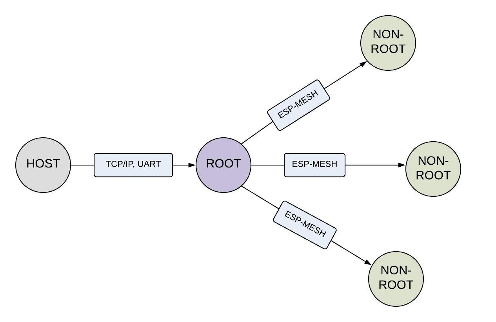

Mupgrade
=========

:link_to_translation:`en:[English]`

Mupgrade (Mesh Upgrade) 是 ESP-MESH OTA 升级的一种方案，目的是通过断点续传、数据压缩、版本回退和固件检查等机制实现 ESP-MESH 设备高效的升级。

Mupgrade 先将升级的固件下载到根节点，再由根节点将固件分包后，同时给多个设备进行批量升级。

功能
-----

- **断点续传**：根节点将固件以固定的大小进行分包, 待升级设备会记录每包固件的升级情况并写入 flash 中，中断升级后，再次升级时只请求未接收到的数据；
- **数据压缩**：使用 miniz 对每片固件进行压缩处理，减少数据包的大小，提高传输速率；
- **组播发送**：多个设备同时进行批量升级时，设备在收到升级数据包后自行拷贝一份，再传给下一节点，减少数据传输；
- **固件检查**：生成的固件中包含 Mupgrde 标识和 CRC 校验码，避免升级不带此功能的版本、固件发送错误和固件不完整等问题；
- **版本回退**：设备可以通过一定方式（GPIO 触发或连续断电重启多次）回退到上一个版本。

流程
----

.. figure:: ../../_static/Mupgrade/Mupgrade_process_cn.jpg
    :align: center
    :alt: Mupgrade_process
    :figclass: align-center

步骤一：固件下载
^^^^^^^^^^^^^^^^

1. HOST 通过 UART 或 Wi-Fi 等方式与根节点建立通信；
2. HOST 将固件的长度和标识等信息传给根节点；
3. 根节点通过固件的长度和标识判断是否支持此固件升级，擦除 flash 分区并返回状态给 HOST；
4. HOST 收到返回状态后，做出相应的处理；
    - 已经下载：跳过固件发送的步骤 5，进入步骤 6；
    - 长度错误：检查固件是否发送错误，大小是否超过分区限制；
    - 检查成功：继续后续的操作。
5. HOST 发送固件给根节点，根节点收到后直接写入 flash，当接收到的固件长度与设置长度相等时，会主动校验固件，并返回固件烧录情况；
6. HOST 将待升级的设备列表发送给根节点。

.. note::

    1. 分区表中必须包含：ota_data, ota_0, ota_1；
    2. 固件大小不能超过 ota_0 与 ota_1 分区的大小；
    3. 根节点在收到数据包后会进行写 flash 操作，此时会挂起其他 task，若此时 HOST 给根节点发包将会造成数据包的丢失。因此若使用 UART 发送固件，请打开流控，或分包发送且等到根节点回 ACK 后再发下一包数据。

步骤二：固件传输
^^^^^^^^^^^^^^^^

1. 根节点收到设备列表后，检查设备列表是否正确；
2. 根节点向列表中的设备发送升级状态请求；
3. 相关设备收到升级状态请求后，若无升级断点数据则擦除 flash 分区，返回丢包情况；
4. 根节点根据返回的丢包情况将固件分包发送给目标设备；
5. 相关设备按固件包的序号将固件分片写入 flash 中，每升级 10% 上报一次升级状态；
6. 根节点重复步骤 2，直至列表中所有设备均完成固件下载或超过重试次数。

步骤三：版本切换
^^^^^^^^^^^^^^^^

1. 待升级的设备完成接收固件后会在 flash 的 ota_data 中标识下一次重启后运行的分区；
2. 根节点收到所有相关设备的完成信息后，给所有待升级设备发送重启命令；
3. 相关设备收到重启命令后，重启设备后主动上报当前设备的版本；
4. HOST 校验版本，完成升级。

分区表
-------

单个 ESP32 的 flash 有多个应用程序分区和多种不同类型的数据。分区表可以用来定义 flash 布局。
由于 esp-idf 内置分区表存放应用程序的分区仅为 1 MB，无法满足 ESP-MESH 应用开发的需求，为了简化您对分区表的配置，提供了以下两种类型的分区给您参考。

1. 无 `factory` 分区::

    # Name,   Type, SubType,  Offset,   Size,  Flags
    nvs,      data, nvs,      0x9000,   16k
    otadata,  data, ota,      0xd000,   8k
    phy_init, data, phy,      0xf000,   4k
    ota_0,    app,  ota_0,    0x10000,  1920k
    ota_1,    app,  ota_1,    ,         1920k
    coredump, data, coredump, ,         64K
    reserved, data, 0xfe,     ,         128K

2. 有 `factory` 分区::

    # Name,   Type, SubType,  Offset,   Size,  Flags
    nvs,      data, nvs,      0x9000,   16k
    otadata,  data, ota,      0xd000,   8k
    phy_init, data, phy,      0xf000,   4k
    factory,  app,  factory,  0x10000,  1280k
    ota_0,    app,  ota_0,    ,         1280k
    ota_1,    app,  ota_1,    ,         1280k
    coredump, data, coredump, ,         64K
    reserved, data, 0xfe,     ,         128K

.. Note::

    1. 更新分区表前，需要先擦除整个 flash；
    2. 应用程序分区（ factory、ota_0、ota_1）必须处于与 0x10000（64K）对齐的偏移量；
    3. 分区表无法通过 OTA 的方式进行修改；
    4. 根节点会使用 ota_0 或 ota_1 作固件缓冲，如无 factory 分区版本回退，版本回退后的固件可能不是自己的版本。

注意事项
---------

若要自定义升级方式，请注意：

1. **勿逐一升级**：若版本间不兼容，会破坏原有网络，容易造成孤立节点，增加升级困难；
2. **勿整包传输**：ESP-MESH 属于多跳网络，只能保证点对点，无法保证端对端的可靠性。若整个固件一次性传输，当设备层级较高时，很可能出现数据的丢失，造成设备无法成功升级。