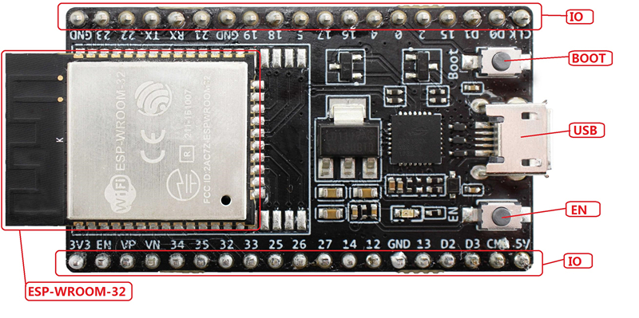

[[English]](../../en/get-started/get_started_en.md)

# ESP-MDF 入门指南

《ESP-MDF 入门指南》旨在指导您创建基于乐鑫芯片 ESP32 的 Mesh 应用的软件环境。本文将通过一个简单的例子来说明如何使用 ESP-MDF (Espressif Mesh Development Framework)，包括配置、编译、下载固件到开发板等步骤。

## 硬件准备

您需要准备至少两块 [ESP32-DevKitC V4](https://esp-idf.readthedocs.io/zh_CN/latest/hw-reference/modules-and-boards.html#esp32-devkitc-v4) 开发板。

ESP32-DevKitC V4 功能模块介绍:

| 接口/模块 | 说明 |
| --------- | :--- |
| ESP32-WROOM-32 | [ESP32-WROOM-32](http://esp-idf.readthedocs.io/zh_CN/latest/hw-reference/modules-and-boards.html#esp-modules-and-boards-esp-wroom-32) 模组 |
| EN           | 复位按键，按下此轻触开关，系统复位。|
| Boot         | 下载键，按下此按键，然后再按下 EN 按键，系统进入下载模式，通过串口对 flash 进行下载。 |
| USB          | USB 接口，既为开发板提供电源，以作为通信接口连接 PC 与 ESP32-WROOM-32 模组。 |
| IO           | 扩展了 ESP32-WROOM-32 的大部分引脚。 |

<div align=center>

<p> ESP32-DevKitC V4 </p>
</div>

## 获取 ESP-MDF

获取 ESP-MDF API 库，打开一个终端，进入某个您希望存放 ESP-MDF 的目录，然后 git clone 以下指令：

```sh
mkdir ~/esp
cd ~/esp
git clone --recursive https://github.com/espressif/esp-mdf.git
```

ESP-MDF 会被下载到 `~/esp/esp-mdf`。

## 设置 ESP 工具链

首先，您需要搭建 ESP-IDF 软件开发环境之后才能使用 ESP-MDF。请根据您的电脑操作系统（[Windows](https://esp-idf.readthedocs.io/zh_CN/latest/get-started/windows-setup.html)，[Linux](http://esp-idf.readthedocs.io/zh_CN/latest/get-started/linux-setup.html) 或 [Mac OS](http://esp-idf.readthedocs.io/zh_CN/latest/get-started/macos-setup.html)）参考 [ESP32 编程指南](http://esp-idf.readthedocs.io/zh_CN/latest/index.html)进行配置。

建议您在 Ubuntu 系统上使用 ESP-MDF。在 Ubuntu 上运行脚本 `setup_toolchain.sh`，创建开发环境，包括所有 SDK 的安装，交叉编译工具链的配置以及系统变量的配置。

```sh
./tools/setup_toolchain.sh
```

您也可以使用 [make](http://esp-idf.readthedocs.io/zh_CN/latest/get-started/make-project.html) 命令或使用 [Eclipse IDE](http://esp-idf.readthedocs.io/zh_CN/latest/get-started/eclipse-setup.html) 编译上传代码到 ESP32。

>  这里使用 `~/esp` 目录来演示如何安装预编译的工具链、ESP-IDF 和示例程序，您也可以使用其它目录，但是需要注意调整相应的指令。

如果这是您第一次使用 ESP32 和 [ESP-IDF](https://github.com/espressif/esp-idf)，那么建议您熟悉 [hello_world](https://github.com/espressif/esp-idf/tree/master/examples/get-started/hello_world) 和 [blink](https://github.com/espressif/esp-idf/tree/master/examples/get-started/blink) 示例。当您可以创建，烧录和运行这两个示例之后，就可以进入下一步。

## 设置 ESP-MDF 路径

工具链程序使用环境变量 MDF_PATH 来访问 ESP-MDF。此变量应该设置在您的 PC 中，否则项目将不能编译。这一操作构成与设置 ESP-IDF 变量相同，请参考文档 [在用户配置文件中添加 IDF_PATH](https://esp-idf.readthedocs.io/zh_CN/latest/get-started/add-idf_path-to-profile.html) 进行操作。

使用命令 `echo` 来检查 `MDF_PATH` 是否设置正确：

```sh
echo $MDF_PATH
```

如果设置正确，运行此命令后将返回 ESP-MDF 项目目录的路径，如：`~/esp/esp-mdf`。

## 创建一个工程

现在可以开始创建 ESP32 Mesh 应用程序了。为了演示如何构创建应用程序，这里以 MDF 中 examples 目录中的 `light_bulb` 项目为例。

将 `examples/light_bulb` 复制到 `~/esp` 目录：

```sh
cd ~/esp
cp -r $MDF_PATH/examples/light_bulb .
```

在 `light_bulb` 示例中，需要引出 ESP32 DevKitC V4 的六个引脚，并分别将它们连接到 RGBCW 灯以显示灯光（颜色和状态）控制效果：

| Pin         | GND  | IO4  | IO16  | IO5  | IO19              | IO23       |
| :---------- | :--- | :--- | :---  | :--- | :---------------- | :--------- |
| 说明| GND | 红色| 绿色| 蓝色| 色温| 亮度|

## 连接与配置

将 ESP32 开发板连接到 PC，检查开发板的串口，并确认串行通信是否如 [ESP-IDF 文档](https://esp-idf.readthedocs.io/zh_CN/latest/get-started/index.html#get-started-connect) 中描述的正常运行。

在终端窗口，通过选择串口和上传速度，进入 `light-bulb` 应用程序目录，并用 `menuconfig` 配置它。

```sh
cd ~/esp/light_bulb
make menuconfig
```

保存配置。

## 创建，烧写和监控程序

现在您可以创建，上传和检查应用程序。运行命令：

```sh
make erase_flash flash monitor -j5
```

这样就能创建程序，其中包括 ESP-IDF/ESP-MDF 的模块，并将 bin 文件烧录到 ESP32 开发板并启动监视器。

如果在上述过程中没有错误，则 RGBCW 灯将闪烁黄色，表示设备已进入配网模式。

## 控制 ESP-MDF 设备

您可以在手机应用程序上配置 mesh light 连网参数，蓝牙配网，设备控制和固件升级。具体操作如下：

1. 安装 Mesh Android APK。
2. 在应用程序上配置网络：
    * 添加设备
    * 输入配置参数
    * 与设备连网
4. 获取设备信息：返回主页查看所有连网设备的列表。
5. 控制 mesh light：颜色控制，升级，重启等。
6. 配网模式：连续重启设备三次。

## 更新 ESP-MDF

在使用 ESP-MDF 一段时间后，您可能需要更新它以使用新功能或修复 bug。最简单的方法是删除现有的 `esp-mdf` 文件夹并再克隆一个，即重复上文中 “获取 ESP-MDF” 的操作。

另一种方法是仅更新已更改的内容。如果您登录 GitHub 很慢，此方法比较合适。执行更新，请运行以下命令：

```sh
cd ~/esp/esp-mdf
git pull
git submodule update --init --recursive
```

`git pull` 指令是从 ESP-MDF 仓库中获取合并更新。`git submodule update --init --recursive` 用来更新现有的子模块或拷贝新的子模块。在 GitHub 上，子模块链接到其他仓库，所以需要这个额外的指令来将子模块下载到你的电脑里。
