[[中文]](./README_cn.md)

# ESP32-MeshKit Guide

---

## Overview
ESP32-MeshKit is a network configuration solution based on [ESP-MESH](https://docs.espressif.com/projects/esp-idf/en/latest/api-guides/mesh.html) for smart homes, which includes [ESP32-MeshKit-Light](https://www.espressif.com/sites/default/files/documentation/esp32-meshkit-light_user_guide_en.pdf), [ESP32-MeshKit-Sense](https://github.com/espressif/esp-iot-solution/blob/master/documents/evaluation_boards/ESP32-MeshKit-Sense_guide_en.md) and [ESP32-MeshKit-Button](tobeadded). It can be used with ESP-MESH App to facilitate your understanding and research of ESP-MESH, as well as your development of other applications.

* ESP32-MeshKit-Light: A smart lighting solution with ESP-MESH functioning as the master network. The Light can serve as a root node (similar to a gateway), an intermediate parent node or a leaf node.

* ESP32-MeshKit-Sense: A low-power consumption solution, specially designed for the applications where ESP-MESH is in Deep-sleep or Light-sleep mode. It is connected to ESP-MESH network as a leaf node only.

* ESP32-MeshKit-Button: A smart button solution, great for the ESP-MESH applications with ultra-low power consumption. It's generally in a power-off status and only works upon waking up. It transmits packets to ESP-MESH devices via [ESP-NOW](https://docs.espressif.com/projects/esp-idf/en/latest/api-reference/network/esp_now.html).

## Protocols

1. [Mconfig](https://docs.espressif.com/projects/esp-mdf/en/latest/api-guides/mconfig.html) (MESH Network Configuration)

	A network configuration solution for ESP-MESH, which uses a network configuration app to connect a single device to ESP-MESH network through Bluetooth. Then the networked device transfers the network configuration information to other non-networked devices.

2. [Mlink](https://docs.espressif.com/projects/esp-mdf/en/latest/api-guides/mlink.html) (MESH LAN Communication)

	A LAN control solution for ESP-MESH, where the root node initiates communication between the network configuration app and the HTTP server, and transfers the communication information to other devices.

3. [Mupgrade](https://docs.espressif.com/projects/esp-mdf/en/latest/api-guides/mupgrade.html) (MESH Upgrade)

	A solution for simultaneous over-the-air (OTA) upgrading of multiple ESP-MESH devices on the same wireless network with functions such as automatic retransmission of failed fragments, data compression, revert to an earlier version, and firmware check.

## Network Configuration App

### 1. ESP-MESH App

* Android: [source code](https://github.com/EspressifApp/EspMeshForAndroid), [apk](https://www.espressif.com/zh-hans/support/download/apps?keys=&field_technology_tid%5B%5D=18) (installation package)
* iOS: Open `App Store` and search `ESPMesh`. Only the devices below 0.5 version are supported currently.
* WeChat mini grogram: Open WeChat and search `ESPMesh`. Only network configuration is supported currently.

> Note: The Android version is given the top priority to be updated.

### 2. Network Configuration

* Preparation:
    * Make sure the device is in the Network Configuration mode. To do this, you may cut off its power supply and restart it for three times. Please refer to your device-specific guide or help documentation for details.
    
    * Open Bluetooth and GPS on your phone, and connect your phone to the target router.

* Scan devices:
    * Add devices for network configuration: App scans through Bluetooth and prompts you about any nearby devices that are in the Network Configuration mode. Tap on the button below `Add device` to add the scanned devices for network configuration.
    
    * Get the device list: A device list will appear after you add the scanned devices for network configuration. Tap on the down arrow at the beginning of the search box, two options `RSSI` (signal strength) and `Only favorites` will appear. You can filter the devices by their `RSSI` or tap on `Only favorites` to display your favorite devices only (To add a favorite device, just tap on the device icon).

    <table>
        <tr>
            <td >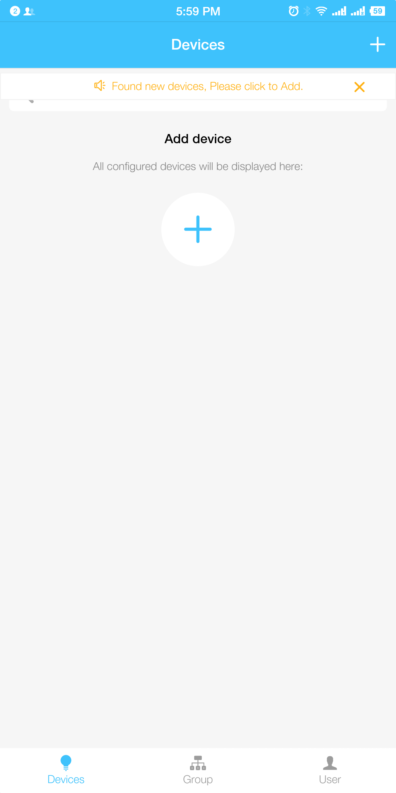
Add devices for network configuration
</td>
            <td >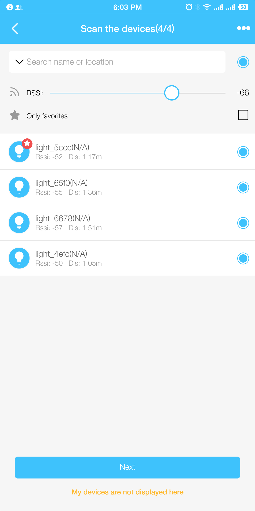
Get the device list
</td>
        </tr>
    </table>

* Enter the network configuration information:
    * Wi-Fi name: note that only 2.4 G is supported
    
    * `MESH ID`: the only identity of ESP-MESH network, which is the MAC address of the connected router by default. Multiple networks with the identical `MESH ID` will be integrated into one network.
    
    * Password: Wi-Fi password
    
    * `More`: related configuration within ESP-MESH network. Just use the default configuration. 

    <table>
        <tr>
            <td >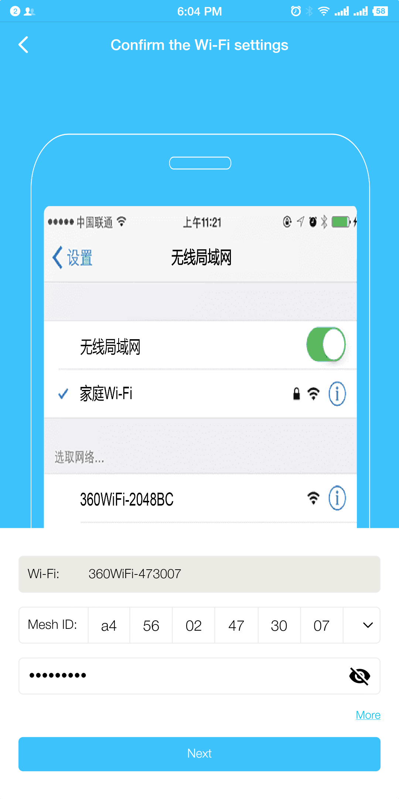
Enter the router information
</td>
            <td >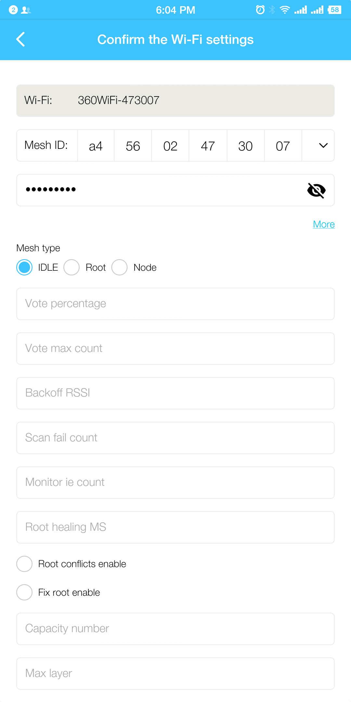
Enter ESP-MESH network configuration information
</td>
        </tr>
    </table>

* Transfer the network configuration information:

    * App screens the devices according to their signal strength and connects to the device with the strongest Bluetooth signal. It then transfers the network configuration information and the device whitelist to the connected device.
    
    * When the device receives the network configuration information, it attempts connecting to the router to verify if the information is correct.
    
    * After the information is confirmed correct, App displays the network is successfully configured, ready for the device to be networked. When the device is successfully networked via Bluetooth, it implements network configuration for the whitelisted devices.

    <table>
        <tr>
            <td >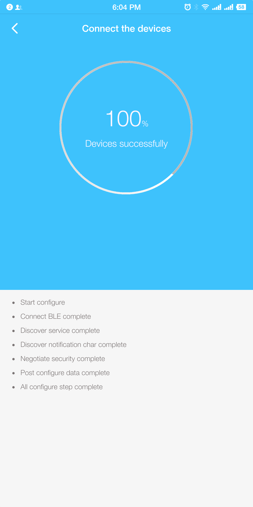
BLE Transmission
</td>
            <td >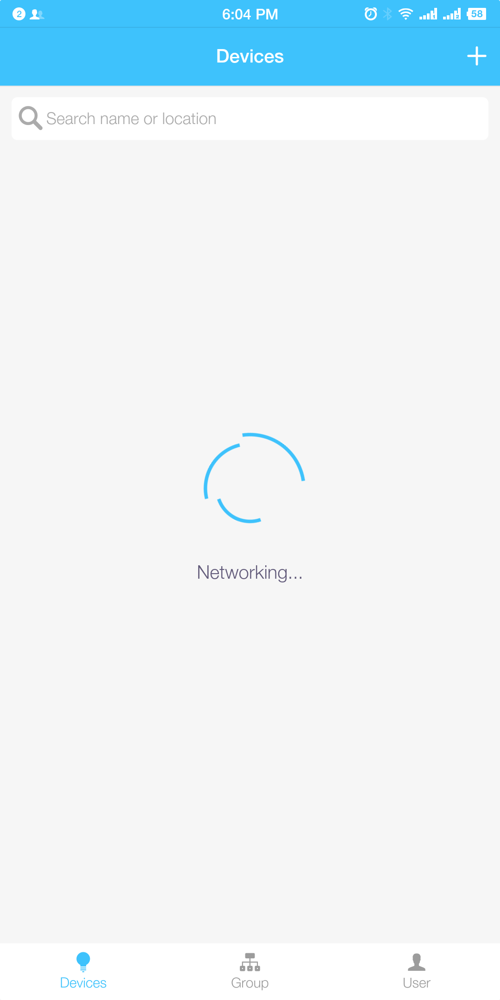
Wait to be networked
</td>
        </tr>
    </table>

### 3. Add a Device
When App finds a device that is successfully configured for its connected router, it automatically pops up a window, asking to add the device. Tap on `Add the device to the mesh network` if you'd like to add it.

<table>
    <tr>
        <td >
Add the device to MESH network
</td>
        <td >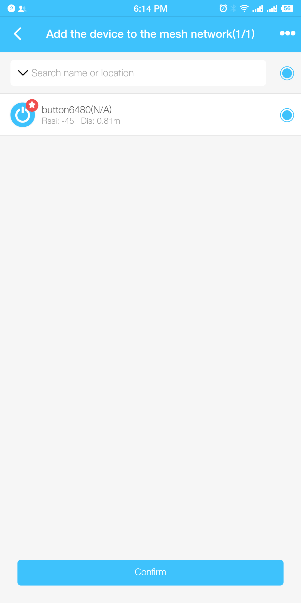
Select the device to be added to MESH network
</td>
    </tr>
</table>

### 4. Control
* Tap the App to navigate to the device control interface. You can drag the sliders to customize your lights and buttons.    

    <table>
        <tr>
            <td >
Light control interface
</td>
            <td >
Button control interface
</td>
        </tr>
   </table>

* Long tap the App interface to edit device related information:
    * Send command: send device debugging command or add custom commands;
    * Device association: This is to associates the devices. For example, when the light B is associated with the light A, it will be switched on after the light A is on. When a button is associated with a light, it can directly control the light's on/off status, color, etc.

    <table>
        <tr>
            <td >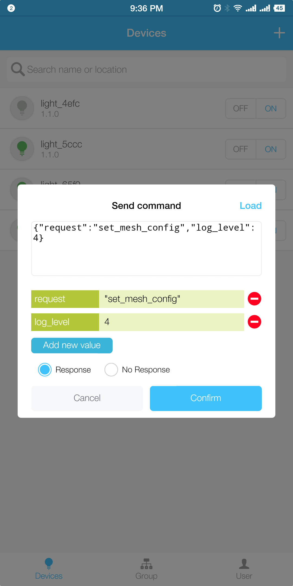
Send command
</td>
            <td >
Select device association
</td>
            <td >
Device association
</td>
        </tr>
   </table>

### 5. Group
* Default group: App groups the devices according to their type by default. Note that the default group can't be deleted.
* Add a group: You can add a custom group to group control the devices.

    <table>
        <tr>
            <td >
Add a group
</td>
            <td >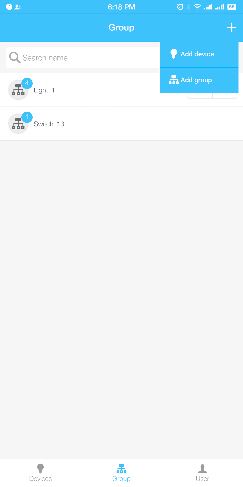
Edit the group name
</td>
        </tr>
   </table>

### 6. User
1. Setting: App version, App update, and common Q&A 
2. Topology: About ESP-MESH network structure and network configuration information

<table>
    <tr>
        <td >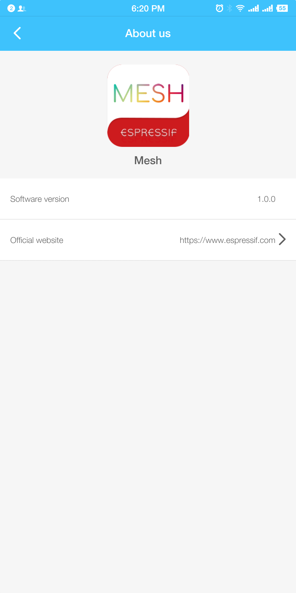
App version
</td>
        <td >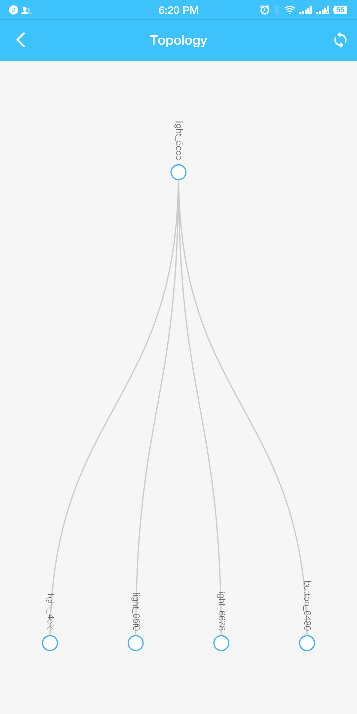
Topology
</td>
        <td >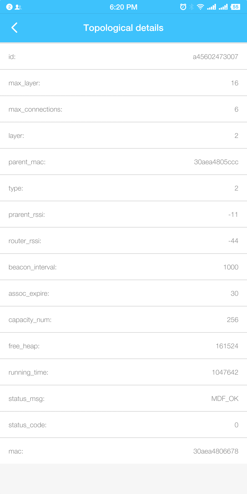
ESP-MESH network configuration information
</td>
    </tr>
</table>

### 7. Firmware Update

There are two ways to update the firmware:

1. Enter firmware url on App: you can save the updated firmware on Cloud (such as GitHub) or a HTTP server that is created within LAN, and enter the url to the saved firmware on App. 
2. Copy firmware to your phone: you can directly copy the updated firmware to the folder `File Management/Phone Storage/Espressif/Esp32/upgrade` on your phone.

<table>
    <tr>
        <td >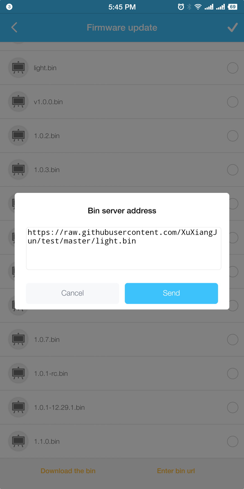
Enter firmware url 
</td>
        <td >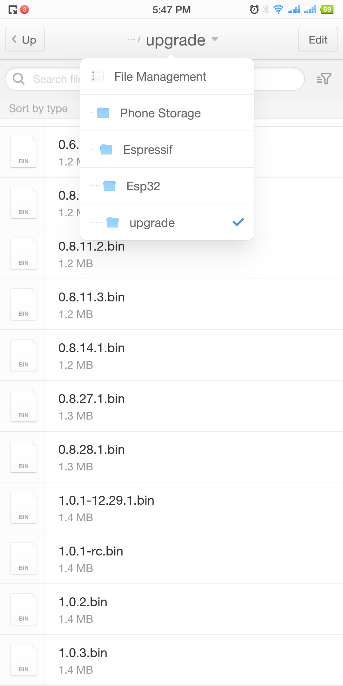
Add firmware to phone 
</td>
        <td >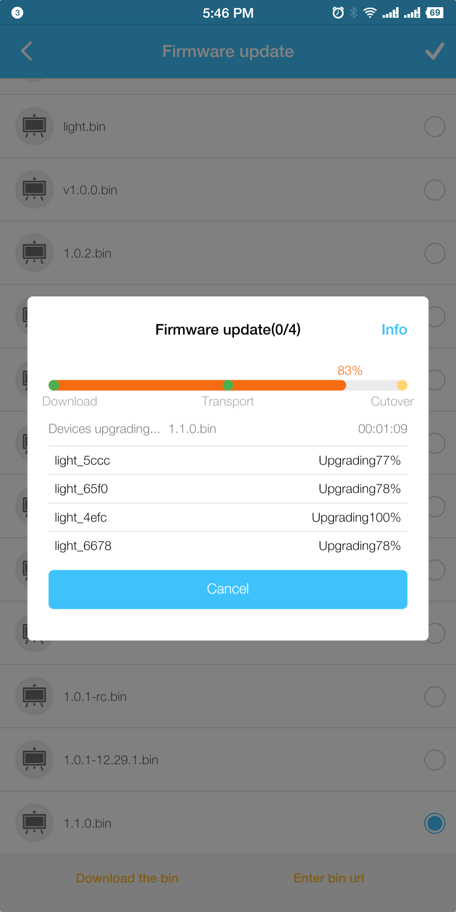
Update in Process
</td>
    </tr>
</table>

## Drivers
All the hardware drivers of ESP32-MeshKit use the corresponding driver code in [esp-iot-solution](https://github.com/espressif/esp-iot-solution). You can visit this repository for any code update.
