[[EN]](./README.md)

# ESP32-MeshKit 指南

---

## 概述
ESP32-MeshKit 是基于 [ESP-MESH](https://docs.espressif.com/projects/esp-idf/en/latest/api-guides/mesh.html) 的智能家居组网方案，其包含的 [ESP32-MeshKit-Light](https://www.espressif.com/sites/default/files/documentation/esp32-meshkit-light_user_guide_cn.pdf)、[ESP32-MeshKit-Sense](https://github.com/espressif/esp-iot-solution/blob/master/documents/evaluation_boards/ESP32-MeshKit-Sense_guide_cn.md) 和 [ESP32-MeshKit-Button](tobe)，可配套 ESP-MESH App 使用，用于调研和了解 ESP-MESH，也可以进行二次开发。

* ESP32-MeshKit-Light：ESP-MESH 作为主干网络用于长供电的场景中，设备可作为根节点（相当于网关）、中间根点和叶子节点；

* ESP32-MeshKit-Sense：ESP-MESH 在 Deep-sleep + Light-sleep 模式下的低功耗方案，设备仅作为叶子节点加入 ESP-MESH 网络；

* ESP32-MeshKit-Button：ESP-MESH 在超低功耗的场景下使用，平常处于断电的状态，仅在唤醒时工作并通过 ESP-NOW 给 ESP-MESH 设备发包。

## 协议

1. 配网：[Mconfig](https://docs.espressif.com/projects/esp-mdf/zh_CN/latest/api-guides/mconfig.html) (MESH Network Configuration) 是 ESP-MESH 配网的一种方案，首先使用 App 通过蓝牙给单个设备配网，然后再由已配网设备给未配网设备传递配网信息。

2. 通信：[Mlink](https://docs.espressif.com/projects/esp-mdf/en/latest/api-guides/mlink.html) (MESH LAN Communication) 是 ESP-MESH 局域网控制的一种方案，根节点会建立 HTTP 服务器与 App 之间进行通信，并将信息转发给 ESP-MESH 网络内的其余设备

3. 升级：[Mupgrade](https://docs.espressif.com/projects/esp-mdf/zh_CN/latest/api-guides/mupgrade.html) (MESH Upgrade) 是 ESP-MESH OTA 升级的一种方案，目的是通过断点续传、数据压缩、版本回退和固件检查等机制实现 ESP-MESH 设备高效的升级。

## APP 的使用

### 1. ESP-MESH App

* 安卓系统：[源码](https://github.com/EspressifApp/EspMeshForAndroid)，[apk](https://www.espressif.com/zh-hans/support/download/apps?keys=&field_technology_tid%5B%5D=18)（安装包）
* iOS 系统：打开 `App Store`， 搜索 `ESPMesh`，目前仅支持设备 0.5 以下的版本
* 微信小程序：打开微信，搜索 `ESPMesh`，目前仅支持配网功能

> 注： 所有版本中优先更新安卓版本

### 2. 配网

* 准备工作：
    * 设备处于配网模式。通常可进行通断电三次使设备进入配网状态，具体操作和设备状态可查看相关设备的说明；
    * 手机打开蓝牙和 GPS 定位功能，并连接目标路由器。

* 设备扫描:
    * 进入蓝牙配网：若周围有处于配网状态的设备，App 会有相关提示；选择主界面中`添加设备`按钮进行设备配网；
    * 获取设备列表：通过蓝牙扫描获取周围处于配网模式的设备，点击搜框前的小箭头，您可以通过 `RSSI`(信号强度) 和 `只显示收藏`（点击设备图标，将会加入收藏）来筛选设备。

    <table>
        <tr>
            <td >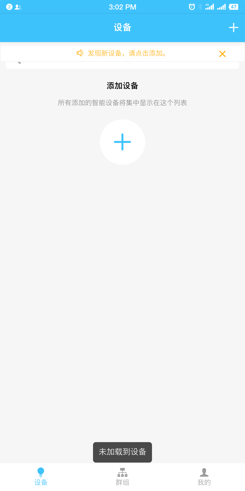
进入蓝牙配网
</td>
            <td >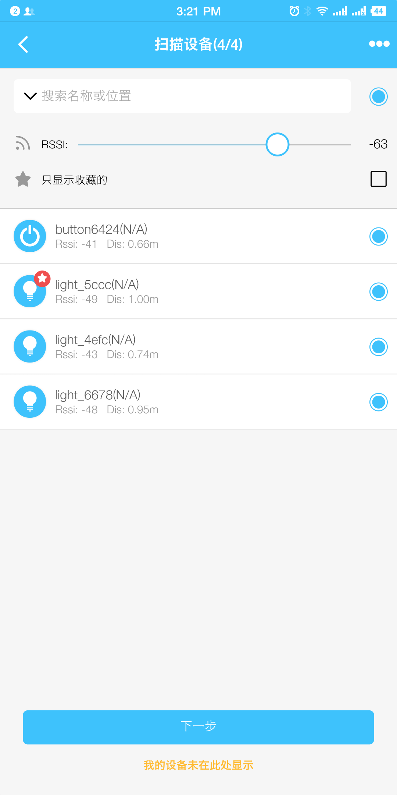
获取设备列表
</td>
        </tr>
    </table>

* 输入配置信息：
    * Wi-Fi 名称：注意仅支持 2.4 G
    * Mesh ID：ESP-MESH 网络的唯一标识符，相同的 `Mesh ID` 将组成一个网络。默认为路由器的 Mac 地址
    * 密码：为 Wi-Fi 密码
    * More：为 ESP-MESH 网络内部的相关配置，使用默认配置即可

    <table>
        <tr>
            <td >
输入路由器信息
</td>
            <td >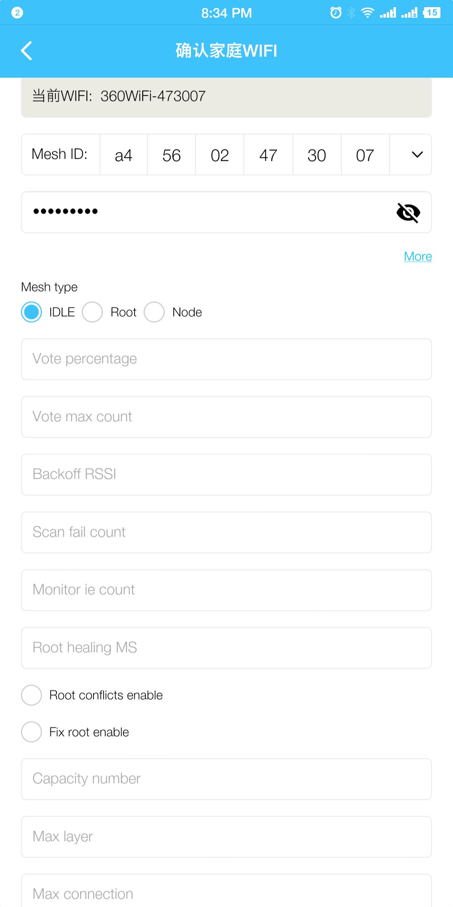
输入 ESP-MESH 配置信息
</td>
        </tr>
    </table>

* 传输配置信息：
    * App 首先会筛选蓝牙信号最强的设备，并与之建立连接，将配置信息和设备白名单列表传输给该设备；
    * 设备收到配置信息后，尝试连接路由器校验配置信息是否正确；
    * 若配置信息正确
    	* APP端：显示配网成功等待组网；
    	* 设备端：通过蓝牙配网成功的设备给设备白名单列表中的设备配网，并进行组网。

    <table>
        <tr>
            <td >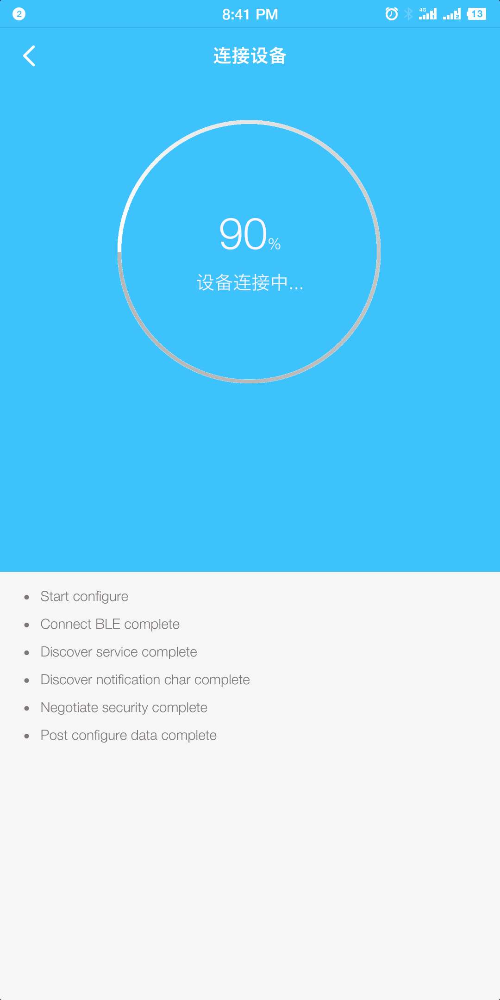
蓝牙传输
</td>
            <td >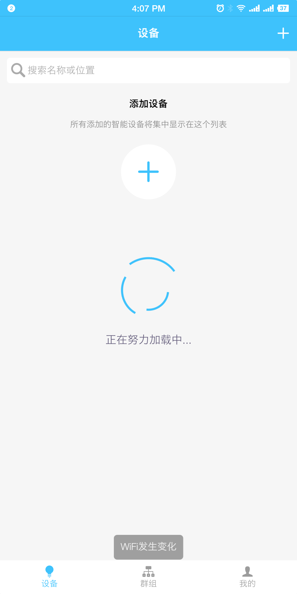
等待组网
</td>
        </tr>
    </table>

### 3. 添加设备
如果 App 所连接的路由器存在已经配网成功的设备，App 会自动弹出设备添加框，点击 `加入网络` 即完成配网。

<table>
    <tr>
        <td >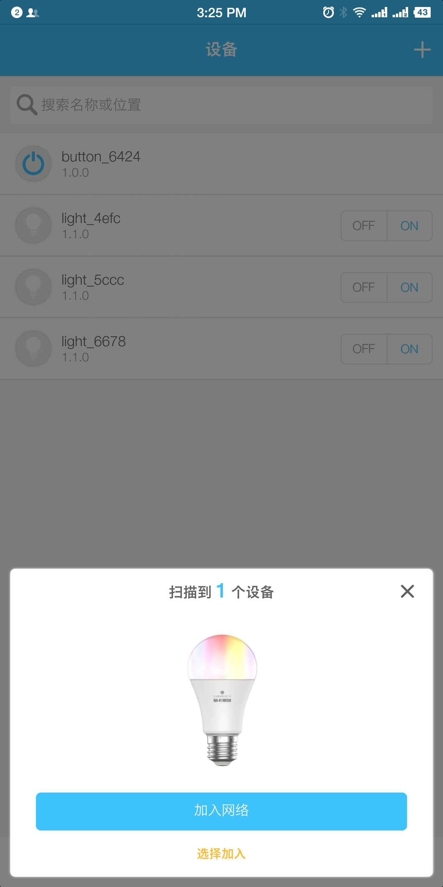
加入网络
</td>
        <td >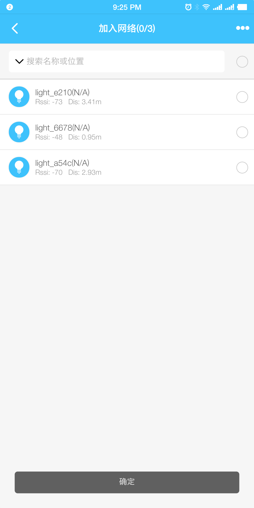
选择加入
</td>
    </tr>
</table>

### 4. 控制
* 短按：进入设备控制界面，自定义设备类型以原始数值的方式显示

    <table>
        <tr>
            <td >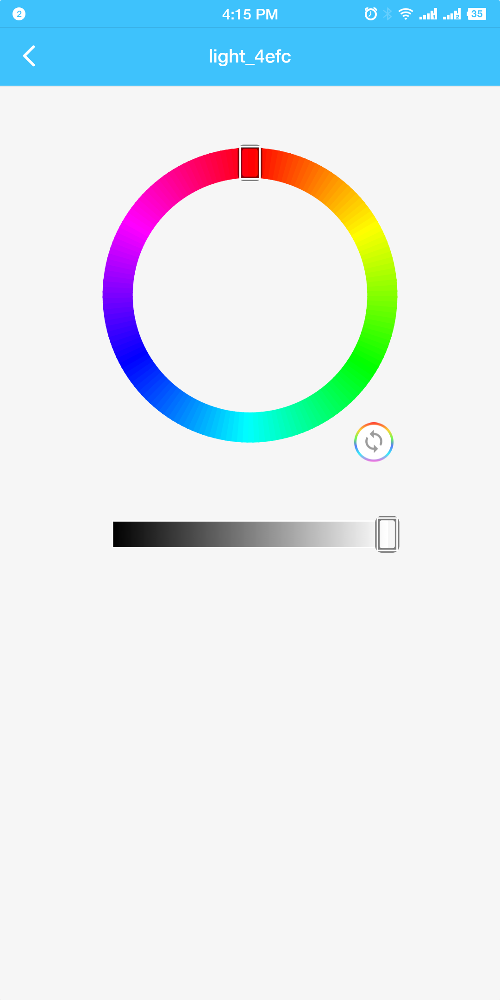
智能灯的控制界面
</td>
            <td >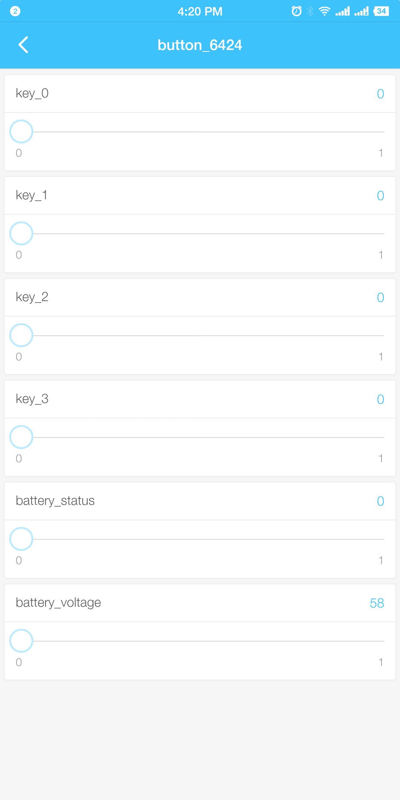
自定义设备类型的控制界面
</td>
        </tr>
   </table>

* 长按：进行设备编辑
    * 发送命令：用于设备的调试，添加自定义请求指令。
    * 自动化：将设备之间进行关联，如将灯 A、B 关联后，当打开灯 A 时，灯 B 以将随之打开，如将 buton 与灯关联，则可以通过 button 直接控制灯的开关、颜色等。

    <table>
        <tr>
            <td >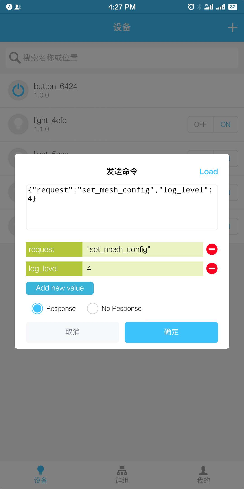
发送命令
</td>
            <td >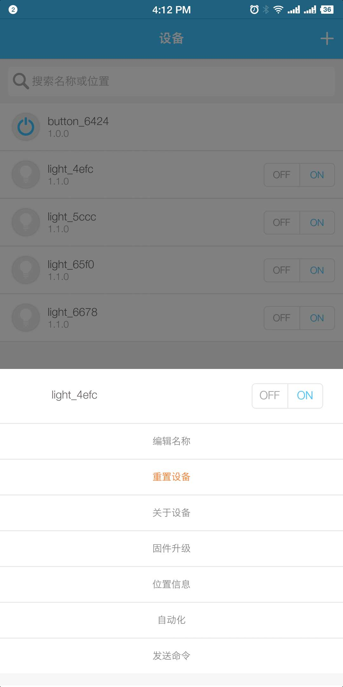
选择自动化
</td>
            <td >
自动化
</td>
        </tr>
   </table>

### 5. 群组
* 默认群组：App 默认以设备的类型对设备进行分组，默认群组禁止解散
* 添加群组：您可以添加自定群组，将设备进行分组控制

    <table>
        <tr>
            <td >
添加群组
</td>
            <td >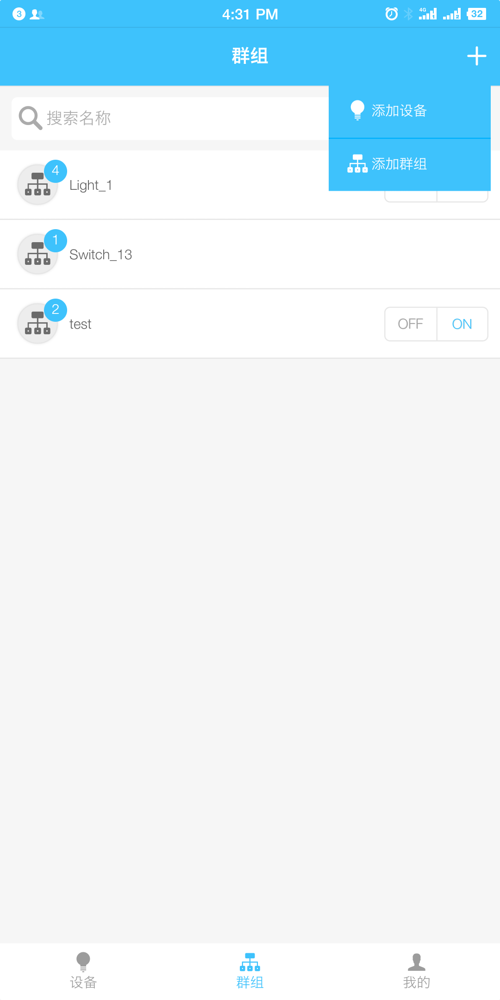
编辑名称
</td>
        </tr>
   </table>

### 6. 我的
1. 设置：App 的版本信息，App 升级及常见的问题解答
2. 拓扑结构：获取 ESP-MESH 网络结构及组网信息

<table>
    <tr>
        <td >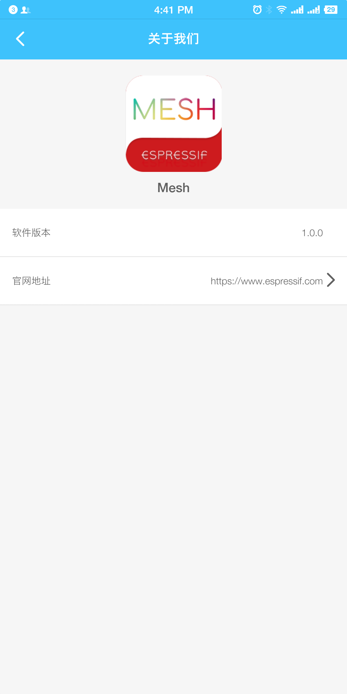
App 版本信息
</td>
        <td >
拓扑结构
</td>
        <td >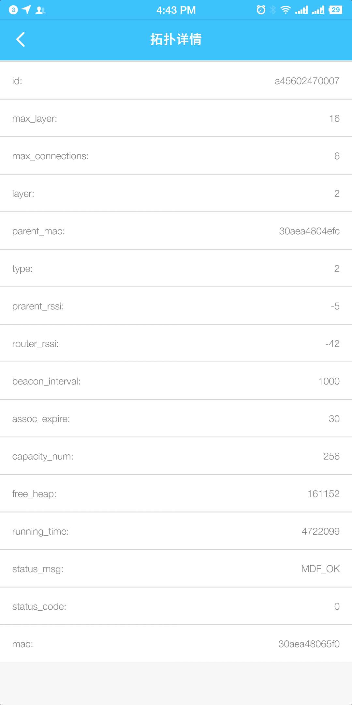
ESP-MESH 网络配置信息
</td>
    </tr>
</table>

### 7. 固件升级
1. 链接升级：您可以将固件放在云端（如 GitHub 上）或局域网内创建的 HTTP 服务器，在 App 端输入 url
2. 文件升级：您可以将固件直接拷贝的手机 `文件管理/手机存储/Espressif/Esp32/upgrade` 文件夹中

<table>
    <tr>
        <td >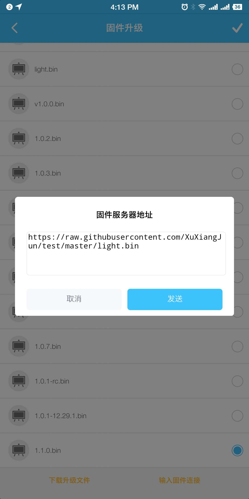
链接升级
</td>
        <td >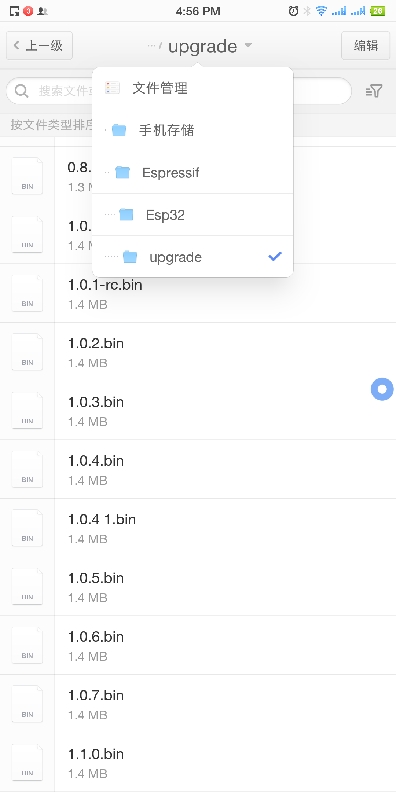
文件升级
</td>
        <td >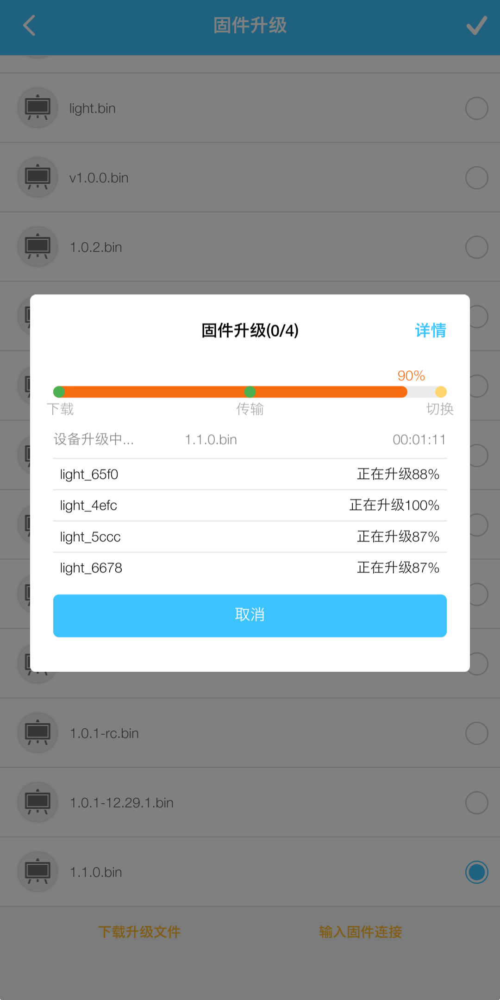
升级中
</td>
    </tr>
</table>

## 驱动说明
ESP32-MeshKit 的硬件驱动全部使用了 [esp-iot-solution](https://github.com/espressif/esp-iot-solution) 中的相关驱动代码，可通过仓库链接进行代码更新。