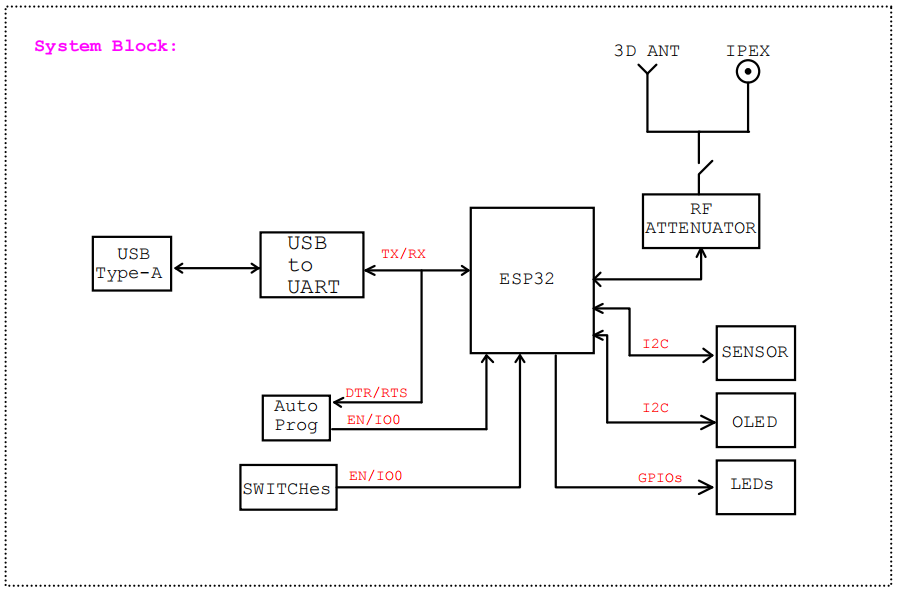
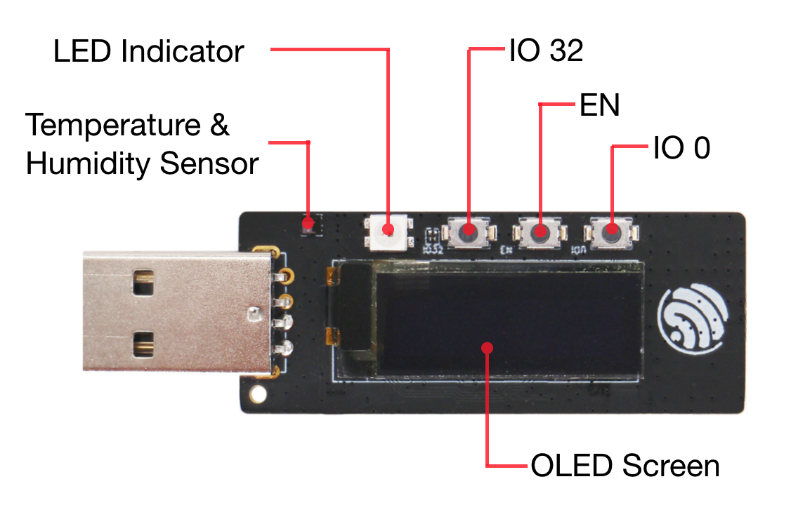
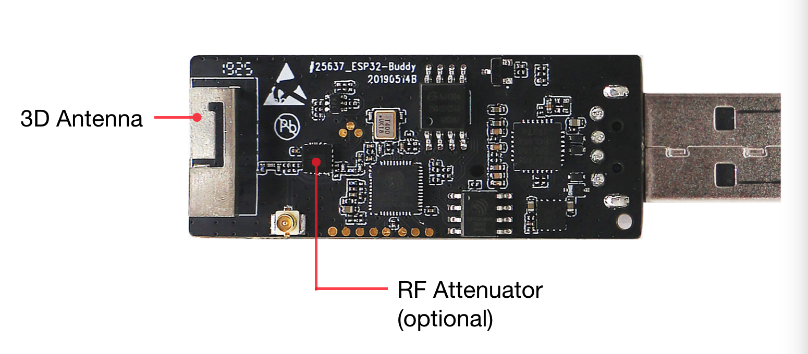

[[中文]](./README_cn.md)
# ESP32-Buddy User Guide

## Overview

ESP32-Buddy is designed for [ESP-MESH](https://docs.espressif.com/projects/esp-idf/en/stable/api-guides/mesh.html) related tests. It will help you test ESP-MESH features and redevelop ESP32-Buddy programs. Before running this example, please read [ESP32-MeshKit Guide](../README.md) in details.

> Notes: This example is not limited to ESP32-Buddy and can be directly used to external modules related to ESP32.

## Hardware

The [ESP32-Buddy](https://www.espressif.com/sites/default/files/documentation/esp32-Buddy_user_guide_en.pdf) is externally equipped with a 0.97-inch OLED Screen, WS2812B LED, HTS221 temperature & humidity Sensor and HMC8073 RF Attenuator.

1. ESP32-Buddy module diagram
<div align=center>

<p> ESP32-Buddy Module Diagram </p>
</div>

2. ESP32-Buddy 
<div align=center>

<p> ESP32-Buddy Front </p>
</div>
<div align=center>

<p> ESP32-Buddy Back </p>
</div>

3. IO Mapping

| IO | Description | 
|:---:|:---|
| IO0 | Button |
| IO32 | Button |
| IO25 | WS2812B LED |
| IO18 | I2C SDA    |
| IO23 | I2C SCL |
| IO19 | HMC8073 LE (Latch Enable) |
| IO21 | HMC8073 CLK |
| IO22 | HMC8073 SI (Data Input) |

## LED Indicator

| Colors | Status |
| ----------- | ------ |
| Red | Idle; waiting for networking |
| Blue | Turning to root node |
| Green | Success network |

## ESP-Buddy Program

### Introduction 

ESP-MESH is a network protocol based on Wi-Fi protocol, which allows multiple devices (hereafter called nodes) distributed over large physical areas (indoors and outdoors) to be interconnected under a single WLAN (Wireless Local Area Network). ESP-MESH is able to self-organize and self-healing, which means the network can be built and maintained autonomously.

The following tests are now available with ESP-Buddy program:

 - Throughput test
 - Distance test
 - Networking test (based on application scenarios, you can test the networking time of different nodes as the root node)

### Throughput Test Flow

1. Compile and burn this program to two ESP-Buddy development boards
2. Select one board and long press IO32 button, making this device the root node and red LED will turn blue
3. Waiting for the other board to be connected to the parent node, then red LED will turn green
4. Configure the root node to enter Throughput Test mode: switch the interface from OLED to Throughput Test via IO0 button, and set it to iPerf Server by pressing IO32 button
5. Configure the child node to enter Throughput Test mode: switch the interface from OLED to Throughput Test via IO0 button, and set it to iPerf Client via IO32 button, start testing
6. The Throughput Test result will be displayed on OLED screen

### Networking Test Flow

1. Compile and burn this program to two ESP-Buddy development boards
2. Select one board and long press IO32 button, making this device the root node and red LED will turn blue
3. Waiting for the other board to be connected to the parent node, then red LED will turn green
6. The Networking Test result will be displayed on OLED screen, with its cost of time shown on the homepage (starts from powering on)

* The use of each command is described below.

## Console Command

### Serial Command Format

* The serial commands supported by ESP-NOW debug receiver include: help, sdcard, wifi_sniffer, wifi_config, wifi_scan, log, coredump, attenuator and command.

* The interaction of serial commands follows the following rules:
    1. The control command is sent from PC to ESP-NOW debug receiver through the serial port. The serial communication baud rate is 115200
    2. The characters in the control command defination are all lowercase letters (some of the options are capital letters), and the strings do not need to be quoted.
    3. The parts inside square brackets [] in the command description, meaning default value, can be filled or may be diaplayed
    4. The format of a serial command is as follows, seperated by a space character between each element

        ```
        Command+Option+Parameter, i.e., log -s aa:bb:cc:dd:ee:ff
        ```

    5. Line break can be '\n' or '\r\n'
    6. The serial port returns execution result at 115200 baud rate 

### General Command

 - help:
 	Print regitered commands and their descriptions
 - version:
 	Get the chip and SDK version
 - heap:
 	Get the current available heap memory size
 - restart:
 	Soft restart the chip
 - reset:
 	Reset all configuration information of the device
 
### Log Command

1. Log configuration
    
    |Command Defination|log [\<tag\>] [\<level\>] [-s <addr (xx:xx:xx:xx:xx:xx)>]||
    |:---:|:---|:---|
    |Instruction|log -s|Send logs to the specified device| 
    | Parameter |addr|Monitor MAC address of the device| 
    ||tag|Use tag to filter logs| 
    ||level|Use level to filter logs| 
    | Example |log * NONE|Set no log output| 
    ||log mwifi INFO|Set the log with mwifi TAG output level to INFO| 
    ||log -s 30:ae:a4:80:16:3c|Send logs to the 30:ae:a4:80:16:3c device| 

### coredump Command

1. coredump data
 
   |Command Defination|coredump [-loe] [-q <seq>] [-s <addr (xx:xx:xx:xx:xx:xx)>]|   |
   |:---:|:---|:---|
   |Instruction|coredump -l|Get the length of the coredump data on the device| 
   ||coredump -o|Read the coredump data on the device and print it to the console| 
   ||coredump -e|Erase the coredump data on the device| 
   ||coredump -s|Send the coredump data on the device to a specified device| 
   |Parameter|addr|Monitor MAC address of the device| 
   ||sequence|Sequence number of the coredump data| 
   |Example|coredump -s 30:ae:a4:80:16:3c|Send the coredump data to the 30:ae:a4:80:16:3c device| 
   ||coredump -q 110 -s 30:ae:a4:80:16:3c|Send the coredump data from sequence number 110 to the 30:ae:a4:80:16:3c device| 
   ||coredump -l|Get the length of the coredump data on the device| 
   ||coredump -o|Read the coredump data on the device and print it to the console| 
   ||coredump -e|Erase the coredump data on the device| 

### mesh config Command

1. mesh config

    |Command Defination|mesh_config  [-oS] [-s <ssid>] [-p <password>] [-b <bssid (xx:xx:xx:xx:xx:xx)>] [-c <channel (1 ~ 13)>] [-i <mesh_id (6 Bytes)>] [-t <mesh_type ('idle'or 'root' or 'node' or 'leaf')>] [-P <mesh_password>] [-n <max_connection (1 ~ 10)>] [-l <max_layer (1 ~ 32)>]||
    |:---:|:---|:---|
    |Instruction|mesh_config -s <ssid> -p <password> -b <bssid>|Configure router information connected to the device| 
    ||mesh_config -c|Configure the working channel of the device ESP-MESH| 
    ||mesh_config -i <mesh_id> -t <mesh_type> -P <mesh_password> -n <max_connection> -l <max_layer>|Configure ESP-MESH (ID, password, capacity)| 
    ||mesh_config -o|Print ESP-MESH configuration information| 
    ||mesh_config -S|Save ESP-MESH configuration information| 
    |Example|mesh_config -c 11|Configure channel 11 as the working channel of ESP-MESH| 
    ||mesh_config -i 14:12:12:12:12:12 -s espressif -p espressif|Configure 14:12:12:12:12:12 as the ID of ESP-MESH; router connection information: SSID-espressif, password-espressif| 
    ||mesh_config -o|Print ESP-MESH configuration information| 
    ||mesh_config -S|Save ESP-MESH configuration information| 

### mesh_status Command

1. mesh status

    |Command Defination|mesh_status [-spo]||
    |:---:|:---|:---|
    |Instruction|mesh_status -s|Start ESP-MESH|
    ||mesh_status -p|Stop ESP-MESH|
    ||mesh_status -o|Print ESP-MESH status information|
    |Example|mesh_status -o|Print ESP-MESH status information|
    ||mesh_status -s|Start ESP-MESH|
    ||mesh_status -p|Stop ESP-MESH|

### mesh_scan Command

1. mesh scan

    |Command Defination|mesh_scan [-r <rssi (-120 ~ 0)>] [-s <ssid (xx:xx:xx:xx:xx:xx)>] [-b <bssid (xx:xx:xx:xx:xx:xx)>] [-t <type ('router' or 'mesh')>] [-p <time>]||
    |:---:|:---|:---|
    |Instruction|mesh_scan -r|Set RSSI filter value| 
    ||mesh_scan -s|Set SSID filter string| 
    ||mesh_scan -b|Set BSSID filter| 
    ||mesh_scan -t|Set filter type| 
    ||mesh_scan -p|Set the passive scanning time of each channel| 
    |Example|mesh_scan -t mesh|Filter mesh devices| 
    ||wifi_scan -r -60 -t mesh|Scan mesh devices with RSSI signal values within -60| 
    ||wifi_scan -s espressif -t mesh|Scan mesh devices with SSID under espressif| 
    ||wifi_scan -p 300|Set the passive scanning time of each channel to 300 ms| 

### mesh_iperf Command

1. mesh iperf

    |Command Defination|mesh_iperf [-spa] [-c <host (xx:xx:xx:xx:xx:xx)>] [-i <interval (sec)>] [-l <len (Bytes)>] [-t <time (sec)>]||
    |:---:|:---|:---|
    |Instruction|mesh_iperf -c|Run the device as client mode| 
    ||mesh_iperf -s|Run the device as server mode| 
    ||mesh_iperf -p|ping|
    ||mesh_iperf -i|Set bandwidth calculation period| 
    ||mesh_iperf -l|Set buffer length| 
    ||mesh_iperf -t|Set iperf testing time| 
    ||mesh_iperf -a|Stop iperf test| 
    |Example|mesh_iperf -s |Run the device as server mode| 
    ||mesh_iperf -c 30:ae:a4:80:16:3c|Run the device as client mode, and try performance testing with server 30:ae:a4:80:16:3c| 

### attenuator Command

1. attenuator

    |Command Defination|attenuator [-d]||
    |:---:|:---|:---|
    |Instruction|attenuator -d|Set the attenuator value, range <0,31>| 
    |Example|mesh_iperf -d 30 |Set the attenuator to 30 dB| 
