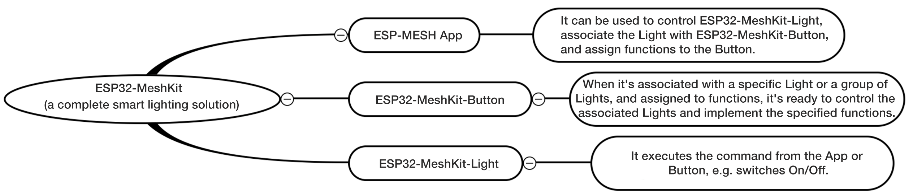
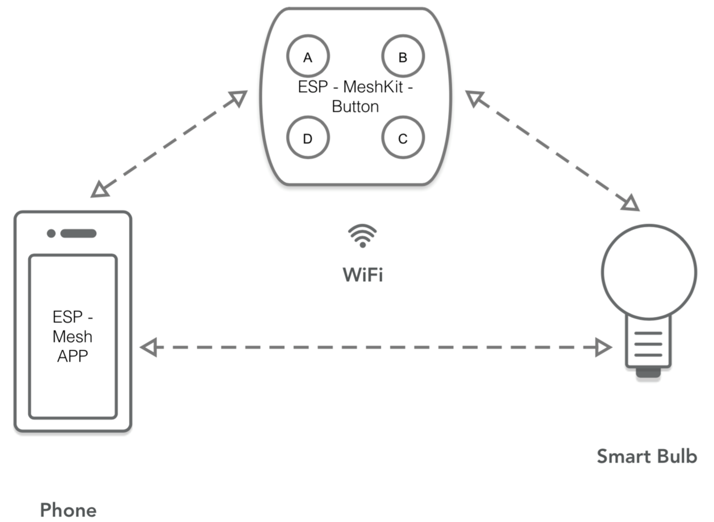
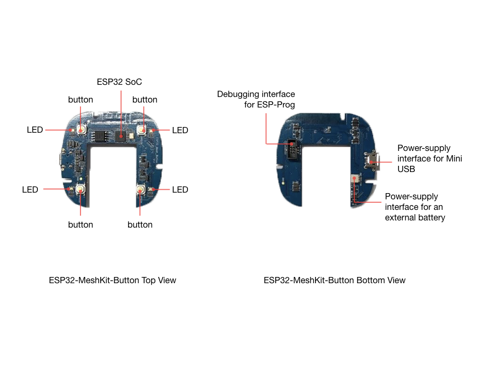
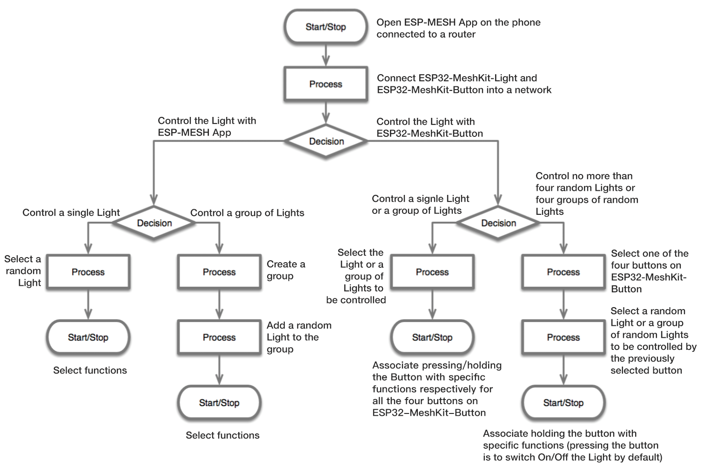
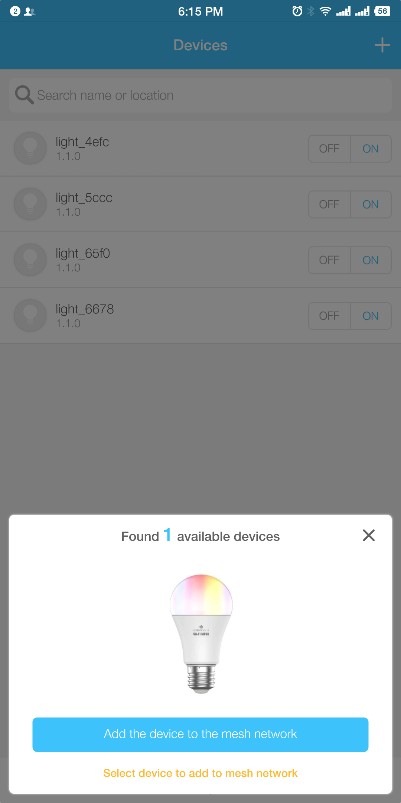
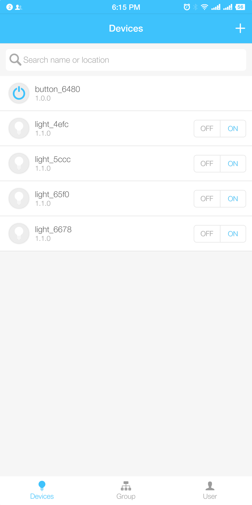
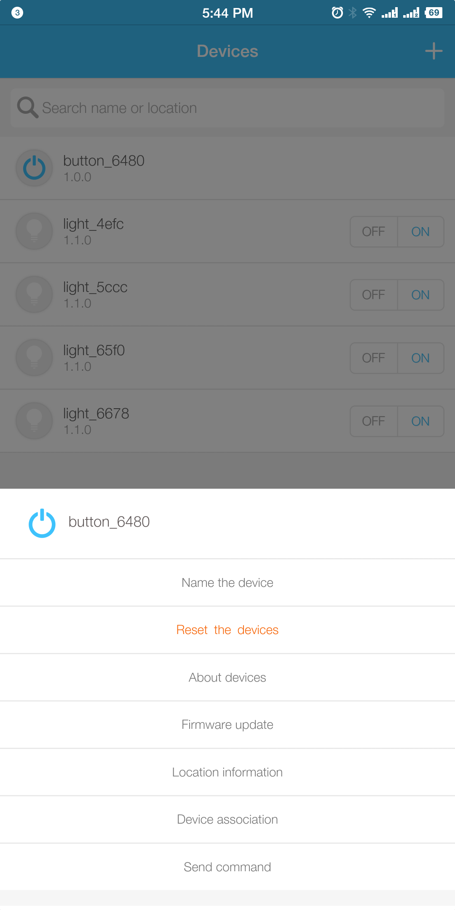
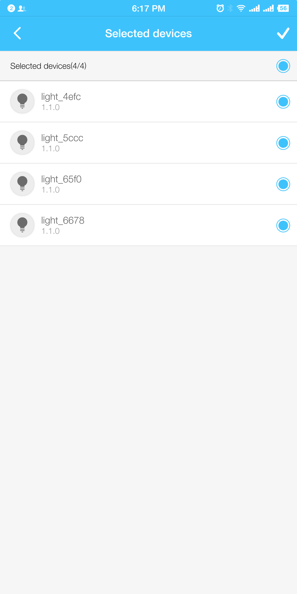
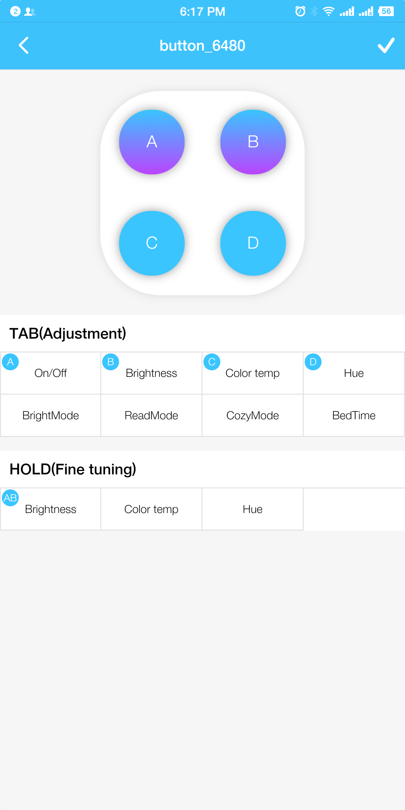

[[中文]](./README_cn.md)

# ESP32-MeshKit-Button

## Overview

ESP32-MeshKit-Button is a smart button solution based on [ESP-MESH](https://docs.espressif.com/projects/esp-idf/en/latest/api-guides/mesh.html). It features network configuration, upgrade, device association, etc., and will help you better understand how ESP-MESH can be used in the applications with ultra-low power consumption. 

ESP32-MeshKit-Button is connected to ESP-MESH network as a child node only, and must be used with [ESP32-MeshKit-Light](https://www.espressif.com/sites/default/files/documentation/esp32-meshkit-light_user_guide_en.pdf). Before running this example, please refer to [ESP32-MeshKit Guide](../../README_en.md).

<div align=center>

<p> Module Diagram </p>
</div>

## Hardware

* 1 x development board [ESP32-MeshKit-Button](docs/ESP32-MeshKit-Button_Schematic.pdf)
* No less than 1 x [ESP32-MeshKit-Light](https://www.espressif.com/sites/default/files/documentation/esp32-meshkit-light_user_guide_en.pdf)
* 1 x debugger [ESP-Prog](https://github.com/espressif/esp-iot-solution/blob/master/documents/evaluation_boards/ESP-Prog_guide_en.md) (an optional debugging tool)
* 1 x Lithium battery: 200 mAh (power supply via Mini USB, optional)

<div align=center>

<p> Interaction </p>
</div>

ESP32-MeshKit-Button features all the necessary hardwares:

* Microcontroller: ESP32 SoC
* Power supply interface: one for Mini USB and one for an external battery
* Debugging interface: for the connection to ESP-Prog
* Control component: 4 x button
* Display component: 4 x RGB LED

<div align=center>

</div>

## Function

ESP32-MeshKit-Button supports both press and hold (long press) for the control of a single ESP32-MeshKit-Light or a group of the Lights. When you press the Button, the Light can be switched on/off or switched between different modes, light color, etc., while long pressing the Button, you can adjust the Light's brightness and color temperature.

| Function | Description |
|---|---|
| On/Off switch | Switch on/off a single ESP32-MeshKit-Light or a group of the Lights with ESP-MESH App on your phone. |
| Brightness adjustment | Adjust the brightness of a single ESP32-MeshKit-Light or a group of the Lights with ESP-MESH App on your phone. (from the current brightness) |
| Color temperature adjustment| Adjust the color temperature of a single ESP32-MeshKit-Light or a group of the Lights with ESP-MESH App on your phone. (from the current color temperature) |
| Hue adjustment | Adjust the hue of a single ESP32-MeshKit-Light or a group of the Lights with ESP-MESH App on your phone. (from the current hue) |
| Bright mode | Switch a single ESP32-MeshKit-Light or a group of the Lights to the pre-specified bright mode with ESP-MESH App on your phone, while you're working or in a conference. In this mode, the Light will turn white (H/S/V: 0/0/100), and since the S value is 0, the Light will stay white, but you can adjust its brightness.|
| Read mode | Switch a single ESP32-MeshKit-Light or a group of the Lights to the pre-specified read mode with ESP-MESH App on your phone, while you focus on reading. In this mode, the Light will turn to an eye-friendly color (H/S/V: 216/10/100). |
| Cozy mode | In this mode, the Light will turn to a cozy light-yellow color (H/S/V: 60/10.2/100).|
| Bedtime mode | Switch a single ESP32-MeshKit-Light or a group of the Lights to the pre-specified bedtime mode with ESP-MESH App on your phone, while you're taking a break in your drawing room or bedroom. In this mode, the Light will turn to a warm yellow color (H/S/V: 28/63/100) to keep you feel comfortable.|

## Process

[ESP32-MeshKit-Button use video](http://demo.iot.espressif.cn:8887/cmp/demo/ESP32-MeshKit-Button_Demo.mp4)

Prior to the use of ESP32-MeshKit-Button, start ESP32-MeshKit-Light first and complete its network configuration.

<div align=center>

<p> Process </p>
</div>

### 1. Network Configuration

* Connect ESP32-MeshKit-Button to Mini USB. When the device's LED indicator flashes yellow, it shows the device enters Network Configuration mode. Long press two random buttons simultaneously to reset the device if you want to restart the network configuration.
* Connect the device to MESH network in accordance with [ESP32-MeshKit Guide](../../README_en.md).
* When the network configuration is completed, ESP32-MeshKit-Button appears on ESP-MESH App, and its LED stops flashing but remains yellow, which shows the Button is waiting to be associated with ESP32-MeshKit-Light.

<table>
    <tr>
        <td ><p align=center>Add to MESH Network</p></td>
        <td ><p align=center>Network Successfully Configured</p></td>
    </tr>
</table>

> Note:
> 1. ESP32-MeshKit-Button is only a child node and must be used with other ESP32-MeshKit devices.
> 2. ESP32-MeshKit-Button needs to be added to the distribution network by adding devices. It does not support separate distribution networks.

### 2. Association
* After the device is networked, long press the Button on ESP-MESH App, and select `Device association` in a pop-up window to choose a association way and the devices to be associated. Then, assign functions to each button, and click on the top right icon `√` to complete the association.
* When the association is done, the device's LED turns from yellow to blue or flash blue, indicating the device is in a charging status.

<table>
    <tr>
        <td ><p align=center>Select Device Association</p></td>
        <td ><p align=center>Select Association Way</p></td>
        <td ><p align=center>Select Devices to be Associated</p></td>
        <td ><p align=center>Assign Functions to Buttons </p></td>
    </tr>
</table>

### 3. Control
* In case of ESP32-MeshKit-Button with connection to Mini USB, when the Button is triggered, it enters **ESP-MESH mode**, where you can associate, upgrade and control the device, as well as implement its network configuration.
* In case of ESP32-MeshKit-Button without connection to Mini USB but its power supplied by a battery, it enters **ESP-NOW mode**, where the ESP32 chip cuts off power supply and restarts only when the Button is pressed. Once the chip finishes sending the control command, it immediately cuts off the power again.

### 4. LED Indicator

- Button not networked or being networked: its LED indicator flashes yellow
- Button networked but not associated: remains yellow
- Button networked and associated without Mini USB connection: turns off
- Button networked and associated with Mini USB connection:
	* In charging status: flashes blue
	* Charging completed: remains blue
	* Low battery: flashes red
- Random button triggered: turns to green

## Power Consumption and Duration

ESP32-MeshKit-Button is designed to offer a button solution that features ultra-low power consumption. It can complete a packet sending process from a power-off status within about 1200 ms.

The table below lists the current and running duration of ESP32-MeshKit-Button in different scenarios. Note the current is measured on its specific power-supply part DCVCC-SUFVCC.

| Scenario | Current | Duration |
|---|---|---|
| Power supply cut by the ESP32 chip | 0.1 uA | Depends on how long the button stays un-triggered when the power is supplied by a battery.|
| Start-up process after waking up | 40 mA | 800 ms |
| Initialization and packet sending control via ESP-NOW | 60 mA | 400 ms |

According to the above table, a single button-trigger event will cause a power consumption of 56 mAs (40 mA x 800 ms + 60 mA x 400 ms = 56 mAs). So, its 200-mAh battery can provide up to about 10,000 times of button control (200 mAh x 3600 / 56 mAs ≈ 12800 - the power consumption in the power-off status).

> Note: Time-saving features can also be found in the following aspects.
> 1. Data transmission: The Button can be networked as a child node from start-up within around 500 ms because its network configuration related data is transmitted via ESP-NOW, a connectionless WiFi communication protocol based on the data link layer, which helps saving the device connection time.
> 2. Wake-up button test: A function related to a wake-up button test is added to `bootloader`, so you can test the Button before the chip has already started.
> 3. `bootloader` starting process: Clear the `bootloader` log to reduce the `bootloader` starting time.

## Wake-up Button Test

In case of ESP32-MeshKit-Button with its power supplied by an external battery, the starting process of its ESP32 chip after waking up takes only 800 ms. Therefore, it's very unlikely to conduct the wake-up button trigger test after the chip is started. In this case, a test related function is added to `bootloader`.

You need to add the test code to `esp-idf/components/bootloader/subproject/main/bootloader_start.c`, and call `button_bootloader_trigger()` after the hardware initialization with the function `bootloader_init()`  in `call_start_cpu0()` .

```c
#include "soc/gpio_periph.h"

void button_bootloader_trigger()
{
#define RTC_SLOW_MEM ((uint32_t*) (0x50000000))       /*!< RTC slow memory, 8k size */
#define BUTTON_GPIO_LED_GREEN (26)

#define BUTTON_GPIO_KEY0      (39)
#define BUTTON_GPIO_KEY1      (34)
#define BUTTON_GPIO_KEY2      (32)
#define BUTTON_GPIO_KEY3      (35)
#define BUTTON_KEY_NUM        (4)

    typedef struct {
        uint32_t gpio_num;
        uint32_t status;
        bool push;
        bool release;
        int backup_tickcount;
    } button_key_t;

    bool key_press_flag = false;
    button_key_t button_key[BUTTON_KEY_NUM] = {
        {.gpio_num = BUTTON_GPIO_KEY0},
        {.gpio_num = BUTTON_GPIO_KEY1},
        {.gpio_num = BUTTON_GPIO_KEY2},
        {.gpio_num = BUTTON_GPIO_KEY3},
    };

    for (int i = 0; i < BUTTON_KEY_NUM; ++i) {
        gpio_pad_select_gpio(button_key[i].gpio_num);
        PIN_INPUT_ENABLE(GPIO_PIN_MUX_REG[button_key[i].gpio_num]);
    }

    uint32_t tm_start = esp_log_early_timestamp();

    do {
        for (int i = 0; !key_press_flag && i < BUTTON_KEY_NUM; ++i) {
            if (GPIO_INPUT_GET(button_key[i].gpio_num)) {
                ets_delay_us(10 * 1000);
            }

            button_key[i].push = GPIO_INPUT_GET(button_key[i].gpio_num);
            key_press_flag |= button_key[i].push;
            ESP_LOGI(TAG, "gpio_num: %d, level: %d", button_key[i].gpio_num, button_key[i].push);
        }
    } while (!key_press_flag && 30 > (esp_log_early_timestamp() - tm_start));

    if (key_press_flag) {
        gpio_pad_select_gpio(BUTTON_GPIO_LED_GREEN);
        GPIO_OUTPUT_SET(BUTTON_GPIO_LED_GREEN, 1);
        ESP_LOGI(TAG, "There is a button pressed");
    }

    memcpy(RTC_SLOW_MEM, button_key, sizeof(button_key_t) * BUTTON_KEY_NUM);
}
```
