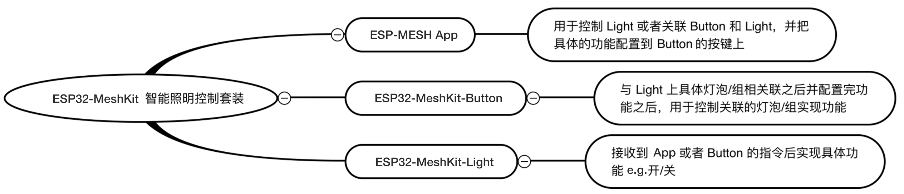
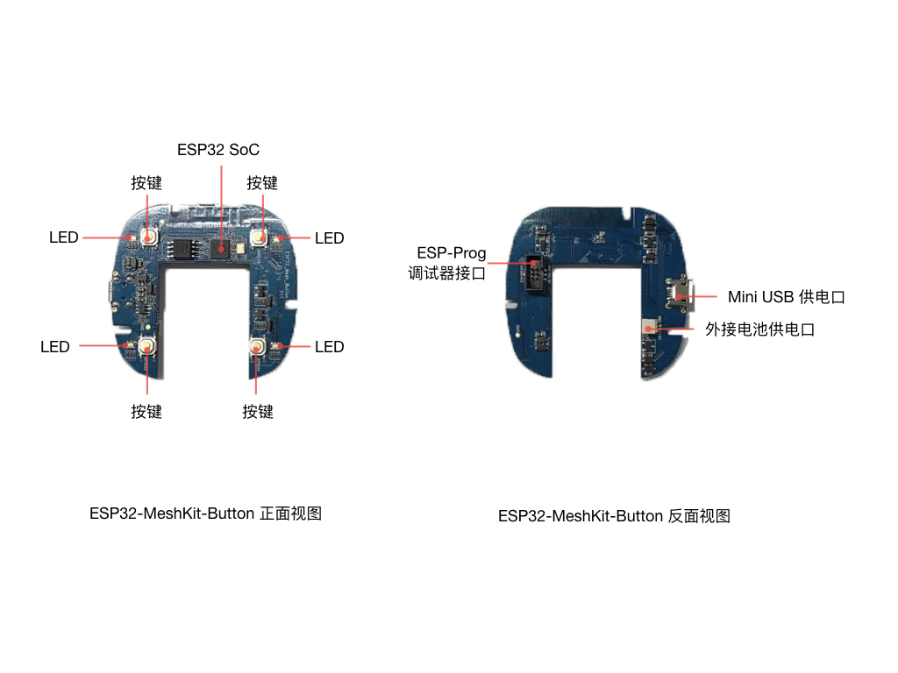
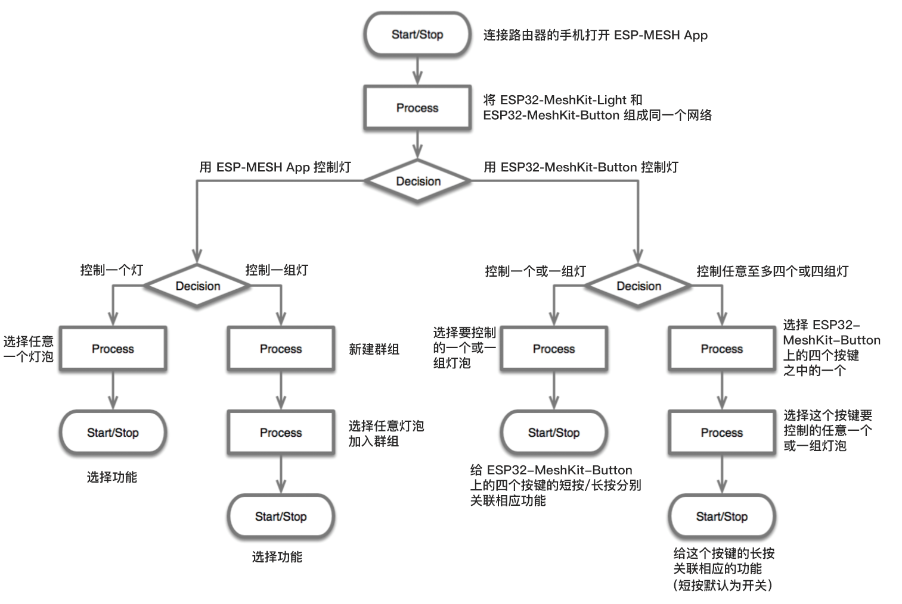
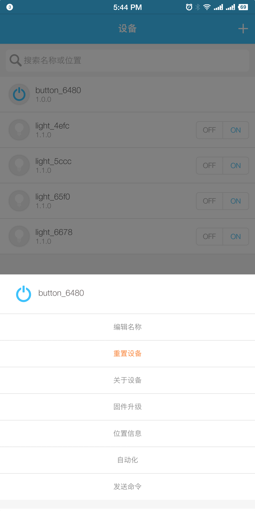
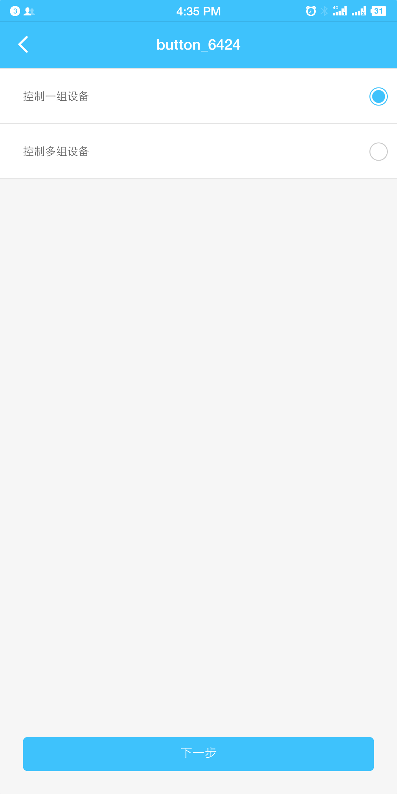
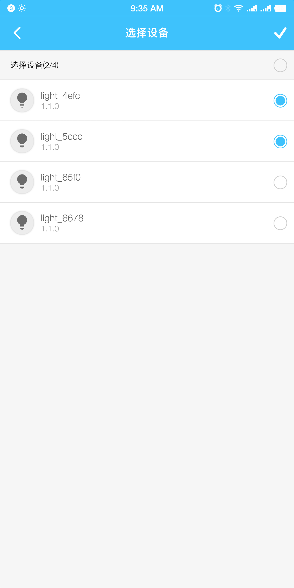

[[EN]](./README.md)

# ESP32-MeshKit-Button

## 概述

ESP32-MeshKit-Button 是基于 [ESP-MESH](https://docs.espressif.com/projects/esp-idf/en/latest/api-guides/mesh.html) 的智能开关，包含配网、升级和设备联动等功能，它将帮助您更好地了解 ESP-MESH 在超低功耗场景下的使用情况。ESP32-MeshKit-Button 仅作为子节点连入 ESP-MESH，因此需要配合 [ESP32-MeshKit-Light](https://www.espressif.com/sites/default/files/documentation/esp32-meshkit-light_user_guide_cn.pdf) 使用。在运行本示例之前请先详细阅读 [ESP32-MeshKit 指南](../README_cn.md)。

<div align=center>

<p> 模块设计 </p>
</div>

## 硬件说明

ESP32-MeshKit-Button 开发板硬件资源主要包括：

* **主控单元**：ESP32 SoC
* **供电单元**：Mini USB 供电口和外接电池供电口
* **调试单元**：ESP-Prog 调试器接口
* **控制单元**：4 个按键
* **显示单元**：4 个 RGB LED

<div align=center>

</div>

建立 ESP-MESH 网络，您需要：

| 硬件 | 数量 |
| -------- | -------- |
| [ESP32-MeshKit-Button 开发板](docs/ESP32-MeshKit-Button_Schematic.pdf) | 1 |
| [ESP32-MeshKit-Light](https://www.espressif.com/sites/default/files/documentation/esp32-meshkit-light_user_guide_cn.pdf)| 至少 1 个 |
| [ESP-Prog 调试器](https://github.com/espressif/esp-iot-solution/blob/master/documents/evaluation_boards/ESP-Prog_guide_cn.md)（调试用，非必须） | 1 |
| 200 mAh 锂电池（可通过 Mini USB 供电，非必须）| 1 |

<div align=center>

<p> 设备交互 </p>
</div>

## 配网

### 1. 准备

由于 ESP32-MeshKit-Button 不可作为根节点，需要配合使用 ESP32-MeshKit-Light 加入 ESP-MESH 网络，请确保 Mesh 网络中至少有一个 ESP32-MeshKit-Light 设备。在使用 ESP32-MeshKit-Button 之前，先启动 ESP32-MeshKit-Light，并完成配网组网。 

更多建立 ESP-MESH 网络详情，请参照 [ESP32-MeshKit 指南](../README_cn.md)。

<div align=center>

<p> 操作流程 </p>
</div>

### 2. 操作流程

* 将 ESP32-MeshKit-Button 连接 Mini USB，LED 黄色闪烁，表明设备已进入配网状态。若设备需要重新配网，同时长按任意两个键 5 秒将重置设备；

* 根据 ESP-MESH App 提示，点击`加入网络`将设备添加到 Mesh 网络；

* 配网完成后，ESP32-MeshKit-Button 出现在已添加设备列表中，其 LED 将停止闪烁（由黄色闪烁变为黄色常亮），等待与 ESP32-MeshKit-Light 关联。

> 注：
> 1. ESP32-MeshKit-Button 仅作为子节点，必须配合其他 ESP32-MeshKit 设备进行使用；
> 2. ESP32-MeshKit-Button 需要通过添加设备的方法加入配网，不支持单独配网。

<table>
    <tr>
        <td ><p align=center>加入网络</p></td>
        <td ><p align=center>配网成功</p></td>
    </tr>
</table>

### 3. 关联

* 添加设备配⽹成功后，在 ESP-MESH App 中打开已添加设备列表，长按 ESP32-MeshKit-Button 设备；

* 在弹出框中选择 `自动化`，然后选择关联的方式及设备，点击右上角的 `√`；

* 通过拖放的方式为每一个按键绑定关联的事件，点击右上角的 `√` 完成关联。设备端的 LED 将显示充电的状态（由黄色变成蓝色或蓝色闪烁）。

<table>
    <tr>
        <td ><p align=center>选择自动化</p></td>
        <td ><p align=center>选择关联的方式</p></td>
        <td ><p align=center>选择关联的设备</p></td>
        <td ><p align=center>绑定关联的事件</p></td>
    </tr>
</table>

请点击[此处](http://demo.iot.espressif.cn:8887/cmp/demo/ESP32-MeshKit-Button_Demo.mp4)观看 ESP32-MeshKit-Button 演示视频。

### 4. USB 连接

* ESP32-MeshKit-Button 若连接 Mini USB，当按键触发时处于 **ESP-MESH 模式**。在此模式下，可以对设备进行配网、绑定、升级和控制。

* ESP32-MeshKit-Button 若未连接 Mini USB 而使用电池供电时，设备处于 **ESP-NOW 模式**。在此模式下，ESP32 芯片会断开电源，仅在按下按键时重新启动，芯片发送完控制指令后立即断开电源。

### 5. LED 指示灯

| 指示灯颜色 | USB 接口 | 状态 |
| --------- | -------- | ------ |
| 黄色（慢闪）| 已连接 | 进入配网模式，未组网 |
| 黄色（快闪）| 已连接 | 已配置，正在组网 |
| 黄色（常亮）| 已连接 | 已组网但未绑定 |
| 蓝色（闪烁）| 已连接 | 已组网且已绑定，正在充电 |
| 蓝色（常亮）| 已连接 | 已组网且已绑定，充电完成 |
| 红色（闪烁）| 已连接 | 已组网且已绑定，电量不足 |
| 熄灭 | 未连接 | 进入省电模式，按键可正常工作 |
| 绿色（按下任意按键） | 已连接/未连接 | 按键被触发，设备已配置 |
| 黄色（闪烁一次）| 已连接 | 按键被触发，设备未配置 |
| 从绿色变成黄色 | 未连接 | 按键被触发，设备已配置，但未绑定 |
| 从绿色变为黄色闪烁 | 已连接 | 按键被触发，设备未配置，且未绑定 |

## 功能简介

ESP32-MeshKit-Button 上的按键有两种操作⽅式：短按和⻓按。

短按

|功能 | 应用场景 | 
|---|---|
| 开/关 | 打开/关闭关联的 ESP32-MeshKit-Light。 | 
| 亮度调节 | 随着短按次数增加，灯泡亮度数值依次递增。调节到最大数值后，短按即回到初始数值，依次往复。|
| 色温调节 | 随着短按次数增加，灯泡色温数值依次递增。调节到最大数值后，短按即回到初始数值，依次往复。|
| 色调调节 | 随着短按次数增加，灯泡色调不断变化，调节完所有色调后，短按即回到初始色调，依次往复。| 
| 明亮模式 | 灯泡进入明亮模式，发出明亮通透的白光 (H/S/V: 0/0/100)。|
| 阅读模式 | 灯泡进入阅读模式，发出柔和、适合阅读的光 (H/S/V: 216/10/100)。|
| 温馨模式 | 灯泡进入温馨模式，发出温馨、淡黄色光 (H/S/V: 60/10.2/100)。|
| 就寝模式 | 灯泡进入就寝模式，发出色温较暖的黄色光 (H/S/V: 28/63/100)。|

长按

| 功能 | 应用场景 | 
| -------- | ----------- |
| 亮度 | 为一对按键绑定亮度事件，长按逐渐增加/降低亮度。 |
| 色温 | 为一对按键绑定色温事件，长按逐渐升高/降低色温。 |
| 色调 | 为一对按键绑定色调事件，长按实现前后色调的转换。 |

## 功耗及时间

ESP32-MeshKit-Button 是针对超低功耗的按键方案，设备从断电到完成发包需要 1200 ms 左右的时间。下表列出了 ESP32-MeshKit-Button 在各个运行阶段的电流和时间，电流值为电源供电处 “DCVCC-SUFVCC” 的电流。

| 运行阶段 | 电流 | 时间 |
|---|---|---|
| ESP32 芯片断电 | 0.1 uA | 使用电池供电，按键未触发时长 |
| 唤醒后的启动过程 | 40 mA | 800 ms |
| 初始化及 ESP-NOW 发包控制 | 60 mA | 400 ms |

根据上述表格，单次按键触发耗电量为 56 mAs (40 mA x 800 ms + 60 mA x 400 ms = 56 mAs)，且考虑到芯片断电时硬件电路也有耗电，因而 200 mAh 的电源可以支持约 10,000 次控制（200 mAh x 3600 / 56 mAs ≈ 12800 - 芯片断电时硬件电路耗电量）。

> 注：以下方面同样体现出功耗优势
> 1. 数据传输：ESP32-MeshKit-Button 作为 ESP-MESH 子节点设备，从启动到组网成功需要的时间大约为 500 ms 左右，因为设备在配置完成后，使用 ESP-NOW 进行数据传输，而 ESP-NOW 是基于数据链路层的无连接协议，所以省去设备连接的时间；
> 2. 检测时间：在 `bootloader` 增加了按键检测，无需等待芯片完全启动；
> 3. `bootloader` 启动时间：清除 `bootloader` 日志，减少 `bootloader` 的启动时间。

## 唤醒按键检测

ESP32-MeshKit-Button 使用外接电池供电的情况下，由于 ESP32 芯片断电到唤醒后的启动过程需要 800 ms，如果在芯片完全启动后再检测按键触发，将无法获取短按的操作，因此需要在 `bootloader` 中加入按键检测。

您需要在 `esp-idf/components/bootloader/subproject/main/bootloader_start.c` 文件中加入下列检测代码，并在 `call_start_cpu0()` 函数中调用硬件初始化函数 `bootloader_init()` 之后用调用 `button_bootloader_trigger()`。

```c
#include "soc/gpio_periph.h"

void button_bootloader_trigger()
{
#define RTC_SLOW_MEM ((uint32_t*) (0x50000000))       /*!< RTC slow memory, 8k size */
#define BUTTON_GPIO_LED_BLUE (14)
#define BUTTON_GPIO_KEY0     (39)
#define BUTTON_GPIO_KEY1     (34)
#define BUTTON_GPIO_KEY2     (32)
#define BUTTON_GPIO_KEY3     (35)
#define BUTTON_KEY_NUM       (4)

    typedef struct {
        uint32_t gpio_num;
        uint32_t status;
        bool push;
        bool release;
        int backup_tickcount;
    } button_key_t;

    bool key_press_flag = false;
    button_key_t button_key[BUTTON_KEY_NUM] = {
        {.gpio_num = BUTTON_GPIO_KEY0},
        {.gpio_num = BUTTON_GPIO_KEY1},
        {.gpio_num = BUTTON_GPIO_KEY2},
        {.gpio_num = BUTTON_GPIO_KEY3},
    };

    for (int i = 0; i < BUTTON_KEY_NUM; ++i) {
        gpio_pad_select_gpio(button_key[i].gpio_num);
        PIN_INPUT_ENABLE(GPIO_PIN_MUX_REG[button_key[i].gpio_num]);
    }

    uint32_t tm_start = esp_log_early_timestamp();

    do {
        for (int i = 0; !key_press_flag && i < BUTTON_KEY_NUM; ++i) {
            if (GPIO_INPUT_GET(button_key[i].gpio_num)) {
                ets_delay_us(10 * 1000);
            }

            button_key[i].push = GPIO_INPUT_GET(button_key[i].gpio_num);
            key_press_flag |= button_key[i].push;
            ESP_LOGI(TAG, "gpio_num: %d, level: %d", button_key[i].gpio_num, button_key[i].push);
        }
    } while (!key_press_flag && 30 > (esp_log_early_timestamp() - tm_start));

    if (key_press_flag) {
        gpio_pad_select_gpio(BUTTON_GPIO_LED_BLUE);
        GPIO_OUTPUT_SET(BUTTON_GPIO_LED_BLUE, 1);
        ESP_LOGI(TAG, "There is a button pressed");
    }

    memcpy(RTC_SLOW_MEM, button_key, sizeof(button_key_t) * BUTTON_KEY_NUM);
}
```