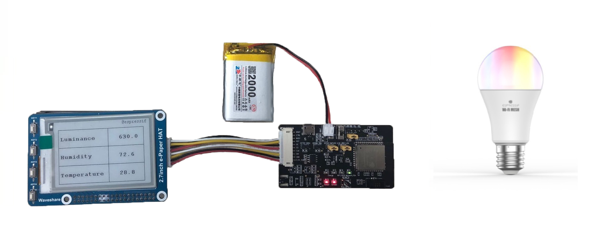
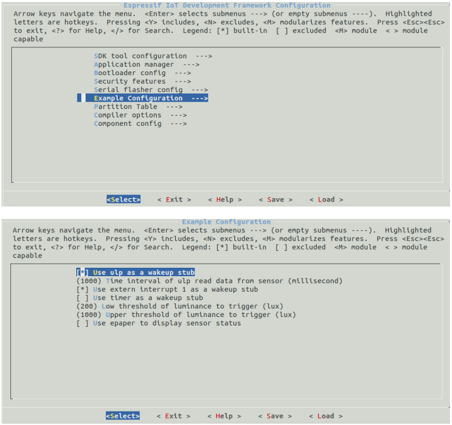
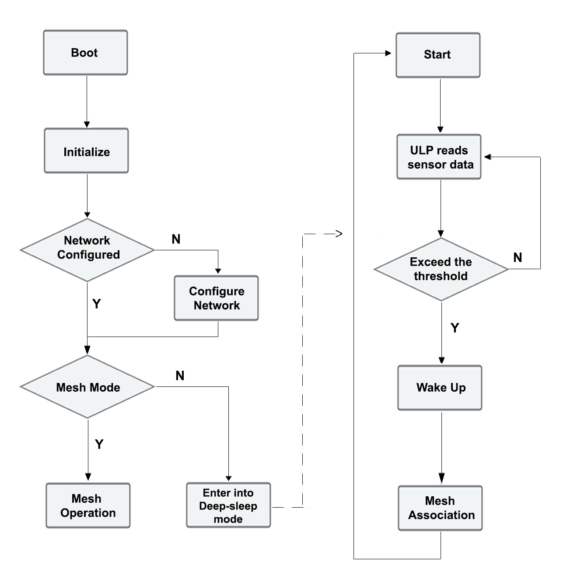

# ESP32-MeshKit-Sense 示例说明

本文以 ESP32-MeshKit-Sense（[ESP-MDF](https://github.com/espressif/esp-mdf/blob/master/README_cn.md) 设备类型）为例，在 [ESP-MESH](https://docs.espressif.com/projects/esp-idf/en/latest/api-guides/mesh.html) 网络构建和通信的基础上，实现了 Mesh 网络内不同设备之间的联动控制功能，以及 Deep-sleep 低功耗方案。

## 1. 概述

[ESP32-MeshKit-Sense 开发板](https://github.com/espressif/esp-iot-solution/blob/master/documents/evaluation_boards/ESP32-MeshKit-Sense_guide_cn.md)集成了温湿度传感器 (HTS221)、光照强度传感器 (BH1750) 和状态指示灯外设。在本示例中，ESP32-MeshKit-Sense 通过检测外设传感器的状态变化，实现与其他设备的联动控制。同时，本示例还结合了 ESP32 在 Deep-sleep 模式下能够使用 ULP (Ultra Low Power) 协处理器读取传感器的功能，实现低功耗传感器方案。

> 关于 ESP32-MeshKit-Sense 与其他设备的联动控制，目前只支持根据光照强度传感器的数值，控制
 [ESP32-MeshKit-Light](https://www.espressif.com/sites/default/files/documentation/esp32-meshkit-light_user_guide_cn.pdf) 的开关，后续会增加通过检测温湿度传感器的数值，控制更多其他类型设备。

在进行 ESP32-MeshKit-Sense 开发之前，请详细阅读 [ESP-MDF 入门指南](https://github.com/espressif/esp-mdf/blob/master/docs/zh_CN/get-started/get_started_cn.md)，完成[代码获取](https://github.com/espressif/esp-mdf/blob/master/docs/zh_CN/get-started/get_started_cn.md#%E8%8E%B7%E5%8F%96-esp-mdf)，[编译工具链](https://github.com/espressif/esp-mdf/blob/master/docs/zh_CN/get-started/get_started_cn.md#%E8%AE%BE%E7%BD%AE-esp-%E5%B7%A5%E5%85%B7%E9%93%BE)安装，[ESP-MDF 路径设置](https://github.com/espressif/esp-mdf/blob/master/docs/zh_CN/get-started/get_started_cn.md#%E8%AE%BE%E7%BD%AE-esp-mdf-%E8%B7%AF%E5%BE%84)等工作。

## 2. 准备

### 2.1 硬件准备

* [ESP32-MeshKit-Sense 开发板](https://github.com/espressif/esp-iot-solution/blob/master/documents/evaluation_boards/ESP32-MeshKit-Sense_guide_cn.md)一个
* [ESP32-MeshKit-Light](https://www.espressif.com/sites/default/files/documentation/esp32-meshkit-light_user_guide_cn.pdf) 一个或数个
* [ESP-Prog 调试器](https://github.com/espressif/esp-iot-solution/blob/master/documents/evaluation_boards/ESP-Prog_guide_cn.md)（调试用，非必须）
* 墨水屏（非必须）
* 锂电池（可通过 Mini USB 供电，非必须）

<div align=center>

</div>

其中，ESP32-MeshKit-Sense 开发板硬件资源主要包括：

* 主控单元：ESP32 模组
* 供电单元：Mini USB 供电口和外接电池供电口
* 调试单元：ESP-Prog 调试器接口
* 显示单元：显示屏接口和 LED 指示灯
* 传感器单元：温湿度传感器 (HTS221) 和光照强度传感器 (BH1750)

<div align=center>

</div>
开发板上有 5 处跳线，其功能和接法如下：  

| 跳线位置        | 功能                                                         | 接法                         |
| --------------- | ------------------------------------------------------------ | ---------------------------- |
| EXT5V-CH5V      | USB 输入的 5 V 与充电管理芯片的输入之间的连接，连接后才可使用电池充电功能 | 仅充电时接上               |
| CHVBA-VBA       | 充电管理芯片的输出和电池正极之间的连接，连接后才可使用电池充电功能 | 仅充电时接上               |
| DCVCC-SUFVCC    | 供电电源与 DC-DC 的输入之间的连接，可测量整个板子工作时的总电流 | USB 和电池供电时都要接上 |
| 3.3V-PER_3.3V   | 总路 3.3 V 与所有外设供电的连接，可测量外设工作时的电流       | 需要使用外设时接上         |
| 3.3V-3.3V_ESP32 | 总路 3.3 V 与模组供电的连接，可测量模组部分（包含 Reset Protect 芯片和模组）工作时的电流 | 需要使用模组时接上         |

LED 指示灯共有 6 个，其功能和指示的状态如下：

| 指示灯                  | 功能                           | 状态指示                                                     |
| ----------------------- | ------------------------------ | ------------------------------------------------------------ |
| Charge 指示灯（双色灯） | 指示充电状态                   | 红色表示正在充电；绿色表示充电完成                           |
| BAT 指示灯（双色灯）    | 指示电量                       | 红色表示电量低；绿色表示电量充足                             |
| WiFi 指示灯             | 指示 WiFi 连接状态              | 慢闪表示处于配网状态；快闪表示处于组网状态；常亮表示组网成功                                           |
| Network 指示灯          | 指示网络连接状态       | 暂不适用于本示例 |
| Sensor 指示灯           | 指示传感器是否处于工作状态 | 亮起表示正在工作，不亮表示处于掉电模式                       |
| Screen 指示灯           | 指示显示屏是否处于工作状态 | 亮起表示正在工作，不亮表示处于掉电模式                       |

### 2.2 配置 ULP 编译环境

关于 ESP32 的 ULP 协处理器简介和汇编编译环境设置，请参照[乐鑫官方 GitHub 文档](https://github.com/espressif/esp-iot-solution/blob/master/documents/low_power_solution/esp32_ulp_co-processor_and_assembly_environment_setup_cn.md)。

### 2.3 示例配置

当硬件准备和编译环境配置完成后，可通过命令 `make menuconfig` 进行示例配置：

<div align=center>

<p> ESP32 Configurations </p>
</div>


本 ESP32-MeshKit-Sense 示例可配置的参数包括：Deep-sleep 唤醒源、光照强度阈值以及墨水屏使能。

* **Deep-sleep 唤醒源**

	* **ULP 唤醒**

		如果 ULP 读取传感器的值满足唤醒条件，则将主 CPU 唤醒。
	
		> 如果设置了 ULP 唤醒，则需要继续配置以下参数
        >* **ULP 采集数据间隔**：在低功耗工作模式下，ULP 每隔设置的时间间隔采集一次传感器数据；
        >* **光照强度阈值下限**：当环境光照强度低于阈值下限时，将主 CPU 唤醒；
        >* **光照强度阈值上限**：当环境光照强度高于阈值上限时，将主 CPU 唤醒。
    
	* **GPIO 唤醒**
		
		通过 WakeUp 按键 (GPIO34) 将主 CPU 唤醒，之后设备将一直保持在 Mesh 工作模式。
	
	* **Timer 唤醒**
	
		设置定时器，定时将主 CPU 唤醒（默认关闭）。
		
    	> 如果设置了 Timer 唤醒，需要进一步设置唤醒的间隔，即每隔多久（单位毫秒）唤醒设备。

* **墨水屏使能**：使能墨水屏后，墨水屏将会显示醒来后 ULP 读取到的最新一组数值。

## 3. 示例运行

通过以下命令进行代码烧录，并启动日志监视程序：`make erase_flash flash monitor -j5`。

如果上述过程没有错误，则 ESP32-MeshKit-Sense 开发板上的 Sensor 指示灯红色常亮，表示设备正常上电运行。WiFi 指示灯绿色慢闪，表示设备处于**配网模式**。下一步需要使用 [ESP-MESH App for Android](https://www.espressif.com/zh-hans/support/download/apps?keys=&field_technology_tid%5B%5D=18) 进行配网操作，详情请参见[配网操作指导视频](https://player.youku.com/embed/XMzc1ODE4MDYwOA==)。

```
I (383) wifi: wifi driver task: 3ffce9d8, prio:23, stack:3584, core=0
I (384) wifi: wifi firmware version: 328353e
I (384) wifi: config NVS flash: enabled
I (386) wifi: config nano formating: disabled
I (390) system_api: Base MAC address is not set, read default base MAC address from BLK0 of EFUSE
I (400) system_api: Base MAC address is not set, read default base MAC address from BLK0 of EFUSE
I (418) wifi: Init dynamic tx buffer num: 32
I (418) wifi: Init data frame dynamic rx buffer num: 32
I (418) wifi: Init management frame dynamic rx buffer num: 32
I (424) wifi: Init static rx buffer size: 1600
I (428) wifi: Init static rx buffer num: 10
I (432) wifi: Init dynamic rx buffer num: 32
I (437) wifi: Set ps type: 0

I (503) phy: phy_version: 4000, b6198fa, Sep  3 2018, 15:11:06, 0, 0
I (504) wifi: mode : sta (24:0a:c4:1c:cc:94)
I (506) ESPNOW: espnow [version: 1.0] init
I (507) [sense_main, 222]: not a deep sleep reset
I (512) gpio: GPIO[27]| InputEn: 0| OutputEn: 1| OpenDrain: 0| Pullup: 0| Pulldown: 0| Intr:0 
I (625) gpio: GPIO[4]| InputEn: 0| OutputEn: 1| OpenDrain: 0| Pullup: 0| Pulldown: 0| Intr:0 
I (626) gpio: GPIO[15]| InputEn: 0| OutputEn: 1| OpenDrain: 0| Pullup: 0| Pulldown: 0| Intr:0 
I (633) LED_CPP: setup led

I (637) gpio: GPIO[34]| InputEn: 1| OutputEn: 0| OpenDrain: 0| Pullup: 1| Pulldown: 0| Intr:3 
I (647) [sense_main, 509]: event_loop_cb, event: 0x2101
I (1294) [mconfig_chain, 348]: Generate RSA public and private keys
I (1294) wifi: ic_enable_sniffer
I (1295) [sense_main, 302]: BLE name: sense_cc94
I (1298) [sense_main, 509]: event_loop_cb, event: 0x2200
I (2314) BTDM_INIT: BT controller compile version [97a362b]
I (2315) system_api: Base MAC address is not set, read default base MAC address from BLK0 of EFUSE
I (2628) [mconfig_blufi, 514]: BLUFI init finish, set ble advertising data
I (2629) system_api: Base MAC address is not set, read default base MAC address from BLK0 of EFUSE
I (2638) [mconfig_blufi, 805]: start ble advertising
```

### 3.1 示例工作模式

在本示例中，ESP32-MeshKit-Sense 具有两种工作模式：Mesh 工作模式和低功耗工作模式。初次上电，默认直接进入配网模式，组网成功后会默认进入低功耗模式。

#### 3.1.1 Mesh 工作模式

ESP32-MeshKit-Sense 在 Mesh 工作模式时，即是一个普通的 Mesh 设备，具有 ESP-MDF 提供的各种功能，包括组网、控制、升级等。

#### 3.1.2 低功耗工作模式

对于传感器设备，由于安装环境的限制（一般为建筑物角落，工业现场等环境），难以采用线缆供电，多采用电池供电，加之一次安装后需要能够长时间工作，因此传感器设备对功耗有很高的要求。针对这类应用场景，ESP-MDF 提供了低功耗传感器的使用例程。具体功耗情况，可参考 [ESP32 低功耗方案概述](https://github.com/espressif/esp-iot-solution/blob/master/documents/low_power_solution/esp32_lowpower_solution_cn.md)。

在低功耗工作模式下，主 CPU 关闭，系统以极低的功耗运行，同时 ULP 定期获取传感器数据。ULP 在每次获取到传感器数据之后会与设定的光照强度阈值进行比较，当光照强度高于设置的阈值上限，或低于设置的阈值下限时将会唤醒主 CPU 并进入 Mesh 工作模式，并根据当前的环境触发联动操作，联动操作完成后继续进入低功耗模式。

#### 3.1.3 工作模式切换操作

ESP32-MeshKit-Sense 通过 WakeUp 按键 (GPIO34) 进行 Mesh 工作模式和低功耗工作模式之间的切换。

WakeUp 按键定义了如下操作：

- 在睡眠模式下，按一下唤醒主 CPU，唤醒后进入正常工作模式

- 在正常工作模式下

    - 按一下进入 Deep-sleep 模式
    
    - 长按 3 s 将设备配置信息清除，并重启进入配网模式

### 3.2 示例操作流程

<div align=center>

<p> ESP32-MeshKit-Sense Workflow </p>
</div>

以下就上图中的几个部分进行简要说明：

1. 左侧为程序运行的大致流程，右侧为进入低功耗模式后的运行流程。

2. 网络配置过程包含以下 3 个步骤：

   * 初次上电或者配置信息已清除，ESP32-MeshKit-Sense 中无配网信息，WiFi 指示灯慢闪，表明设备已进入**配网状态**；

   * 使用 ESP32-MESH App（[iOS版](https://itunes.apple.com/cn/app/esp-mesh/id1420425921?mt=8) 和 [安卓版](https://github.com/EspressifApp/Esp32MeshForAndroid/raw/master/release/mesh.apk)）进行配网，此时 WiFi 指示灯快闪，表明设备已进入**组网状态**；

   * 配网成功后，WiFi 指示灯常亮，表示设备**组网成功**，此时设备处于 Mesh 工作模式。

3. ULP 会周期性醒来读取传感器数值，此时 Sensor 指示灯会周期性闪烁，Sensor 亮起时表示 ULP 正在读取传感器数值，熄灭时表示 ULP 进入睡眠状态。

4. 在低功耗模式下，主 CPU 被唤醒后会将设备接入到 Mesh 网络中，并触发联动操作，操作完成后再次进入 Deep-sleep 模式。

关于本地联动控制功能的使用，需要按照以下步骤进行设置：

1. 将 ESP32-MeshKit-Sense 和 ESP32-MeshKit-Light 配置成同一个 Mesh 网络；

2. 使用 ESP32-MESH App 将两种设备进行关联，此时，

    * 若环境亮度低于设定的阈值下限，ESP32-MeshKit-Sense 将控制 ESP32-MeshKit-Light 打开；
    
    * 若环境亮度高于设定的阈值上限，ESP32-MeshKit-Sense 将控制 ESP32-MeshKit-Light 关闭。
    
3. 按下 ESP32-MeshKit-Sense 上的 WakeUp 按键，ESP32-MeshKit-Sense 开发板上将只有 Sensor 指示灯闪烁，说明 ESP32-MeshKit-Sense 已进入低功耗工作模式，此时 ULP 正在运行并定时（默认 500 毫秒，可配置）读取传感器数值。

    * 使用遮挡物将光照强度传感器挡住，此时 ESP32-MeshKit-Sense 将会被唤醒，并控制 ESP32-MeshKit-Light 打开，一段时间后再次进入低功耗工作模式；
   
    * 使用强光照射光照强度传感器，此时 ESP32-MeshKit-Sense 将会被唤醒，并控制 ESP32-MeshKit-Light 关闭，一段时间后再次进入低功耗工作模式。

## 4. ULP 相关操作

### 4.1 设置唤醒触发条件

`meshkit_sense/sense_driver/ulp_operation` 目录下存有设定相应触发条件的接口函数：

* set_ulp_hts221_humidity_threshold(...); // 设定湿度传感器触发 ESP32-MeshKit-Sense 唤醒的阈值，包括最大值、最小值和变化量

* set_ulp_hts221_temperature_threshold(...); // 设定温度传感器触发 ESP32-MeshKit-Sense 唤醒的阈值，包括最大值、最小值和变化量

* set_ulp_bh1750_luminance_threshold(...); // 设定光照强度传感器触发 ESP32-MeshKit-Sense 唤醒的阈值，包括最大值、最小值和变化量

> 注：根据变化量进行唤醒指以 ESP32-MeshKit-Sense 进入 Deep-sleep 模式时读取的传感器值作为初始值，在 ESP32-MeshKit-Sense 进入 Deep-sleep 模式后，将 ULP 读取的对应的传感器值与初始值之间做差值运算，若结果大于设定变化量时，就会触发 ESP32-MeshKit-Sense 唤醒。例如：将变化量设定为 100，在进入 Deep-sleep 模式时传感器的数值为 400，当 ULP 读取到的对应传感器的值小于 300 或者大于 500 就会进行唤醒 ESP32-MeshKit-Sense。

### 4.2 获取 ULP 读到的数据

ESP32-MeshKit-Sense 被唤醒之后，可以使用以下三个接口函数获取在 Deep-sleep 模式下 ULP 读取的最新数值：

* get_ulp_bh1750_luminance(...); // 获取湿度值

* get_ulp_hts221_temperature(...); // 获取温度值

* get_ulp_hts221_humidity(...); // 获取亮度值

## 5. 功耗说明

ESP32-MeshKit-Sense 主打的是低功耗传感器方案，所以在功耗上进行了严格的设计，下表列出了本示例在各个运行阶段的电流和时间，电流值为电源供电处 “DCVCC-SUFVCC” 的电流。

| 运行阶段 | 电流 | 时间 |
|---|---|---|
| Deep-sleep 模式下 ULP 睡眠 | 21 uA | 自定义（默认值为 1000 ms） |
| Deep-sleep 模式下 ULP 读取传感器数据 | 3.4 mA | 150 ms |
| 唤醒后的启动过程 | 40 mA | 1000 ms |
| 正常运行 | 100 mA | < 3000 ms |

在 ULP 睡眠的模式下，功耗非常低，处于这个模式的时间越长，则平均功耗就会越低，但对环境参数的检测时间间隔就会越长，灵敏度也就越低，所以用户可以根据实际的使用环境和要求设置一个合理的时间。

## 6. 相关资源

* [Deep Sleep Wake Stubs 介绍](https://esp-idf.readthedocs.io/zh_CN/latest/api-guides/deep-sleep-stub.html)
* [ESP32-MeshKit-Sense 硬件设计指南](https://github.com/espressif/esp-iot-solution/blob/master/documents/evaluation_boards/ESP32-MeshKit-Sense_guide_cn.md)
* [ESP32-MeshKit-Light 用户指南](https://www.espressif.com/sites/default/files/documentation/esp32-meshkit-light_user_guide_cn.pdf)
* [ESP-Prog 下载与调试板介绍](https://github.com/espressif/esp-iot-solution/blob/master/documents/evaluation_boards/ESP-Prog_guide_cn.md)
* [ESP32 的 ULP 协处理器简介和汇编编译环境设置](https://github.com/espressif/esp-iot-solution/blob/master/documents/low_power_solution/esp32_ulp_co-processor_and_assembly_environment_setup_cn.md)
* [ESP32 低功耗方案概述](https://github.com/espressif/esp-iot-solution/blob/master/documents/low_power_solution/esp32_lowpower_solution_cn.md)