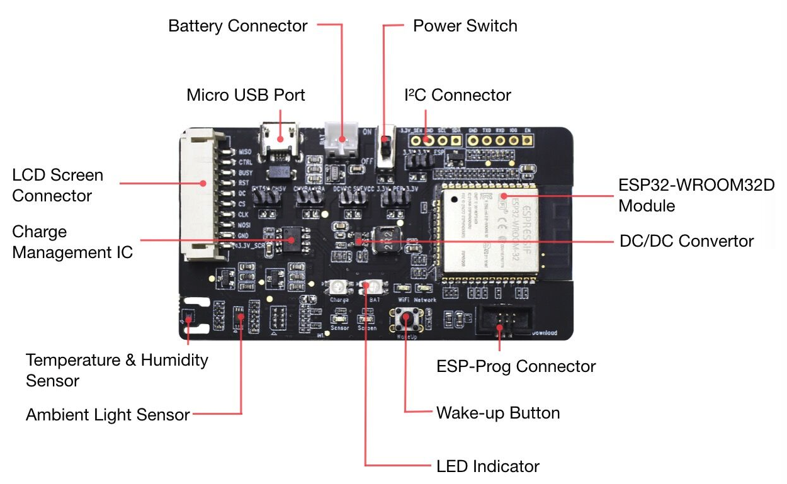

[[EN]](./README.md)

# ESP32-MeshKit-Sense 示例说明

本示例旨在：

 * 演示 ESP32-MeshKit-Sense 如何通过读取传感器数值，检测外设传感器的状态变化，实现与 [ESP32-MeshKit-Light](https://www.espressif.com/sites/default/files/documentation/esp32-meshkit-light_user_guide_cn.pdf) 之间的联动控制，以及；
 
 * 结合 ESP32 在 Deep-sleep 模式下能够使用 ULP (Ultra Low Power) 协处理器读取传感器的功能，实现低功耗传感器方案。

> 关于 ESP32-MeshKit-Sense 与其他设备的联动控制，目前只支持根据光照强度传感器的数值，控制
 ESP32-MeshKit-Light 的开关，后续会增加通过检测温湿度传感器的数值，控制更多其他类型设备。

## 1. 概述

[ESP32-MeshKit-Sense](https://github.com/espressif/esp-iot-solution/blob/master/documents/evaluation_boards/ESP32-MeshKit-Sense_guide_cn.md) 开发板集成了温湿度传感器 (HTS221)、光照强度传感器 (BH1750) 和状态指示灯外设。

作为传感器设备，ESP32-MeshKit-Sense 功耗极低，特别适合建筑物角落、工业现场等安装环境受限的情况。此类环境难以采用线缆供电，所以多采用电池进行长时间供电。

ESP32-MeshKit-Sense 与其它硬件设备共同组成了基于 [ESP-WIFI-MESH](https://docs.espressif.com/projects/esp-idf/zh_CN/stable/api-guides/mesh.html) 网络协议的 [ESP32-MeshKit](https://docs.espressif.com/projects/esp-mdf/zh_CN/latest/hw-reference/esp32-meshkit.html) 智能家居组网方案。

简言之，ESP-WIFI-MESH 是一种基于 Wi-Fi 协议构建的网络协议，专为 ESP32 芯片研发而成，集 Wi-Fi 和蓝牙两大技术优势，提供了如何运用同一组网设备建立无线网络的创新解决方案。

[ESP-MDF](https://github.com/espressif/esp-mdf/blob/master/README_cn.md) (Espressif Mesh Development Framework) 是基于 ESP32 芯片的 ESP-WIFI-MESH 开发框架，为 ESP32-MeshKit-Sense 提供了低功耗传感器的使用例程。

更多乐鑫低功耗方案详情，可参考 [ESP32 低功耗方案概述](https://github.com/espressif/esp-iot-solution/blob/master/documents/low_power_solution/esp32_lowpower_solution_cn.md)。

## 2. 准备

### 2.1 硬件准备

* [ESP32-MeshKit-Sense](https://github.com/espressif/esp-iot-solution/blob/master/documents/evaluation_boards/ESP32-MeshKit-Sense_guide_cn.md) 开发板一个
* [ESP32-MeshKit-Light](https://www.espressif.com/sites/default/files/documentation/esp32-meshkit-light_user_guide_cn.pdf) 一个或数个
* [ESP-Prog 调试器](https://github.com/espressif/esp-iot-solution/blob/master/documents/evaluation_boards/ESP-Prog_guide_cn.md)（调试用，非必须）
* 墨水屏（非必须）
* 锂电池（可通过 Mini USB 供电，非必须）

其中，ESP32-MeshKit-Sense 开发板硬件资源主要包括：

* **主控单元**：ESP32 模组
* **供电单元**：
	* Mini USB 供电口
	* 外接电池供电口
* **调试单元**：ESP-Prog 调试器接口
* **显示单元**：
	* 显示屏接口
	* LED 指示灯
* **传感器单元**：
	* 温湿度传感器 (HTS221) 
	* 光照强度传感器 (BH1750)

ESP32-MeshKit-Sense 开发板上有 5 处跳线，其功能和接法如下：  

| 跳线位置   | 连接 | 功能 | 接法 |
|------------|--------|----------|-----------|
| EXT5V-CH5V  | USB 输入的 5 V 与充电管理芯片的输入之间的连接 | 连接后才可使用电池充电功能 | 仅充电时接上    |
| CHVBA-VBA   | 充电管理芯片的输出和电池正极之间的连接 | 连接后才可使用电池充电功能 | 仅充电时接上    |
| DCVCC-SUFVCC    | 供电电源与 DC-DC 的输入之间的连接 | 可测量整个板子工作时的总电流 | USB 和电池供电时都要接上 |
| 3.3V-PER_3.3V   | 总路 3.3 V 与所有外设供电的连接 | 可测量外设工作时的电流       | 需要使用外设时接上         |
| 3.3V-3.3V_ESP32 | 总路 3.3 V 与模组供电的连接 | 可测量模组部分（包含 Reset Protect 芯片和模组）工作时的电流 | 需要使用模组时接上         |

6 个 LED 指示灯，其功能和指示的状态如下：

| 指示灯         | 功能        | 状态指示     |
| --------------| ----------- |-------------|
| Charge 指示灯（双色灯） | 指示充电状态  | 红色表示正在充电；  绿色表示充电完成。 |
| BAT 指示灯（双色灯）    | 指示电量 | 红色表示电量低； 绿色表示电量充足。   |
| WiFi 指示灯 | 指示 WiFi 连接状态 |慢闪表示处于配网状态； 快闪表示处于组网状态； 常亮表示组网成功。|                                  
| Network 指示灯 | 指示网络连接状态 | 暂不适用于本示例 |
| Sensor 指示灯 | 指示传感器是否处于工作状态 | 亮起表示正在工作；  不亮表示处于掉电模式。  |
| Screen 指示灯  | 指示显示屏是否处于工作状态 | 亮起表示正在工作；  不亮表示处于掉电模式。 |

### 2.2 软件

现在，您可以开始搭建编译环境，并配置 ULP 汇编环境，然后进行示例配置。 

1. 搭建编译环境

	请参阅 [ESP-MDF 入门指南](https://docs.espressif.com/projects/esp-mdf/zh_CN/latest/get-started/index.html)完成以下两个步骤：
	* 获取 ESP-MDF
	* 设置 ESP-MDF 路径

2. 配置 ULP 汇编环境

	ULP 协处理器目前只支持汇编开发, 需要配置 ULP 协处理器编译环境, 详见: [ESP32 的 ULP 协处理器简介和汇编编译环境设置](https://github.com/espressif/esp-iot-solution/blob/master/documents/low_power_solution/esp32_ulp_co-processor_and_assembly_environment_setup_cn.md)。

	> **注: 不支持多线程编译, 即不能使用 `make -j`**

3. 示例配置

	拷贝 `development_kit/meshkit_sense` 到 `~/esp` 目录，连接您的板子。

	然后， 进入 `~/esp/development_kit/meshkit_sense`，通过命令 `make menuconfig` 进行示例配置。

 ESP32 配置 

在菜单中，进入 `Example Configuration`，配置以下参数：

* **Deep-sleep 唤醒源**

	* **ULP 唤醒（`ulp 用作唤醒源`）**

		如果 ULP 读取传感器的值满足唤醒条件，则将主 CPU 唤醒。
	
		> 如果设置了 ULP 唤醒，则需要继续配置以下参数：
		>
        >* **ULP 采集数据间隔（`ulp 读取传感器数据的时间间隔`）**：在 Deep-sleep 模式下，ULP 每隔设置的时间间隔采集一次传感器数据；
        >
        >* **光照强度阈值下限（`触发唤醒的光照强度最低阈值`）**：当环境光照强度低于阈值下限时，将主 CPU 唤醒；
        >* **光照强度阈值上限（`触发唤醒的光照强度最高阈值`）**：当环境光照强度高于阈值上限时，将主 CPU 唤醒。
    
	* **GPIO 唤醒（`extern interrupt 1 用作唤醒源`）**
		
		通过 WakeUp 按键 (GPIO34) 将主 CPU 唤醒，之后设备将一直保持在 Mesh 模式。
	
	* **Timer 唤醒（`timer 用作唤醒源`）**
	
		设置定时器，定时将主 CPU 唤醒（默认关闭）。
		
    	> 如果设置了 Timer 唤醒，需要进一步设置**唤醒的间隔（`deepsleep 唤醒间隔`）**，即每隔多久（单位毫秒）唤醒设备。

* **墨水屏使能**：使能墨水屏后，墨水屏将会显示醒来后 ULP 读取到的最新一组数值。

### 2.3 示例运行

通过以下命令进行代码烧录，并启动日志监视程序：`make erase_flash flash monitor -j5`。

如果上述过程没有错误，则 ESP32-MeshKit-Sense 开发板上的 Sensor 指示灯红色常亮，表示设备正常上电运行。WiFi 指示灯绿色慢闪，表示设备处于**配网模式**。

下一步需要使用 ESP-Mesh App（[安卓版](https://www.espressif.com/en/support/download/apps)或 [iOS 版](https://itunes.apple.com/cn/app/esp-mesh/id1420425921?mt=8https://itunes.apple.com/cn/app/esp-mesh/id1420425921?mt=8)）进行配网操作，详情请参见[配网操作指导视频](https://player.youku.com/embed/XMzc1ODE4MDYwOA==)。

### 3. 示例工作模式

在本示例中，ESP32-MeshKit-Sense 具有三种工作模式：

* 配网模式
* Mesh 模式
* Deep-sleep 模式

初次上电，默认直接进入配网模式，组网成功后会默认进入 Mesh 模式，然后快速切换至 Deep-sleep 模式。

#### 3.1 配网模式

初次上电或者配置信息已清除，ESP32-MeshKit-Sense 进入此模式。

#### 3.2 Mesh 模式

ESP32-MeshKit-Sense 加入 ESP-WIFI-MESH 网络后，进入 Mesh 模式，此时即是一个普通的 Mesh 设备，具有 ESP-MDF 提供的各种功能，包括组网、控制、升级等。

#### 3.3 Deep-sleep 模式

ESP32-MeshKit-Sense 在一段时间内无任何操作，便会进入 Deep-sleep 模式。此时，主 CPU 关闭，系统以极低的功耗运行。同时，ULP 定期获取传感器数据，并在每次获取数据后，与设定的数值进行比较。当传感器数据满足唤醒条件时，将唤醒主 CPU，设备进入 Mesh 模式，并根据当前的环境触发联动操作，联动操作完成后继续进入 Deep-sleep 模式。

#### 3.4 模式切换

ESP32-MeshKit-Sense 通过 WakeUp 按键 (GPIO34) 进行模式切换。

WakeUp 按键定义了如下操作：

- **在 Deep-sleep 模式下，按下该按键**：唤醒主 CPU，唤醒后设备进入 Mesh 模式

- 在 Mesh 模式下

    - **再次按下该按键**：设备进入 Deep-sleep 模式
    
    - **长按 3 s**：将设备配置信息清除，并重启进入配网模式

### 4. 示例操作流程

 ESP32-MeshKit-Sense 操作流程 

左侧为程序运行的大致流程，右侧为进入 Deep-sleep 模式后的运行流程。

#### 4.1 配网流程

1. 初次上电或者配置信息已清除，ESP32-MeshKit-Sense 中无配网信息，WiFi 指示灯慢闪，表明设备已进入**配网模式**； 

2. 使用 ESP32-Mesh App（[iOS 版](https://itunes.apple.com/cn/app/esp-mesh/id1420425921?mt=8) 和[安卓版](https://github.com/EspressifApp/Esp32MeshForAndroid/raw/master/release/mesh.apk)）进行配网；

3. 此时 WiFi 指示灯快闪，表明设备已进入**组网状态**；

4. 配网成功后，WiFi 指示灯由快闪变为常亮，表示设备**组网成功**，此时设备处于 Mesh 模式；

5. 设备在一段时间内无操作，便进入 Deep-sleep 模式；

6. 在 Deep-sleep 模式下，ULP 会周期性醒来读取传感器数值，此时 Sensor 指示灯：

	* 闪烁：ULP 正在读取传感器数值
	* 熄灭：ULP 进入睡眠状态

7. 当满足一定唤醒条件时：

   * ULP 唤醒 CPU
   * 设备接入到 ESP-WIFI-MESH 网络，进行联动操作
   * 操作完成后，设备再次进入 Deep-sleep 模式
   
### 4.2 设备联动控制

关于本地联动控制功能的使用，需按照以下步骤进行设置：

1. 通过 ESP32-Mesh App 将 ESP32-MeshKit-Sense 和 ESP32-MeshKit-Light 配置成同一个 ESP-WIFI-MESH 网络；
> **注：** ESP32-MeshKit-Sense 只能加入已建立的 ESP-WIFI-MESH 网络。更多详情，请参照 [ESP32-MeshKit 指南](../README_cn.md)。

2. 使用 ESP32-Mesh App 将 ESP32-MeshKit-Sense 和 ESP32-MeshKit-Light 进行关联，此时，

    * 若环境亮度低于设定的阈值下限，ESP32-MeshKit-Sense 将控制 ESP32-MeshKit-Light 打开；
    
    * 若环境亮度高于设定的阈值上限，ESP32-MeshKit-Sense 将控制 ESP32-MeshKit-Light 关闭。
    
3. 按下 ESP32-MeshKit-Sense 上的 WakeUp 按键，ESP32-MeshKit-Sense 开发板上将只有 Sensor 指示灯闪烁，说明 ESP32-MeshKit-Sense 已进入 Deep-sleep 模式，此时 ULP 正在运行并定时（默认 500 毫秒，可配置）读取传感器数值。

    * 使用遮挡物将光照强度传感器挡住，此时 ESP32-MeshKit-Sense 将会被唤醒，并控制 ESP32-MeshKit-Light 打开，一段时间后再次进入 Deep-sleep 模式；
   
    * 使用强光照射光照强度传感器，此时 ESP32-MeshKit-Sense 将会被唤醒，并控制 ESP32-MeshKit-Light 关闭，一段时间后再次进入 Deep-sleep 模式。

## 5. ULP 相关操作

### 5.1 设置唤醒触发条件

您可以设置触发 ESP32-MeshKit-Sense 唤醒的阈值，包括最大值、最小值和变化量。 

`meshkit_sense/sense_driver/ulp_operation/ulp_sensor.c` 目录下存有设定相应触发条件的接口函数：

* `set_ulp_hts221_humidity_threshold(...)`：设定湿度传感器触发设备唤醒的阈值

* `set_ulp_hts221_temperature_threshold(...)`：设定温度传感器触发设备唤醒的阈值

* `set_ulp_bh1750_luminance_threshold(...)`：设定光照强度传感器触发设备唤醒的阈值

> **注：** 根据变化量进行唤醒指以 ESP32-MeshKit-Sense 进入 Deep-sleep 模式时读取的传感器值作为初始值，在 ESP32-MeshKit-Sense 进入 Deep-sleep 模式后，将 ULP 读取的对应的传感器值与初始值之间做差值运算，若结果大于设定变化量时，就会触发 ESP32-MeshKit-Sense 唤醒。例如：将变化量设定为 100，在进入 Deep-sleep 模式时传感器的数值为 400，当 ULP 读取到的对应传感器的值小于 300 或者大于 500 就会进行唤醒 ESP32-MeshKit-Sense。

### 5.2 获取 ULP 读到的数据

ESP32-MeshKit-Sense 被唤醒之后，可以使用以下三个接口函数获取在 Deep-sleep 模式下 ULP 读取的最新数值：

* `get_ulp_bh1750_luminance(...)`：获取亮度值

* `get_ulp_hts221_temperature(...)`：获取温度值

* `get_ulp_hts221_humidity(...)`：获取湿度值

## 6. 功耗说明

ESP32 在 Deep-sleep 模式下能够使用 ULP (Ultra Low Power) 协处理器读取传感器数据，因而 ESP32-MeshKit-Sense 主打的是低功耗传感器方案，并在功耗上进行了严格的设计。

下表列出了本示例在各个运行阶段的电流和时间，电流值为电源供电处 “DCVCC-SUFVCC” 的电流。

| 运行阶段 | 电流 | 时间 |
|---|---|---|
| Deep-sleep 模式下 ULP 睡眠 | 21 uA | 自定义（默认值为 1000 ms） |
| Deep-sleep 模式下 ULP 读取传感器数据 | 3.4 mA | 150 ms |
| 唤醒后的启动过程 | 40 mA | 1000 ms |
| 正常运行 | 100 mA | < 3000 ms |

在 ULP 睡眠的模式下，功耗非常低，处于这个模式的时间越长，则平均功耗就会越低，但对环境参数的检测时间间隔就会越长，灵敏度也就越低，所以用户可以根据实际的使用环境和要求设置一个合理的时间。

## 7. 相关资源

* [Deep Sleep Wake Stubs 介绍](https://docs.espressif.com/projects/esp-idf/zh_CN/stable/api-guides/deep-sleep-stub.html)
* [ESP32-MeshKit-Sense 硬件设计指南](https://github.com/espressif/esp-iot-solution/blob/master/documents/evaluation_boards/ESP32-MeshKit-Sense_guide_cn.md)
* [ESP32-MeshKit-Light 用户指南](https://www.espressif.com/sites/default/files/documentation/esp32-meshkit-light_user_guide_cn.pdf)
* [ESP-Prog 下载与调试板介绍](https://github.com/espressif/esp-iot-solution/blob/master/documents/evaluation_boards/ESP-Prog_guide_cn.md)
* [ESP32 的 ULP 协处理器简介和汇编编译环境设置](https://github.com/espressif/esp-iot-solution/blob/master/documents/low_power_solution/esp32_ulp_co-processor_and_assembly_environment_setup_cn.md)
* [ESP32 低功耗方案概述](https://github.com/espressif/esp-iot-solution/blob/master/documents/low_power_solution/esp32_lowpower_solution_cn.md)