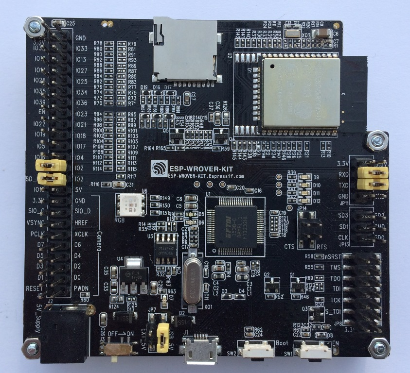

# 0. ESPNOW_DEBUG 示例说明

Espnow_debug 接收板需要和 ESP-MDF 设备处于同一个 Wi-Fi 信道上才可以接收 ESP-MDF 设备发送的调试数据。同时，如果 espnow_debug 接收板和 ESP-MDF 设备处于同一个局域网（连接同一个路由器）下，接收板还可以通过 mDNS 设备发现服务获取 Mesh 网络的基本信息，包括：Mesh-ID、根节点 IP、根节点 MAC 地址等。

Espnow_debug 接收板提供的主要功能包括：

1. 支持串口命令功能，通过命令行实现接收板连接路由器连接、添加和删除 ESP-MDF 设备、设置 ESP-MDF 设备的日志传输级别等操作
2. 接收 ESP-MDF 设备的运行日志与 coredump 信息并保存至 SD 卡
3. 通过 mDNS 服务获取 Mesh 网络的基本信息，包括：Mesh-ID、根节点 IP、根节点 MAC 地址等（espnow_debug 接收板和 ESP-MDF 设备需要连接到同一个路由器）
4. 对接收的运行日志进行统计，显示所有已添加的 ESP-MDF 设备的运行状态，包括：ERR 和 WARN 日志数量、重启次数、Coredump 接收个数、设备运行时间等
5. 支持 SD 卡文件操作，命令包括：ls（显示 SD 卡文件列表），rm（删除 SD 卡文件） 和 read（读取 SD 卡文件内容）
6. 支持设备调试操作，包括：重启，重置，重配网设备，以及擦除设备 NVS 存储区域中的指定数据

<div align=center>

</div>

## 1. ESP-NOW 介绍

### 1.1. 概述

Espnow_debug 接收板通过 [ESP-NOW](https://esp-idf.readthedocs.io/zh_CN/latest/api-reference/wifi/esp_now.html) 无线传输技术接收 ESP-MDF 设备的运行日志和 Coredump 数据。ESP-NOW 是由 Espressif 定义的一种无连接的 Wi-Fi 通信协议，广泛应用于智能照明，遥控，传感器等领域。在 ESP-NOW 中，数据被封装在 Wi-Fi Action 帧中进行数据的收发，在没有连接的情况下从一个 Wi-Fi 设备传输数据到另一个 Wi-Fi 设备。

### 1.2. ESP-NOW 特性

1. 收发双方必须在 `同一个信道上`
2. 接收端在非加密通信的情况下可以不添加发送端的 MAC 地址（加密通信时需要添加），但是发送端必须要添加接收端的 MAC 地址
3. ESP-NOW 最多可添加 `20` 个配对设备，同时支持其中最多 `6` 个设备进行通信加密
4. 通过注册回调函数的方式接收数据包，以及检查发送情况（成功或失败）
5. 利用 CTR 和 CBC-MAC 协议（CCMP）保护数据的安全

> 更多关于 ESP-NOW 的原理介绍，请参考 Espressif 官方手册 [ESP-NOW 使用说明](https://esp-idf.readthedocs.io/zh_CN/latest/api-reference/wifi/esp_now.html) 和 ESP-IDF 示例 [espnow](https://github.com/espressif/esp-idf/tree/master/examples/wifi/espnow)。

## 2. ESPNOW_DEBUG 示例使用说明

### 2.1. 硬件说明

| 硬件 | 数量 | 备注 |
| :--- | :--- | :--- |
| [ESP-WROVER-KIT V2](https://esp-idf.readthedocs.io/zh_CN/latest/hw-reference/modules-and-boards-previous.html#esp-wrover-kit-v2) 开发板 | 1 | [使用说明](https://esp-idf.readthedocs.io/zh_CN/latest/get-started/get-started-wrover-kit-v2.html) |
| TF 卡 | 1 | 保存 ESP-MDF 设备的运行日志和 coredump 数据，容量建议大于 1G |
| MiniUSB 数据线 | 1 | |

<div align=center>

<p> ESP-WROVER-KIT-V2 </p>
</div>

### 2.2. 项目文件组织结构

```
espnow_debug
├── build                        // All files generated through compiling
├── components
│   ├── espnow_console           // console module for interaction with terminal device
│   ├── espnow_lcd               // lcd module for info display
│   └── espnow sdcard            // sdcard module for data storage
├── main
│   ├── component.mk
│   ├── espnow_recv_handle.c     // handle with espnow received data
│   ├── espnow_terminal.c        // Main entry of project
│   └── Kconfig.projbuild        // Kconfig file of the example
├── gen_misc.sh                  // script for compiling and downloading
├── Makefile
├── partitions.csv               // partition table file
├── README.md
└── sdkconfig.default            // default configuration options
```

### 2.3. 串口命令格式说明

* Espnow_debug 接收板支持的串口指令包括: join、channel、add、del、list、log、llog、dumpreq、dumperase、ls、rm 和 read。

* 串口命令的交互遵循以下规则：
    1. 控制命令通过串口，从 PC 端发送给 Espnow_debug 接收板，串口通信波特率为 115200
    2. 控制命令定义中，字符均为小写字母, 字符串不需要带引号
    3. 命令描述中括号 {} 包含的元素整体, 表示一个参数, 需要根据实际情况进行替换
    4. 命令描述中方括号 [] 包含的部分，表示为缺省值, 可以填写或者可能显示
    5. 串口命令的模式如下所示，每个元素之间，以空格符分隔

        ```
        命令＋参数＋参数，例如： join ap_ssid ap_password
        命令＋选项＋参数，例如： add -m aa:bb:cc:dd:ee:ff -m 12:34:56:78:90:ab
        ```
    6. 换行符支持 '\n' 或者 '\r\n'。
    7. 串口以 115200 波特率返回执行结果

* 下面以操作流程为序，介绍每条命令的使用。

#### 2.3.1. 获取信道

1. 连接路由器

    |||||
    |-|-|-|-|
    |命令定义|join {ap_ssid} {ap_password}||
    |指令|join|连接 espnow_debug 接收板至 Mesh 网络中根节点所在的路由器|
    |参数|{router_ssid}|路由器 SSID|
    ||{router_password}|路由器密码|
    |示例|join my_router my_password|连接到 SSID 为 my_router，密码为 my_password 的路由器|
    |响应|OK|连接成功|
    - 注意：
        - 路由器信息设置完成后会默认保存至 espnow_debug 接收板的 flash 中。之后，在接收板上电启动后读取 flash 中保存的路由器信息并连接
        - 重复输入 join 命令，将连接到新配置的路由器并覆盖 flash 中之前存储的路由器配置信息

2. 删除路由器连接信息

    |||||
    |-|-|-|-|
    |命令定义|delr||
    |指令|delr|删除 espnow_debug 接收板的 flash 中存储的路由器（Router）信息, 删除路由器信息不会断开当前的路由器连接|
    |参数|无||
    |响应|OK|删除成功|

3. 设置 ESP-NOW 通信信道

    |||||
    |-|-|-|-|
    |命令定义|channel {primary_channel} {secondary_channel} ||
    |指令|channel|设置 espnow_debug 接收板的无线通信 channel 用于接收 espnow 数据|
    |参数|{primary_channel}|设置主信道，可以选择 1-13|
    ||{secondary_channel}|设置辅信道，可以选择 none, above, below(默认选择 none)|
    |||none: 频宽模式为：为 HT(High Throughput)20<br>above: 频宽模式为：HT40，辅信道在主信道之上（频率高于主信道）<br>below: 频宽模式为：HT40，辅信道在主信道之下（频率低于主信道）|
    |典型示例|channel 1 none |设置主信道为 channel1, 模式为 HT20.|
    |响应|OK|设置成功|

> join 命令与 channel 命令比较：
> * 都可以设置 espnow 收发端（espnow_debug 接收板和 ESP-MDF 设备）在同一个信道上
> * join 命令除了可以设置接收端的网络信道外，还可以获取 Mesh 网络中根节点提供的 mDNS 信息，包括根节点的 IP 地址、通信端口、MAC 地址等
> * channel 命令主要用于在 espnow_debug 接收板无法连接路由器（距离路由太远或者路由器连接数有限）的情况

#### 2.3.2. 添加或删除 ESP-MDF 设备

1. 添加 Mesh设备到 ESP-NOW 监听列表

    |||||
    |-|-|-|-|
    |命令定义|add -m {DEV_MAC_1} [-m {DEV_MAC_2}, ...]||
    |指令|add|在监听列表中添加新的设备，espnow_debug 接收板会接收来自监听列表中的设备发送的日志信息(如果有的话)|
    |选项符|－m|表示通过 MAC 地址进行添加，可同时添加多个设备信息（不可超过 5 个）|
    |参数|{DEV_MAC_1}|填写需要添加的 MESH 设备的 MAC 地址|
    |示例|add -m aa:bb:cc:dd:ee:ff -m 12:34:56:78:90:ab|将 MAC 地址为`aa:bb:cc:dd:ee:ff` 和 `12:34:56:78:90:ab` 的设备，添加到监听列表|
    |响应|OK|添加成功|
    - 注意：
        - 一次最多可添加 5 个 ESP-MDF 设备
        - 添加的 ESP-MDF 设备的 MAC 地址信息默认保存在 espnow_debug 接收板的 flash 中
        - 添加的 ESP-MDF 设备需要开启 `MDF_ESPNOW_DEBUG` 功能才可发送 espnow 数据。以事例 `light_bulb` 为例，通过 menuconfig 进行配置打开 `MDF_ESPNOW_DEBUG` 功能：Light blub Config -> Enable espnow debug module in mesh


2. 将 Mesh设备从 ESP-NOW 监听列表中删除

    |||||
    |-|-|-|-|
    |命令定义|del [-m {DEV_MAC_1} -m {DEV_MAC_2}, ...]||
    |指令|del|从监听列表中删除设备，删除设备后，espnow_debug 接收板将不会接收该设备的日志信息；<br>如果不带任何参数，则清空监听列表|
    |选项符|－m|表示通过 MAC 地址进行添加，可同时删除多个设备信息（不可超过 5 个）|
    |参数|{DEV_MAC_1}|填写需要添加的 MESH 设备的 MAC 地址|
    |示例 1|del -m aa:bb:cc:dd:ee:ff -m 12:34:56:78:90:ab|将 MAC 地址为`aa:bb:cc:dd:ee:ff` 和 `12:34:56:78:90:ab` 的设备，从监听列表删除|
    |示例 2|del|清空监听列表中所有记录|
    |响应|OK|删除成功|
    - 注意：
        - 一次最多可删除 5 个 ESP-MDF 设备
        - 不指定 `-m` 参数表示删除所有的 ESP-MDF 设备
        - `del` 删除所有已添加的 ESP-MDF 设备

3. 列出监听列表信息

    |||||
    |-|-|-|-|
    |命令定义|list||
    |指令|list|列出已监听列表的信息|
    |参数|无||
    |响应|显示监听列表信息||

#### 2.3.3. 调整日志级别

1. log -l level

    |||||
    |-|-|-|-|
    |命令定义|log -l {level}||
    |指令|log|设置 ESP-MDF 设备发送日志|
    |选项符|-l|表示调整 ESP-MDF 设备的发送日志级别|
    |参数|level|发送的日志等级|
    |||MDF_ESPNOW_LOG_NONE, // no output<br>MDF_ESPNOW_LOG_ERROR, // error log<br>MDF_ESPNOW_LOG_WARN, // warning log<br>MDF_ESPNOW_LOG_DEBUG, // debug log<br>MDF_ESPNOW_LOG_VERBOSE, // verbose log<br>MDF_ESPNOW_LOG_RESTORE, // restore to original ESP_LOG* channel |
    |示例|log -l 3|调整所有已添加的 ESP-MDF 设备的发送日志级别为 info 级别，高于 info 级别（日志级别从高到底依次为：ERROR > WARN > INFO > DEBUG > VERBOSE）的日志将通过 espnow 发送给 espnow_debug 接收板|
    |响应|OK|设置成功|
    - 注意：`MDF_ESPNOW_LOG_RESTORE` 表示恢复 ESP-MDF 设备日志打印到原输出通道（如串口打印）

2. llog -t tag -l level

    |||||
    |-|-|-|-|
    |命令定义|llog -t {tag} -l {level}||
    |指令|llog|调整 espnow_debug 接收板自身的打印日志级别|
    |选项符|－t|模块标签 tag|
    ||－l|日志的打印级别 level|
    |参数|{tag}|填写模块标签|
    ||{level}|填写日志的打印级别|
    |示例|llog -t espnow_lcd -l 3|设置espnow_debug 接收板 tag 为 `espnow_lcd` 的模块的日志打印级别为 `info` 级别|
    |响应|OK|设置成功|

#### 2.3.4. Coredump 数据请求与擦除

1. dumpreq

    |||||
    |-|-|-|-|
    |命令定义|dumpreq||
    |指令|dumpreq|请求 ESP-MDF 设备的 coredump 数据|
    |参数|无||
    |响应|如果 ESP-MDF 设备的 flash 中有 coredump 数据，则开启线程并发送 coredump 数据给 espnow_debug 接收板；<br>若没有 coredump 数据，则回复 `mdf_coredump_get_info no coredump data`||

    > 现阶段在请求 ESP-MDF 设备 coredump 数据时，只支持添加一个 ESP-MDF 设备。用户需要将多余的设备删除掉（用 `del` 命令）。

2. dumperase

    |||||
    |-|-|-|-|
    |命令定义|dumperase||
    |指令|dumperase|请求 ESP-MDF 设备擦除其 flash 中的 coredump 数据|
    |参数|无||
    |响应|OK|命令执行成功|

#### 2.3.5. SD 卡文件操作命令

1. ls

    |||||
    |-|-|-|-|
    |命令定义|ls [{type}]||
    |指令|ls|显示 SD 卡中文件列表|
    |参数|type|文件类型|
    |||all // 显示所有文件<br>log // 显示所有日志文件<br>dmp // 显示所有 coredump 文件<br>如果不带任何参数，则显示所有文件 |
    |示例|ls log|显示 SD 卡中所有日志文件|
    |响应|OK|设置成功|

2. rm

    |||||
    |-|-|-|-|
    |命令定义|rm {type}||
    |指令|rm|删除 SD 卡中指定类型或指定文件名的文件|
    |参数|type|文件类型或文件名|
    |||all // 删除所有日志文件和 coredump 文件<br>log // 删除所有日志文件<br>dmp // 删除所有 coredump 文件<br><filename> //删除指定文件 |
    |示例|rm log|删除 SD 卡中所有日志文件|
    |响应|OK|设置成功|

3. read

    |||||
    |-|-|-|-|
    |命令定义|read file||
    |指令|read|读取 SD 卡中指定文件|
    |参数|file|要读取文件的文件名|
    |示例|read abcdef.dmp|读取 SD 卡中文件名为 abcdef.dmp 的 coredump 文件|
    |响应|OK|设置成功|

read 命令使用说明：read 命令目前只支持读取 coredump 文件，用户需要通过如下步骤解析接收到的 coredump 数据：

* read 命令读取 coredump 文件：`read abcdef.dmp`。 read 读取的文件经过 base64 编码后打印到串口，以如下格式显示，

    ```
    ================= CORE DUMP START =================
    <body of base64-encoded core dump, save it to file on disk>
    ================= CORE DUMP END ===================
    ```

* 将 `================= CORE DUMP START =================` 和 `================= CORE DUMP END ===================` 之间的数据拷贝到一个全新文件中（假设为 file_A）
* 通过 Linux 命令：`base64 -d file_A > file_B` 将打印的 base64 编码的数据再次转换成原始二进制数据，并保存到一个全新文件中（假设为 file_B）
* 通过命令：`python esp-idf/components/espcoredump/espcoredump.py info_corefile -t raw -c <path/to/doredump/file> <path/to/project/elf/file>` 解析接收到的 file_B 文件

> * read 命令目前只支持读取 coredump 文件
> * 经过 base64 编码（从 SD 卡打印到串口）和解码（命令 `base64 -d file_A > file_B`）过程，文件 abcdef.dmp 和 file_B 的内容完全一致。

#### 2.3.6. 设备调试命令

1. manual -t type

    |||||
    |-|-|-|-|
    |命令定义|manual -t {type}||
    |指令|manual|给 ESP-MDF 设备发送调试命令|
    |选项符|-t|表示给 ESP-MDF 设备发送的调试命令|
    |参数|type|调试命令类型：reboot, reset, config [0,1,2]|
    |示例|manual -t 0|给 ESP-MDF 设备发送 `重启` 调试命令|
    |响应|OK|设置成功|

2. nvs_erase -k key

    |||||
    |-|-|-|-|
    |命令定义|erase_nvs -k {key}||
    |指令|erase_nvs|擦除 ESP-MDF 设备 NVS 存储区域的指定数据|
    |选项符|-k|指定 ESP-MDF 设备 NVS 存储区域的 key|
    |参数|key|NVS 存储的 key，key 的长度在 15 个字节及以内，且前后不需要加引号|
    |示例|erase_nvs -t mdf_network|擦除 ESP-MDF 设备中的配网信息|
    |响应|OK|设置成功|

#### 2.3.7. 其他命令

* `free`: 显示系统剩余 Heap Memory
* `restart`: 重启 espnow_debug 接收板

## 3. 性能影响说明

由于 ESP-NOW 和 ESP-MESH 一样，都是通过 Wi-Fi 接口进行数据包收发，因此，当 ESP-MDF 设备的 `MDF_ESPNOW_DEBUG` 功能打开且数据传输量较大时，会对其控制命令接收或数据传输产生一些延时。

经实际测试，在网络环境良好的情况下，以下配置参数导致的 ESP-MDF 设备延时是可以忽略的阈值：

* 50 个 ESP-MDF 设备（设备数量越多，网络环境越差）
* ESP-NOW 接收端添加 `10` 个 ESP-MDF 设备（接收端添加数量越多，网络环境越差）
* APP 控制命令发送的频率为 `1 秒/次`（控制频率越高，网络环境越差）
* 传输日志级别为 `info` （日志级别越低，网络环境越差）
