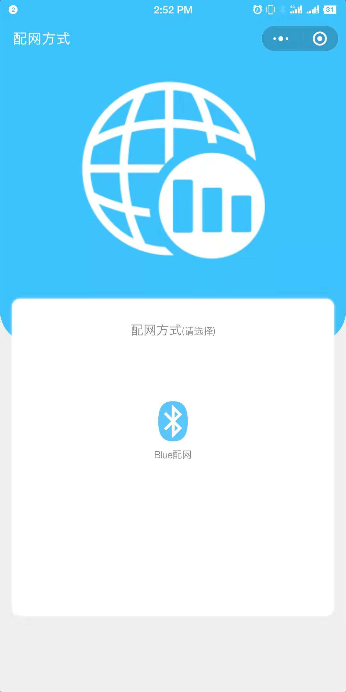
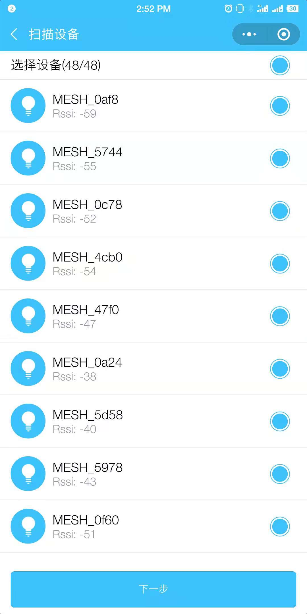
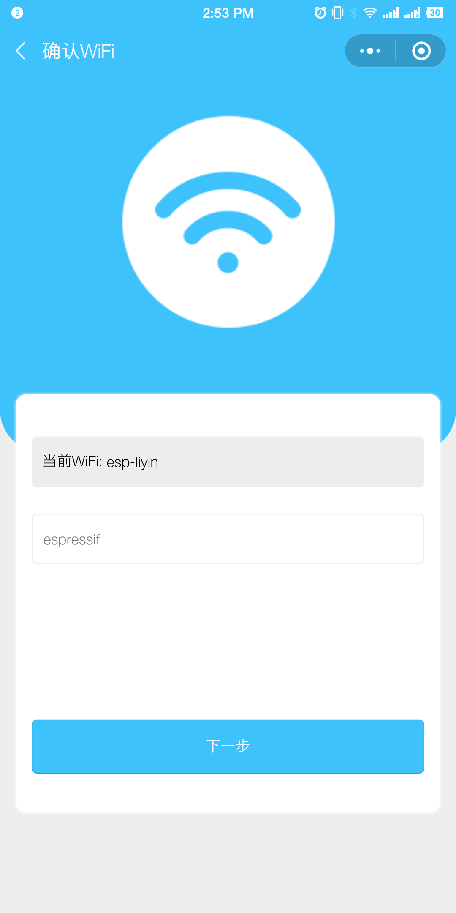
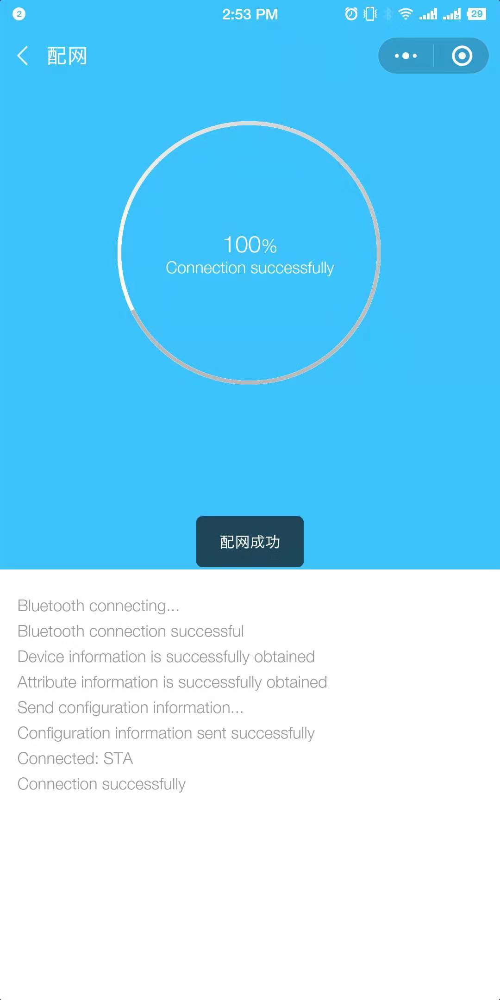

[[EN]](./README.md)

# Mconfig 示例

## 介绍

本示例将介绍如何基于 `Mconfig` 模块 APIs 配置 ESP-MESH 网络。

## 配网流程

1. 手机连接到路由器上，并确保路由器是 2.4 GHz
2. 打开微信，搜索 `ESPMesh` 或扫描如下二维码：

	

	
	
Mini program for Network configuration

	

3. 输入配置参数：

    <table>
        <tr>
            <td >
选择配网方式
</td>
            <td >
获取设备列表
</td>
            <td >
输入配置信息
</td>
            <td >
传输配置信息
</td>
        </tr>
    </table>