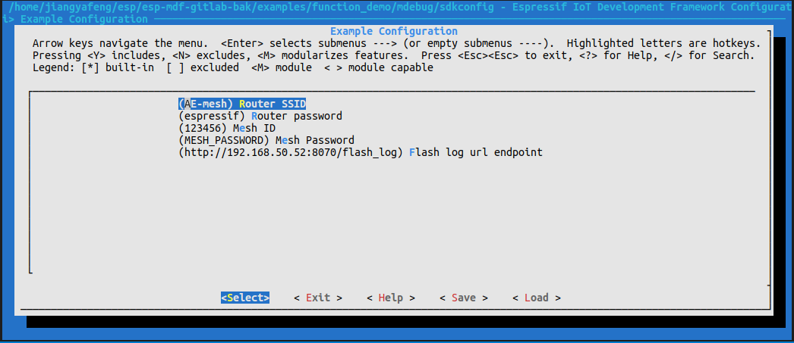
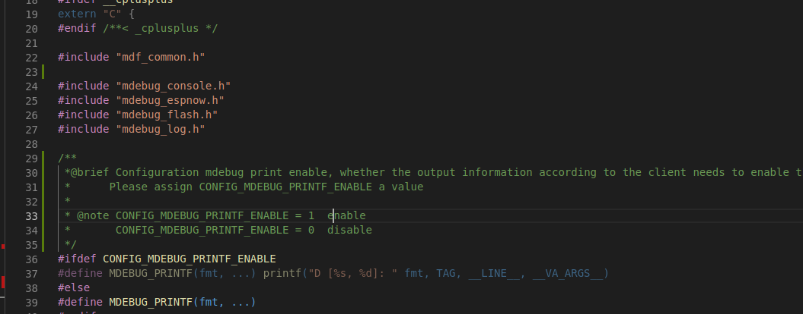
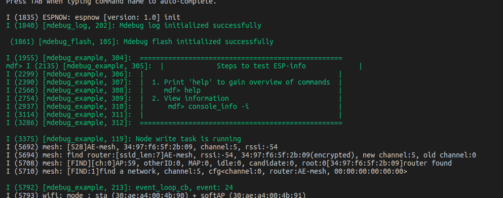
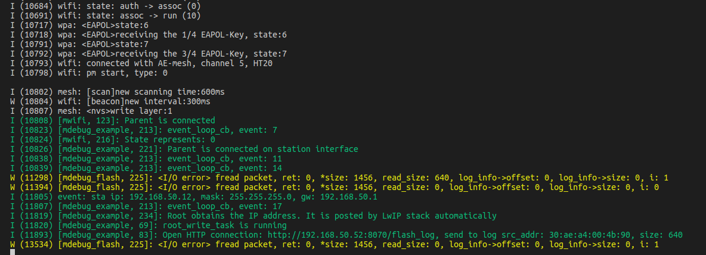
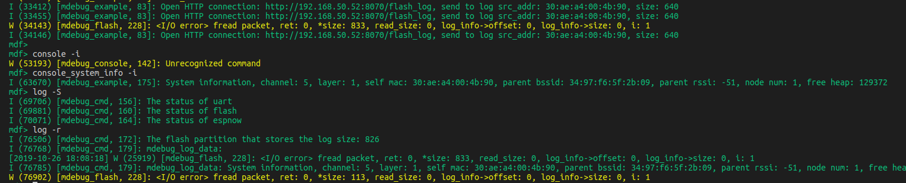
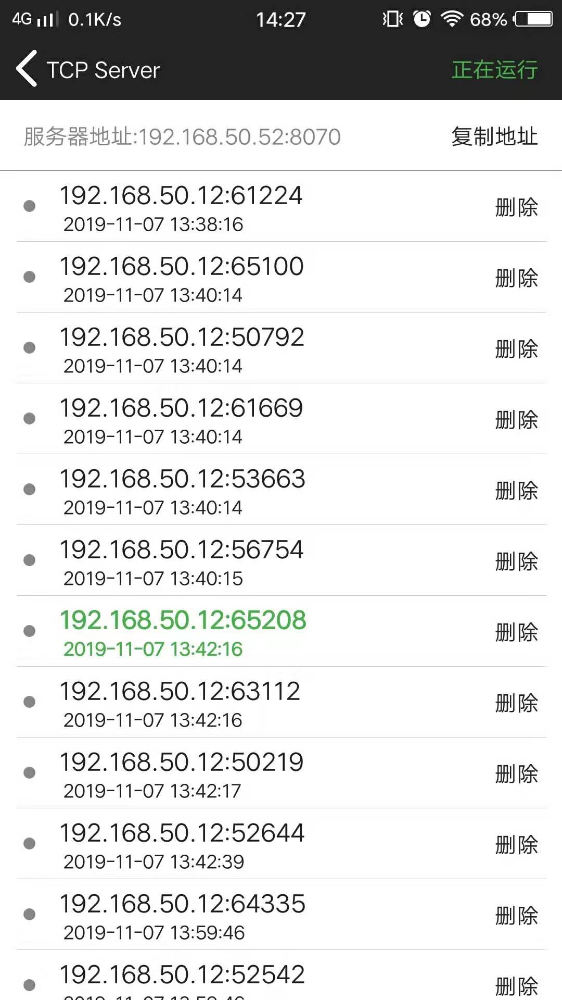
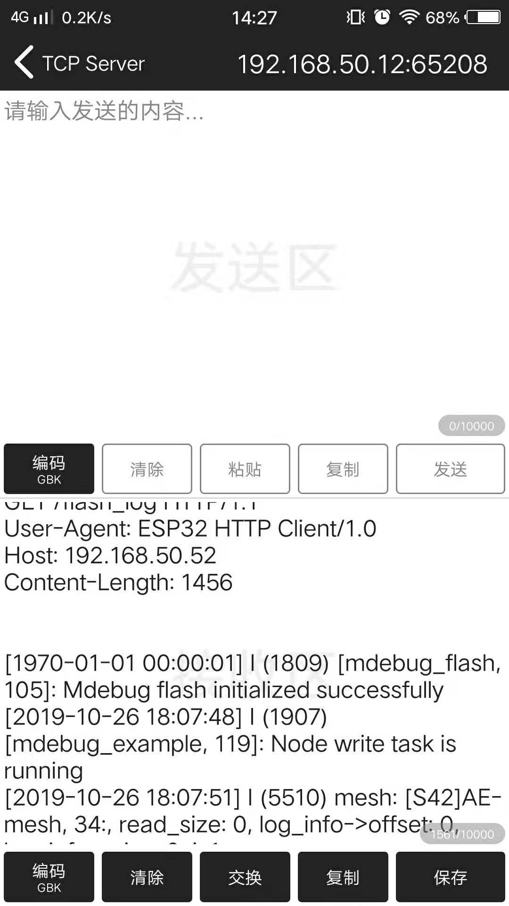

[[中文]](./README_cn.md)

# Mdebug log package upload example

## Introduction

This example shows how to connect a device to a remote external server based on the `http_client` module APIs. The device acts as the root node to transfer all data to the remote server.

This example implements the function of transferring log data to the TCP server in the device on the http network. The data is packaged into a file and transmitted to server, and uploaded according to the size of the data `MWIFI_PAYLOAD_LEN`. In addition, a `console` control command is added, and the basic information of the device can be obtained through the serial port command.

## Hardware

* An ESP32 development board
* 1 x router that supports 2.4G

## Process

### Run TCP server

1. Connect PC or the mobile phone to the router.
2. Use a TCP testing tool (any third-party TCP testing software) to create a TCP server.

> Note: This example uses the iOS [TCP_UDP](https://itunes.apple.com/cn/app/tcp-udp%E8%B0%83%E8%AF%95%E5%B7%A5%E5%85%B7/id1437239406?mt=8) tool.

### Configure the devices

Enter `make menuconfig`, and configure the followings under the submenu "Example Configuration".

 * Setting `Router SSID` and `Router password`
 * Setting `flash log url`,The IP address and device in your TCP server can be transmitted under the same network segment.
 * For examples:

    <div align=center>
    
    <p>Configuration network</p>
    </div>

### Build and Flash

Make:
```shell
make erase_flash flash ESPBAUD=921600 ESPPORT=/dev/ttyUSB0 monitor
```

CMake:
```shell
idf.py erase_flash flash monitor-b 921600 -p /dev/ttyUSB0
```
> Note:You need to change the serial port according to the serial port of the client's PC.

### Operating procedures

1. The user needs to open the network assistant tool and connect to the network.
2. The user controls the information through the console command line, and the help can view the format of the input.
* The main serial command line is as follows:
```
console -i     // This will output basic information about the device.
log -S         // The status of the log is flash, espnow, uart mode.
log -e flash   // Enable the log to flash 
log -r         // Read log 
log -d flash   // diable log
```
> Note: In `components/mdebug/include/mdebug.h`, you can determine whether the output information is correct according to whether the client needs to enable the debug output of the log part.

<div align=center>

<p>debug enable</p>
</div>

### Run

* This is the serial port successfully prints the data, indicating that the upload is successful, and the information is controlled through the console command line.

    <table>
    <tr>
        <td ><center>serial information</center></td>
        <td ><center>serial information</center></td>
        <td ><center>serial command</center></td>
    </tr>
    </table>

* This is the display interface of the mobile phone, indicating that the log data is received.

    <table>
    <tr>
        <td ><center>server accepted packet</center></td>
        <td ><center>Data content</center></td>
    </tr>
    </table>

### Test result

1. When `MWIFI_PAYLOAD_LEN = 1456` is set, the maximum data size of a packet is MWIFI_PAYLOAD_LEN bytes.

### Note

1. The network that requires the phone link here is the same as the esp32 chip, so that data information can be collected on the network assistant tool. 
1. It should also be noted that when using a new chip for burning, the chip needs to be erased and then burned.
1. The log_info area is added to the partition table in this example as a space to save logs. The chip needs to be erased before programming.
1. The head of the data is a timestamp. It is just an experiment and there is no real-time calibration. It can be modified according to the user's own needs.
1. Get the `uart`, `flash`, `espnow` status in the Console command, you can't use the `console` command to disable it, because the main program has been forced to be enabled. If the user wants to use such a function, the main program can be disable.
