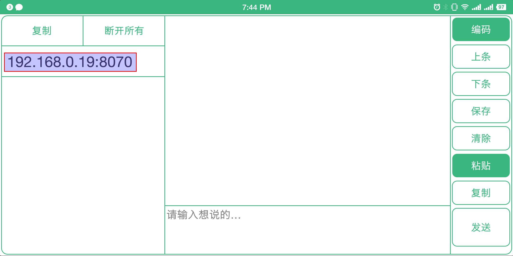
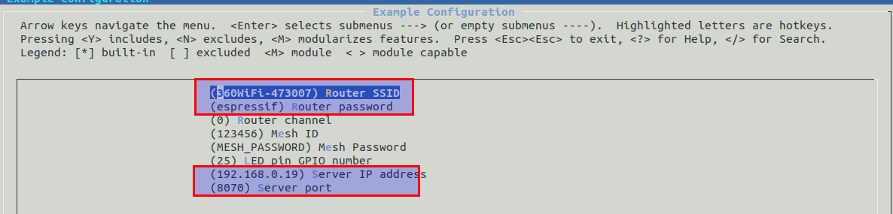
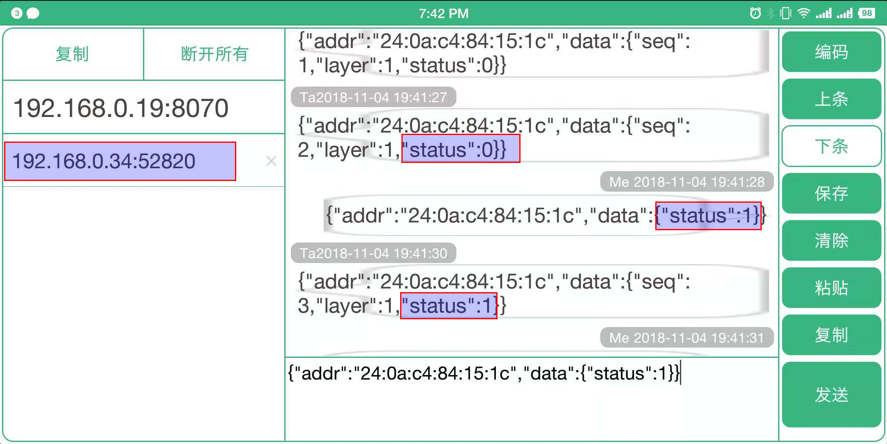

[[中文]](./README_cn.md)

# Mwifi Example

## Introduction

It introduces how to connect the devices to a remote external server based on `Mwifi` module APIs. To be specific, the devices transmit all the data to the root node via ESP-MESH, and then the root node connects to a remote server with LWIP.

## Hardware

* At least 2 x ESP32 development boards
* 1 x router that supports 2.4G

## Process

### Run TCP server

1. Connect PC or the mobile phone to the router
2. Use a TCP testing tool (any third-party TCP testing software) to create a TCP server

<div align=center>

<p> Create a TCP server </p>
</div>

> Note: The example uses the Android [network testing](https://a.app.qq.com/o/simple.jsp?pkgname=mellow.cyan.nettool) tool.

### Configure the devices

Enter `make menuconfig`, and configure the followings under the submenu "Example Configuration".

	* The router information: If you cannot get the router's channel, please set it as 0, which indicates that the channel will be automatically acquired by the devices.
	* ESP-MESH network: The network password length should be between 8 and 64 bits (both exclusive), and the network will not be encrypted if you leave the password blank.
	* TCP server: the information of the TCP server run on the PC
	* LED configuration: control GPIO level via the PC

<div align=center>

<p> Configure the devices </p>
</div>

### Build and Flash

```shell
make erase_flash flash -j5 monitor ESPBAUD=921600 ESPPORT=/dev/ttyUSB0
```

### Run

1. ESP-MESH devices send the real-time LED status to the TCP server at an interval of three seconds
2. The TCP server sends the command to control the device's LED status. When the destination address is `ff:ff:ff:ff:ff:ff`, it will send the command to all the devices.

<div align=center>

<p> TCP server </p>
</div>