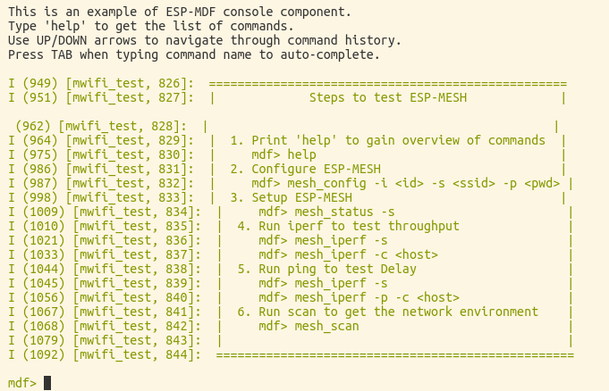

[[中文]](./README_cn.md)

# ESP-WIFI-MESH Console Debugging Demo

## Overview

This demo will show how to use `Mdebug` module to perform basic ESP-WIFI-MESH debugging in mesh products, including the following features:

 - [ESP-WIFI-MESH throughput test](#ESP-WIFI-MESH-Throughput-Test): sets work mode (client/server) and ping.
 - [ESP-WIFI-MESH network configuration](#mesh_config-Command): sets ESP-WIFI-MESH configuration information, including router SSID, password and BSSID, work channel, MESH ID and its password, device type, maximum number of connected devices and maximum layers; prints/saves ESP-WIFI-MESH configuration information.
 - [ESP-WIFI-MESH status query](#mesh_status-Command): starts/stops ESP-WIFI-MESH, and prints the status of ESP-WIFI-MESH devices.
 - [Wi-Fi scan](#mesh_scan-Command): scans AP or ESP-WIFI-MESH devices nearby, and sets scan filters, such as filtered out by RSSI, SSID or BSSID, and sets passive scan time in each channel.
 - [Coredump information management](#Coredump-Command): prints/erases coredump data, gets coredump data length, sends coredump data to a specific device, retransmit coredump data with a specific sequence number.
 - [Log configuration](#Log-Command): adds/removes monitors, sets logging level, and sends logs to a specific device.
 - [General commands](#General-Command): include help command to print all currently supported commands, heap command to get the remaining memory of the current device, restart command to restart devices, and reset command to reset and restart devices.

## Hardware

1. One ESP32 development board
2. One 2.4 G router

## Workflow

1. Compile and flash this project to ESP32 development board;
2. Open serial port terminal and restart development board, you will get the following information in the terminal:

<div align=center>

<p> TCP Server </p>
</div>

> Please use serial port terminals such as `minicom` to avoid some unexpected problems when using `make monitor`.

3. Debug ESP-WIFI-MESH by entering the following commands according to the prompts.

* The following describes the use of each command in sequence.

### Serial Port Command

* ESP-NOW debug receiver board supports the following serial port commands: help, sdcard, wifi_sniffer, wifi_config, wifi_scan, log, coredump and command.

* The interaction of serial port commands follows the following rules:
    1. PC sends commands to ESP-NOW debug receiver board through serial port with a baud rate of 115200.
    2. In command definition, all characters are lowercase (some options are uppercase), and strings do not need to be quoted.
    3. The elements in brackets {} in command description should be taken as a parameter and be replaced as the case may be.
    4. The part contained in square brackets [] in command description is the default value and can be filled in or displayed.
    5. The pattern of serial port commands is shown below, with each element separated by a space:

        ```
        Command ＋ Option ＋ Parameter，for example: log -s aa:bb:cc:dd:ee:ff
        ```

    6. Serial port commands support line breaks: '\n' and '\r\n'.
    7. Serial port returns execution results at a baud rate of 115200.

### ESP-WIFI-MESH Throughput Test

1. Hardware
    * Two ESP32 development boards
    * Flash console_test project to the two boards
2. Workflow
    1. Configure ESP-WIFI-MESH on the two boards and set the boards to the same ESP-WIFI-MESH network. For example, enter the same command `mesh_config -i 14:12:12:12:12:12 -s espressif -p espressif` on the terminals of the two boards;
    2. After the network is established, enter the command `mesh_status -o` to check the status;
    3. Run the command `mesh_status -s` to set one of the board into iperf server mode;
    4. Run the command `mesh_iperf -c 30:ae:a4:80:16:3c` to set the other board into iperf client mode.

### General Command

 - `help`: prints registered commands and their instructions.
 - `version`: gets chip version and SDK version.
 - `heap`: gets available heap memory size.
 - `restart`: softly restarts chip.
 - `reset`: clears all configuration information on the device.
 
### Log Command

1. Log Configuration

    |||||
    |-|-|-|-|
    |Command definition|log [\<tag\>] [\<level\>] [-s <addr (xx:xx:xx:xx:xx:xx)>]||
    |Command|log -s|Send log to a specific device|
    |Parameter|addr|MAC address of the monitor|
    ||tag|Use tag to filter log|
    ||level|Use level to filter log|
    |Example|log * NONE|Forbid log output|
    ||log mwifi INFO|Set the level of the logs with mwifi tag to INFO|
    ||log -s 30:ae:a4:80:16:3c|Send the log to the device 30:ae:a4:80:16:3c|

### Coredump Command

1. Coredump Data

    |||||
    |-|-|-|-|
    |Command definition|coredump [-loe] [-q <seq>] [-s <addr (xx:xx:xx:xx:xx:xx)>]||
    |Command|coredump -l|Get coredump data length from this device|
    ||coredump -o|Read coredump data from this device and print it to console|
    ||coredump -e|Erase coredump data from this device|
    ||coredump -s|Send coredump data from this device to a specific device|
    |Parameter|addr|MAC address of the monitor|
    ||sequence|The sequence number of coredump data|
    |Example|coredump -s 30:ae:a4:80:16:3c|Send coredump data to the device 30:ae:a4:80:16:3c|
    ||coredump -q 110 -s 30:ae:a4:80:16:3c|Send coredump data starting with the sequence number of 110 to the device 30:ae:a4:80:16:3c|
    ||coredump -l|Get coredump data length from this device|
    ||coredump -o|Read coredump data from this device and print it to console|
    ||coredump -e|Erase coredump data from this device|

### mesh_config Command

1. mesh_config

    |||||
    |-|-|-|-|
    |Command definition|mesh_config  [-oS] [-s <ssid>] [-p <password>] [-b <bssid (xx:xx:xx:xx:xx:xx)>] [-c <channel (1 ~ 13)>] [-i <mesh_id (6 Bytes)>] [-t <mesh_type ('idle'or 'root' or 'node' or 'leaf')>] [-P <mesh_password>] [-n <max_connection (1 ~ 10)>] [-l <max_layer (1 ~ 32)>]||
    |Command|mesh_config -s <ssid> -p <password> -b <bssid>|Set router information|
    ||mesh_config -c|Set work channel for ESP-WIFI-MESH devices|
    ||mesh_config -i <mesh_id> -t <mesh_type> -P <mesh_password> -n <max_connection> -l <max_layer>|Configure ESP-WIFI-MESH, including ID, password and capacity|
    ||mesh_config -o|Print ESP-WIFI-MESH configuration information|
    ||mesh_config -S|Save ESP-WIFI-MESH configuration information|
    |Example|mesh_config -c 11|Set the work channel of ESP-WIFI-MESH to channel 11|
    ||mesh_config -i 14:12:12:12:12:12 -s espressif -p espressif|Set ESP-WIFI-MESH ID to 14:12:12:12:12:12; router information: set SSID to expressif, set password to espressif|
    ||mesh_config -o|Print ESP-WIFI-MESH configuration information|
    ||mesh_config -S|Save ESP-WIFI-MESH configuration information|

### mesh_status Command

1. mesh_status

    |||||
    |-|-|-|-|
    |Command definition|mesh_status [-spo]||
    |Command|mesh_status -s|Start ESP-WIFI-MESH|
    ||mesh_status -p|Stop ESP-WIFI-MESH|
    ||mesh_status -o|Print ESP-WIFI-MESH status information|
    |Example|mesh_status -o|Print ESP-WIFI-MESH status information|
    ||mesh_status -s|Start ESP-WIFI-MESH|
    ||mesh_status -p|Stop ESP-WIFI-MESH|

### mesh_scan Command

1. mesh_scan

    |||||
    |-|-|-|-|
    |Command definition|mesh_scan [-r <rssi (-120 ~ 0)>] [-s <ssid (xx:xx:xx:xx:xx:xx)>] [-b <bssid (xx:xx:xx:xx:xx:xx)>] [-t <type ('router' or 'mesh')>] [-p <time>]||
    |Command|mesh_scan -r|Set an RSSI filter value|
    ||mesh_scan -s|Set an SSID filter string|
    ||mesh_scan -b|Set a BSSID filter|
    ||mesh_scan -t|Set filter type|
    ||mesh_scan -p|Set passive scan time for each channel|
    |Example|mesh_scan -t mesh|Filter mesh devices|
    ||wifi_scan -r -60 -t mesh|Scan mesh devices with RSSI signal value within -60|
    ||wifi_scan -s espressif -t mesh|Scan mesh devices with SSID under espressif|
    ||wifi_scan -p 300|Set the passive scan time for each channel to 300 ms|

### mesh_iperf Command

1. mesh_iperf

    |||||
    |-|-|-|-|
    |Command definition|mesh_iperf [-spa] [-c <host (xx:xx:xx:xx:xx:xx)>] [-i <interval (sec)>] [-l <len (Bytes)>] [-t <time (sec)>]||
    |Command|mesh_iperf -c|Run this device in client mode|
    ||mesh_iperf -s|Run this device in server mode|
    ||mesh_iperf -p|ping|
    ||mesh_iperf -i|Set bandwidth calculation cycle|
    ||mesh_iperf -l|Set buffer length|
    ||mesh_iperf -t|Set iperf test time|
    ||mesh_iperf -a|Stop iperf test|
    |Example|mesh_iperf -s |Run this device in server mode|
    ||mesh_iperf -c 30:ae:a4:80:16:3c|Run this device in client mode, and perform a performance test with 30:ae:a4:80:16:3c server|

