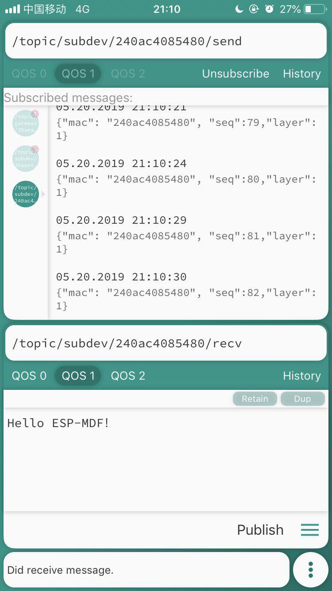

[[EN]](./README.md)

# Mwifi 示例

## 介绍

本示例将介绍如何基于 `Mwifi` 模块 APIs，实现设备连接远程外部服务器。设备首先通过 ESP-MESH 将所有数据传输到根节点，根节点使用 LWIP 连接 MQTT 远程服务器(示例使用：`mqtt://iot.eclipse.org`)。

## 硬件准备

1. 至少两块 ESP32 开发板
2. 一台支持 2.4G 路由器
3. 手机或者电脑(带有 MQTT 调试工具)

## 工作流程

### 配置设备

输入 `make menuconfig`，在 “Example Configuration” 子菜单下，进行配置：

<div align=center>

<p> 配置设备 </p>
</div>

### 编译和烧录

```shell
make erase_flash flash -j5 monitor ESPBAUD=921600 ESPPORT=/dev/ttyUSB0
```

### 运行

1. ESP-MESH 设备每隔三秒会向 Topic:"/topic/subdev/MAC/send"（MAC：节点的 MAC 地址）推送设备信息
2. 当 MESH 网络中路由表发生变化时，会向 Topic:"/topic/gateway/MAC/update"（MAC：为根节点的 MAC 地址）推送变化的节点相关信息
3. 可以从 Topic:"/topic/subdev/MAC/recv" 接收来自服务器的数据

例如：
- MQTT 测试工具中订阅 `/topic/subdev/240ac4085480/send` topic 将收到来自设备的数据
- 在 MQTT 测试工具中向 `/topic/subdev/240ac4085480/recv` topic 发送数据，MAC 地址为 240ac4085480 的设备将收到数据

<div align=center>

</div>