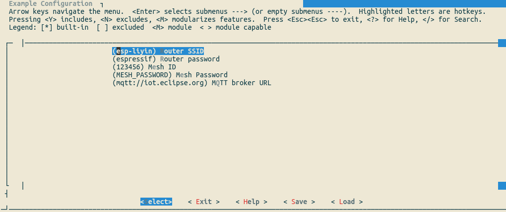

[[EN]](./README.md)

# Mwifi 示例

## 介绍

本示例将介绍如何基于 `Mwifi` 模块 APIs，实现设备连接远程外部服务器。设备首先通过 ESP-WIFI-MESH 将所有数据传输到根节点，根节点通过 MQTT 连接远程服务器(示例使用：`mqtt://iot.eclipse.org`)。

## 硬件准备

1. 至少两块 ESP32 开发板
2. 一台支持 2.4G 路由器
3. 手机或者电脑(带有 MQTT 调试工具)

## 工作流程

### 配置设备

输入 `make menuconfig`，在 “Example Configuration” 子菜单下，进行配置：

<div align=center>

<p> 配置设备 </p>
</div>

### 编译和烧录

```shell
make erase_flash flash -j5 monitor ESPBAUD=921600 ESPPORT=/dev/ttyUSB0
```

### 运行

1. ESP-WIFI-MESH 子设备每隔三秒会向根节点发送心跳信息，信息内容如下：

    ```json
    {
        "type":"heartbeat",
        "self":"840d8ee3b1d8",
        "parent":"a45602473007",
        "layer":1
    }
    ```

    > type 是消息类型，self 是当前设备的 MAC 地址，parent 是当前设备父节点的 MAC 地址，layer 是当前设备的层书。强烈建议开发者在设计基于 MQTT 进行通信的 MESH 系统时保留这一机制。这样既可以方便 Cloud 判断设备是否在线，也很容易看出 MESH 网络完整的 TOPO 结构

1. ESP-WIFI-MESH 根节点收到来自子节点的数据后，会向 Topic: "mesh/{MAC}/toCloud"（MAC：根节点的 MAC 地址）转发来自子节点的消息。信息内容如下：

    ```json
    {
        "addr":"840d8ee3b1d8",
        "type":"json",
        "data":{
            "type":"heartbeat",
            "self":"840d8ee3b1d8",
            "parent":"a45602473007",
            "layer":1
        }
    }
    ```

    > addr 是子节点的 MAC 地址，type 是消息类型，data 是来自子设备的消息。

1. 当 MESH 网络中路由表发生变化时，根节点会向 Topic: "mesh/{MAC}/topo"（MAC：为根节点的 MAC 地址）推送变化的节点相关信息, 信息内容如下：

    ```json
    [
        "840d8ee3b1d8",
        "30aea4800ea0"
    ]
    ```

    > 列表完整复制了当前根节点的路由表

1. 根节点从 Topic:"mesh/{MAC}/toDevice" (MAC 可以是 3 个值，分别时根节点 MAC 地址，"ffffffffffff" 和 "ff0000010000") 接收来自服务器的数据

例如，有两个节点运行该事例，分别是 840d8ee3b1d8（根节点） 和 30aea4800ea0 (子节点)。

- mosquitto_sub 中订阅 `mesh/+/toCloud` topic 将收到来自设备的消息，如下：

    ```bash
    mesh/840d8ee3b1d8/toCloud {"addr":"840d8ee3b1d8","type":"json","data":{"type":"heartbeat", "self": "840d8ee3b1d8", "parent":"a45602473007","layer":1}}
    mesh/840d8ee3b1d8/toCloud {"addr":"30aea4800ea0","type":"json","data":{"type":"heartbeat", "self": "30aea4800ea0", "parent":"840d8ee3b1d9","layer":2}}
    mesh/840d8ee3b1d8/toCloud {"addr":"840d8ee3b1d8","type":"json","data":{"type":"heartbeat", "self": "840d8ee3b1d8", "parent":"a45602473007","layer":1}}
    mesh/840d8ee3b1d8/toCloud {"addr":"30aea4800ea0","type":"json","data":{"type":"heartbeat", "self": "30aea4800ea0", "parent":"840d8ee3b1d9","layer":2}}
    mesh/840d8ee3b1d8/toCloud {"addr":"840d8ee3b1d8","type":"json","data":{"type":"heartbeat", "self": "840d8ee3b1d8", "parent":"a45602473007","layer":1}}
    mesh/840d8ee3b1d8/toCloud {"addr":"30aea4800ea0","type":"json","data":{"type":"heartbeat", "self": "30aea4800ea0", "parent":"840d8ee3b1d9","layer":2}}
    mesh/840d8ee3b1d8/toCloud {"addr":"840d8ee3b1d8","type":"json","data":{"type":"heartbeat", "self": "840d8ee3b1d8", "parent":"a45602473007","layer":1}}
    ```

- mosquitto_sub 中订阅 `mesh/+/topo` topic 将收到来自设备的消息，如下：

    ```bash
    mesh/840d8ee3b1d8/topo ["840d8ee3b1d8"]
    mesh/840d8ee3b1d8/topo ["840d8ee3b1d8","30aea4800ea0"]
    ```

- mosquitto_pub 中向 `mesh/840d8ee3b1d8/toDevice` topic 发送消息，消息内容如下

    ```json
    {
        "addr":["30aea4800ea0","840d8ee3b1d8"],
        "type":"json",
        "data":{
            "key1":"123",
            "key2":"456"
        }
    }
    ```

    此时，两个节点均收到 data 字段的内容，日志如下：

    ```bash
    I (987708) [mqtt_examples, 116]: Node receive: 84:0d:8e:e3:b1:d8, size: 27, data: {"key1":"123","key2":"456"}
    ```

    ```bash
    I (623724) [mqtt_examples, 118]: Node receive: 84:0d:8e:e3:b1:d8, size: 27, data: {"key1":"123","key2":"456"}
    ```
