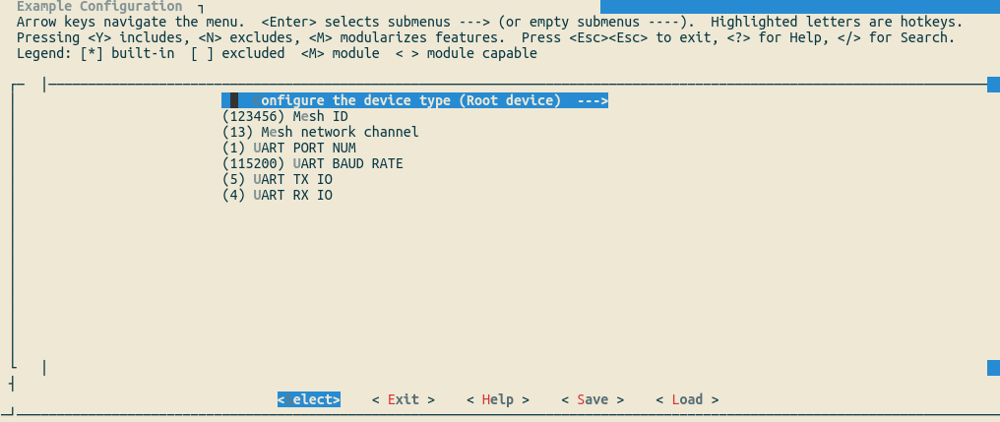
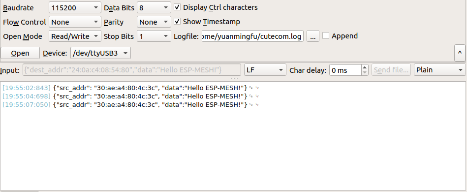

[[EN]](./README.md)

# Mwifi 无路由器示例

## 介绍

本示例将介绍如何快速组建一个无路由器 ESP-WIFI-MESH 网络，并通过串口透传到指定节点，其余的组网方案及详细使用方式参见：[README](../README.md)，在运行本示例之前请详细阅读 [README](../../README_cn.md) 和 [ESP-WIFI-MESH](https://docs.espressif.com/projects/esp-idf/en/stable/api-guides/mesh.html) 文档。

## 配置

运行本示例，您至少需要准备两块开发板，一块配置为根节点，其余为非根节点，本示例默认为非根节点类型。

- 根节点：一个 ESP-WIFI-MESH 网络中有且仅有一个根节点，通过 `MESH_ID` 和信道来区分不同的 `MESH` 网络
- 非根节点：包含叶子节点和中间节点，其根据网络情况自动选择父节点
	- 叶子节点：叶子节点不会做为中间节点，即不允许有下游链接

你需要通过 `make menuconfig`(Make) 或者 `idf.py menuconfig`(CMake)，在 `Example Configuration` 子菜单下，配置一个设备为根节点，其余设备为非根节点。
您也可以在 `Component config -> MDF Mwifi` 子菜单下，配置 ESP-WIFI-MESH 的最大层级、每层的连接数、广播包的间隔等参数。

<div align=center>

<p> 配置设备类型 </p>
</div>

## 运行

1. 设置事件回调函数；
2. 初始化 Wi-Fi，根据配置启动 ESP-WIFI-MESH；
3. 创建处理任务：
	- 根节点:
		- 创建串口处理任务，接收来自串口的 JSON 格式数据，解析并转发到目的地址
		- 接收来自非根节点的数据（目的地址可能为根节点本身的 MAC 地址或者 MESH 网络指定的根节点地址），并转发到串口
	- 非根节点：
		- 创建串口处理任务，接收来自串口的 JSON 格式数据，解析并转发到目的地址
		- 接收来自根节点的数据，并转发到串口
4. 创建定时器：定时打印 ESP-WIFI-MESH 网络的层级，父节点的信号强度及剩余内存。

<div align=center>

<p> 串口终端 </p>
</div>

## 串口数据传输格式

格式：
```
{"dest_addr":"dest mac address","data":"content"}
{"group":"group address","data":"content"}
```

示例:
```
{"dest_addr":"30:ae:a4:80:4c:3c","data":"Hello ESP-WIFI-MESH!"}
{"group":"01:00:5e:ae:ae:ae","data":"Hello ESP-WIFI-MESH!"}
```
