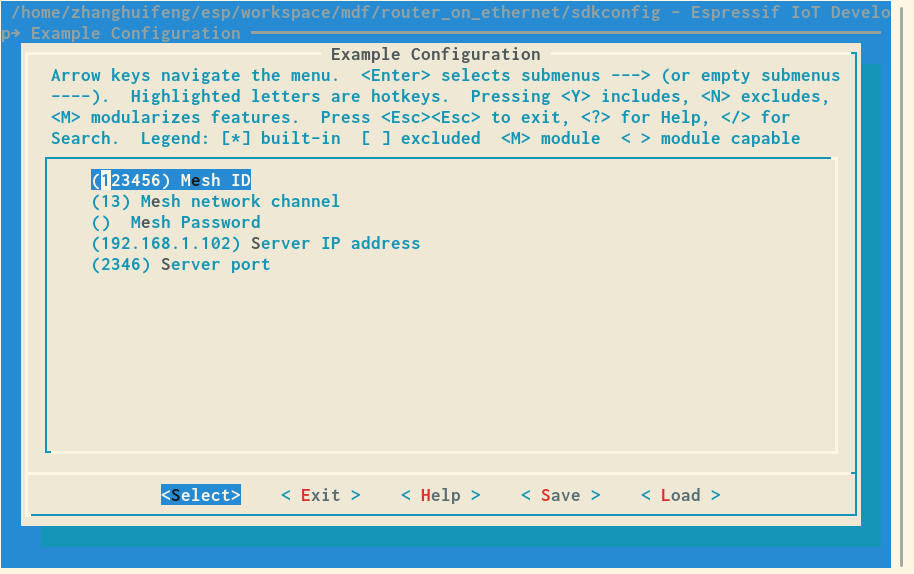
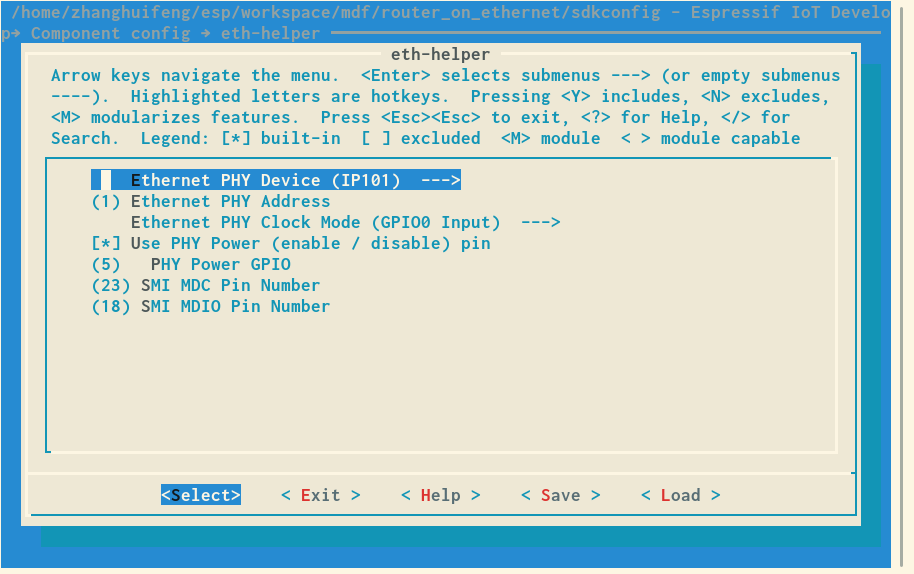
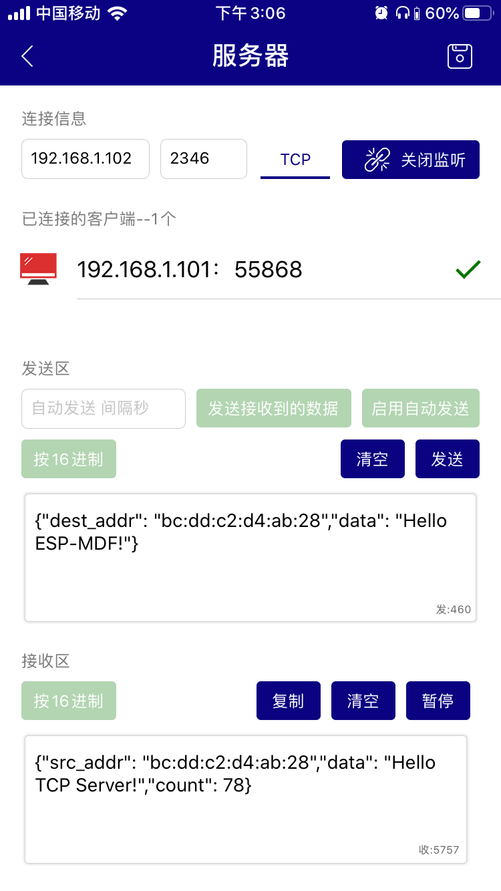

[[EN]](./README.md)

# Mwifi Ethernet 根节点示例

## 介绍

本示例将介绍如何基于 `Mwifi` 模块配合 `Ethernet`模块 APIs，实现设备连接远程外部服务器。设备首先通过 ESP-MESH 将所有数据传输到根节点，根节点使用 LWIP 连接远程服务器。

本示例实现了 mesh 网络中设备数据通过以太网传输到 TCP 服务器功能，也可在 TCP 服务器中发送数据到指定节点或组。

## 硬件准备

1. 至少两块 ESP32 开发板（一块 ESP32 开发板要支持以太网，另一块 ESP32 开发板使用 no_router 示例，配置成 `Non-Root device`，两块开发板使用同一 Mesh ID 和 channel）。
1. 支持以太网的路由器

## 工作流程

### 运行 TCP 服务器

1. 将主机（PC 或手机）连接到路由器。
2. 使用 TCP 测试工具（此工具为任意一个第三方的 TCP 测试软件）来创建 TCP 服务器。

> 注：本示例使用的是 iOS [TCP_UDP](https://itunes.apple.com/cn/app/tcp-udp%E8%B0%83%E8%AF%95%E5%B7%A5%E5%85%B7/id1437239406?mt=8) 测试工具

### 配置设备

输入 `make menuconfig`，在 “Example Configuration” 子菜单下，进行配置：

* ESP-MESH 网络：密码长度要大于 8 位并小于 64 位，设置为空则不加密
* TCP 服务器：主机上运行的 TCP 服务器信息, 包含：IP 地址、端口

<div align=center>

<p> 配置设备 </p>
</div>

在 `Example Configuration->Eth-helper`子菜单下，进行以太网的配置，这部分需要根据实际使用的 PHY 芯片和连接方式进行设置，可参考 ESP-IDF 中关于以太网的示例

<div align=center>

<p> 配置以太网（适用于 ESP32-Ethernet-Kit-A_V1.1） </p>
</div>

### 编译和烧录

Make:

```bash
make erase_flash flash -j5 monitor ESPBAUD=921600 ESPPORT=/dev/ttyUSB0
```

CMake:

```bash
idf.py erase_flash flash monitor -b 921600 -p /dev/ttyUSB0
```

### 运行

1. ESP-MESH 设备每隔三秒会给 TCP 服务发送当前设备的信息
2. TCP 服务器可以发送数据（数据格式请见下一章节的介绍）到指定地址或者指定组。
    * 当目的地址为 `ff:ff:ff:ff:ff:ff` 时，给所有设备发送。
    * 当使用组地址时，将向该组内所有设备发送。

<div align=center>

<p> TCP 服务器 </p>
</div>

### 数据格式

TCP 服务器通信数据格式：

```json
{"dest_addr":"dest mac address","data":"content"}
{"group":"group address","data":"content"}
```

示例:

```json
{"dest_addr":"24:0a:c4:08:54:80","data":"Hello ESP-MDF!"}
{"group":"01:00:5e:ae:ae:ae","data":"Hello ESP-MDF!"}
```
