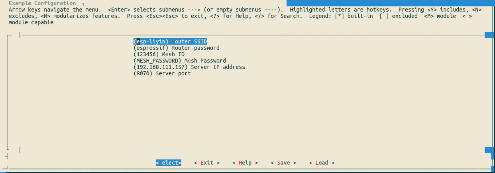
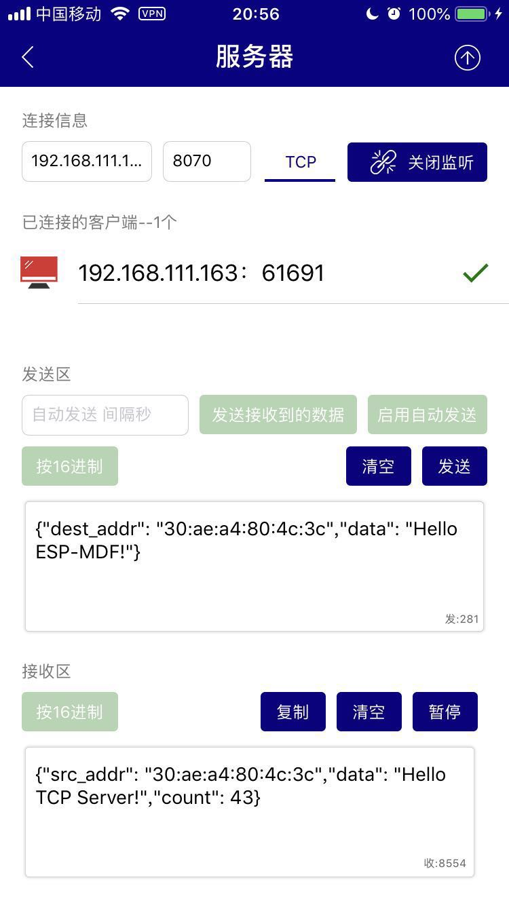

[[中文]](./README_cn.md)

# Mwifi Router Example

## Introduction

It introduces how to connect the devices to a remote external server based on `Mwifi` module APIs. To be specific, the devices transmit all the data to the root node via ESP-WIFI-MESH, and then the root node connects to a remote server with LWIP.

This example implements the functions of sending device data to a TCP server or sending data to a specific node or a specific group of nodes from a TCP server over the mesh network.

## Hardware

* At least 2 x ESP32 development boards
* 1 x router that supports 2.4G

## Process

### Run TCP server

1. Connect PC or the mobile phone to the router.
2. Use a TCP testing tool (any third-party TCP testing software) to create a TCP server.

> Note: This example uses the iOS [TCP_UDP](https://itunes.apple.com/cn/app/tcp-udp%E8%B0%83%E8%AF%95%E5%B7%A5%E5%85%B7/id1437239406?mt=8) tool.

### Configure the devices

Enter `make menuconfig`, and configure the followings under the submenu "Example Configuration".

 * The router information: If you cannot get the router's channel, please set it as 0, which indicates that the channel will be automatically acquired by the devices.
 * ESP-WIFI-MESH network: The network password length should be between 8 and 64 bits (both exclusive), and the network will not be encrypted if you leave the password blank.
 * TCP server: the information of the TCP server run on the PC

<div align=center>

<p> Configure the devices </p>
</div>

### Build and Flash

Make:
```shell
make erase_flash flash -j5 monitor ESPBAUD=921600 ESPPORT=/dev/ttyUSB0
```

CMake:
```shell
idf.py erase_flash flash monitor-b 921600 -p /dev/ttyUSB0
```

### Run

1. ESP-WIFI-MESH devices send the real-time device status to the TCP server at an interval of three seconds.
2. The TCP server sends data (in as format describe in the following section) to a specific address or group address:
	-  	When the destination address is `ff:ff:ff:ff:ff:ff`, it will send data to all devices.
	-  When the destination is a group address, it will send data to all the devices in this group.

<div align=center>

<p> TCP server </p>
</div>

### Data Format

The data format for TCP server communication:

```
{"dest_addr":"dest mac address","data":"content"}
{"group":"group address","data":"content"}
```

For Example:

```
{"dest_addr":"24:0a:c4:08:54:80","data":"Hello ESP-MDF!"}
{"group":"01:00:5e:ae:ae:ae","data":"Hello ESP-MDF!"}
```