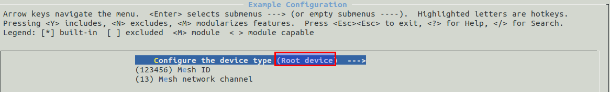
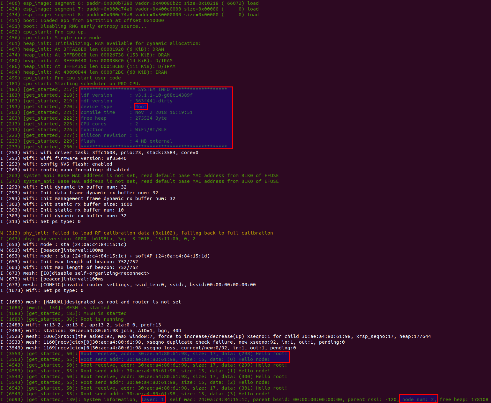

[[EN]](./README.md)

# get_started 示例

## 介绍

本示例将介绍如何快速组建一个无路由器 ESP-MESH 网络，其余的组网方案及详细使用方式参见：[examples/function_demo/mwifi](../function_demo/mwifi/README_cn.md)，在运行本示例之前请详细阅读 [README](../../README_cn.md) 和 [ESP-MESH](https://docs.espressif.com/projects/esp-idf/en/latest/api-guides/mesh.html) 文档。

## 配置

运行本示例，您至少需要准备两块开发板，一块配置为根节点，其余为非根节点，本示例默认为非根节点类型。

- 根节点：一个 ESP-MESH 网络中有且仅有一个根节点，通过 `MESH_ID` 和信道来区分不同的 `MESH` 网络
- 非根节点：包含叶子节点和中间节点，其根据网络情况自动选择父节点

你需要通过 `make menuconfig`，在 `Example Configuration` 子菜单下，配置一个设备为根节点，其余设备为非根节点。
您也可以在 `Component config -> MDF Mwifi` 子菜单下，配置 ESP-MESH 的最大层级、每层的连接数、广播包的间隔等参数。

 配置设备类型 

## 运行

1. 设置事件回调函数；
2. 初始化 wifi，启动 ESP-MESH；
3. 创建处理函数：
	- 非根节点：每隔三秒将会给根节点发送 `Hello root!` 数据包给根节点，并等待根节点的回复；
	- 根节点:收到数据后回复 `Hello node！`。
4. 创建定时器：定时打印 ESP-MESH 网络的层级，父节的信号强度及剩余内存。

根节点日志如下：

 根节点的日志 

