[[EN]](./README.md)

# Aliyun Linkkit 应用指南

## 注意事项
1.由于目前由于 aliyun sdk 网关设备对于子节点内存消耗较大,所以目前单个网络最大支持 30 个设备.
2.当前阿里云设备配网 LOG 信息为红色.
3.子设备在配网成功后会出现 UDP 错误,该问题是因为阿里 awss 配网成功后自动调用的绑定接口.
4.子节点重新登录时,会打印蓝色的警告信息,这个是因为 aliyun sdk 未添加网关重连接口.
5.example 中未添加解绑的接口,用户可以自助调用解绑,解绑接口只有网关节点有效.

## 概述
Aliyun Linkkit 是基于 [ESP-MESH](https://docs.espressif.com/projects/esp-idf/en/stable/api-guides/mesh.html) 的智能家居组网方案，可配套 阿里公版APP“云智能”使用，可以帮助用户更快捷的使用 ESP-MESH 应用于产品开发。

* ESP-MESH 作为主干网络用于长供电的场景中，设备可作为根节点（相当于网关）、中间根点和叶子节点,所有设备通过根节点登录到阿里服务器,进而完成间接通讯。
	- 支持 MESH 组网,并完成登录,用户操作无感知
	- 支持阿里 <云智能> APP 一键配网
	- 支持阿里 <云智能> APP 控制设备
	- 支持 天猫精灵控制(开关,颜色等)
	- 支持厂商 OTA 更新固件

### 快速开始

#### 1.阿里云平台部署

1. ** 新建产品`**： 需要为每个设备配置阿里注册的四元组信息
    >在 [智能生活开放平台](https://living.aliyun.com/#/) 创建产品, 参考[创建产品文档](https://living.aliyun.com/doc#readygo.html).

	<td >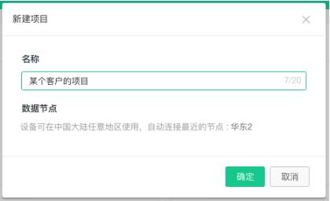</td>

2. ** 配置 `四元组信息与版本信息`**： 需要为每个设备配置阿里注册的四元组信息与当前版本信息
    ```shell
    make menuconfig ---> Component config  ---> Aliyun linkkit device key  --->
    ```
    <td ></td>

3. ** 配置 `设备参数` **：需要配置设备属性的参数信息
    ```shell
    make menuconfig ---> Example Configuration  --->  device driver config
    ```
4. ** 编译下载 **：`将配置好的代码编译为固件后下载到设备
    ```shell
   make -j5 erase_flash flash
    ```

5. ** Aliyun Linkkit SDK 路径**：`当前为 3.0.1 版本 Link Kit SDK`, 请参阅[`设备接入Link Kit SDK > C SDK`](https://help.aliyun.com/document_detail/96623.html)。
    ```shell
    esp-mdf/components/third_party/mdf-aliyun/iotkit-embedde
    ```

### 3.设备应用
1.** 设备进入配网模式 **： 当设备全擦除烧录后,默认会进入配网模式
> 设备上电进入配网模式 扫描信各道内 wifi 信息, 当设备连接 RGB 灯珠时, RGB 灯会进行 黄色闪烁的状态
<td >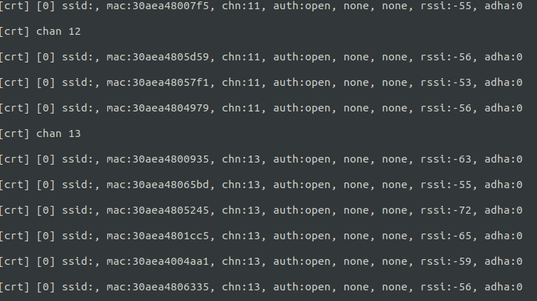</td>

2.** App 下载 **：手机从[智能生活开放平台](https://living.aliyun.com/doc#muti-app.html) 下载对应的 App
><td >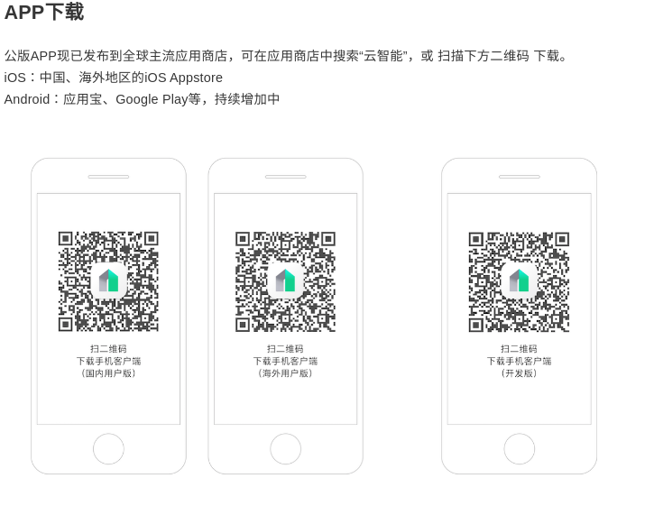</td>

3.** 设备配网 ** 注册账号并登录后,进入 APP, 点击右上角扫描按钮, 扫描第二步的二维码配网
> 使用手机 App 对设备进行配网
    <table>
            <td >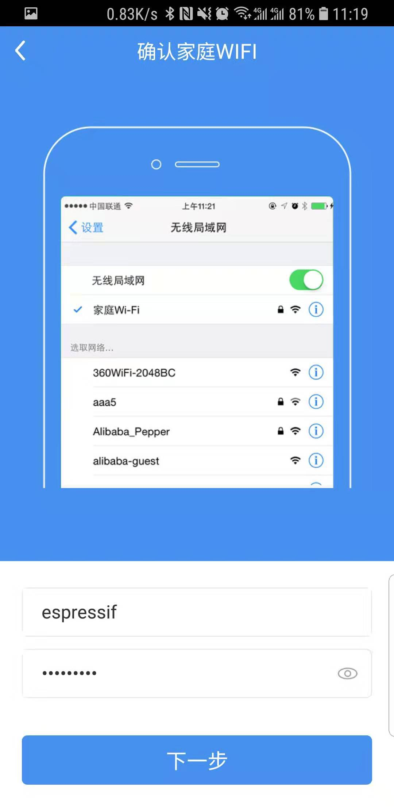</td>
            <td ></td>
            <td ></td>
    </table>

4.**设备控制**
> 使用手机 App 对设备进行控制 `示例为灯`
    <table>
            <td >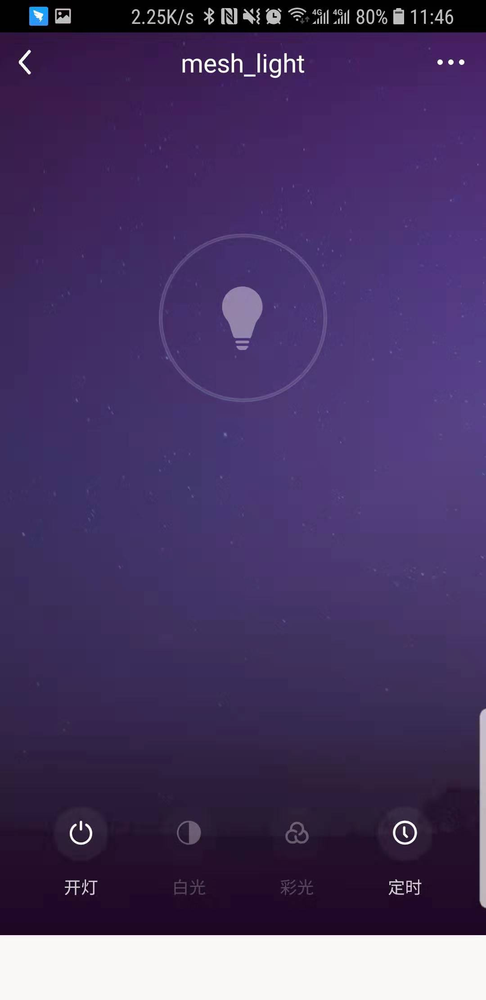</td>
            <td >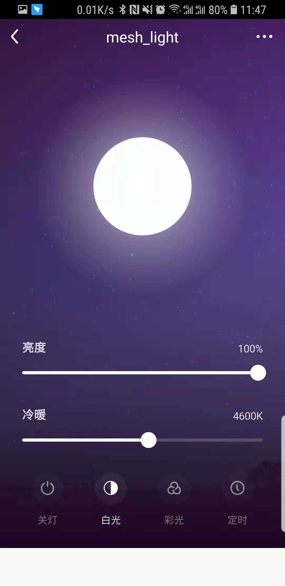</td>
            <td >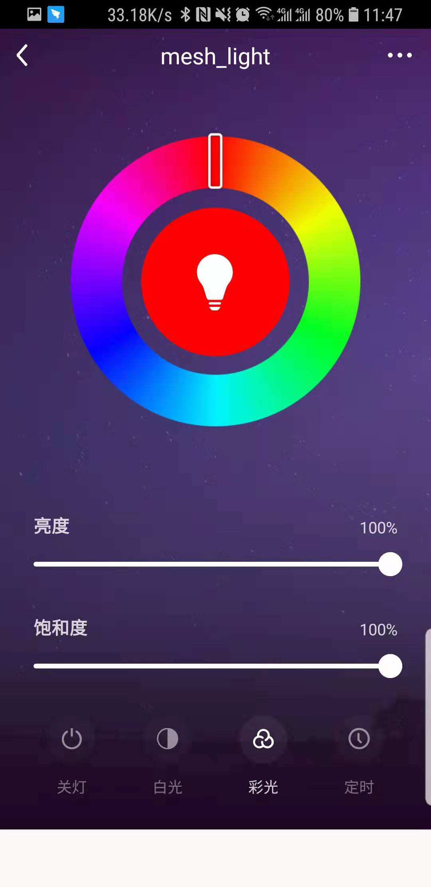</td>
    </table>

5.**配置使用天猫精灵控制**
><td >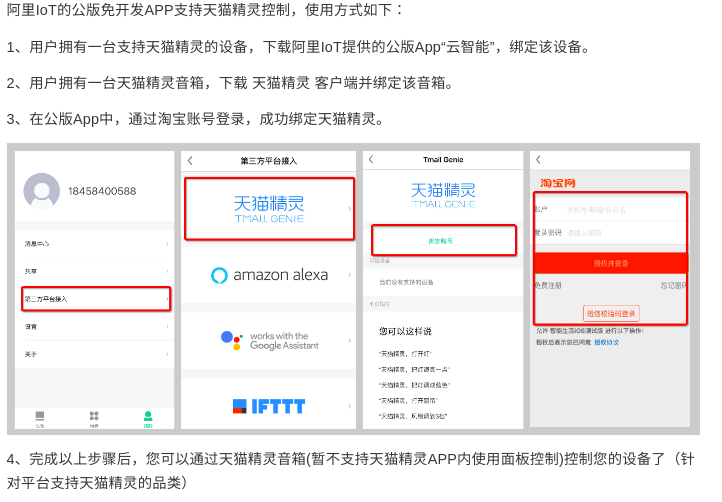</td>
>配置天猫精灵后点击 天猫精灵 APP 扫描到当前设备,即可控制当前配置设备.
>示例命令: 天猫精灵, 打开电灯,关闭电灯,把灯调成红色,把灯调成蓝色等.

6.**设备 OTA**

> 1.点击下图中右边的运营中心
> <td >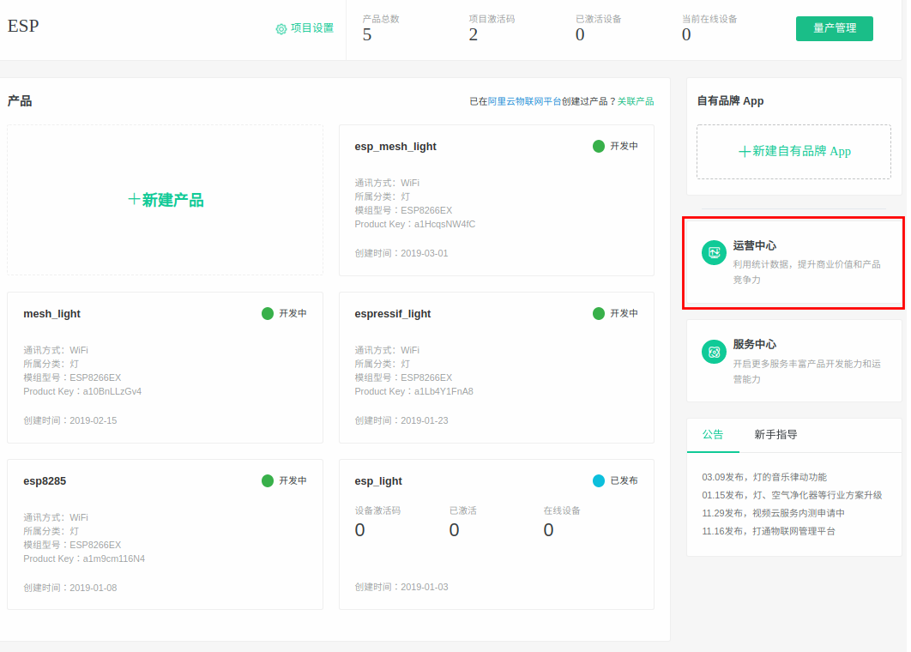</td>

> 2.点击下图中右边的添加固件
> <td ></td>

> 3 查看`menuconfig` 中配置的版本信息
> <td >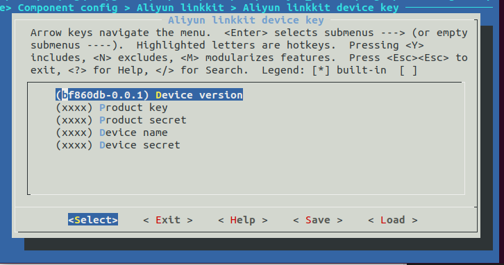</td>

> 4.填写图片中的固件信息,填写方式为 $Product key-$Device version
> `其中 Product key: a1HcqsNW4fC, Device version: bf860db-0.0.1, 中间符号为: -`
> <td >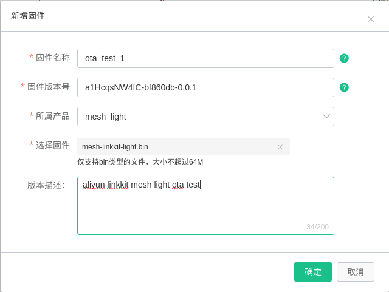</td>

> 5 OTA 固件验证(为了保证固件可用,需要在批量升级前进行少量设备 OTA 测试 )
> <td >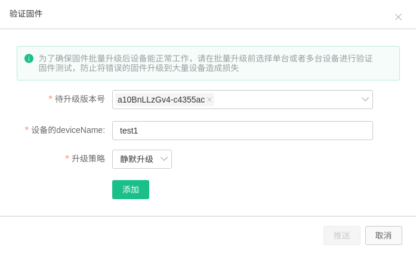</td>

> 6 OTA 固件会被推送下载到根节点,并按照版本号中的`ProductKey` 分发固件到对应的设备中
