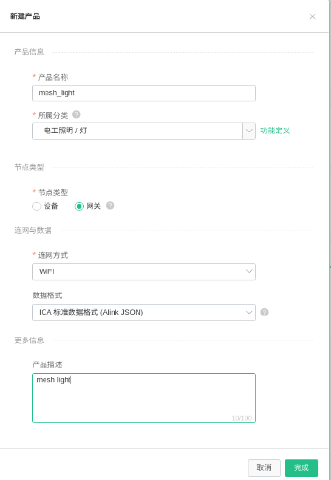
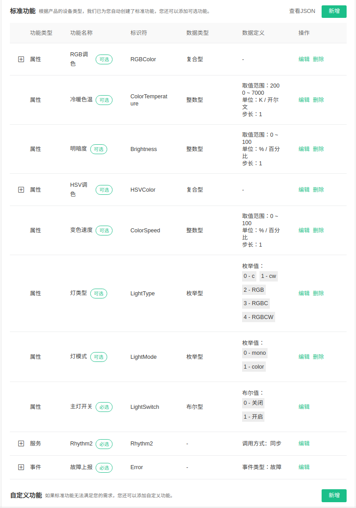
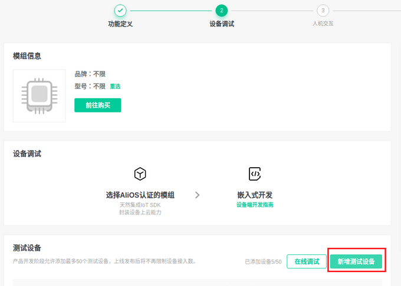
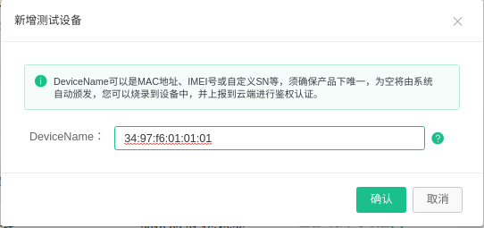
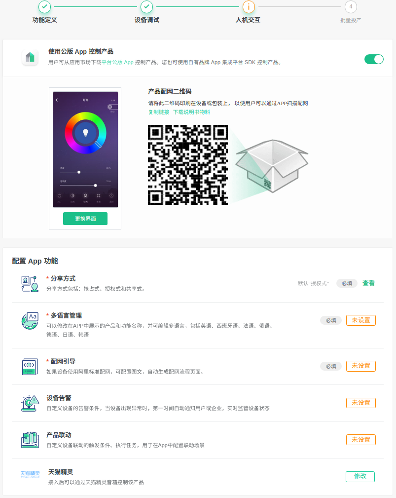
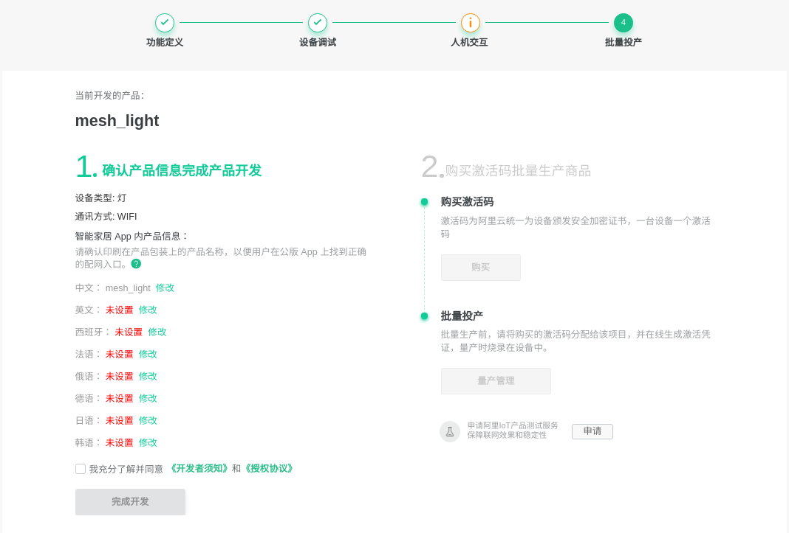
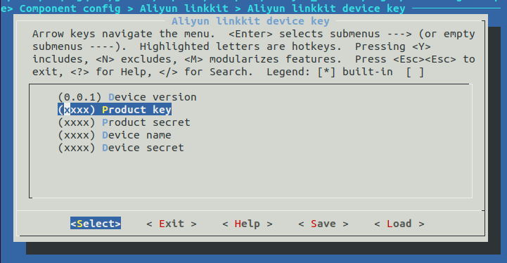

[[EN]](./README.md)

# Aliyun Linkkit Light 应用指南
---
## 注意事项
1.由于目前由于 aliyun sdk 网关设备对于子节点内存消耗较大,所以目前单个网络最大支持 30 个设备.
2.当前阿里云设备配网 LOG 信息为红色.
3.子设备在配网成功后会出现 UDP 错误,该问题是因为阿里 awss 配网成功后自动调用的绑定接口.
4.子节点重新登录时,会打印蓝色的警告信息,这个是因为 aliyun sdk 未添加网关重连接口.
5.example 中未添加解绑的接口,用户可以自助调用解绑,解绑接口只有网关节点有效.

## 概述
MAliyun Linkkit 是基于 [ESP-WIFI-MESH](https://docs.espressif.com/projects/esp-idf/en/stable/api-guides/mesh.html) 的智能家居组网方案,可配套 阿里公版APP“云智能”使用，用于调研和了解 ESP-WIFI-MESH，也可以进行二次开发。


### 1.阿里云平台部署
在 [智能生活开放平台](https://living.aliyun.com/#/) 创建产品, 参考[创建产品文档](https://living.aliyun.com/doc#readygo.html).

#### 1.新建产品: 选择所属分类为:`电工照明/灯`, 节点类型选择`网关`.
> <td ></td>

#### 2.功能定义: 根据设备特性,选择标准功能,点击`新增`
>当前应用 Demo 为 5路(WCRGB) PWM 照明灯
><td ></td>

#### 3.设备调试: 根据当前测试应用,点击`新增测试设备`
>新增测试设备,为后续测试注册`四元组`
><td ></td>
>
>输入设备名称,根据阿里要求自定义即可,当前测试使用mac地址
><td ></td>
>

#### 4.人机交互: 根据测试需要配置选择项
>点击按钮选择`使用公版 App 控制产品`
>点击`更换界面`更换自己喜欢的界面
>并保存旁边的`产品配网二维码`,后续配网需要该二维码
>如果需要可以优化后续选项
><td ></td>

#### 5.批量投产
> 测试阶段通过后,量产阶段需要完善产品信息
> 购买激活码,并且将激活码批量投产到该产品
><td ></td>

### 2.应用部署

1. ** 学习 MDF **:

2. ** 配置 `四元组信息`**： 需要为每个设备配置阿里注册的四元组信息
    ```shell
    make menuconfig ---> Component config  ---> Aliyun linkkit device key  --->
    ```
    <td ></td>

3. ** 配置 `设备参数` **：需要配置设备去掉等属性的参数信息
    ```shell
    make menuconfig ---> Example Configuration  --->  device driver config
    ```
     <td ></td>

4. ** 编译下载 **：`将配置好的代码编译为固件后下载到设备
    ```shell
   make -j5 erase_flash flash
    ```
### 3.硬件说明

[ESP32-MeshKit-Light](https://www.espressif.com/sites/default/files/documentation/esp32-meshkit-light_user_guide_cn.pdf) 支持 5 路 PWM IO 口，支持色温（CW）灯和彩色（RGB）灯调节，色温灯的输出功率为 9 W，彩色灯的输出功率为 3.5 W。

1. 内部模组视图和引脚排序

<div align=center>

<p> 内部模组视图 </p>
</div>

2. 引脚定义

|模块脚号 | 符号 | 状态 | 描述 | 
|:---:|:---:|:---:|:---|
|  1, 7 | GND | P| 接地脚|
| 2| CHIP_PU| I| 芯片使能（高电平有效），模块内部有上拉，为外部使能备用|
| 3 | GIPO32| I/O|RTC 32K_XP（32.768 kHz 晶振输入），功能扩展备用脚 | 
| 4 | GPIO33| I/O|RTC 32K_XN（32.768 kHz 晶振输入），功能扩展备用脚 |
| 5|GIPO0| I/O|IC 内部上拉，功能扩展备用脚 |
| 6| VDD3.3V|P | 模块供电脚，3V3|
| 8 | GPIO4|O | PWM_R 输出控制脚|
| 9 | GPIO16|O|PWM_G 输出控制脚，备用 UART 接口 (URXD)|
| 10 | GPIO5|O|PWM_B 输出控制脚，备用 UART 接口 (UTXD)|
| 11 | GPIO23|O |PWM_BR 输出控制脚 |
| 12 | GPIO19|O |PWM_CT 输出控制脚 |
| 13 | GPIO22| I/O|PWM 共用脚，功能扩展备用脚 |
| 14 | GPIO15| I|IC 内部上拉，功能扩展备用脚 |
| 15 | GPIO2| O|IC 内部下拉，功能扩展备用脚 |
| 16 | UORXD| I/O|UART 调试和软件烧录接口接收脚 |
| 17 | UOTXD| I/O|UART 调试和软件烧录接口发送脚|
| 19 | ANT| I/O| 外置天线输出脚 |
| 18, 20| GND | p| RF 接地|


## 灯的状态

1. 等待配网：黄色闪烁
2. 配网成功：绿色闪烁
3. 登录失败三次以上：蓝色常亮
4. 开始升级：淡蓝色闪烁三秒
5. 升级成功等待重启：蓝色闪烁
6. 异常重启：红色闪烁

> 注：连续上电三次（关 > 开 > 关 > 开 > 关 > 开）重置设备

