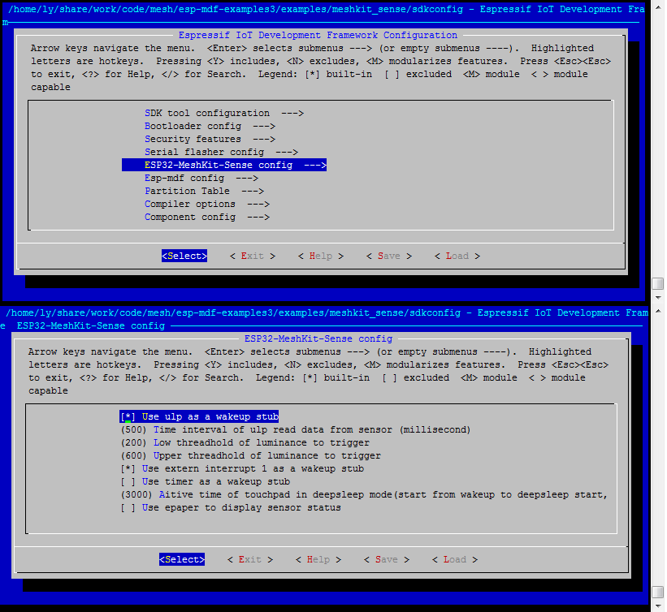
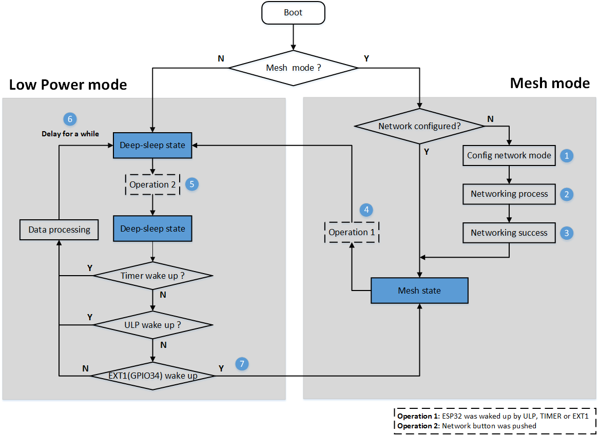

# ESP32-MeshKit-Sense 示例说明

ESP32-MeshKit-Sense 示例是对 ESP-MDF 设备类型的进一步扩充，在 ESP-Mesh 网络构建和通信的基础上，实现了 Mesh 网络内不同设备之间的联动控制功能，以及 Deep-sleep 低功耗方案。

## 0. ESP32-MeshKit-Sense 示例概述

[ESP32-MeshKit-Sense 开发板](https://www.espressif.com/sites/default/files/documentation/esp32-meshkit-sense_hardware_design_guidelines_cn.pdf) 集成了温湿度传感器 (HTS221)、光照强度传感器 (BH1750) 和状态指示灯外设。在本示例中，ESP32-MeshKit-Sense 通过检测外设传感器的状态变化，实现与其他设备的联动控制。同时，本示例还结合了 ESP32 在 Deep-sleep 模式下能够使用 ULP 读取传感器的功能，实现低功耗传感器方案。

> 关于 ESP32-MeshKit-Sense 与其他设备的联动控制，目前只支持根据光照强度传感器的数值，控制
 [ESP32-MeshKit-Light](https://www.espressif.com/sites/default/files/documentation/ESP32-MeshKit-Light_User_Guide__CN.pdf) 的开关，后续会增加通过检测温湿度传感器的数值，控制更多其他类型设备。

在进行 ESP32-MeshKit-Sense 开发之前，请详细阅读 [ESP-MDF 入门指南](https://github.com/espressif/esp-mdf/blob/master/docs/zh_CN/get-started/get_started_cn.md)，完成 [代码获取](https://github.com/espressif/esp-mdf/blob/master/docs/zh_CN/get-started/get_started_cn.md#%E8%8E%B7%E5%8F%96-esp-mdf)，[编译工具链](https://github.com/espressif/esp-mdf/blob/master/docs/zh_CN/get-started/get_started_cn.md#%E8%AE%BE%E7%BD%AE-esp-%E5%B7%A5%E5%85%B7%E9%93%BE) 安装，[ESP-MDF 路径设置](https://github.com/espressif/esp-mdf/blob/master/docs/zh_CN/get-started/get_started_cn.md#%E8%AE%BE%E7%BD%AE-esp-mdf-%E8%B7%AF%E5%BE%84) 等工作。

## 1. ESP32-MeshKit-Sense 示例准备

### 1.1. 硬件准备

* [ESP32-MeshKit-Sense 开发板](https://www.espressif.com/sites/default/files/documentation/esp32-meshkit-sense_hardware_design_guidelines_cn.pdf) 一个
* [ESP32-MeshKit-Light](https://www.espressif.com/sites/default/files/documentation/ESP32-MeshKit-Light_User_Guide__CN.pdf) 一个或数个
* [ESP-Prog 调试器](https://github.com/espressif/esp-iot-solution/blob/master/documents/evaluation_boards/ESP-Prog_guide_cn.md) （调试用，非必须）
* 墨水屏（非必须）
* 锂电池（可通过 Mini USB 供电，非必须）

<div align=center>

</div>

其中，ESP32-MeshKit-Sense 开发板硬件资源主要包括：

* 主控单元：ESP32 模组
* 供电单元：Mini USB 供电口和外接电池供电口
* 调试单元：ESP-Prog 调试器接口
* 显示单元：显示屏接口和 LED 指示灯
* 传感器单元：温湿度传感器 (HTS221) 和光照强度传感器 (BH1750)

<div align=center>

</div>

### 1.2. 配置 ULP 编译环境

关于 ESP32 的 ULP 协处理器简介和汇编编译环境设置，请参照 [文档链接](https://github.com/espressif/esp-iot-solution/blob/master/documents/low_power_solution/esp32_ulp_co-processor_and_assembly_environment_setup_cn.md)。

### 1.3. 示例配置

当硬件准备和编译环境准备完成后，可通过命令 `make menuconfig` 进行示例配置：

<div align=center>

<p> ESP32 Configurations </p>
</div>

本 ESP32-MeshKit-Sense 示例可配置的参数包括：Deep-sleep 唤醒源和延时睡眠时间：

* **ULP 唤醒**：如果 ULP 读取传感器的值满足唤醒条件，则将主 CPU 唤醒。如果设置了 ULP 唤醒，则需要继续配置以下参数
    * ULP 采集数据间隔：在低功耗工作模式下，ULP 每隔设置的时间间隔采集一次传感器数据；
    * 亮度阈值下限：当环境亮度低于阈值下限时，将主 CPU 唤醒；
    * 亮度阈值上限：当环境亮度高于阈值上限时，将主 CPU 唤醒。
* **GPIO 唤醒**：通过 WakeUp 按键 (GPIO34) 将主 CPU 唤醒，之后设备将一直保持在 Mesh 工作模式。
* **Timer 唤醒**：设置定时器，定时将主 CPU 唤醒（默认关闭）
    * 如果设置了 Timer 唤醒，需要进一步设置唤醒的间隔，即每隔多久唤醒设备，单位毫秒。
* **延时睡眠时间**：每次主 CPU 被唤醒后，需要延时一段时间后进入 Deep-sleep 状态，该延时时间即延时睡眠时间。

## 2. ESP32-MeshKit-Sense 示例运行

通过以下命令进行代码烧录，并启动日志监视程序： `make erase_flash flash monitor -j5`

如果在上述过程中没有错误，则 ESP32-MeshKit-Sense 开发板上的 Sensor 指示灯亮，表示设备正常上电运行。Network 指示灯会出现绿色慢闪，表示设备已进入 **配网模式**。下一步需要使用 [ESP-Mesh App for Android](hrttps://www.espressif.com/zh-hans/support/download/apps?keys=&field_technology_tid%5B%5D=18) 进行配网操作。

```
I (612) wifi: mode : sta (30:ae:a4:90:f3:c0)
D (614) mdf_event_loop: [mdf_event_loop_init, 121]:mdf_event_loop_init success
W (619) mdf_reboot_handle: [mdf_reboot_handle, 237]:reboot_num: 3, enter the configuration network mode
I (627) sense_main: [sensor_event_loop_cb, 105]:***********************************
I (636) sense_main: [sensor_event_loop_cb, 106]:*    ENTER CONFIG NETWORK MODE    *
I (644) sense_main: [sensor_event_loop_cb, 107]:***********************************
D (654) mdf_reboot_handle: [mdf_reboot_event_init, 308]:mdf_reboot_handle, ret: 0
I (660) mdf_device_handle: [mdf_device_init_handle, 936]:******************* SYSTEM INFO *******************
I (670) mdf_device_handle: [mdf_device_init_handle, 937]:idf version      : v3.1-dev-1395-g0e71cdc
I (680) mdf_device_handle: [mdf_device_init_handle, 940]:device version   : sensor_90f3c0-0.7.25-22
I (690) mdf_device_handle: [mdf_device_init_handle, 941]:compile time     : Jul 27 2018 14:42:40
I (699) mdf_device_handle: [mdf_device_init_handle, 942]:free heap        : 120500 B
I (707) mdf_device_handle: [mdf_device_init_handle, 943]:CPU cores        : 2
I (715) mdf_device_handle: [mdf_device_init_handle, 946]:function         : WiFi/BT/BLE
I (724) mdf_device_handle: [mdf_device_init_handle, 947]:silicon revision : 1
I (732) mdf_device_handle: [mdf_device_init_handle, 949]:flash            : 4 MB external
I (741) mdf_device_handle: [mdf_device_init_handle, 950]:**************************************************
I (751) ESPNOW: espnow [version: 1.0] init
I (756) sense_main: [sensor_event_loop_cb, 105]:***********************************
I (763) sense_main: [sensor_event_loop_cb, 106]:*    ENTER CONFIG NETWORK MODE    *
I (772) sense_main: [sensor_event_loop_cb, 107]:***********************************
I (780) BTDM_INIT: BT controller compile version [7b64b4e]

I (787) system_api: Base MAC address is not set, read default base MAC address from BLK0 of EFUSE
I (1064) mdf_blufi_network_config: [mdf_blufi_init, 527]:bt addr: 30:ae:a4:90:f3:c2
I (1065) mdf_blufi_network_config: [mdf_blufi_init, 528]:blufi version: 0102
I (1072) mdf_blufi_network_config: [mdf_blufi_event_callback, 372]:blufi init finish
I (1078) mdf_blufi_network_config: [mdf_blufi_set_name, 279]:mdf blufi name: MESH_22_90f3c2
I (2077) mdf_network_config: [mdf_network_handle, 296]:generate RSA public and private keys
D (3618) mdf_reboot_handle: [mdf_reboot_num_clear, 289]:erase reboot number
```

### 2.1. 示例工作模式

ESP32-MeshKit-Sense 具有两种工作模式：Mesh 工作模式和低功耗工作模式。

#### 2.1.1. Mesh 工作模式

初次上电后，默认进入 Mesh 工作模式。ESP32-MeshKit-Sense 在 Mesh 工作模式时，既是一个普通的 Mesh 设备，具有 ESP-MDF 提供的各种功能，包括配网、组网、控制、升级等。Network 指示灯可用于指示设备的网络状态：

* 慢闪：配网状态
* 快闪：组网状态
* 常亮：组网成功

#### 2.1.2. 低功耗工作模式

为了便利传感器方案的开发，ESP-MDF 特别设计了低功耗工作模式，本示例属于 [数据采集或异常检测（不支持 GPIO 触发、不需要频繁上传数据）](https://github.com/espressif/esp-iot-solution/blob/master/documents/low_power_solution/esp32_lowpower_solution_cn.md#%E6%95%B0%E6%8D%AE%E9%87%87%E9%9B%86%E6%88%96%E5%BC%82%E5%B8%B8%E6%A3%80%E6%B5%8B%E4%B8%8D%E6%94%AF%E6%8C%81-gpio-%E8%A7%A6%E5%8F%91%E4%B8%8D%E9%9C%80%E8%A6%81%E9%A2%91%E7%B9%81%E4%B8%8A%E4%BC%A0%E6%95%B0%E6%8D%AE) 的应用场景。具体功耗情况，请参考 [ESP32 低功耗方案概述](https://github.com/espressif/esp-iot-solution/blob/master/documents/low_power_solution/esp32_lowpower_solution_cn.md)。

在低功耗工作模式下，ESP32-MeshKit-Sense 有两种状态：

* Deep-sleep 状态：主 CPU 关闭，系统以极低的功耗运行，同时 ULP 定期采集传感器数据；
* ESP-NOW 状态：只启动 ESP-NOW 进行数据收发，不运行 Mesh，也不具备 ESP-MDF 提供的任何功能。数据收发完成后会有一段时间的延时，之后继续进入 Deep-sleep 状态。

两种状态之间的切换条件如下：

* 从 Deep-sleep 状态切换到 ESP-NOW 状态：环境亮度高于设置的亮度阈值上限，或低于设置的亮度阈值下限；
* 从 ESP-NOW 状态切换到 Deep-sleep 状态：无需人为操作，延时一段时间（默认为 3 秒，可配置）后自动进入 Deep-sleep 状态。

#### 2.2.3. 工作模式切换操作

ESP32-MeshKit-Sense 通过 WakeUp 按键 (GPIO34) 进行 Mesh 工作模式和低功耗工作模式之间的切换。

> 关于 ESP32-MeshKit-Sense 工作模式的切换，请参考 `2.2 章节` 示例操作图中的 4、5、6、7 过程。

### 2.2. 示例操作流程

<div align=center>

<p> ESP32-MeshKit-Sense Workflow </p>
</div>

以下就上图中的主要过程进行介绍：

1. 初次上电，ESP32-MeshKit-Sense 中无配网信息，Network 指示灯慢闪，表明设备已进入 **配网状态**；
2. 使用 ESP32-Mesh App 进行配网，此时 Network 指示灯快闪，表明设备已进入 **组网状态**；
3. 配网成功后，Network 指示灯常亮，表示设备 **组网成功**，此时设备处于 Mesh 工作模式；
4. 按下 WakeUp 按键 (GPIO34)，ESP32-MeshKit-Sense 将会进入低功耗工作模式；
5. 在低功耗工作模式下，ULP 会定时读取传感器的数值，并根据设置的触发条件唤醒 ESP32-MeshKit-Sense；
6. ESP32-MeshKit-Sense 被唤醒之后进入 ESP-NOW 状态，进行一定的数据处理，在数据处理完成后，延时固定时间（默认 3 秒，可配置）后继续进入 Deep-sleep 状态；
7. 在 Deep-sleep 状态下，按下 WakeUp 按键（GPIO34），设备将切换到 Mesh 工作模式。

关于本地联动控制功能的使用，需要按照以下步骤进行设置：

1. 将 ESP32-MeshKit-Sense 和 ESP32-MeshKit-Light 配置成同一个 Mesh 网络；
2. 使用 ESP32-Mesh App 将两种设备进行关联，此时，
    * 若环境亮度低于设定的阈值下限，ESP32-MeshKit-Sense 将控制 ESP32-MeshKit-Light 打开；
    * 若环境亮度高于设定的阈值上限，ESP32-MeshKit-Sense 将控制 ESP32-MeshKit-Light 关闭。
3. 按下 ESP32-MeshKit-Sense 上的 WakeUp 按键，ESP32-MeshKit-Sense 开发板上将只有 Sensor 指示灯闪烁，此时说明 ESP32-MeshKit-Sense 已进入低功耗工作模式，此时 ULP 正在运行并定时（默认 500 毫秒，可配置）读取传感器数值，
    * 使用遮挡物将光照强度传感器挡住，此时 ESP32-MeshKit-Sense 将会被唤醒，并控制 ESP32-MeshKit-Light 打开，一段时间后再次进入低功耗工作模式；
    * 使用强光照射光照强度传感器，此时 ESP32-MeshKit-Sense 将会被唤醒，并控制 ESP32-MeshKit-Light 关闭，一段时间后再次进入低功耗工作模式。

## 3. ULP 相关操作

### 3.1 设置唤醒触发条件

在 `meshkit_sense/sense_driver/ulp_operation` 目录下有设定相应触发条件的接口：

* set_ulp_hts221_humidity_threshold(...); // 设定湿度传感器触发 ESP32-MeshKit-Sense 唤醒的阈值，包括最大值、最小值和变化量
* set_ulp_hts221_temperature_threshold(...); // 设定温度传感器触发 ESP32-MeshKit-Sense 唤醒的阈值，包括最大值、最小值和变化量
* set_ulp_bh1750_luminance_threshold(...); // 设定光照强度传感器触发 ESP32-MeshKit-Sense 唤醒的阈值，包括最大值、最小值和变化量

> 注：根据变化量进行唤醒指以 ESP32-MeshKit-Sense 进入 Deep-sleep 模式时读取的传感器值作为初始值，在 ESP32-MeshKit-Sense 进入 Deep-sleep 模式后，将 ULP 读取的对应的传感器值与初始值之间做差值运算，若结果大于设定变化量时，就会触发 ESP32-MeshKit-Sense 唤醒。例如：将变化量设定为 100，在进入 Deep-sleep 模式时传感器的数值为 400，当 ULP 读取到的对应传感器的值小于 300 或者大于 500 就会进行唤醒 ESP32-MeshKit-Sense。

### 3.2 获取 ULP 读到的数据

在 ESP32-MeshKit-Sense 被唤醒之后，可以使用以下三个接口获取在 Deep-sleep 模式下 ULP 读取的最新数值：

* get_ulp_bh1750_luminance(...); // 获取湿度值
* get_ulp_hts221_temperature(...); // 获取温度值
* get_ulp_hts221_humidity(...); // 获取亮度值

## 4. 驱动说明

本示例中的硬件驱动全部使用了 [esp-iot-solution](https://github.com/espressif/esp-iot-solution) 中的相关驱动代码，可通过仓库链接进行代码更新。

## 5. 相关资源

* [ESP-MDF 入门指南](https://github.com/espressif/esp-mdf/blob/master/docs/zh_CN/get-started/get_started_cn.md)
* [ESP-MESH 介绍](https://esp-idf.readthedocs.io/en/latest/api-guides/mesh.html)
* [ESP-NOW 介绍](https://esp-idf.readthedocs.io/en/latest/api-reference/wifi/esp_now.html)
* [Deep Sleep Wake Stubs 介绍](https://esp-idf.readthedocs.io/en/latest/api-guides/deep-sleep-stub.html)
* [ESP32-MeshKit-Sense 硬件设计指南](https://www.espressif.com/sites/default/files/documentation/esp32-meshkit-sense_hardware_design_guidelines_cn.pdf)
* [ESP32-MeshKit-Light 用户指南](https://www.espressif.com/sites/default/files/documentation/ESP32-MeshKit-Light_User_Guide__CN.pdf)
* [ESP-Prog 下载与调试板介绍](https://github.com/espressif/esp-iot-solution/blob/master/documents/evaluation_boards/ESP-Prog_guide_cn.md)
* [ESP32 的 ULP 协处理器简介和汇编编译环境设置](https://github.com/espressif/esp-iot-solution/blob/master/documents/low_power_solution/esp32_ulp_co-processor_and_assembly_environment_setup_cn.md)
* [ESP32 低功耗方案概述](https://github.com/espressif/esp-iot-solution/blob/master/documents/low_power_solution/esp32_lowpower_solution_cn.md)
* [下载 ESP-Mesh App for Android](https://www.espressif.com/zh-hans/support/download/apps?keys=&field_technology_tid%5B%5D=18)
* [驱动代码](https://github.com/espressif/esp-iot-solution/tree/master/components)
