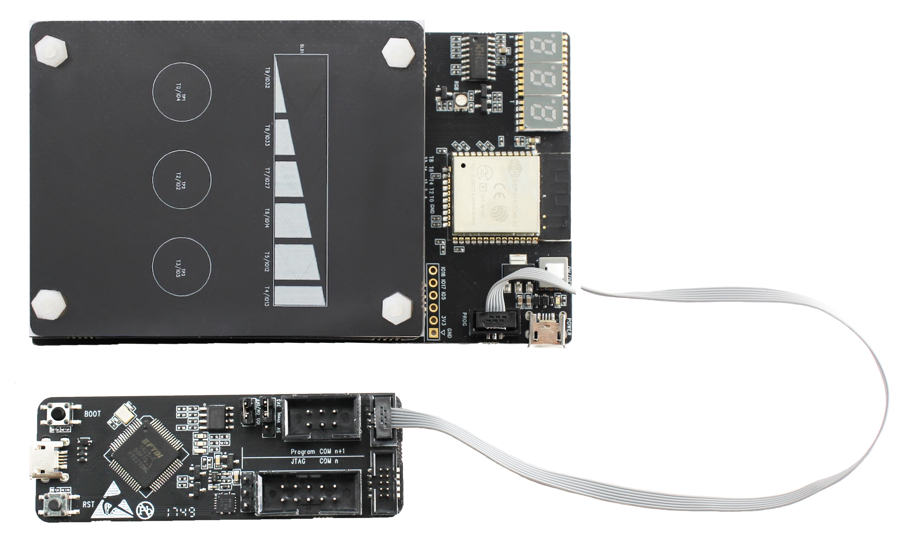
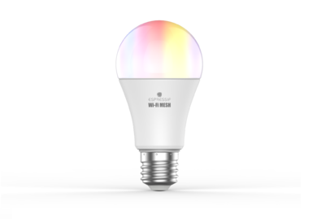
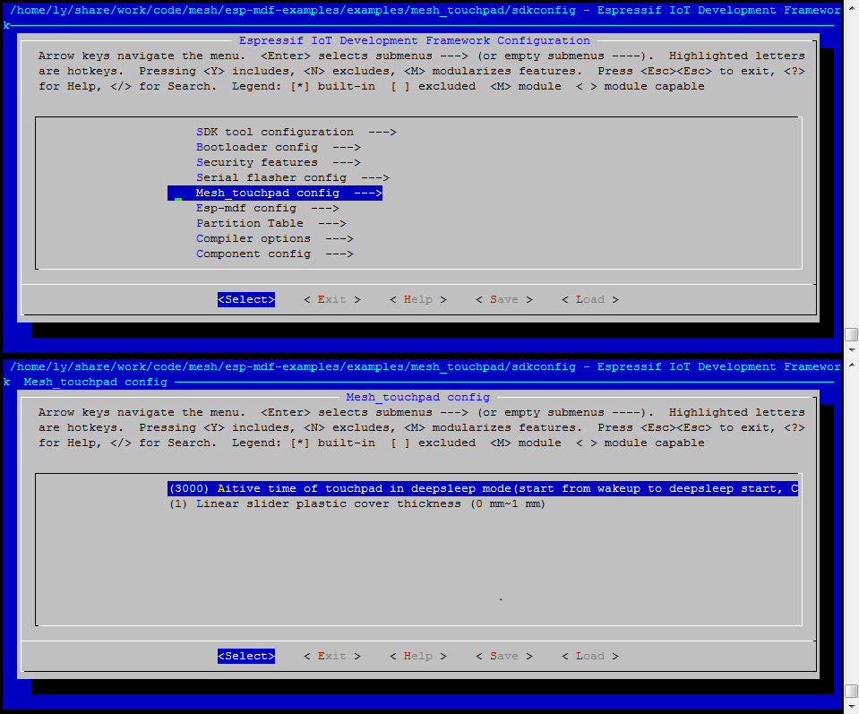
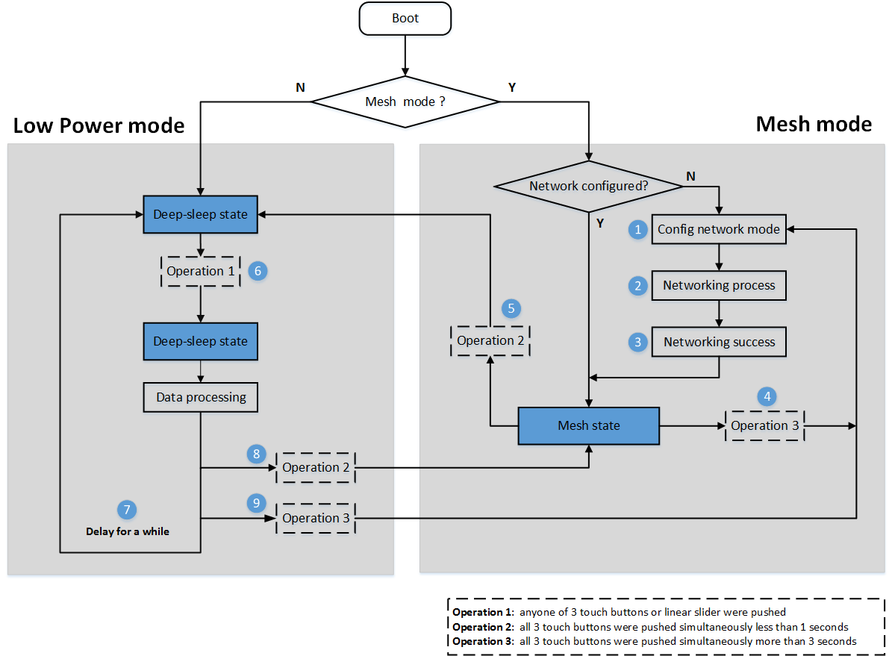

# Mesh-Touchpad 示例说明

Mesh-Touchpad 示例是对 ESP-MDF 设备类型的进一步扩充，在 ESP-Mesh 具有的网络构建和通信的基础上，实现了 Mesh 网络内不同设备之间的联动控制功能，以及 Deep-sleep 低功耗方案。

## 0. Mesh-Touchpad 示例概述

Mesh-Touchpad 示例基于 Espressif 开发的 [ESP32-Sense Kit 套件](https://github.com/espressif/esp-iot-solution/blob/master/documents/evaluation_boards/esp32_sense_kit_guide_cn.md) 所开发。该套件包含一个主板和若干子板，如下所示：

<div align=center>

</div>

> 目前该示例的代码仅支持线性滑条（Linear Slider）子板，关于其他类型子板的程序开发请参考 [ESP32 触摸功能开发套件](https://github.com/espressif/esp-iot-solution/blob/master/examples/touch_pad_evb)。

在进行 Mesh-Touchpad 开发之前，请详细阅读 [ESP-MDF 入门指南](https://github.com/espressif/esp-mdf/blob/master/docs/zh_CN/get-started/get_started_cn.md)，完成 [代码获取](https://github.com/espressif/esp-mdf/blob/master/docs/zh_CN/get-started/get_started_cn.md#%E8%8E%B7%E5%8F%96-esp-mdf)，[编译工具链](https://github.com/espressif/esp-mdf/blob/master/docs/zh_CN/get-started/get_started_cn.md#%E8%AE%BE%E7%BD%AE-esp-%E5%B7%A5%E5%85%B7%E9%93%BE) 安装，[ESP-MDF 路径设置](https://github.com/espressif/esp-mdf/blob/master/docs/zh_CN/get-started/get_started_cn.md#%E8%AE%BE%E7%BD%AE-esp-mdf-%E8%B7%AF%E5%BE%84) 等工作。

## 1. Mesh-Touchpad 示例准备

### 1.1. 硬件准备

* [ESP32-Sense 开发套件](https://github.com/espressif/esp-iot-solution/blob/master/documents/evaluation_boards/esp32_sense_kit_guide_cn.md) 中主板和线性滑条子板
* [ESP32-MeshKit-Light](https://www.espressif.com/sites/default/files/documentation/esp32-meshkit-light_user_guide_cn.pdf) 一个或数个
* [ESP-Prog](https://github.com/espressif/esp-iot-solution/blob/master/documents/evaluation_boards/ESP-Prog_guide_cn.md) 调试器（调试用，非必须）

<table><tr>
<td ></td>
<td ></td>
</tr>
<tr>
<td align="center"> ESP32-Sense </td>
<td align="center"> ESP32-MeshKit-Light </td>
</tr>
</table>

其中，主板硬件资源包括：

* 主控单元：ESP32 模组
* 供电单元：Mini USB 供电口
* 调试单元：ESP-Prog 调试器接口
* 显示单元：数码管和 RGB 三色灯电路

<div align=center>

</div>

### 1.2. 示例配置

通过命令 `make menuconfig` 进行示例配置：

<div align=center>

</div>

本 Mesh-Touchpad 示例可配置的参数包括：

* Mesh-Touchpad 不同硬件的参数配置
    * 当使用不同厚度或不同材质的盖板时，需要重新设置各通道触摸变化率参数，填写到文件 `main/include/touchpad.h` 中。详细设置过程请参考 [ESP32-Sense Kit 参数配置](https://github.com/espressif/esp-iot-solution/blob/master/documents/evaluation_boards/esp32_sense_kit_guide_cn.md#51-参数配置)
* Mesh-Touchpad 示例配置
    * 延时睡眠时间：每次主 CPU 被唤醒后，需要延时一段时间后进入 Deep-sleep 状态，该延时时间即延时睡眠时间；
    * 塑料盖板厚度：浮点数值，取值范围为 0 ~ 1（单位 mm）。

## 2. Mesh-Touchpad 示例运行

通过以下命令进行代码烧录，并启动日志监视程序： `make erase_flash flash monitor -j5`

如果在上述过程中没有错误，Mesh-Touchpad 开发板上的 RGB 三色灯会表现为黄色闪烁，表示设备已进入 **配网状态**。下一步需要使用 [ESP-Mesh App for Android](hrttps://www.espressif.com/zh-hans/support/download/apps?keys=&field_technology_tid%5B%5D=18) 进行配网操作。

```
I (904) wifi: mode : sta (30:ae:a4:30:77:90)
D (907) mdf_event_loop: [mdf_event_loop_init, 121]:mdf_event_loop_init success
D (908) mdf_reboot_handle: [mdf_reboot_event_init, 308]:mdf_reboot_handle, ret: 0
I (913) mdf_device_handle: [mdf_device_init_handle, 936]:******************* SYSTEM INFO *******************
I (923) mdf_device_handle: [mdf_device_init_handle, 937]:idf version      : v3.1-dev-1395-g0e71cdc
I (933) mdf_device_handle: [mdf_device_init_handle, 940]:device version   : touch_pad_307790-v0.0.1-12
I (943) mdf_device_handle: [mdf_device_init_handle, 941]:compile time     : Jul 27 2018 10:55:23
I (952) mdf_device_handle: [mdf_device_init_handle, 942]:free heap        : 133052 B
I (961) mdf_device_handle: [mdf_device_init_handle, 943]:CPU cores        : 2
I (969) mdf_device_handle: [mdf_device_init_handle, 946]:function         : WiFi/BT/BLE
I (977) mdf_device_handle: [mdf_device_init_handle, 947]:silicon revision : 1
I (985) mdf_device_handle: [mdf_device_init_handle, 949]:flash            : 4 MB external
I (994) mdf_device_handle: [mdf_device_init_handle, 950]:***************************************************
I (1005) ESPNOW: espnow [version: 1.0] init
I (1009) touchpad_main: [touchpad_event_loop_cb, 41]:***********************************
I (1017) touchpad_main: [touchpad_event_loop_cb, 42]:*      ENTER CONFIG NETWORK       *
I (1026) touchpad_main: [touchpad_event_loop_cb, 43]:***********************************
I (1035) BTDM_INIT: BT controller compile version [7b64b4e]

I (1042) system_api: Base MAC address is not set, read default base MAC address from BLK0 of EFUSE
I (1304) mdf_blufi_network_config: [mdf_blufi_init, 527]:bt addr: 30:ae:a4:30:77:92
I (1304) mdf_blufi_network_config: [mdf_blufi_init, 528]:blufi version: 0102
I (1311) mdf_blufi_network_config: [mdf_blufi_event_callback, 372]:blufi init finish
I (1318) mdf_blufi_network_config: [mdf_blufi_set_name, 279]:mdf blufi name: MESH_12_307792
I (1702) mdf_network_config: [mdf_network_handle, 296]:generate RSA public and private keys
D (3908) mdf_reboot_handle: [mdf_reboot_num_clear, 289]:erase reboot number
```

### 2.1. Mesh-Touchpad 显示单元说明

1. RGB 三色灯指示：
    * 网络状态指示
        * 黄闪：配网状态
        * 绿闪：组网状态
        * 红闪：组网失败状态
        * 蓝色：组网成功状态
    * 工作模式指示
        * 蓝色：Mesh 工作模式
        * 绿色：低功耗工作模式
    * 错误指示
        * 红色：系统错误

2. 七段数码管指示：
    * 显示 Linear Slider 的检测值（没有盖板：0~150，盖板厚度 0~1mm：0~255）
    * 指示 touch button 触摸点（三个 touch button 分为：左，中，右。当按下左侧 touch button，显示 "100"；同理，按下中间和右侧的 touch button 时，显示 "010" 和 "001"）

### 2.2. Mesh-Touchpad 工作模式说明

Mesh-Touchpad 具有两种工作模式：Mesh 工作模式和低功耗工作模式。

#### 2.2.1. Mesh 工作模式

初次上电后，默认进入 Mesh 工作模式。Mesh-Touchpad 在 Mesh 工作模式时，既是一个普通的 Mesh 设备，具有 ESP-MDF 提供的各种功能，包括配网、组网、控制、升级等。RGB 三色灯可用于指示设备的网络状态：

* 黄闪：配网状态
* 绿闪：组网状态
* 红闪：组网失败状态
* 蓝色：组网成功状态

#### 2.2.2. 低功耗工作模式

为了便利传感器方案的开发，ESP-MDF 特别设计了低功耗工作模式，本示例属于 [使用 Touchpad 触摸/GPIO 按键唤醒的用户交互场景（如控制面板）](https://github.com/espressif/esp-iot-solution/blob/master/documents/low_power_solution/esp32_lowpower_solution_cn.md) 的用户交互场景，在 Deep-sleep 状态下，当设置唤醒源为 touchpad 唤醒时，芯片的平均电流大约为 50 uA。

> 更多关于 ESP32 低功耗方案，请参考 [ESP32 低功耗方案概述](https://github.com/espressif/esp-iot-solution/blob/master/documents/low_power_solution/esp32_lowpower_solution_cn.md)。

在低功耗工作模式下，Mesh-Touchpad 会有两种状态：

* Deep-sleep 状态：主 CPU 关闭，系统以极低的功耗运行；
* ESP-NOW 状态：只启动 ESP-NOW 进行数据收发，不运行 Mesh，也不具备 ESP-MDF 提供的任何功能。数据收发完成后会进行一段时间的延时，之后继续进入 Deep-sleep 状态。

两种状态之间的切换操作：

* 从 Deep-sleep 状态切换到 ESP-NOW 状态：按下任意一个 touch button 或者 linear slider；
* 从 ESP-NOW 状态切换到 Deep-sleep 状态：无需人为操作，延时一段时间（默认 3 秒，可配置）后自动进入 Deep-sleep 状态；

#### 2.2.3. 工作模式切换操作

* 从 Mesh 工作模式切换到低功耗工作模式：同时按下三个 touch button（按压时间小于 1s）；
* 从低功耗工作模式切换到 Mesh 工作模式：需要先将 Mesh-Touchpad 唤醒，切换到 ESP-NOW 工作状态，之后同时按下三个 touch button（按压时间小于 1s）。

> 关于 Mesh-Touchpad 工作模式的切换，请参考本文档 `2.3 章节` 示例操作图中 4、5、6、8、9 过程。

### 2.3. 示例操作

<div align=center>

<p> Mesh-Touchpad Workflow </p>
</div>

以下就上图中的主要过程进行介绍

1. 初次上电，Mesh-Touchpad 中无配网信息，RGB 三色灯黄闪，表明设备已进入 **配网状态**；
2. 使用  ESP32-Mesh App 进行配网，此时 RGB 三色灯绿闪，表明设备已进入 **组网状态**；
3. 配网成功后，RGB 三色灯蓝色绿色常亮，表示设备 **组网成功**。此时设备处于 Mesh 工作模式；
4. 设备处于 Mesh 工作模式，若检测到三个 touch button 被同时按下，且按压时间超过 3s，此时 Mesh-Touchpad 将会进入 **配网状态**；
5. 在 Mesh 工作模式下，同时按下三个 touch button （按压时间小于 2s），Mesh-Touchpad 将会进入低功耗工作模式；
6. 在低功耗工作模式下，系统会实时监测 Touchpad 引脚 (TOUCH_PAD_NUM0 ~ TOUCH_PAD_NUM9），如果有手指触摸某一 touch button 或 linear slider，相对应的 Touchpad 引脚会唤醒 Mesh-Touchpad；
7. Mesh-Touchpad 被唤醒后进入 ESP-NOW 状态，启动 ESP-NOW 进行一定的数据处理，在处理完成后，延时固定时间（默认 3 秒，可配置）后继续进入 Deep-sleep 状态；
8. 在 Mesh-Touchpad 被唤醒后，若检测到三个 touch button 被同时按下（按压时间小于 2s），此时 Mesh-Touchpad 将会进入 Mesh 工作模式；
9. 在 Mesh-Touchpad 被唤醒后，若检测到三个 touch button 被同时按下，且按压时间超过 3s，此时 Mesh-Touchpad 将会进入 Mesh 工作模式，并进入 **配网状态**。

关于本地联动控制功能的使用，需要按照以下步骤进行设置：

1. 使用 ESP32-Mesh App 将 Mesh-Touchpad 和 ESP32-MeshKit-Light 配置成同一个 Mesh 网络；
2. 使用 ESP32-Mesh App 将两种设备进行关联；
3. 从左至右，依次按下 Mesh-Touchpad 的三个 touch button，ESP32-MeshKit-Light 将分别显示红色，绿色和蓝色；滑动 Linear Slider，ESP32-MeshKit-Light 将发生亮度渐变；

## 4. 驱动说明

本示例中的硬件驱动全部使用了 [esp-iot-solution](https://github.com/espressif/esp-iot-solution) 中的相关驱动代码，可通过仓库链接进行代码更新。

## 5. 相关资源

* [ESP-MDF 入门指南](https://github.com/espressif/esp-mdf/blob/master/docs/zh_CN/get-started/get_started_cn.md)
* [ESP-MESH 介绍](https://esp-idf.readthedocs.io/en/latest/api-guides/mesh.html)
* [ESP-NOW 介绍](https://esp-idf.readthedocs.io/en/latest/api-reference/wifi/esp_now.html)
* [Deep Sleep Wake Stubs 介绍](https://esp-idf.readthedocs.io/en/latest/api-guides/deep-sleep-stub.html)
* [ESP32-MeshKit-Light 用户指南](https://www.espressif.com/sites/default/files/documentation/esp32-meshkit-light_user_guide_cn.pdf)
* [ESP-Prog 下载与调试板介绍](https://github.com/espressif/esp-iot-solution/blob/master/documents/evaluation_boards/ESP-Prog_guide_cn.md)
* [ESP32 低功耗方案概述](https://github.com/espressif/esp-iot-solution/blob/master/documents/low_power_solution/esp32_lowpower_solution_cn.md)
* [触摸传感器应用设计参考文档](https://github.com/espressif/esp-iot-solution/blob/master/documents/touch_pad_solution/touch_sensor_design_cn.md)
* [下载 ESP-Mesh App for Android](hrttps://www.espressif.com/zh-hans/support/download/apps?keys=&field_technology_tid%5B%5D=18)
* [驱动代码](https://github.com/espressif/esp-iot-solution/tree/master/components)
