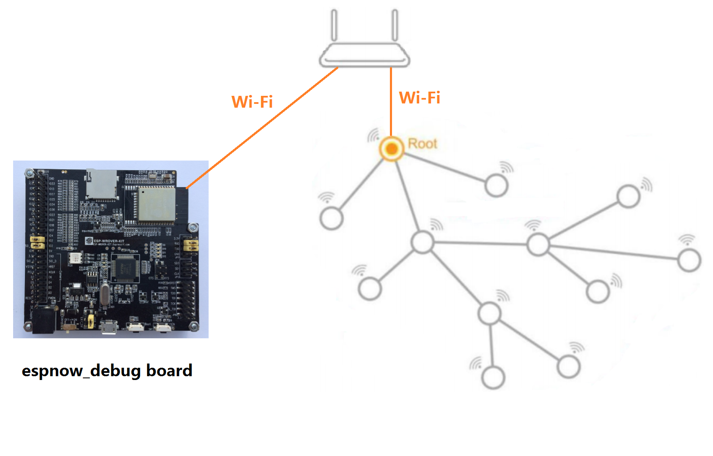
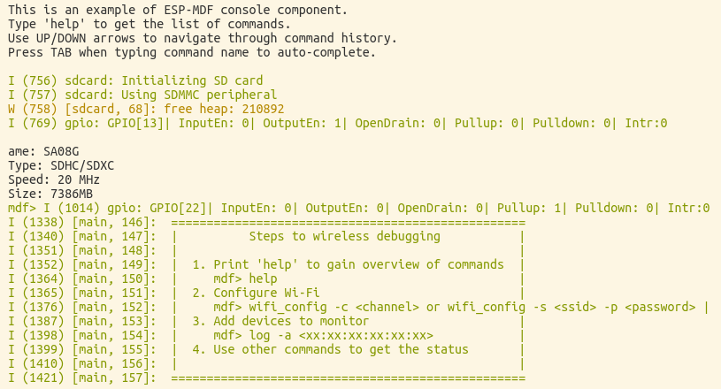

[[中文]](./README_cn.md)

# ESP-NOW Debug Receiver Board Demo

ESP-NOW debug receiver board can receive debugging data from ESP-MESH devices only when the board is on the same Wi-Fi channel with the devices.

<div align=center>

</div>

> If the ESP-NOW debug receiver board is on the same channel with ESP-MESH network, you don't need to connect the borad with the router.

ESP-NOW debug receiver board provides the following features:

 - [SD card file management](#Commands-for-SD-Card-Files): lists all files in current SD card, deletes specific files, and prints file contents optionally in some formats such as hex, string or base64.
 
 - [Sniffer listening for surrounding IEEE 802.11 packages](#Sniffer-Command): captures packages and saves them in pcap format in SD card, specifies the name of the file to save captured packages, sets package filters, and specifies a channel to listen for.
 
 - [Wi-Fi configuration](#Wi-Fi-Command): sets Wi-Fi information needed in STA mode, including router SSID, password, BSSID and work channel, and saves/erases the configuration information.
 
 - [Wi-Fi scan](#Scan-Command): works in STA mode, and scans AP or ESP-MESH devices nearby, sets filters such as filtered by RSSI, SSID or BSSID, and sets passive scan time in each channel. 

 - [Log configuration](#Log-Command): monitors logs from other devices, counts the numbers of various logs (I, W, E), restart times and coredump times and displays them on the screen, adds/removes monitors, and sets logging level.
  
 - [Coredump information management](#Coredump-Command): checks with the specific device whether there is coredump information, receives/erases coredump information, and requests to receive coredump information with specific sequence numbers.

 - [Command](#Command-<"command">): runs commands on specific devices.
 
 - [General command](#Other-Command): includes help command to print all currently supported commands.

## ESP-NOW Introduction

### Overview

ESP-NOW debug receiver board receives running log and coredump data from ESP-MESH devices via [ESP-NOW](https://esp-idf.readthedocs.io/en/latest/api-reference/wifi/esp_now.html) wireless transmission technology. ESP-NOW is a connectionless Wi-Fi protocol defined by Espressif, widely used in smart lighting, remote control, sensors and other fields. In ESP-NOW, data is encapsulated in Wi-Fi Action frame for data transmission, transferring data from one Wi-Fi device to another without connection.

### ESP-NOW Features

1. The sender and the receiver must be on the same channel.
2. The receiver may not add the MAC address of the sender in the case of non-encrypted communication (MAC address is needed in encrypted communication), but the sender must add the MAC address of the receiver.
3. ESP-NOW can add up to 20 paired devices, and supports six of these devices to encrypt communications.
4. Register callback functions to receive data packages, and check the delivery status (succeed or fail).
5. Ensure data security by CTR and CCBC-MAC protocol (CCMP).

> For more information about ESP-NOW, please refer to [ESP-NOW Instructions](https://esp-idf.readthedocs.io/en/latest/api-reference/wifi/esp_now.html) and ESP-IDF example [espnow](https://github.com/espressif/esp-idf/tree/master/examples/wifi/espnow)

## ESP-NOW Debug Demo Instructions

### Hareware

| Hareware | Piece | Note |
| :--- | :--- | :--- |
| [ESP-WROVER-KIT V2 Development Board (with a screen) ](https://esp-idf.readthedocs.io/en/latest/hw-reference/modules-and-boards-previous.html#esp-wrover-kit-v2)  | 1 | [Instructions](https://esp-idf.readthedocs.io/en/latest/get-started/get-started-wrover-kit-v2.html) |
| TF Card | 1 | Save running log and coredump data. The recommended capacity is more than 1 GB.|
| MiniUSB Cable | 1 | |

<div align=center>

<p> ESP-WROVER-KIT-V2 </p>
</div>

> Note: 
> 1. You can use other boards other than ESP-WROVER-KIT, but some storage features, such as storing captured data packages, are not available.
> 2. If you choose to use ESP-WROVER-KIT v4.1 together with SD card and LCD, please remove the resistors R167 and R168 to ensure the normal use of the screen.

### Project Structure

```
wireless_debug/
├── build                        // All files generated through compiling
├── components
│   ├── i2c_bus
│   ├── lcd                     // lcd module for info display
│   ├── pcap
│   └── sdcard                  // sdcard module for data storage
├── main
│   ├── component.mk
│   ├── debug_cmd.c
│   ├── debug_recv.cpp
│   ├── include
│   │   ├── debug_cmd.h
│   │   ├── debug_recv.h
│   │   └── image.h
│   ├── Kconfig.projbuild       // Kconfig file of the example
│   ├── main.c                  // Main entry of project
│   └── wifi_sniffer_cmd.c
├── Makefile
├── partitions.csv              // partition table file
├── README_cn.md
├── sdkconfig
├── sdkconfig.defaults          // default configuration options
├── sdkconfig.old
└── terminal_log.png
```

### Workflow

1. Compile and flash this project to an ESP32 development board;
2. Open serial port terminal and restart development board, you will get the following information in the terminal:

<div align=center>

<p> Serial Port Terminal </p>
</div>

> Please use serial port terminals such as `minicom` to avoid some unexpected problems when using `make monitor`.

3. Debug ESP-MESH by entering the following commands according to the prompts.

* The following describes the use of each command in sequence.

### Serial Port Commands

* ESP-NOW debug receiver board supports the following serial port commands: help, sdcard, wifi_sniffer, wifi_config, wifi_scan, log, coredump and command.

* The interaction of serial port commands follows the following rules:
    1. PC sends commands to ESP-NOW debug receiver board through serial port with a baud rate of 115200.
    2. In command definition, all characters are lowercase (some options are uppercase), and strings do not need to be quoted.
    3. The elements in brackets {} in command description should be taken as a parameter and be replaced as the case may be.
    4. The part contained in square brackets [] in command description is the default value and can be filled in or displayed.
    5. The pattern of serial port commands is shown below, with each element separated by a space:

        ```
        Command ＋ Option ＋ Parameter，for example: log -s aa:bb:cc:dd:ee:ff
        ```

    6. Serial port commands support line breaks: '\n' and '\r\n'.
    7. Serial port returns execution results at a baud rate of 115200.

### Commands for SD Card Files

1. List files

    |||||
    |-|-|-|-|
    |Command definition|sdcard -l <file_name>||
    |Command|sdcard -l|Display a list of all matched files in SD card |
    |Parameter|file_name|String to be matched|
    |||* // means to display all files<br>*.ab // means to display all ab files |
    |Example|sdcard -l *.pcap|Display all pcap files in SD card|

2. Remove files

    |||||
    |-|-|-|-|
    |Command definition|sdcard -r <file_name>||
    |Command|sdcard -r|Remove specific files or all matched files|
    |Parameter|file_name|File name or string to be matched|
    |||* // means to remove all files<br>*.ab // means to remove all ab files<br> a.abc // means to remove a.abc files |
    |Example|sdcard -r *.pcap|Remove all pcap files in SD card|

3. Print file content

    |||||
    |-|-|-|-|
    |Command definition|sdcard -o <file_name> -t <type>||
    |Command|sdcard -o|Print the content of a specific file|
    |Parameter|file_name|File name|
    ||| a.abc // means to print the content of a.abc file |
    ||type|File print type|
    ||| hex // means to print files in hex |
    ||| string // means to print files in string |
    ||| base64 // means to print files in base64 |
    |Example|sdcard -o a.abc|Print the content of a.abc file|

### Sniffer Command

1. Configure sniffer monitoring channel

    |||||
    |-|-|-|-|
    |Command definition|wifi_sniffer -c <channel (1 ~ 13)>||
    |Command|wifi_sniffer -c|Configure sniffer monitoring channel|
    |Parameter|channel|Channel number|
    |Example|wifi_sniffer -c 11|Sniffer monitors channel 11|

2. Configure the name of the file used to save monitored data packages

    |||||
    |-|-|-|-|
    |Command definition|wifi_sniffer -f <file>||
    |Command|wifi_sniffer -f|Configure the name of the file used to save monitored packages|
    |Parameter|file|File name|
    ||| sniffer.pcap // means to save the data to sniffer.pcap file |
    |Example|wifi_sniffer -f sniffer.pcap|The data monitored by sniffer is saved in sniffer.pcap|

3. Configure filters for data packages monitoring

    |||||
    |-|-|-|-|
    |Command definition|wifi_sniffer -F <mgmt\|data\|ctrl\|misc\|mpdu\|ampdu> ||
    |Command|wifi_sniffer -F|Set filters for data package|
    |Parameter|mgmt\|data\|ctrl\|misc\|mpdu\|ampdu|Filter types|
    ||| ampdu // means to filter ampdu data packages|
    |Example|wifi_sniffer -F ampdu|Sniffer monitors and filters ampdu data packages|

4. Stop sniffer monitoring

    |||||
    |-|-|-|-|
    |Command definition|wifi_sniffer -s||
    |Command|wifi_sniffer -s|Stop monitoring|
    |Example|wifi_sniffer -s|Stop sniffer monitoring|

### Wi-Fi Command

1. Wi-Fi configuration

    |||||
    |-|-|-|-|
    |Command definition|wifi_config -c <channel (1 ~ 13)> -s <ssid> -b <bssid (xx:xx:xx:xx:xx:xx)> -p <password>||
    |Command|wifi_config -c -s -b -p|Wi-Fi configuration|
    |Parameter|channel|Wi-Fi work channel|
    ||ssid|AP SSID|
    ||bssid|AP BSSID|
    ||password|AP password|
    |Example|wifi_config -s "esp-liyin" -p "password"|Wi-Fi sets and connects to the AP with SSID as esp-liyin and password as "password".|
    |Example|wifi_config -c 11|Configure the working channel of the ESP-MESH device to be 11|

2. Save/erase Wi-Fi configuration information

    |||||
    |-|-|-|-|
    |Command definition|wifi_config -SE|Save/erase Wi-Fi configuration information|
    |Example|wifi_config -S|Save Wi-Fi configuration information|

### Scan Command

1. Scan conmmand

    |||||
    |-|-|-|-|
    |Command definition|wifi_scan [-m] [-r <rssi (-120 ~ 0)>] [-s <ssid>] [-b <bssid (xx:xx:xx:xx:xx:xx)>] [-p <time (ms)>] [-i <mesh_id (xx:xx:xx:xx:xx:xx)>] [-P <mesh_password>]||
    |Parameter|rssi|Filter devices by RSSI|
    ||ssid|Filter devices by SSID|
    ||bssid|Filter devices by BSSID|
    ||passive|Passive scan time of each channel|
    ||mesh|Scan mesh devices|
    ||mesh_id|mesh_id|
    ||mesh_password|mesh_password|
    |Example|wifi_scan|Scan all APs|
    ||wifi_scan -r -60|Scan devices with RSSI signal value within -60|
    ||wifi_scan -m -p 600 -i 30:ae:a4:80:16:3c |Scan mesh devices with mesh_id 30:ae:a4:80:16:3c|

### Log Command

1. Log Configuration

    |||||
    |-|-|-|-|
    |Command definition|log  [-ari] <mac (xx:xx:xx:xx:xx:xx)> [-t <tag>] [-l <level>]||
    |Command|log -a|Add a log monitor|
    ||log -r|Remove a log monitor|
    |Parameter|mac|MAC address of the monitor|
    ||tag|Use tag to filter log|
    ||level|Use level to filter log|
    |Command|log -i|Print log data of the monitor|
    |Parameter|mac|MAC address of the monitor|
    |Example|log -i 30:ae:a4:80:16:3c|Print log data of the monitor 30:ae:a4:80:16:3c|
    ||log -a 30:ae:a4:80:16:3c|Add the monitor 30:ae:a4:80:16:3c|
    ||log -r 30:ae:a4:80:16:3c|Remove the monitor 30:ae:a4:80:16:3c|
    ||log 30:ae:a4:80:16:3c -t * -l INFO|Set the level of all log output from monitor 30:ae:a4:80:16:3c to INFO|

### Coredump Command

1. Coredump command

    |||||
    |-|-|-|-|
    |Command definition|coredump  [-fre] <mac (xx:xx:xx:xx:xx:xx)> [-q <seq>]||
    |Command|coredump -f|Check a specific device whether there is coredump data|
    ||coredump -r|Receive coredump data from a specific device|
    ||coredump -e|Erase coredump data of a specified device|
    |Parameter|mac|MAC address of the monitor|
    ||sequence|The sequence number of coredump data|
    |Example|coredump -f 30:ae:a4:80:16:3c|Check the device 30:ae:a4:80:16:3c whether there is coredump data|
    ||coredump -r 30:ae:a4:80:16:3c|Receive coredump data from the device 30:ae:a4:80:16:3c|
    ||coredump -r 30:ae:a4:80:16:3c -q 110|Receive coredump data from device 30:ae:a4:80:16:3c, starting from the sequence number of 110|
    ||coredump -e 30:ae:a4:80:16:3c|Erase coredump data from device 30:ae:a4:80:16:3c|

> See [ESP32 Coredump](https://docs.espressif.com/projects/esp-idf/en/latest/api-guides/core_dump.html) for more information about coredump.

### Command <"command">

1. Command

    |||||
    |-|-|-|-|
    |Command definition|command  <addr ((xx:xx:xx:xx:xx:xx))> <"command">||
    |Parameter|addr|Device MAC address|
    ||command|The command to be executed on a specific device|
    |Example|command 30:ae:a4:80:16:3c help|Run help command on device 30:ae:a4:80:16:3c|

### Other Command

* `help`: prints all currently supported commands.

## Impact on Performance

Since ESP-NOW, like ESP-MESH, uses a Wi-Fi interface to send and receive data packages, delay may occur in receiving commands or in data transmission if there is a large amount of data to be transmitted among ESP-MESH devices.

By testing in a good network, we provide the following thresholds, and with such configuration parameters, the delay caused to ESP-MESH devices is negligible.

* Fifty ESP-MESH devices (The more the devices, the worse the network.)
* Add `10` ESP-MESH devices to ESP-NOW receiver (The more the devices added to the receiver, the worse the network may be.)
* Set logging level to `info` (The lower the level, the worse the network may be.)
